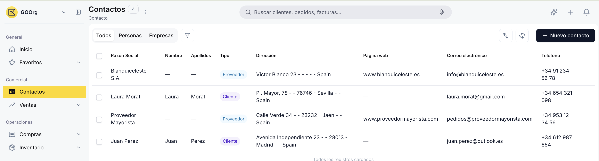
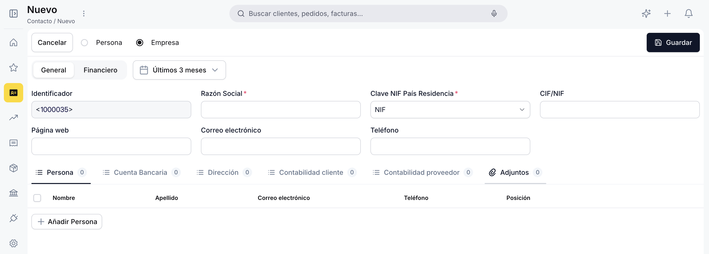
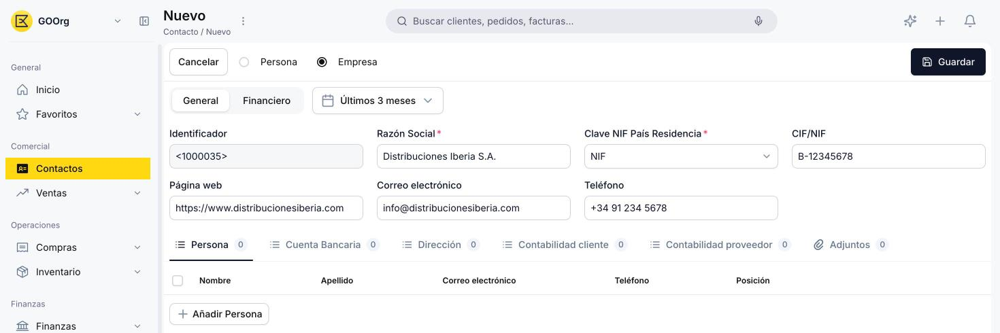
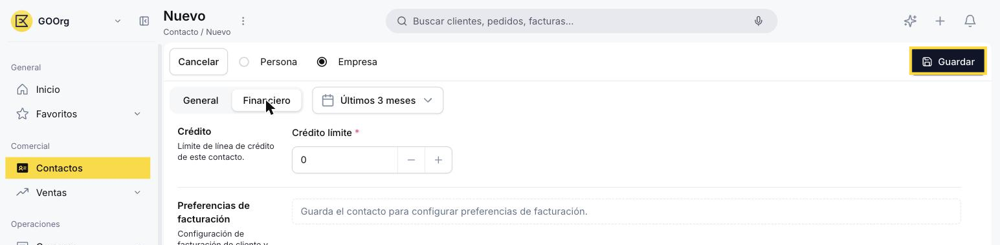
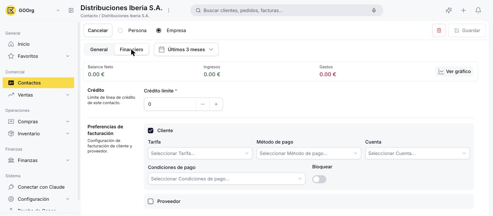

# Cómo crear un contacto

Para poder emitir un documento de venta o de compra, primero necesitas tener el contacto correspondiente cargado en el sistema. Vas a completar sus datos generales, guardarlo, y recién después vas a poder asignarle el rol de cliente y/o proveedor.

## Datos generales

1. Accede a la ventana [Contactos](https://go.etendo.cloud/contacts){target="_blank"}, desde la vista lista, haz clic en **+ Nuevo contacto**.

    

2. Elige el tipo de contacto con las opciones **Persona / Empresa**, en la parte superior del formulario:
    - **Persona** — pide **Nombre** y **Apellidos** en vez de Razón Social.
    - **Empresa** — pide **Razón Social** en vez de Nombre y Apellidos (Por Defecto).

    

3. Completa los campos de la solapa **General**:

    - **Razón Social** (modo Empresa) o **Nombre** y **Apellidos** (modo Persona) — obligatorios, según el tipo elegido.
    - **Clave NIF País Residencia** — obligatorio. Define el tipo de identificador fiscal (NIF, CIF, VAT, etc.).
    - **CIF/NIF** — número de identificación fiscal.
    - **Correo electrónico**, **Teléfono** y **Página web** — opcionales.

    

    !!! info "Identificador"
        El campo **Identificador** (ej: `1000035`) se genera automáticamente al guardar el contacto. No se completa a mano y no se puede modificar después.

4. Si ya tienes los datos a mano, completa las solapas debajo de la sección General — puedes dejarlos para más adelante sin problema:

    - **Persona** — personas de contacto vinculadas (nombre, correo, teléfono, posición). Tiene sentido completarla cuando la comunicación con este contacto involucra a distintas personas dentro de la misma empresa — por ejemplo, si las facturas se envían a un responsable y los albaranes a otro.
    - **Cuenta Bancaria** — IBAN y Código Swift.
    - **Dirección** — calle, código postal, ciudad, país y región, marcando si aplica como dirección de envíos, de facturación, o ambas.
    - **Contabilidad (cliente)** y **Contabilidad (proveedor)** — cuentas contables asociadas al contacto según su rol.
    - **Adjuntos** — archivos vinculados al contacto.

    !!! warning "Dirección obligatoria para facturar"
        Para poder emitir facturas a este contacto, la solapa **Dirección** es obligatoria: sin al menos una dirección marcada como dirección de facturación, no vas a poder facturarle. Te recomendamos cargarla aunque dejes el resto de las solapas para más adelante.

## Crédito límite (opcional)

1. En la solapa **Financiero**, puedes dejar el campo **Crédito límite** en `0` o ajustarlo si ya sabes qué límite de crédito le vas a dar a este contacto.

    

    !!! info "Preferencias de facturación"
        Hasta que no guardes el contacto, la solapa Financiero no te va a dejar configurar el rol Cliente/Proveedor: en su lugar vas a ver el mensaje "Guarda el contacto para configurar preferencias de facturación."

## Guardar el contacto

1. Cuando termines de completar los datos que necesites, haz clic en **Guardar** para crear el contacto.

## Asignar el rol Cliente y/o Proveedor

1. Con el contacto ya guardado, entra a la solapa **Financiero**: ahora sí vas a poder activar el checkbox correspondiente según cómo vayas a operar con este contacto:

    - **Cliente** — habilita **Tarifa**, **Método de pago**, **Cuenta**, **Condiciones de pago** y el toggle **Bloquear** (para impedir nuevos documentos de venta a este contacto). El contacto podrá aparecer en documentos de venta.
    - **Proveedor** — habilita los mismos campos, orientados a compras, incluido su propio toggle **Bloquear**. El contacto podrá aparecer en documentos de compra.

    

2. Si el contacto te compra y te vende al mismo tiempo, activa ambos roles a la vez.

## Crear un contacto desde un documento de venta o compra

También puedes crear un contacto sin salir de un pedido, una factura o un albarán. Si buscas un contacto que todavía no existe desde el selector de contacto de ese documento, Etendo Go te ofrece un popup de creación rápida en vez de llevarte a la vista lista de Contactos.

1. En el selector de contacto del documento, escribe el nombre del contacto que quieres crear y elige la opción para crearlo desde ahí.
2. Completa el popup con los campos mínimos que pide: **Razón Social** (o Nombre y Apellidos, según el tipo) y el tipo de contacto — ambos son obligatorios para guardar desde este popup.
3. Guarda el popup: el contacto queda creado y vinculado automáticamente al documento donde lo creaste.

!!! info "Completar el resto de los datos"
    El popup solo carga los datos mínimos. Para completar el resto de los campos (dirección, cuenta bancaria, rol Cliente/Proveedor, etc.), abre el contacto después desde la vista lista de Contactos y sigue los pasos de las secciones anteriores.

## Artículos Relacionados

- [¿Qué es la sección Contactos?](../que-es-la-seccion-contactos/que-es-la-seccion-contactos.md)
- [Gestionar tus contactos](../gestionar-tus-contactos/gestionar-tus-contactos.md)

---
Esta obra está bajo la licencia :material-creative-commons: :fontawesome-brands-creative-commons-by: :fontawesome-brands-creative-commons-sa: [CC BY-SA 2.5 ES](https://creativecommons.org/licenses/by-sa/2.5/es/){target="_blank"} de [Futit Services S.L](https://etendo.software){target="_blank"}.
