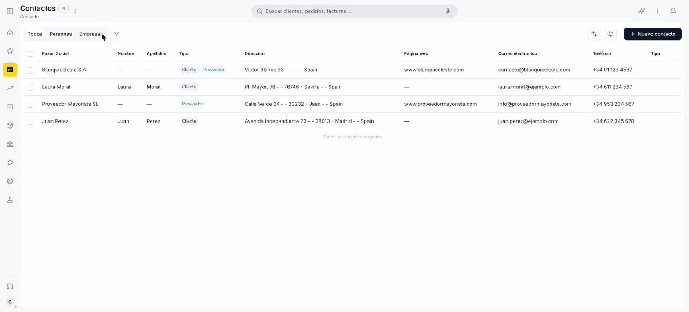
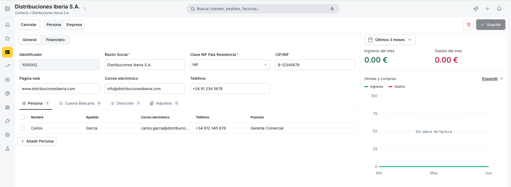
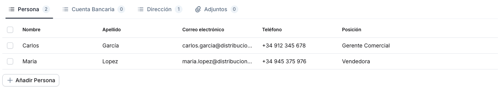
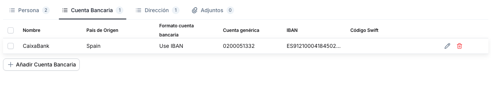
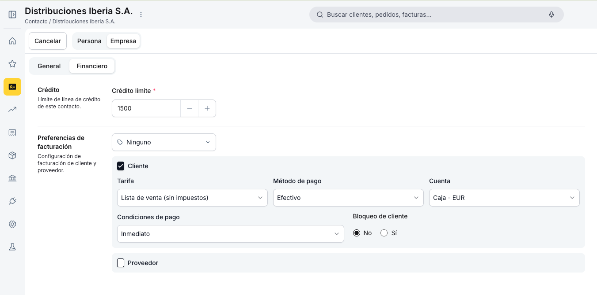
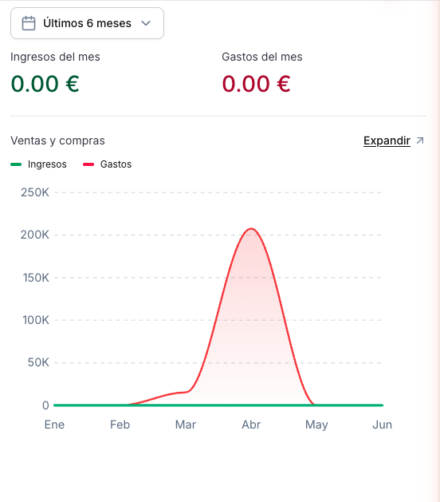

# Contactos

La ventana de **Contactos** es el registro central de clientes, proveedores y cualquier contraparte con la que trabaje tu empresa. Un mismo registro puede actuar como cliente, proveedor o ambos a la vez.

La tarifa, el método de pago y las condiciones de pago configurados aquí se heredan automáticamente en cada factura o pedido que se cree para ese contacto. No es necesario completarlos de nuevo en cada documento.

---

## Vista Lista

Los tabs superiores filtran por **Todos**, **Personas** y **Empresas**. El ícono de filtro permite acotar además por rol: **Cliente** o **Proveedor**. Los contactos con ambos roles muestran los dos badges de color simultáneamente.

Haciendo clic en el encabezado de cualquier columna se ordena la lista por ese campo; un segundo clic invierte el orden. Para búsquedas más precisas, el panel de **filtros avanzados** permite combinar múltiples criterios como razón social, tipo, dirección o correo electrónico.

Para crear un nuevo contacto usa el botón **+ Nuevo contacto** en la esquina superior derecha.

---

## Vista Formulario

El formulario se abre en dos situaciones: al crear un contacto nuevo con **+ Nuevo contacto**, o al hacer clic sobre un contacto existente en la lista para ver y editar toda su información.

### Tab General

El selector **Persona / Empresa** en la parte superior del formulario determina el tipo de contacto:

- **Empresa** — solo muestra **Razón Social**.
- **Persona** — agrega los campos **Nombre** y **Apellido** además de **Razón Social**.

!!! info "Identificador automático"
    El campo **Identificador** (ej: `1000001`) se genera solo al guardar el contacto. No requiere entrada manual y no puede modificarse.

En la parte inferior del formulario se encuentran cuatro sub-tabs para ampliar la información del contacto:

#### Persona

Registra las personas de contacto vinculadas al cliente o proveedor, con datos de nombre, correo, teléfono y posición.

#### Cuenta Bancaria

Almacena las cuentas bancarias del contacto, incluyendo IBAN y Código Swift.

#### Dirección

{ align=right width=300 }

Lista las direcciones del contacto. Al agregar o editar una dirección se abre el popup **Ubicación**, donde se completan los campos de calle, código postal, ciudad, país y región, y se indica si aplica como **Dir. envíos**, **Dir. factura** o ambas.

#### Adjuntos

Permite adjuntar archivos al contacto arrastrándolos al área o seleccionándolos desde el explorador. Formatos compatibles: PDF, Word, Excel, PowerPoint e Imágenes.

---

### Tab Financiero

Este tab define los datos financieros del contacto. Contiene la sección **Crédito** (con el campo **Crédito límite**) y la sección **Preferencias de facturación**, donde se configuran los roles del contacto mediante los checkboxes **Cliente** y **Proveedor**. Al crear un contacto nuevo, el checkbox **Cliente** viene activado por defecto.

!!! tip "Roles simultáneos"
    Un contacto puede tener ambos roles activos al mismo tiempo. En la vista lista aparecerán los badges **Cliente** y **Proveedor** juntos.

#### Cliente

Al activar **Cliente**, el contacto puede aparecer en documentos de venta. Los campos **Tarifa**, **Método de pago**, **Condiciones de pago** y **Cuenta** que configures aquí se precargarán en cada factura o pedido de venta.

!!! warning "Bloqueo de cliente"
    Si el campo **Bloqueo de cliente** se establece en **Sí**, el sistema impide crear nuevos documentos de venta para ese contacto. Úsalo para clientes con crédito suspendido.

#### Proveedor

Al activar **Proveedor**, el contacto puede aparecer en documentos de compra. De igual forma, **Tarifa de compra**, **Método de pago**, **Condiciones de pago** y **Cuenta contable de gastos** se precargarán en cada factura o pedido de compra.

!!! warning "Bloqueo de proveedor"
    Si **Bloqueo de proveedor** se establece en **Sí**, el sistema impide crear nuevos documentos de compra para ese proveedor.

---

### Panel Lateral

{ align=right width=300 }

El panel derecho muestra, en tiempo real, los ingresos y gastos del mes asociados al contacto, y un gráfico comparativo de los últimos meses. El rango de tiempo se ajusta con el selector (ej: **Últimos 3 meses**).

---

## Artículos Relacionados

- [:material-file-document-outline: Ventas](../../ventas/index.md)
- [:material-file-document-outline: Pedidos de venta](../../ventas/pedidos-de-venta.md)
- [:material-file-document-outline: Compras](../../compras/index.md)
- [:material-file-document-outline: Pedidos de compra](../../compras/pedidos-de-compra.md)

---
This work is licensed under :material-creative-commons: :fontawesome-brands-creative-commons-by: :fontawesome-brands-creative-commons-sa: [ CC BY-SA 2.5 ES](https://creativecommons.org/licenses/by-sa/2.5/es/){target="_blank"} by [Futit Services S.L](https://etendo.software){target="_blank"}.
