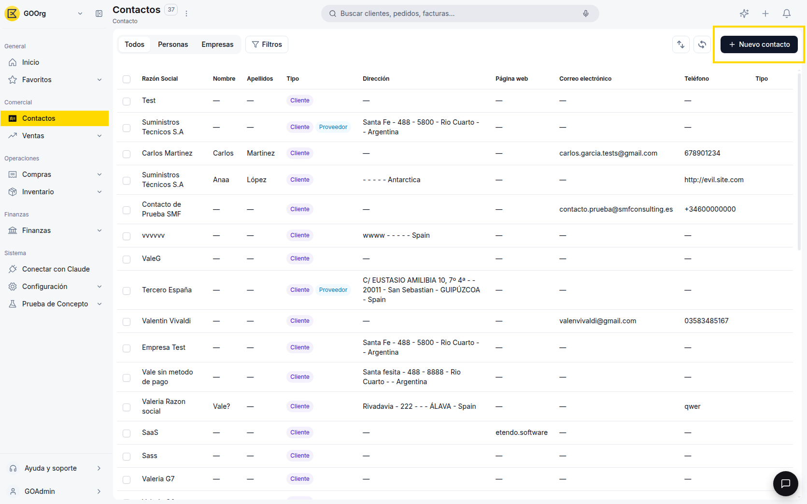
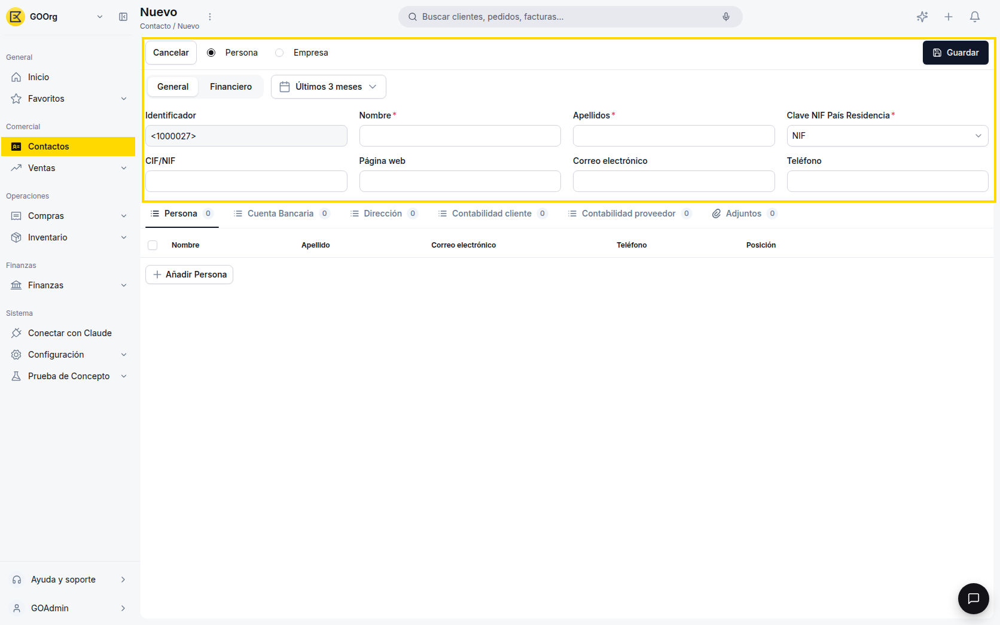
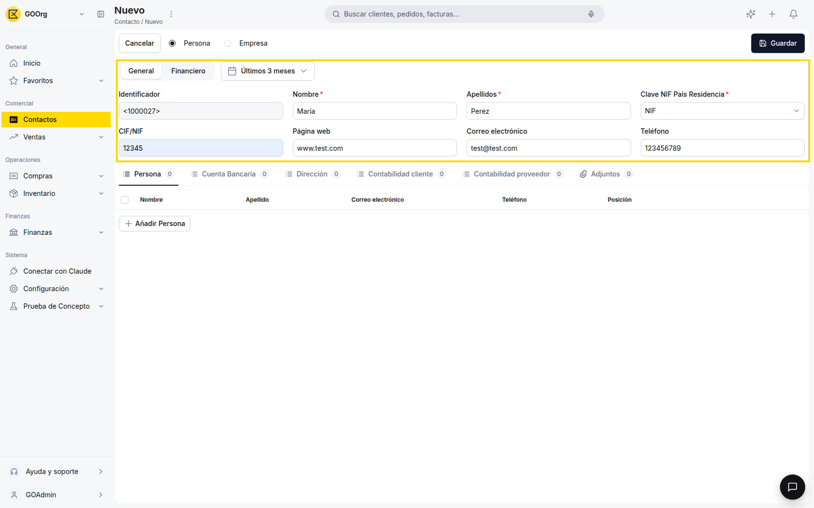
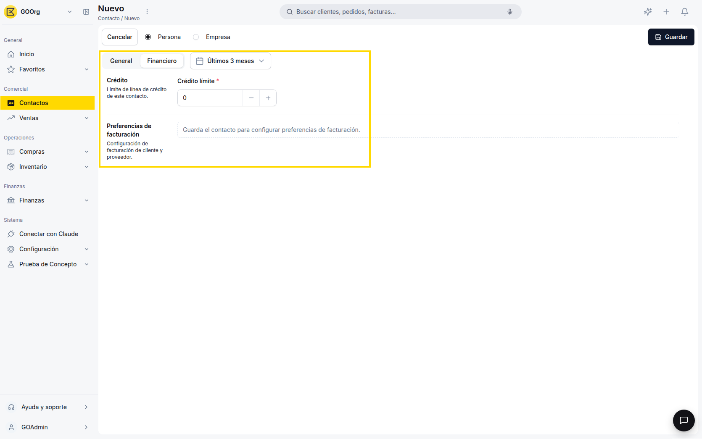
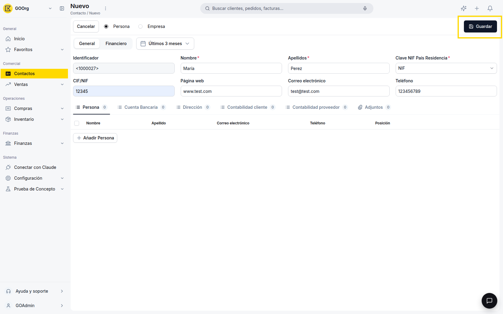
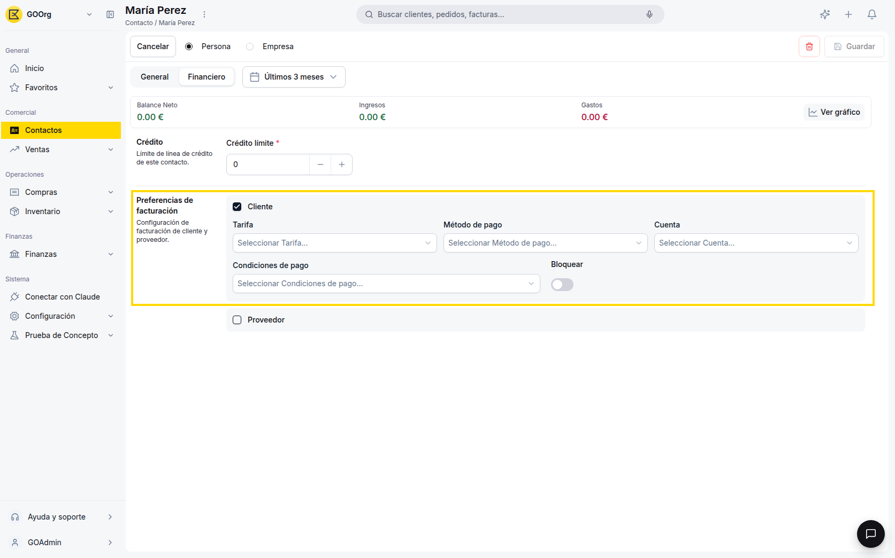

# Crear un contacto

Para poder emitir un documento de venta o de compra, primero necesitas tener el contacto correspondiente cargado en el sistema. Vas a completar sus datos generales, guardarlo, y recién después vas a poder asignarle el rol de cliente y/o proveedor.

## Datos generales

1. Desde la vista lista de Contactos, haz clic en **+ Nuevo contacto**.

    

2. Elige el tipo de contacto con las opciones **Persona / Empresa**, en la parte superior del formulario:
    - **Empresa** — pide **Razón Social** en vez de Nombre y Apellidos.
    - **Persona** — pide **Nombre** y **Apellidos** en vez de Razón Social.

    
3. Completa los campos del tab **General**:
    - **Razón Social** (modo Empresa) o **Nombre** y **Apellidos** (modo Persona) — obligatorios, según el tipo elegido.
    - **Clave NIF País Residencia** — obligatorio. Define el tipo de identificador fiscal (NIF, CIF, VAT, etc.).
    - **CIF/NIF** — número de identificación fiscal.
    - **Correo electrónico**, **Teléfono** y **Página web** — opcionales.

    

    !!! info "Identificador"
        El campo **Identificador** (ej: `1000001`) se genera automáticamente al guardar el contacto. No se completa a mano y no se puede modificar después.

4. Si ya tienes los datos a mano, completa los sub-tabs debajo del tab General — puedes dejarlos para más adelante sin problema:
    - **Persona** — personas de contacto vinculadas (nombre, correo, teléfono, posición).
    - **Cuenta Bancaria** — IBAN y Código Swift.
    - **Dirección** — calle, código postal, ciudad, país y región, marcando si aplica como dirección de envíos, de facturación, o ambas.

## Crédito límite (opcional)

1. En el tab **Financiero**, puedes dejar el campo **Crédito límite** en `0` o ajustarlo si ya sabes qué límite de crédito le vas a dar a este contacto.

    

    !!! info "Preferencias de facturación"
        Hasta que no guardes el contacto, el tab Financiero no te va a dejar configurar el rol Cliente/Proveedor: en su lugar vas a ver el mensaje "Guarda el contacto para configurar preferencias de facturación."

## Guardar el contacto

1. Cuando termines de completar los datos que necesites, haz clic en **Guardar** para crear el contacto.

    

## Asignar el rol Cliente y/o Proveedor

1. Con el contacto ya guardado, vuelve a abrirlo y entra al tab **Financiero**: ahora sí vas a poder activar el checkbox correspondiente según cómo vayas a operar con este contacto:
    - **Cliente** — habilita **Tarifa**, **Cuenta**, **Método de pago**, **Condiciones de pago** y el toggle **Bloquear** (para impedir nuevos documentos de venta a este contacto). El contacto podrá aparecer en documentos de venta.
    - **Proveedor** — habilita los mismos campos, orientados a compras. El contacto podrá aparecer en documentos de compra.

    

2. Si el contacto te compra y te vende al mismo tiempo, activa ambos roles a la vez.

## Artículos Relacionados

- [¿Qué es la sección Contactos?](../que-es-la-seccion-contactos/que-es-la-seccion-contactos.md)
- [Gestionar tus contactos](../gestionar-tus-contactos/gestionar-tus-contactos.md)

---
Esta obra está bajo la licencia :material-creative-commons: :fontawesome-brands-creative-commons-by: :fontawesome-brands-creative-commons-sa: [CC BY-SA 2.5 ES](https://creativecommons.org/licenses/by-sa/2.5/es/){target="_blank"} de [Futit Services S.L](https://etendo.software){target="_blank"}.
