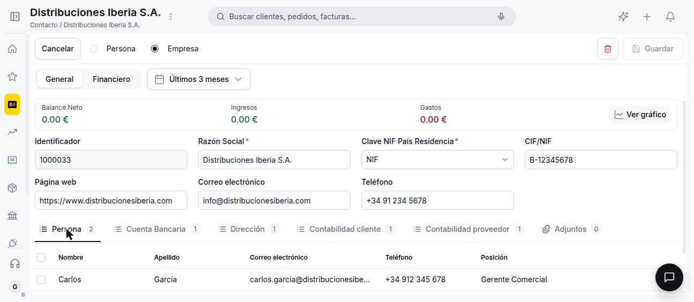
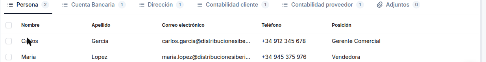
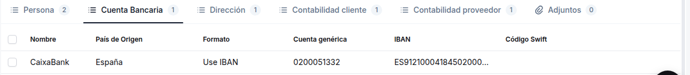
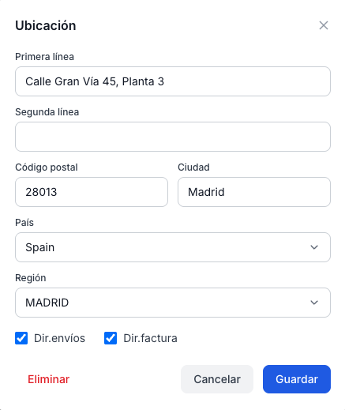
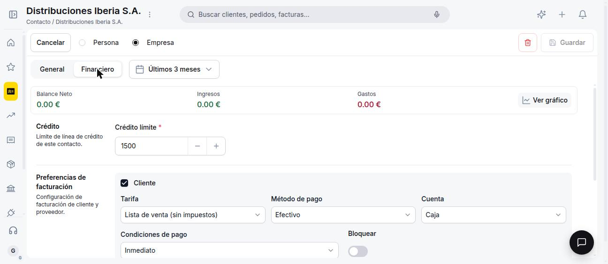
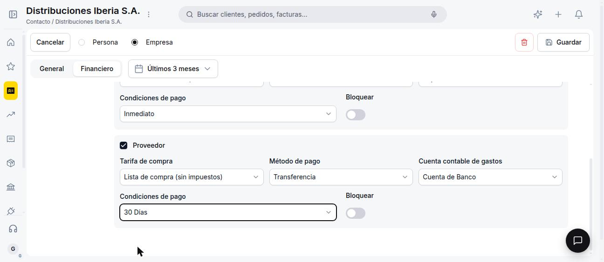
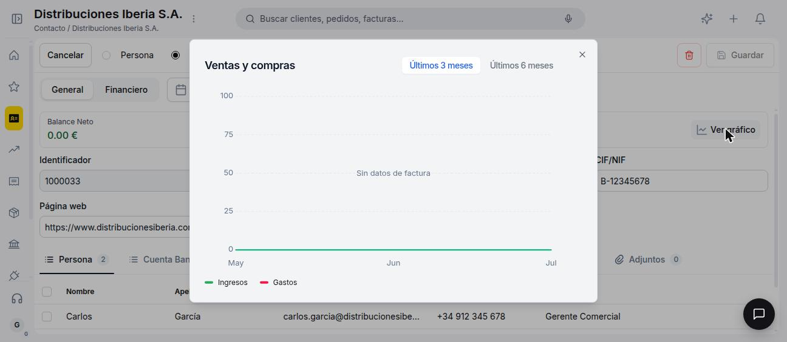

# Gestionar tus contactos

## Vista Lista

La lista muestra **Razón Social**, **Tipo** (Empresa / Persona), **Dirección**, **Correo electrónico**, **Teléfono** y **Página web**. Para contactos de tipo Persona, se muestran además **Nombre** y **Apellidos**. El tipo de rol se muestra como badge de color: lavanda para **Cliente**, celeste para **Proveedor**; si un contacto tiene ambos roles, se muestran los dos badges simultáneamente.

Los tres tabs de filtrado rápido — **Todos**, **Empresas** y **Personas** — filtran por el tipo de contacto. Desde los filtros de la ventana es posible acotar además por rol: **Cliente** y/o **Proveedor**. A diferencia de otras ventanas, la lista no muestra acciones rápidas al pasar el cursor sobre una fila.

Para crear un nuevo contacto usa el botón **+ Nuevo contacto** en la esquina superior derecha.

---

## Vista Formulario

El formulario se abre en dos situaciones: al crear un contacto nuevo con **+ Nuevo contacto**, o al hacer clic sobre un contacto existente en la lista — Contactos no tiene una vista detalle intermedia, el clic lleva directo al formulario de edición.

### Tab General

La barra de acciones superior presenta el toggle **Persona / Empresa** que define el tipo de contacto: al seleccionar **Empresa**, los campos Nombre y Apellidos quedan ocultos; al seleccionar **Persona**, aparecen.

El tab **General** presenta los campos en el siguiente orden:

| # | Campo | Tipo | Requerido | Notas |
|---|-------|------|:---:|-------|
| 1 | Identificador | Texto (solo lectura) | Auto | No editable. Se genera al guardar. Ej: `1000001` |
| 2 | Razón Social | Texto | ✅ | Nombre principal del contacto |
| 3 | Nombre | Texto | ❌ | Solo visible si el tipo es Persona |
| 4 | Apellidos | Texto | ❌ | Solo visible si el tipo es Persona |
| 5 | Clave NIF País Residencia | Dropdown | ✅ | Tipo de identificador fiscal: NIF, CIF, VAT, etc. |
| 6 | CIF/NIF | Texto | ❌ | Número de identificación fiscal |
| 7 | Correo electrónico | Texto (email) | ❌ | |
| 8 | Teléfono | Texto | ❌ | |
| 9 | Página web | Texto (URL) | ❌ | |

Debajo de estos campos, el formulario incluye seis sub-tabs para ampliar la información del contacto:

#### Persona

Registra las personas de contacto vinculadas al cliente o proveedor, con datos de nombre, correo, teléfono y posición.

#### Cuenta Bancaria

Almacena las cuentas bancarias del contacto, incluyendo IBAN y Código Swift.

#### Dirección

Lista las direcciones del contacto. Al agregar o editar una dirección se abre el popup **Ubicación**, donde se completan calle, código postal, ciudad, país y región, y se indica si aplica como dirección de **envíos**, de **facturación**, o ambas.

#### Contabilidad (cliente) y Contabilidad (proveedor)

Reflejan las cuentas contables por defecto asociadas al contacto en su rol de cliente y de proveedor respectivamente. Esta guía todavía no detalla sus campos — vas a encontrarlos documentados en un próximo artículo.

#### Adjuntos

Permite vincular archivos al contacto. Esta guía todavía no detalla su funcionamiento — va a quedar documentado en un próximo artículo.

---

### Tab Financiero

El tab Financiero contiene dos bloques independientes, cada uno activado mediante checkbox. El campo **Crédito límite** (con stepper +/−, valor por defecto 0) aplica a ambos roles.

**Bloque Cliente** (checkbox ☑ Cliente):

| # | Campo | Tipo | Descripción |
|---|-------|------|-------------|
| 1 | Tarifa | Dropdown | Tarifa de venta por defecto. Se hereda en documentos de venta |
| 2 | Método de pago | Dropdown | Método de cobro habitual |
| 3 | Cuenta | Dropdown | Cuenta contable de ingresos |
| 4 | Condiciones de pago | Dropdown | Plazo de cobro por defecto (ej: 30 Días) |
| 5 | Bloquear | Toggle | Si está activo, impide crear nuevos documentos de venta para este contacto |

**Bloque Proveedor** (checkbox ☑ Proveedor): los mismos campos, orientados al ciclo de compras — **Tarifa de compra**, **Cuenta contable de gastos**, **Método de pago** y **Condiciones de pago** al proveedor, y su propio toggle **Bloquear**.

El badge Cliente/Proveedor visible en el listado se determina por cuáles de estos checkboxes están activos.

---

## Resumen Financiero y Gráfico

Mientras trabajas en el formulario de un contacto, una barra superior muestra en tiempo real el **Balance Neto**, los **Ingresos** y los **Gastos** asociados a ese contacto para el período seleccionado (por defecto, últimos 3 meses). El botón **Ver gráfico** abre el modal **Ventas y compras**, con un gráfico de líneas que compara ventas vs. compras y un toggle para alternar entre **Últimos 3 meses** y **Últimos 6 meses**.

---

## Artículos Relacionados

- [¿Qué es la sección Contactos?](../que-es-la-seccion-contactos/que-es-la-seccion-contactos.md)
- [Ventas](../../ventas/index.md)
- [Compras](../../../operaciones/compras/index.md)

---
Esta obra está bajo la licencia :material-creative-commons: :fontawesome-brands-creative-commons-by: :fontawesome-brands-creative-commons-sa: [CC BY-SA 2.5 ES](https://creativecommons.org/licenses/by-sa/2.5/es/){target="_blank"} de [Futit Services S.L](https://etendo.software){target="_blank"}.
