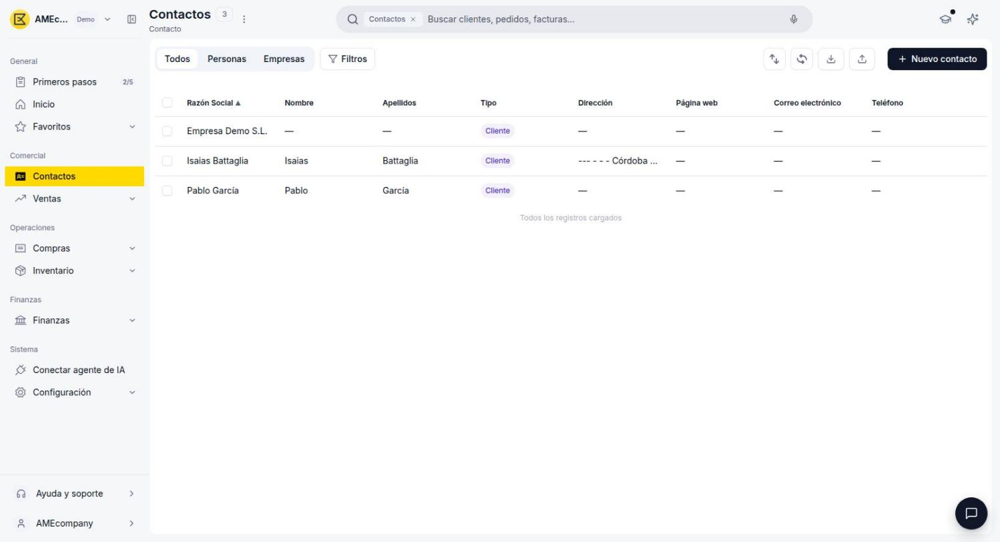
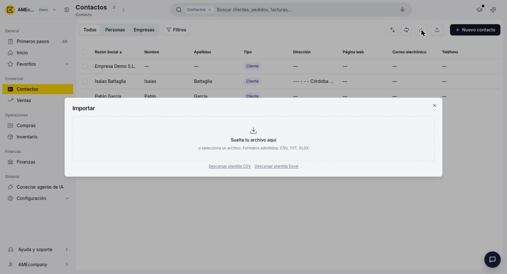
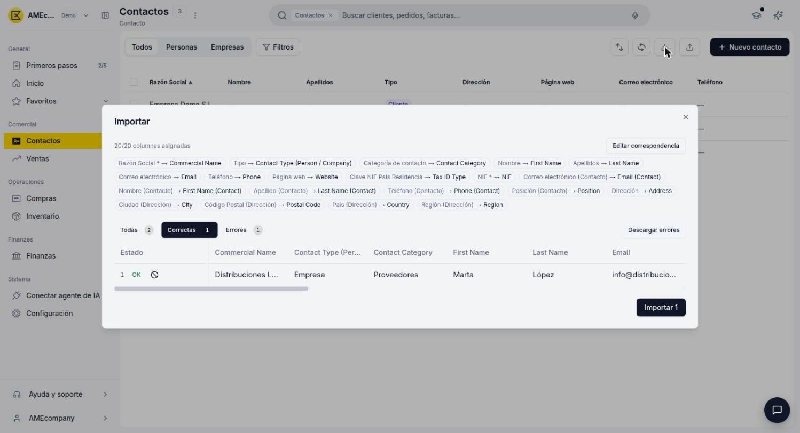
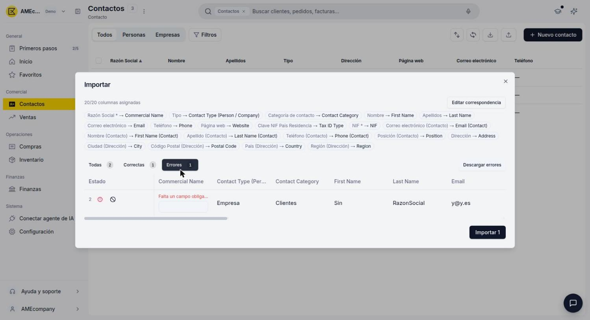
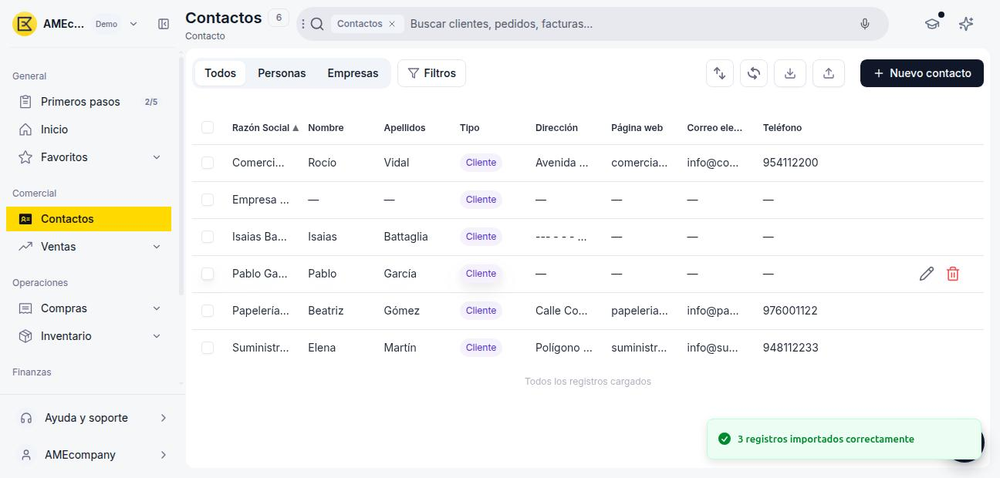

# Importar contactos

Si necesitas cargar varios contactos a la vez, en vez de crearlos uno por uno desde el formulario, puedes importarlos masivamente desde un archivo CSV, TXT o Excel.

## Abre la ventana de importación

1. Ve a **[Contactos](https://go.etendo.cloud/contacts){target="_blank"}**.
2. En la vista lista, haz clic en el ícono **Importar** de la barra de herramientas superior.

    <figure markdown="span">
      
      <figcaption>Ícono Importar en la barra de herramientas de la ventana Contactos.</figcaption>
    </figure>

## Descarga la plantilla

En la ventana **Importar**, descarga la plantilla en el formato que prefieras (**CSV** o **Excel**) antes de preparar tu archivo.

<figure markdown="span">
  
  <figcaption>Ventana Importar: zona de carga de archivo y enlaces de descarga de plantilla.</figcaption>
</figure>

La plantilla trae las siguientes columnas:

- **Razón Social** *(obligatorio)* — Nombre o razón social del contacto.
- **Tipo** *(opcional)* — Persona o Empresa.
- **Categoría de contacto** *(opcional)* — Ej. Clientes, Proveedores.
- **Nombre** y **Apellidos** *(opcionales)*.
- **Correo electrónico**, **Teléfono** y **Página web** *(opcionales)*.
- **Clave NIF País Residencia** *(opcional)* — Tipo de identificador fiscal (NIF, CIF, VAT, etc.).
- **NIF** *(obligatorio)*.
- **Correo electrónico (Contacto)**, **Nombre (Contacto)**, **Apellido (Contacto)**, **Teléfono (Contacto)**, **Posición (Contacto)** *(opcionales)* — Datos de una persona de contacto vinculada, equivalentes a la solapa **Persona** del alta manual.
- **Dirección**, **Ciudad (Dirección)**, **Código Postal (Dirección)**, **País (Dirección)**, **Región (Dirección)** *(opcionales)* — Equivalentes a la solapa **Dirección** del alta manual.

!!! warning "Pendiente de validar con QA"
    Falta confirmar con QA si la importación permite marcar la dirección cargada como dirección de facturación (necesaria para poder facturarle al contacto luego, según [Cómo crear un contacto](../como-crear-un-contacto/como-crear-un-contacto.md)), y si asigna automáticamente el rol Cliente/Proveedor o eso se hace después desde el contacto ya creado.

!!! warning "Hallazgo de pruebas: la validación previa no detecta un NIF con dígito de control incorrecto"
    La pestaña **Correctas** del paso de revisión solo valida que estén completos los campos obligatorios: no valida el dígito de control del NIF/CIF. Si el NIF tiene el dígito de control mal calculado, la fila pasa como "Correcta" pero el servidor la rechaza al importar, con el error real "The tax ID check digit does not match. Review the number." Etendo sí muestra este error correctamente —incluyendo un informe técnico con la fila, la solicitud enviada y la respuesta del servidor, con botones **Reintentar** y **Omitir** por fila—, pero ese resultado puede tardar varios segundos en aparecer para lotes de varias filas, y no hay indicador de progreso mientras tanto. QA debería confirmar si vale la pena validar el dígito de control del NIF también en el paso previo, para detectar este error antes de intentar importar.

## Completa y carga tu archivo

1. Completa la plantilla con tus contactos, respetando al menos las columnas obligatorias (**Razón Social** y **NIF**).
2. Vuelve a la ventana **Importar** y arrastra tu archivo a la zona indicada, o haz clic para seleccionarlo desde tu computadora.

## Revisa el mapeo de columnas

Al cargar el archivo, Etendo intenta emparejar automáticamente cada columna de tu archivo con el campo correspondiente del contacto (por ejemplo, **Razón Social** → **Commercial Name**, **NIF** → **NIF**). Si alguna columna no se asignó correctamente, haz clic en **Editar correspondencia** para corregirla manualmente antes de continuar.

## Revisa las filas correctas y con errores

Debajo del mapeo, Etendo separa las filas de tu archivo en dos pestañas:

- **Correctas** — filas listas para importarse.
- **Errores** — filas con datos faltantes o inválidos, con el motivo indicado en rojo (por ejemplo, "Falta un campo obligatorio").

<figure markdown="span">
  
  <figcaption>Pestaña Correctas: fila validada, lista para importar.</figcaption>
</figure>

<figure markdown="span">
  
  <figcaption>Pestaña Errores: fila con un campo obligatorio faltante, editable en la misma tabla.</figcaption>
</figure>

Puedes corregir un error directamente en la celda resaltada de la tabla, o hacer clic en **Descargar errores** para exportar solo las filas con problemas, corregirlas en tu archivo original y volver a importarlas después.

!!! info "Importar solo lo que está correcto"
    No hace falta que corrijas los errores para avanzar: el botón **Importar** solo carga las filas de la pestaña **Correctas**. Las filas con errores quedan afuera hasta que las corrijas y las vuelvas a importar.

## Importa los contactos

Haz clic en **Importar [cantidad]**, y confirma en el diálogo que se abre a continuación. Los contactos importados quedan disponibles en la vista lista de Contactos, igual que si los hubieras creado manualmente, y un mensaje de confirmación indica cuántos registros se importaron.

<figure markdown="span">
  
  <figcaption>Vista lista de Contactos después de una importación exitosa.</figcaption>
</figure>

!!! tip "Espera a que termine antes de revisar el resultado"
    Para lotes de varias filas, espera unos segundos después de confirmar antes de salir de la ventana o revisar la vista lista (ver nota sobre el NIF y el tiempo de procesamiento más arriba). Si alguna fila falla, revisa la pestaña **Errores**: cada una trae un informe técnico con el motivo exacto y las opciones **Reintentar** u **Omitir**.

---

## Artículos Relacionados

- [¿Qué es la sección Contactos?](../que-es-la-seccion-contactos/que-es-la-seccion-contactos.md)
- [Cómo crear un contacto](../como-crear-un-contacto/como-crear-un-contacto.md)
- [Gestionar tus contactos](../gestionar-tus-contactos/gestionar-tus-contactos.md)

---
Esta obra está bajo la licencia :material-creative-commons: :fontawesome-brands-creative-commons-by: :fontawesome-brands-creative-commons-sa: [CC BY-SA 2.5 ES](https://creativecommons.org/licenses/by-sa/2.5/es/){target="_blank"} de [Futit Services S.L](https://etendo.software){target="_blank"}.
