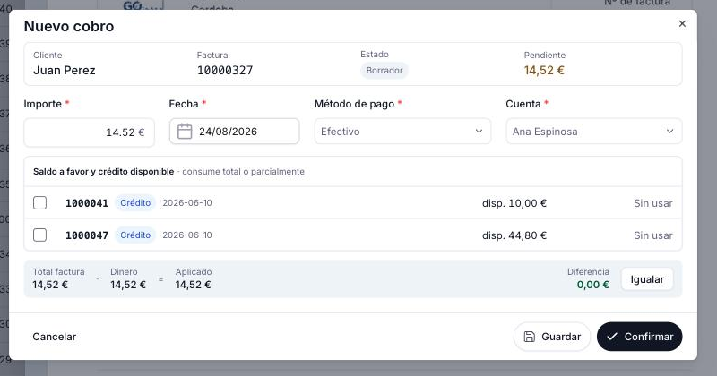
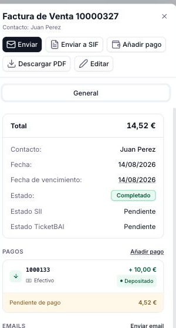
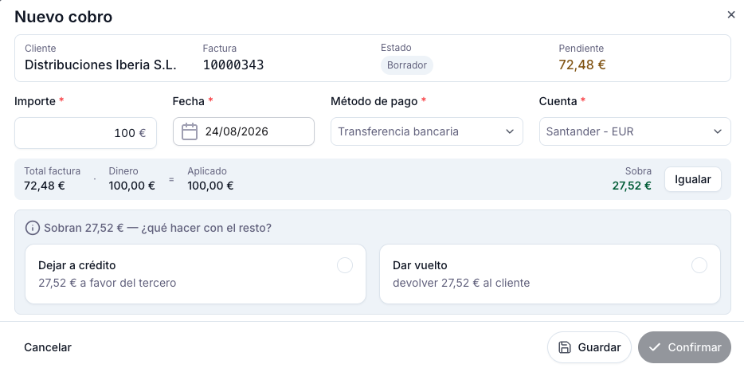
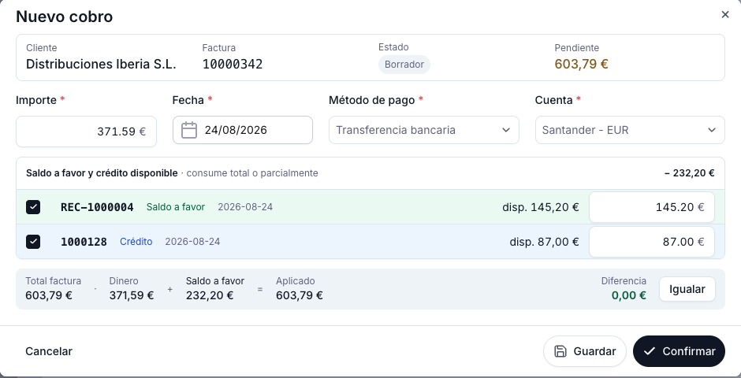

# Añadir pagos a tu factura de venta

Una vez que una factura de venta está en estado **Completado**, puedes registrar los cobros que recibas del cliente — totales o parciales — desde el propio documento.

## Pasos

1. Abre la factura desde la vista lista o desde la vista detalle de **[Ventas > Factura](https://go.etendo.cloud/sales-invoice){target="_blank"}**. El botón **Añadir pago** está disponible tanto en el panel lateral de la vista detalle como en la barra del formulario.

2. Haz clic en **Añadir pago**. Se abre el popup **Nuevo cobro**:

    

    El popup muestra de referencia el **Cliente**, el número de **Factura** y el importe **Pendiente**. El campo **Estado** de esta cabecera corresponde al cobro que se está creando (aparece como "Borrador" hasta que lo confirmes), no al estado de la factura — la factura ya debe estar Completada para poder abrir este popup.

3. Completa los campos del cobro:

    - **Importe** — monto recibido. Toma por defecto el total pendiente de la factura.
    - **Fecha** — fecha del cobro; por defecto, la fecha actual.
    - **Método de pago** — forma en que se recibió el dinero. Se precarga con el método configurado en el contacto, pero es editable.
    - **Cuenta** — dónde se recibe el cobro: puede ser una cuenta bancaria, caja o tarjeta de crédito. Igual que el método de pago, se precarga desde la configuración del contacto y también es editable.

    Si el cliente tiene saldo a favor o crédito disponible, puedes tildarlo para aplicarlo junto con el importe cargado (ver [Aplicar saldo a favor o crédito disponible](#aplicar-saldo-a-favor-o-credito-disponible-opcional) más abajo).

    Debajo se muestra el desglose: **Dinero** es el importe en efectivo o transferencia que estás cargando; si además aplicaste saldo a favor o crédito, se suma en una columna aparte. La suma total es el **Aplicado**, y la diferencia entre este y el **Total factura** se muestra como:

    - **Falta X €** (en rojo) — si el aplicado no alcanza a cubrir el total.
    - **Diferencia 0,00 €** (en verde) — si coinciden exactamente.
    - **Sobra X €** (en verde) — si el aplicado supera el total (ver [Si el cliente paga de más](#si-el-cliente-paga-de-mas-sobrepago) más abajo).

    En cualquiera de los dos primeros casos, usa el botón **Igualar** para ajustar automáticamente el **Importe** y que la diferencia quede en 0 — funciona incluso si ya estás combinando el pago con saldo a favor o crédito aplicado.

4. Haz clic en **Guardar** para registrar el cobro sin cerrar el popup, o en **Confirmar** para registrarlo y cerrar. El sistema actualiza automáticamente el importe **Pendiente de pago** en el panel lateral:

    

    !!! info "Solo el dinero real queda registrado como pago"
        Si aplicaste saldo a favor o crédito junto con el importe, la sección **PAGOS** del panel lateral solo muestra el movimiento de dinero real (efectivo o transferencia); el saldo a favor y el crédito aplicados no generan una línea de pago propia — son compensaciones que se descuentan del total pendiente sin quedar registradas como un cobro adicional.

!!! info "Pagos parciales"
    Puedes registrar varios pagos parciales hasta cubrir el total de la factura. El indicador de **Pendiente de pago** se reduce con cada pago registrado.

!!! tip "Si queda una diferencia sin ajustar"
    Si confirmas el cobro con una diferencia distinta de cero (por ejemplo, cobraste menos de lo esperado y no usaste Igualar), aparece la opción **Ajustar diferencia de X €**. Si la dejas desactivada — la opción por defecto — la factura simplemente queda con esos X € pendientes de cobro, sin ningún error. Si la activas, la diferencia se lleva a una cuenta contable y la factura queda marcada como cobrada.

    Usa esta opción solo para diferencias de redondeo (unos pocos centavos). No la actives para condonar un saldo pendiente real — en ese caso, dejá la diferencia sin ajustar.

## Si el cliente paga de más (sobrepago)

Si el importe aplicado (dinero, más saldo a favor o crédito si usaste alguno) supera el total pendiente de la factura, el popup avisa **Sobran X € — ¿qué hacer con el resto?** y ofrece dos opciones. Debes elegir una para poder confirmar el cobro:

- **Dejar a crédito** — el excedente se guarda como crédito disponible para el cliente, para aplicar en una factura futura.
- **Dar vuelto** — el excedente se devuelve al cliente; el cobro se registra por el total exacto de la factura, sin generar crédito.

En ambos casos la factura queda cobrada por completo.

## Aplicar saldo a favor o crédito disponible (opcional)

Un cliente puede tener a su favor dos tipos de importes disponibles, con orígenes distintos:

- **Saldo a favor** — proviene de una factura rectificativa: una devolución o un ajuste por un cobro registrado incorrectamente.
- **Crédito** — proviene de haber pagado de más en una factura anterior y haber elegido **Dejar a crédito** (ver arriba).

Cuando el cliente tiene alguno de estos importes disponibles, el popup **Nuevo cobro** muestra la sección **Saldo a favor y crédito disponible**, con un listado que indica el origen (**Saldo a favor** o **Crédito**) y la fecha de cada uno. Puedes tildar uno o varios para aplicarlos a esta factura, en lugar de — o combinado con — un cobro nuevo en efectivo o transferencia:

- Al tildar un registro, su importe disponible se aplica automáticamente a la factura y el campo **Importe** se reduce en esa misma medida (por ejemplo, si el saldo a favor o crédito cubre toda la factura, el Importe pasa a 0).
- El importe aplicado de cada registro es editable, para consumir el saldo solo parcialmente.
- Puedes combinar varios orígenes a la vez — por ejemplo, aplicar saldo a favor, crédito y una transferencia en el mismo cobro, como en la captura de arriba — y usar **Igualar** para que la diferencia quede en 0 automáticamente.

Recordá: solo el dinero real (efectivo o transferencia) queda registrado como un pago propio en **PAGOS** (ver nota en el Paso 4); el saldo a favor y el crédito aplicados no generan una línea adicional.

## Artículos Relacionados

- [Crear una factura de venta](../crear-una-factura-de-venta/crear-una-factura-de-venta.md)
- [Gestionar tus facturas de venta](../gestionar-tus-facturas-de-venta/gestionar-tus-facturas-de-venta.md)
- [Enviar tus facturas por email](../enviar-tus-facturas-por-email/enviar-tus-facturas-por-email.md)

---
Esta obra está bajo la licencia :material-creative-commons: :fontawesome-brands-creative-commons-by: :fontawesome-brands-creative-commons-sa: [CC BY-SA 2.5 ES](https://creativecommons.org/licenses/by-sa/2.5/es/){target="_blank"} de [Futit Services S.L](https://etendo.software){target="_blank"}.
