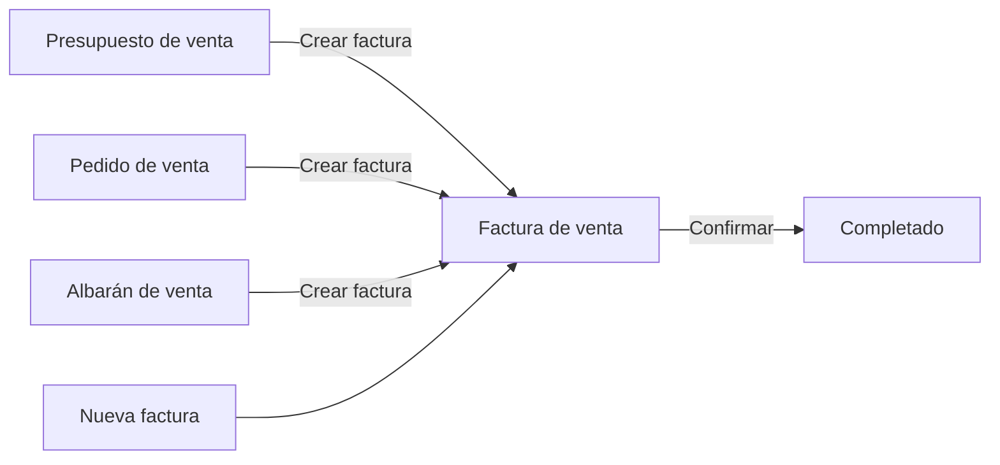
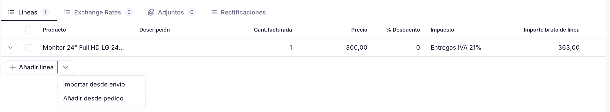
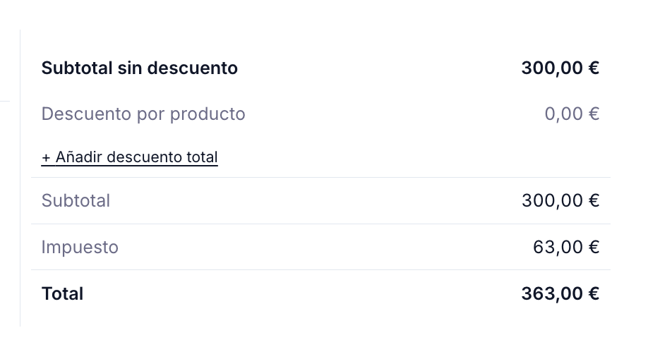

# Crear una factura de venta

La **factura de venta** es el documento fiscal que formaliza el cobro al cliente. Puedes crearla directamente, o generarla desde un [presupuesto de venta](../crear-y-gestionar-presupuestos/crear-y-gestionar-presupuestos.md) aceptado, un [pedido de venta](../crear-y-gestionar-pedidos/crear-y-gestionar-pedidos.md) confirmado o un [albarán](../crear-y-gestionar-albaranes/crear-y-gestionar-albaranes.md) completado, heredando todos sus datos. En estos tres casos, la factura se genera en estado Borrador, lista para revisar o editar antes de confirmarla. Este artículo repasa los **Pasos** para crearla directamente desde cero; para las otras vías, consulta el artículo del documento de origen correspondiente.

## Pasos

1. Accede a la ventana **[Ventas > Factura](https://go.etendo.cloud/sales-invoice){target="_blank"}** y haz clic en **+ Nueva factura**.

2. Completa la **Cabecera** del formulario:

    

    - **Contacto** — cliente al que se dirige la factura. Al seleccionarlo, el sistema autocompleta la Dirección, el Método de pago, las Condiciones de pago y la Tarifa configurados en ese contacto.
    - **Tipo de documento** — por defecto **Factura**. La otra opción, **Factura rectificativa**, se usa para ajustes y devoluciones; consulta [Crear y gestionar devoluciones](../crear-y-gestionar-devoluciones/crear-y-gestionar-devoluciones.md). Este campo no se puede modificar una vez guardada la factura.
    - **Fecha de la factura** — toma por defecto la fecha actual; editable.
    - **Dirección**, **Método de pago**, **Condiciones de pago**, **Moneda** y **Tarifa** — heredados del contacto o de la organización; editables solo para este documento.

    !!! tip "Campos autocargados desde el contacto"
        Son editables solo para esta factura, sin afectar la configuración del cliente.

3. Completa la pestaña **Líneas** con los productos o servicios facturados:

    

    - Usa **+ Añadir líneas** para incorporar productos manualmente. Si el tipo de documento es **Factura**, además tienes disponibles **Importar desde envío** (importa las líneas de un [albarán](../crear-y-gestionar-albaranes/crear-y-gestionar-albaranes.md) existente — "envío" es como se llama a esta acción en el formulario) y **Añadir desde pedido**, para traer las líneas de un pedido existente. Ambas abren un selector con los albaranes o pedidos ya confirmados de ese contacto, donde eliges cuáles importar. La **Factura rectificativa** tiene sus propias opciones de importación; consulta [Crear y gestionar devoluciones](../crear-y-gestionar-devoluciones/crear-y-gestionar-devoluciones.md).
    - **Producto** — al seleccionarlo autocompleta la descripción y el precio según la tarifa de la cabecera; editable.
    - **Cant. facturada**, **Precio**, **% de descuento** e **Impuesto** — se ajustan por línea.
    - Pulsa ++enter++ para guardar la línea, o ++esc++ para cancelar sin guardar.

4. Revisa el panel de **Totales**:

    

    Verifica el **Subtotal**, el **Impuesto** y el **Total** antes de confirmar. El enlace **+ Añadir descuento total** permite aplicar además un descuento sobre el total de la factura, independiente de los descuentos por línea. Si necesitas dejar una observación interna, usa el campo **Notas** — no se incluye en el PDF enviado al cliente.

5. Haz clic en **Confirmar**. La acción es directa, sin popup, y pasa la factura al estado **Completado**.

    !!! warning "La factura no se puede editar tras confirmar"
        Verifica los importes y el contacto antes de confirmar. Si necesitas corregirla igualmente, puedes reactivarla — ver [Gestionar tus facturas de venta](../gestionar-tus-facturas-de-venta/gestionar-tus-facturas-de-venta.md#acciones-disponibles).

Una vez completada, la factura queda pendiente de cobro. Para registrar el pago, consulta [Añadir pagos a tu factura de venta](../anadir-pagos-a-tu-factura-de-venta/anadir-pagos-a-tu-factura-de-venta.md); para enviarla al cliente, consulta [Enviar tus facturas por email](../enviar-tus-facturas-por-email/enviar-tus-facturas-por-email.md).

## Artículos Relacionados

- [Gestionar tus facturas de venta](../gestionar-tus-facturas-de-venta/gestionar-tus-facturas-de-venta.md)
- [Añadir pagos a tu factura de venta](../anadir-pagos-a-tu-factura-de-venta/anadir-pagos-a-tu-factura-de-venta.md)
- [Crear y gestionar pedidos](../crear-y-gestionar-pedidos/crear-y-gestionar-pedidos.md)
- [Crear y gestionar albaranes](../crear-y-gestionar-albaranes/crear-y-gestionar-albaranes.md)

---
Esta obra está bajo la licencia :material-creative-commons: :fontawesome-brands-creative-commons-by: :fontawesome-brands-creative-commons-sa: [CC BY-SA 2.5 ES](https://creativecommons.org/licenses/by-sa/2.5/es/){target="_blank"} de [Futit Services S.L](https://etendo.software){target="_blank"}.
