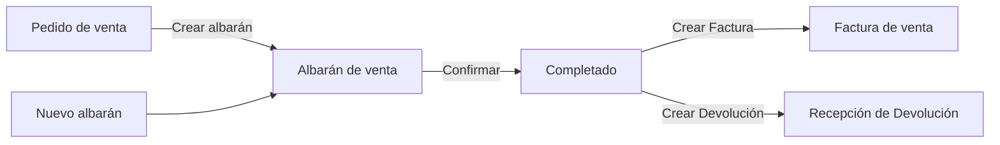

# Crear y gestionar albaranes

## Descripción general

El **albarán de venta** documenta la entrega física de mercadería al cliente. Puede generarse desde un [pedido de venta](../crear-y-gestionar-pedidos/crear-y-gestionar-pedidos.md) confirmado — marcando la opción **Crear albarán** en el popup de confirmación, o más adelante con el botón **Gestionar envío y factura** del pedido — o crearse directamente desde la ventana **[Ventas > Albarán](https://go.etendo.cloud/goods-shipment){target="_blank"}** con **+ Nuevo albarán**. Una vez completado, habilita la generación de la [factura de venta](../crear-una-factura-de-venta/crear-una-factura-de-venta.md) o de una devolución.

## Vista Lista

La vista lista de **[Ventas > Albarán](https://go.etendo.cloud/goods-shipment){target="_blank"}** muestra las columnas **Fecha del movimiento**, **Nº documento**, **Contacto**, **Estado doc.**, **Almacén** y **Estado de facturación**. Al pasar el cursor sobre una fila aparecen accesos rápidos para editar, clonar y enviar por email. Para crear un albarán nuevo usa el botón **+ Nuevo albarán** en la esquina superior derecha.

## Vista Detalle

Al hacer clic sobre un albarán existente se abre la vista detalle, con la previsualización del PDF a la izquierda y, a la derecha, los botones **Enviar**, **Descargar PDF** y **Editar**. El panel incluye las pestañas **General**, **Mensajes** e **Historial**; la pestaña General muestra el **Nº documento**, **Contacto**, **Almacén**, **Fecha movimiento**, **Estado** y **Estado de facturación**, seguidos de las secciones **EMAILS** y **DOCUMENTOS RELACIONADOS** (el pedido de origen, si lo tiene).

## Vista Formulario

El formulario se abre al crear un albarán nuevo o al hacer clic en **Editar** desde la vista detalle.

### Cabecera

- **Contacto** — cliente destinatario; se prellena desde el pedido de origen si el albarán se generó desde uno.
- **Nº documento** — se genera automáticamente al guardar.
- **Fecha del movimiento** — fecha real de la entrega; por defecto, la fecha actual.
- **Almacén** — almacén desde el cual se despacha la mercadería.
- **Dirección** — dirección de entrega del cliente; heredada del pedido, editable para este documento.

### Pestaña Líneas

Las líneas muestran, por producto, la **Cant. movida** (cantidad incluida en este albarán) y la **Cant. pedido** (cantidad total del pedido de origen), a modo de referencia.

La sección **DOCUMENTOS** muestra el pedido de origen como enlace navegable, y el campo **NOTAS** permite añadir observaciones internas que no se incluyen en el PDF.

El formulario incluye también una pestaña **Adjuntos** para vincular archivos al albarán.

## Estados del Documento

| Estado | Descripción |
|---|---|
| Borrador | Sin efecto sobre el stock ni sobre los indicadores del pedido de origen. |
| Completado | Actualiza el **Estado de facturación** del pedido de venta origen. |

!!! warning "El albarán no se puede editar tras confirmar"
    Una vez confirmado, el albarán queda bloqueado y ya no admite cambios.

## Acciones Disponibles

| Acción | Descripción | Estado |
| :--- | :--- | :--- |
| **Cancelar** | Descarta los cambios no guardados y vuelve a la lista. | Borrador y Completado |
| **Guardar** | Guarda el documento sin cambiar su estado. | Solo en Borrador |
| **Confirmar** | Confirma el albarán y lo pasa a estado Completado. | Solo en Borrador |
| **Crear Factura** | Genera una factura de venta en Borrador con las cantidades entregadas. | Solo en Completado |
| **Crear Devolución** | Abre el asistente para crear una devolución a partir de este albarán. Ver [Crear y gestionar devoluciones](../crear-y-gestionar-devoluciones/crear-y-gestionar-devoluciones.md). | Solo en Completado |
| **Clonar** | Crea un nuevo borrador con los mismos datos. | Borrador y Completado |
| **Enviar** | Abre el panel de envío por correo electrónico. | Borrador y Completado |
| **Imprimir** | Genera el PDF del albarán. | Borrador y Completado |
| **Papelera** | Elimina el documento con confirmación previa. | Solo en Borrador |

!!! info "Cantidades pendientes"
    Cuando un pedido está parcialmente entregado, la opción de crear el albarán solo propone las unidades aún no incluidas en albaranes confirmados. La acción deja de estar disponible cuando el pedido queda entregado al 100 %.

## Artículos Relacionados

- [Crear y gestionar pedidos](../crear-y-gestionar-pedidos/crear-y-gestionar-pedidos.md)
- [Crear una factura de venta](../crear-una-factura-de-venta/crear-una-factura-de-venta.md)
- [Crear y gestionar devoluciones](../crear-y-gestionar-devoluciones/crear-y-gestionar-devoluciones.md)

---
Esta obra está bajo la licencia :material-creative-commons: :fontawesome-brands-creative-commons-by: :fontawesome-brands-creative-commons-sa: [CC BY-SA 2.5 ES](https://creativecommons.org/licenses/by-sa/2.5/es/){target="_blank"} de [Futit Services S.L](https://etendo.software){target="_blank"}.
