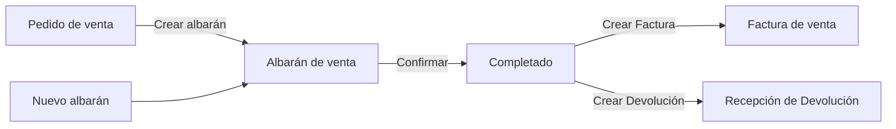
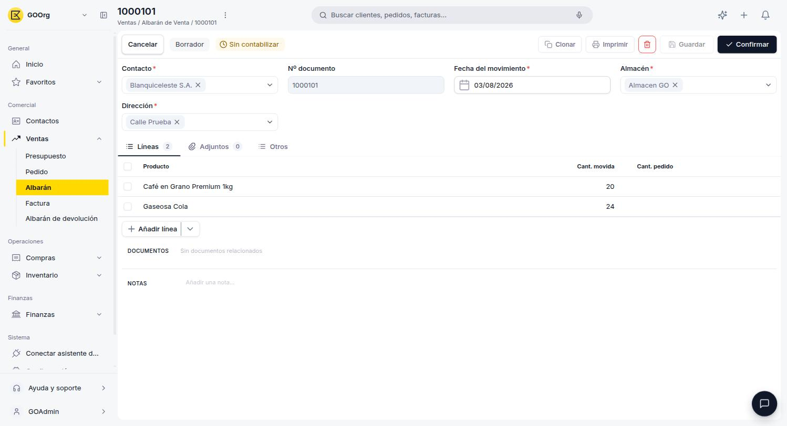
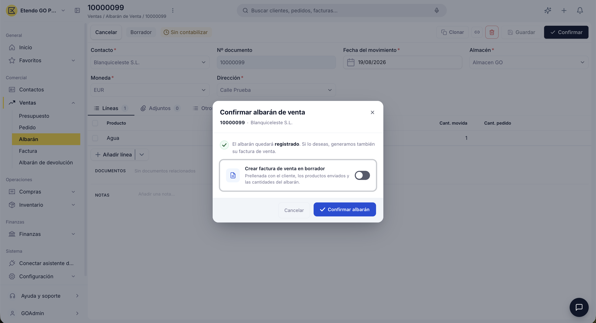
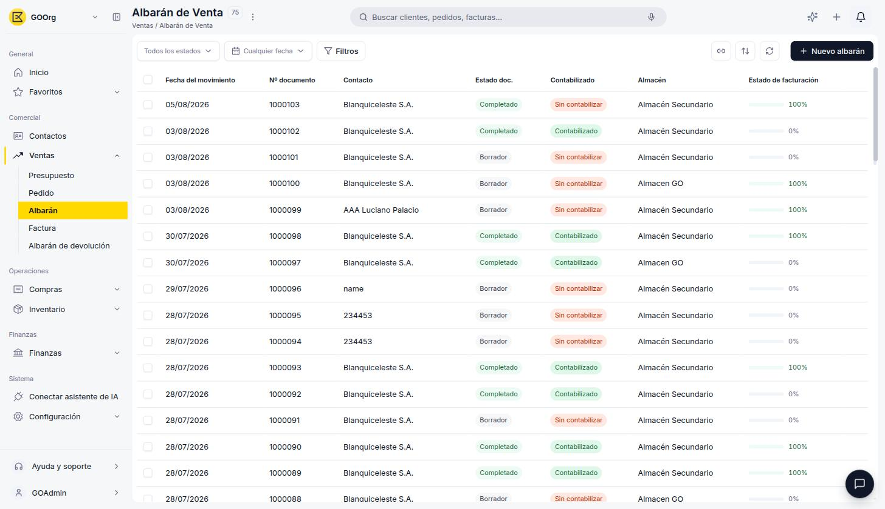
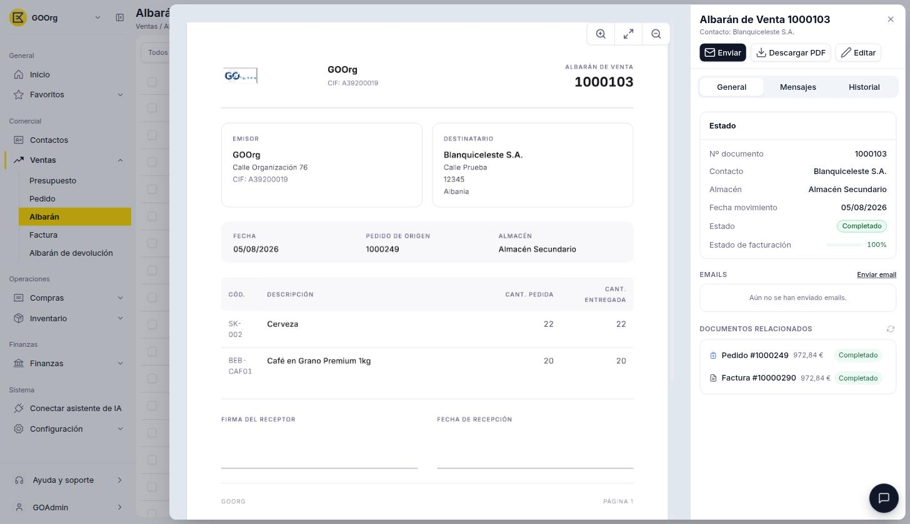
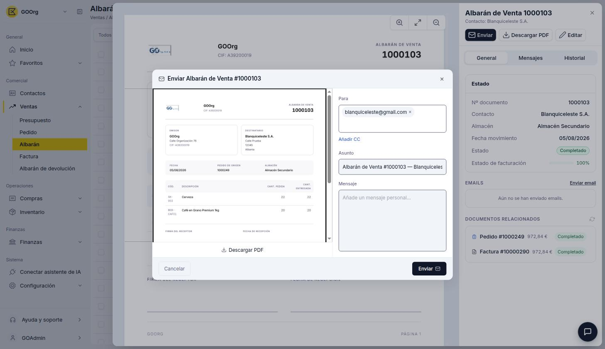
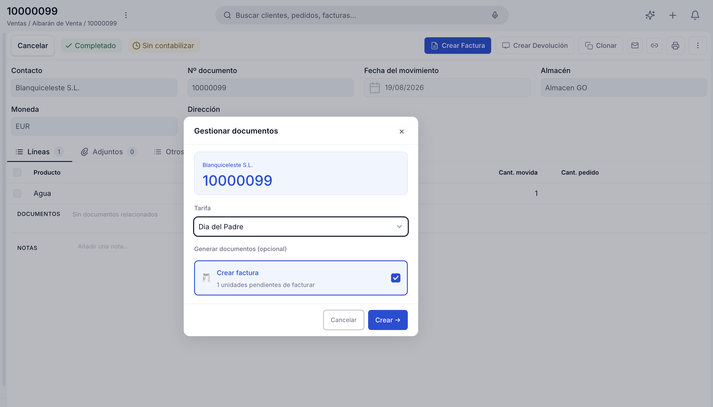
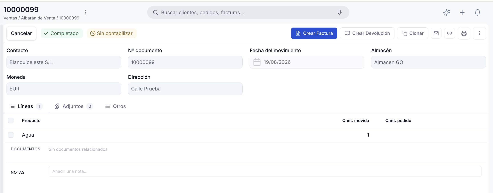

# Crear y gestionar albaranes

## Descripción general

El **albarán de venta** documenta la entrega física de mercadería al cliente. Puede generarse desde un [pedido de venta](../crear-y-gestionar-pedidos/crear-y-gestionar-pedidos.md) confirmado — marcando la opción **Crear albarán** en el popup de confirmación, o más adelante con el botón **Gestionar envío y factura** del pedido — o crearse directamente desde la ventana **[Ventas > Albarán](https://go.etendo.cloud/goods-shipment){target="_blank"}** con **+ Nuevo albarán**. Una vez completado, habilita la generación de la [factura de venta](../crear-una-factura-de-venta/crear-una-factura-de-venta.md) o de una devolución.

Este artículo se organiza en dos flujos: primero cómo **crear un albarán** y confirmarlo, y luego cómo **gestionarlo** — enviarlo y generar la factura o la devolución.

---

## Crear un albarán

### 1. Empieza un albarán nuevo

Puedes generar el albarán desde un [pedido de venta](../crear-y-gestionar-pedidos/crear-y-gestionar-pedidos.md) confirmado — marcando **Crear albarán** en el popup de confirmación del pedido, o más adelante con el botón **Gestionar envío y factura** — en cuyo caso el albarán hereda el contacto, la dirección y las líneas del pedido de origen. Alternativamente, puedes crearlo directamente accediendo a **[Ventas > Albarán](https://go.etendo.cloud/goods-shipment){target="_blank"}** y usando el botón **+ Nuevo albarán** en la esquina superior derecha.

### 2. Completa el formulario

<figure markdown="span">
  
  <figcaption>Formulario de creación y edición del Albarán de venta.</figcaption>
</figure>

El formulario se abre al crear un albarán nuevo o al hacer clic en **Editar** desde la vista detalle.

**Cabecera**

- **Contacto** — cliente destinatario; se prellena desde el pedido de origen si el albarán se generó desde uno.
- **Nº documento** — se genera automáticamente al guardar.
- **Fecha del movimiento** — fecha real de la entrega; por defecto, la fecha actual.
- **Almacén** — almacén desde el cual se despacha la mercadería.
- **Dirección** — se autocompleta con la dirección de entrega del contacto al seleccionarlo (o se hereda del pedido de origen, si el albarán se generó desde uno); editable, por ejemplo cuando el contacto tiene más de una dirección de entrega.

**Pestaña Líneas**

El botón **+ Añadir línea** agrega una línea vacía para cargar manualmente; su menú desplegable ofrece además **Añadir desde pedido** y **Añadir desde Factura**, para incorporar líneas directamente desde un pedido o una factura ya completada del mismo cliente.

Las líneas muestran, por producto, la **Cant. movida** (cantidad incluida en este albarán) y la **Cant. pedido** (cantidad total del pedido de origen), a modo de referencia. Si el albarán no se generó a partir de un pedido de venta, estos campos quedan vacíos.

La sección **DOCUMENTOS** muestra el pedido de origen como enlace navegable (esta misma información aparece también en la vista detalle; ver [Abre el albarán](#2-abre-el-albaran)), y el campo **NOTAS** permite añadir observaciones internas que no se incluyen en el PDF.

El formulario incluye también una pestaña **Adjuntos**, para vincular archivos al albarán.

### 3. Confirma el albarán

<figure markdown="span">
  
  <figcaption>Popup de confirmación del Albarán de venta, con la opción para generar la factura de venta.</figcaption>
</figure>

Al hacer clic en **Confirmar**, el sistema muestra el popup de confirmación con la opción **Crear factura de venta en borrador**, desactivada por defecto (la factura se generaría prellenada con el cliente, los productos enviados y las cantidades del albarán). Si el pedido de origen ya está facturado en su totalidad, esta opción no aparece y el popup solo indica que se registrará el movimiento, sin crear una factura nueva.

Si confirmas sin activar la opción, el albarán pasa a Completado y se procesa la salida de la mercadería del stock; la factura queda pendiente y puedes generarla más adelante con la acción **Crear Factura** (ver [Genera la factura pendiente](#4-genera-la-factura-pendiente)).

!!! warning "El albarán queda bloqueado"
    Una vez confirmado, el albarán no se puede editar directamente. Si necesitas revertir la entrega, deberás crear una devolución para volver a generar la entrada de stock.

---

## Gestionar albaranes

### 1. Busca el albarán

<figure markdown="span">
  
  <figcaption>Vista lista del Albarán de venta con columnas de estado y facturación.</figcaption>
</figure>

La vista lista de **[Ventas > Albarán](https://go.etendo.cloud/goods-shipment){target="_blank"}** muestra las columnas **Fecha del movimiento**, **Nº documento**, **Contacto**, **Estado doc.**, **Almacén** y **Estado de facturación**. Al pasar el cursor sobre una fila aparecen accesos rápidos para editar, clonar y enviar. Para filtrar la lista utiliza los selectores de **estado del documento** en la barra superior.

### 2. Abre el albarán

<figure markdown="span">
  
  <figcaption>Vista detalle con la previsualización del PDF y el panel lateral de información clave.</figcaption>
</figure>

Al hacer clic sobre un albarán existente se abre la vista detalle, con la previsualización del PDF a la izquierda y, a la derecha, los botones **Enviar**, **Descargar PDF** y **Editar**. El panel derecho muestra la información clave: **Nº documento**, **Contacto**, **Almacén**, **Fecha movimiento**, **Estado** y **Estado de facturación**. El panel incluye también la pestaña **General**, que agrega las secciones **EMAILS** y **DOCUMENTOS RELACIONADOS**, que muestra el pedido de origen (si el albarán se generó desde uno) como enlace navegable. Esta misma información aparece también dentro del formulario completo, en la pestaña Líneas, accesible desde **Editar**.

### 3. Enviar o Imprimir albarán

<figure markdown="span">
  
  <figcaption>Panel de envío por email del Albarán de venta.</figcaption>
</figure>

El botón **Enviar**, disponible una vez que el albarán está Completado, abre el panel **Enviar Albarán de Venta**, con los campos **Para**, el enlace **Añadir CC** para sumar destinatarios en copia, **Asunto** (autocompletado con el número de documento y nombre del contacto) y **Mensaje**. Desde este panel también puedes descargar el PDF con el botón **Descargar PDF**.

Junto al botón **Enviar**, el botón **Imprimir** (también solo en Completado) genera directamente el PDF del albarán, sin pasar por el panel de envío.

### 4. Genera la factura pendiente

<figure markdown="span">
  
  <figcaption>Popup Gestionar documentos, con la selección de tarifa para generar la factura pendiente.</figcaption>
</figure>

Si el albarán Completado todavía no tiene una factura asociada, la acción **Crear Factura** (ver [Acciones Disponibles](#acciones-disponibles)) abre el popup **Gestionar documentos**. Antes de generar la factura debes seleccionar la **Tarifa** que se usará para aplicar los precios, ya que el albarán en sí no tiene una tarifa propia. La sección **Generar documentos (opcional)** muestra las unidades pendientes de facturar con la opción **Crear factura** ya marcada; al confirmar, se genera una factura de venta en Borrador con esas cantidades.

El botón **Crear Devolución**, visible en la barra de acciones una vez que el albarán está Completado, permite iniciar una devolución; para el detalle completo de ese proceso, ver [Crear y gestionar devoluciones](../crear-y-gestionar-devoluciones/crear-y-gestionar-devoluciones.md).

!!! info "Cantidades pendientes"
    Cuando un pedido está parcialmente entregado, la opción de crear el albarán solo propone las unidades aún no incluidas en albaranes confirmados. La acción deja de estar disponible cuando el pedido queda entregado al 100 %.

---

## Estados del Documento

La barra superior del formulario muestra el estado actual del albarán junto al indicador de **Estado de facturación**.

| Estado | Descripción |
|---|---|
| Borrador | Sin efecto sobre el stock ni sobre los indicadores del pedido de origen. |
| Completado | Actualiza el **Estado de facturación** del pedido de venta origen y habilita la generación de la factura o de una devolución. |

!!! warning "El albarán no se puede editar tras confirmar"
    Una vez confirmado, el albarán queda bloqueado y ya no admite cambios. Si necesitas revertir la entrega, deberás crear una devolución para volver a generar la entrada de stock.

---

## Acciones Disponibles

<figure markdown="span">
  
  <figcaption>Barra de acciones del Albarán de venta.</figcaption>
</figure>

| Acción | Descripción | Estado |
| :--- | :--- | :--- |
| **Cancelar** | Descarta los cambios no guardados y vuelve a la lista. | Solo en Borrador |
| **Guardar** | Guarda el documento sin cambiar su estado. | Solo en Borrador |
| **Confirmar** | Confirma el albarán y lo pasa a estado Completado (ver [Crear un albarán](#crear-un-albaran)). | Solo en Borrador |
| **Clonar** | Crea un nuevo borrador con los mismos datos. | Borrador y Completado |
| **Enviar** | Abre el panel de envío por correo electrónico. | Solo en Completado |
| **Imprimir** | Genera el PDF del albarán. | Solo en Completado |
| **Crear Factura** | Abre el popup Gestionar documentos para elegir la tarifa y generar la factura de venta en Borrador con las cantidades entregadas. | Solo en Completado |
| **Crear Devolución** | Abre el asistente para crear una devolución a partir de este albarán. Ver [Crear y gestionar devoluciones](../crear-y-gestionar-devoluciones/crear-y-gestionar-devoluciones.md). | Solo en Completado |
| **Papelera** | Elimina el documento con confirmación previa. | Solo en Borrador |

## Artículos Relacionados

- [Crear y gestionar pedidos](../crear-y-gestionar-pedidos/crear-y-gestionar-pedidos.md)
- [Crear una factura de venta](../crear-una-factura-de-venta/crear-una-factura-de-venta.md)
- [Crear y gestionar devoluciones](../crear-y-gestionar-devoluciones/crear-y-gestionar-devoluciones.md)

---
Esta obra está bajo la licencia :material-creative-commons: :fontawesome-brands-creative-commons-by: :fontawesome-brands-creative-commons-sa: [CC BY-SA 2.5 ES](https://creativecommons.org/licenses/by-sa/2.5/es/){target="_blank"} de [Futit Services S.L](https://etendo.software){target="_blank"}.
