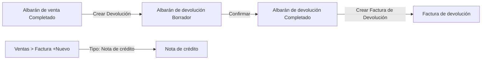
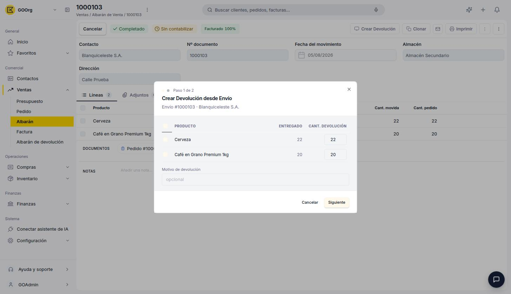
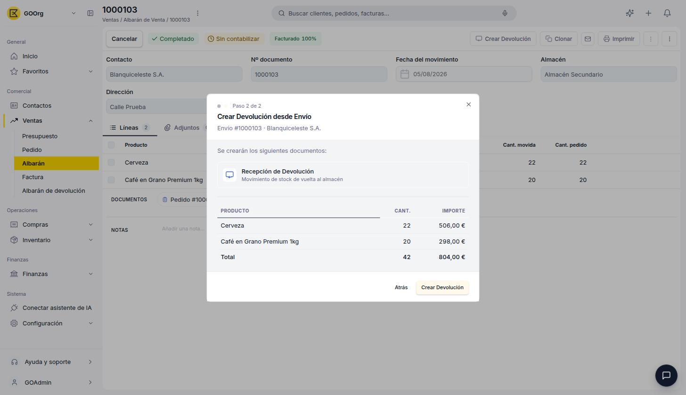
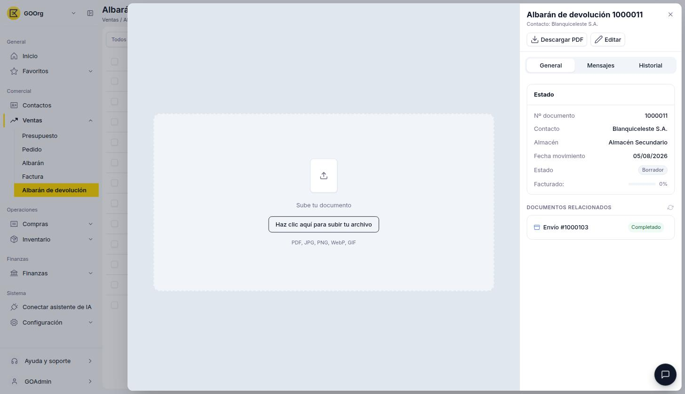
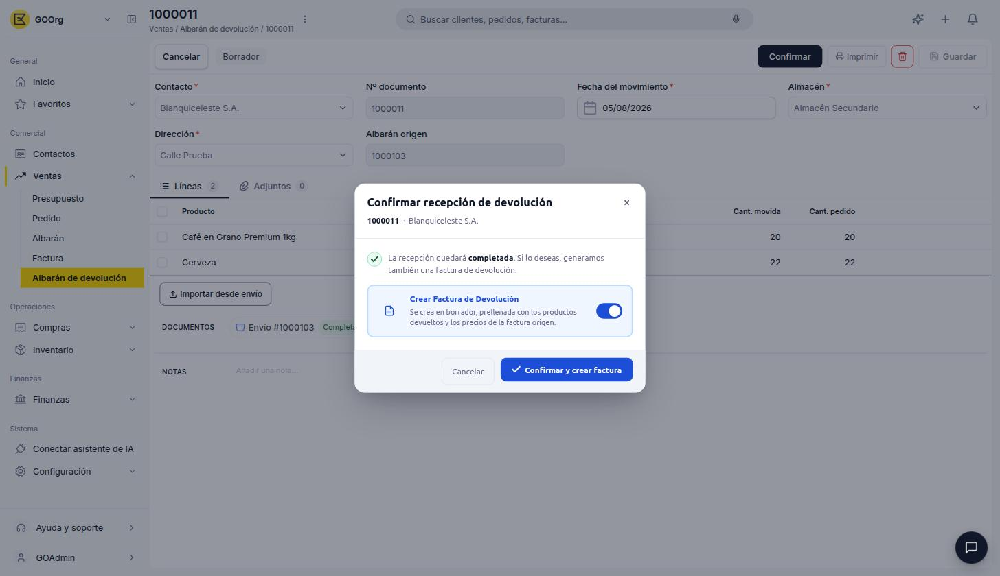

# Crear y gestionar devoluciones

## Descripción general

Cuando un cliente devuelve mercadería, Etendo Go separa el evento físico del financiero:

1. **El evento físico** — la mercadería vuelve al stock del vendedor. Se registra en el **albarán de devolución**, disponible en **[Ventas > Albarán de devolución](https://go.etendo.cloud/return-material-receipt){target="_blank"}**.
2. **El evento financiero** — el cliente recibe un crédito. Se registra en una **factura de devolución** o en una **nota de crédito**, según si hubo o no devolución física de mercadería.

## Crear un albarán de devolución

La forma habitual de crear una devolución es desde el [albarán de venta](../crear-y-gestionar-albaranes/crear-y-gestionar-albaranes.md) ya completado, con el botón **Crear Devolución**. Esto abre un asistente de 2 pasos:

1. **Paso 1 — Cantidades a devolver.** Muestra cada producto del envío con su cantidad **Entregado** y un campo editable **Cant. devolución** (por defecto, la cantidad total entregada; se puede reducir para devoluciones parciales, y destildar los productos que no se devuelven). Incluye un campo opcional **Motivo de devolución**.

    <figure markdown="span">
      
      <figcaption>Paso 1: cantidades a devolver por producto.</figcaption>
    </figure>

2. **Paso 2 — Confirmación.** Muestra el documento que se va a crear — **Recepción de Devolución**, descrito como "movimiento de stock de vuelta al almacén" — junto con el detalle de productos, cantidades e importes y el total. Al hacer clic en **Crear Devolución** se genera el albarán de devolución en estado Borrador.

    <figure markdown="span">
      
      <figcaption>Paso 2: confirmación de la Recepción de Devolución a crear.</figcaption>
    </figure>

!!! info "Este paso solo mueve stock"
    La factura de devolución se genera en un paso posterior, al confirmar este albarán — ver [Confirmar el albarán de devolución](#confirmar-el-albaran-de-devolucion) más abajo.

También es posible crear un albarán de devolución directamente desde **[Ventas > Albarán de devolución](https://go.etendo.cloud/return-material-receipt){target="_blank"}** con el botón **+ Nuevo albarán de devolución**.

### Cabecera del documento

- **Contacto** — prellenado desde el albarán de venta origen; editable.
- **Nº documento** — se genera automáticamente al guardar.
- **Fecha del movimiento** — por defecto, la fecha actual.
- **Almacén** — almacén al que ingresa la mercadería devuelta.
- **Dirección** — dirección de origen de la devolución.
- **Albarán origen** — referencia de solo lectura al albarán de venta del que proviene la devolución (si aplica).

### Pestaña Líneas

Las líneas muestran, por producto, la **Cant. movida** (cantidad devuelta) y la **Cant. pedido** (cantidad del albarán de venta origen), a modo de referencia.

### Vista Detalle

<figure markdown="span">
  
  <figcaption>Vista detalle del Albarán de devolución, con el área "Sube tu documento" y el panel lateral de información clave.</figcaption>
</figure>

A diferencia de los demás documentos de venta, la vista detalle del albarán de devolución no genera un PDF automático: en su lugar muestra un área **Sube tu documento**, para adjuntar manualmente un comprobante (PDF, JPG, PNG, WebP o GIF) si lo necesitas. El panel lateral muestra el **Nº documento**, **Contacto**, **Almacén**, **Fecha movimiento**, **Estado**, **Facturado** (% del importe ya cubierto por una factura de devolución) y la sección **DOCUMENTOS RELACIONADOS**, con el envío de origen y la factura de devolución vinculada, si ya existe.

### Estados del Documento

| Estado | Descripción |
|---|---|
| Borrador | Sin efecto sobre el stock. |
| Completado | Registra el ingreso de la mercadería devuelta al almacén. |

### Confirmar el albarán de devolución

<figure markdown="span">
  
  <figcaption>Popup Confirmar recepción de devolución, con el interruptor Crear Factura de Devolución.</figcaption>
</figure>

Al hacer clic en **Confirmar** sobre el albarán de devolución en Borrador, se abre el popup **Confirmar recepción de devolución**, con un interruptor **Crear Factura de Devolución** (activado por defecto): "Se crea en borrador, prellenada con los productos devueltos y los precios de la factura origen." Puedes dejarlo activado para generar ambos documentos a la vez, o desactivarlo y confirmar solo la recepción.

!!! info "Requiere una factura de venta de origen"
    La factura de devolución toma sus precios de la factura de venta ya emitida sobre la mercadería devuelta. Si el albarán de venta origen todavía no tiene una factura asociada, la creación de la factura de devolución falla; en ese caso, primero factura el albarán de venta y luego genera la factura de devolución desde el botón que se describe a continuación.

Si no generaste la factura de devolución al confirmar, el albarán de devolución ya Completado muestra un botón **Crear Factura de Devolución** en la barra superior. Al hacer clic se abre el popup **Gestionar documentos**, con la opción **Crear factura** para generarla en ese momento.

## Factura de devolución y nota de crédito

El ajuste financiero de una devolución se gestiona con dos tipos de documento dentro de **[Ventas > Factura](https://go.etendo.cloud/sales-invoice){target="_blank"}**, seleccionables mediante el campo **Tipo de documento** de ese formulario (junto a **Factura**):

| Tipo | Vinculado a devolución física | Cuándo usarlo |
| :--- | :---: | :--- |
| **Factura de devolución** | Sí | El cliente devolvió mercadería; queda vinculada al albarán de devolución correspondiente. |
| **Nota de crédito** | No | Ajuste financiero sin retorno físico de mercadería: error de precio, descuento o bonificación. Sus líneas se cargan manualmente. |

Ambos tipos se muestran con importe en negativo en el listado de facturas, y al confirmarse reducen el saldo pendiente de cobro de la factura de venta de origen.

!!! info "Cómo crear una nota de crédito"
    Ve a **[Ventas > Factura](https://go.etendo.cloud/sales-invoice){target="_blank"}**, haz clic en **+ Nueva factura** y selecciona **Tipo de documento: Nota de crédito**.

## Artículos Relacionados

- [Crear y gestionar albaranes](../crear-y-gestionar-albaranes/crear-y-gestionar-albaranes.md)
- [Gestionar tus facturas de venta](../gestionar-tus-facturas-de-venta/gestionar-tus-facturas-de-venta.md)
- [Documentos de venta: preguntas frecuentes](../documentos-de-venta-preguntas-frecuentes/documentos-de-venta-preguntas-frecuentes.md)

---
Esta obra está bajo la licencia :material-creative-commons: :fontawesome-brands-creative-commons-by: :fontawesome-brands-creative-commons-sa: [CC BY-SA 2.5 ES](https://creativecommons.org/licenses/by-sa/2.5/es/){target="_blank"} de [Futit Services S.L](https://etendo.software){target="_blank"}.
