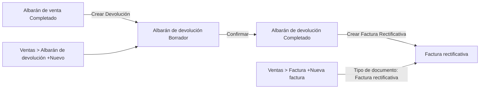
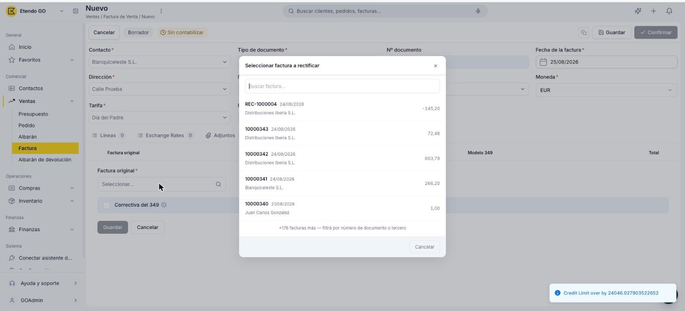

# Crear y gestionar devoluciones

## Descripción general

Cuando un cliente devuelve mercadería, Etendo Go separa el evento físico del financiero:

1. **El evento físico** — la mercadería vuelve al stock del vendedor. Se registra en el **albarán de devolución**, disponible en **[Ventas > Albarán de devolución](https://go.etendo.cloud/return-material-receipt){target="_blank"}**.
2. **El evento financiero** — el cliente recibe un crédito. Se registra con una **[factura rectificativa](#factura-rectificativa)**, que se genera habitualmente desde el albarán de devolución ya Completado.

## Crear un albarán de devolución

Etendo Go ofrece dos caminos para crear un albarán de devolución.

### Desde un albarán de venta ya completado

La forma habitual de crear una devolución es desde el [albarán de venta](../crear-y-gestionar-albaranes/crear-y-gestionar-albaranes.md) ya completado, con el botón **Crear Devolución**. Esto abre un asistente de 2 pasos:

1. **Paso 1 — Cantidades a devolver.**

    <figure markdown="span">
      
      <figcaption>Paso 1: cantidades a devolver por producto.</figcaption>
    </figure>

    Muestra cada producto del envío con su cantidad **Entregado** y un campo editable **Cant. devolución** (por defecto, la cantidad total entregada; se puede reducir para devoluciones parciales, y destildar los productos que no se devuelven). Incluye un campo opcional **Motivo de devolución**.

2. **Paso 2 — Confirmación.**

    <figure markdown="span">
      
      <figcaption>Paso 2: confirmación de la Recepción de Devolución a crear.</figcaption>
    </figure>

    Muestra el documento que se va a crear — llamado aquí **Recepción de Devolución** (es el mismo albarán de devolución; esta pantalla y el popup de confirmación se refieren a él por el nombre del movimiento físico) — junto con el detalle de productos, cantidades e importes y el total. Al hacer clic en **Crear Devolución** se genera el albarán de devolución en estado Borrador.

### Desde Ventas > Albarán de devolución

También es posible crear un albarán de devolución directamente desde **[Ventas > Albarán de devolución](https://go.etendo.cloud/return-material-receipt){target="_blank"}** con el botón **+ Nuevo albarán de devolución**.

!!! info "Este paso solo mueve stock"
    Sea cual sea el camino que uses para crear el albarán de devolución, la factura rectificativa se genera en un paso posterior, al confirmar este albarán — ver [Confirmar el albarán de devolución](#confirmar-el-albaran-de-devolucion) más abajo.

## El albarán de devolución

### Cabecera del documento

- **Contacto** — prellenado desde el albarán de venta origen; editable.
- **Nº documento** — se genera automáticamente al guardar.
- **Fecha del movimiento** — por defecto, la fecha actual.
- **Almacén** — almacén al que ingresa la mercadería devuelta.
- **Dirección** — dirección de origen de la devolución.
- **Albarán origen** — referencia de solo lectura al albarán de venta del que proviene la devolución (si aplica).

### Pestaña Líneas

Las líneas muestran, por producto, la **Cant. movida** (cantidad devuelta) y la **Cant. pedido** (cantidad del albarán de venta origen), a modo de referencia.

### Vista Detalle

<figure markdown="span">
  
  <figcaption>Vista detalle del Albarán de devolución, con el área "Sube tu documento" y el panel lateral de información clave.</figcaption>
</figure>

A diferencia de los demás documentos de venta, la vista detalle del albarán de devolución no genera un PDF automático: en su lugar muestra un área **Sube tu documento**, para adjuntar manualmente un comprobante (PDF, JPG, PNG, WebP o GIF) si lo necesitas. El panel lateral muestra el **Nº documento**, **Contacto**, **Almacén**, **Fecha movimiento**, **Estado**, **Facturado** (% del importe ya cubierto por una factura rectificativa) y la sección **DOCUMENTOS RELACIONADOS**, con el envío de origen y la factura rectificativa vinculada, si ya existe.

### Estados del Documento

| Estado | Descripción |
|---|---|
| Borrador | Sin efecto sobre el stock. |
| Completado | Registra el ingreso de la mercadería devuelta al almacén. |

### Confirmar el albarán de devolución

<figure markdown="span">
  
  <figcaption>Popup Confirmar recepción de devolución, con el interruptor Crear Factura Rectificativa.</figcaption>
</figure>

Al hacer clic en **Confirmar** sobre el albarán de devolución en Borrador, se abre el popup **Confirmar recepción de devolución**, con un interruptor **Crear Factura Rectificativa** (activado por defecto): "Se crea en borrador, prellenada con los productos devueltos y los precios de la factura origen." Puedes dejarlo activado para generar ambos documentos a la vez, o desactivarlo y confirmar solo la recepción.

Si no generaste la factura rectificativa al confirmar, el albarán de devolución ya Completado muestra un botón **Crear Factura Rectificativa** en la barra superior. Al hacer clic se abre el popup **Gestionar documentos**, con la opción **Crear factura** para generarla en ese momento.

## Factura rectificativa

El ajuste financiero de una devolución se gestiona siempre con la **Factura rectificativa** — el único tipo de documento para este caso dentro de **[Ventas > Factura](https://go.etendo.cloud/sales-invoice){target="_blank"}**, seleccionable en el campo **Tipo de documento** de ese formulario (junto a **Factura**). Se muestra con importe en negativo en el listado de facturas, y al confirmarse reduce el saldo pendiente de cobro de la factura de venta de origen.

La forma habitual de generarla es con el botón **Crear Factura Rectificativa** del albarán de devolución ya Completado (ver [Confirmar el albarán de devolución](#confirmar-el-albaran-de-devolucion) más arriba), con sus líneas prellenadas desde ese albarán.

!!! info "Crear una factura rectificativa sin devolución física"
    Para ajustes sin mercadería de por medio — como un error de precio, descuento o bonificación — ve a **[Ventas > Factura](https://go.etendo.cloud/sales-invoice){target="_blank"}**, haz clic en **+ Nueva factura** y selecciona **Tipo de documento: Factura rectificativa**. Sus líneas se cargan a mano.

    Además, en la pestaña **Rectificaciones** del formulario tienes que indicar cuál es la factura original que estás rectificando: haz clic en **+ Añadir rectificación** y selecciona esa factura en el campo **Factura original** (obligatorio). Sin esta asociación no se puede guardar la rectificación.

<figure markdown="span">
  
  <figcaption>Pestaña Rectificaciones: al hacer clic en + Añadir rectificación, se abre el buscador para seleccionar la factura original.</figcaption>
</figure>

## Artículos Relacionados

- [Crear y gestionar albaranes](../crear-y-gestionar-albaranes/crear-y-gestionar-albaranes.md)
- [Gestionar tus facturas de venta](../gestionar-tus-facturas-de-venta/gestionar-tus-facturas-de-venta.md)
- [Documentos de venta: preguntas frecuentes](../documentos-de-venta-preguntas-frecuentes/documentos-de-venta-preguntas-frecuentes.md)

---
Esta obra está bajo la licencia :material-creative-commons: :fontawesome-brands-creative-commons-by: :fontawesome-brands-creative-commons-sa: [CC BY-SA 2.5 ES](https://creativecommons.org/licenses/by-sa/2.5/es/){target="_blank"} de [Futit Services S.L](https://etendo.software){target="_blank"}.
