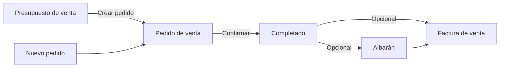
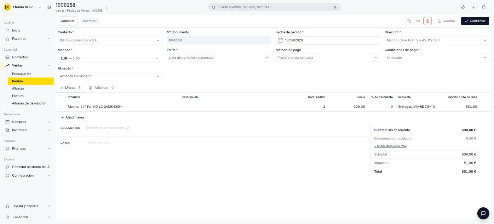
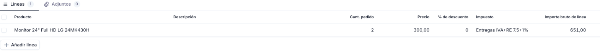
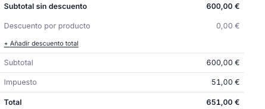
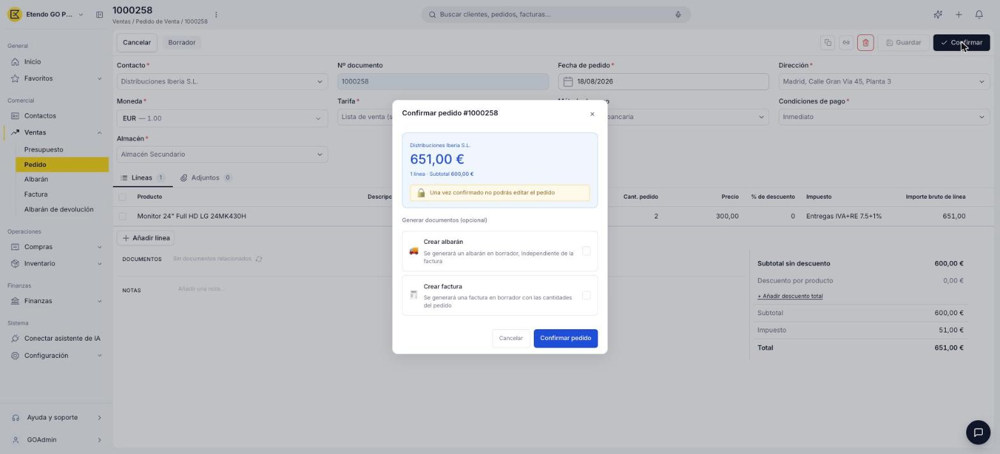
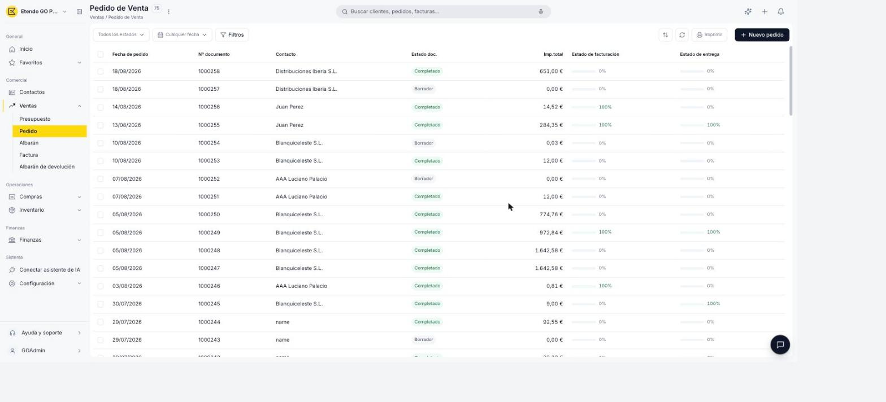
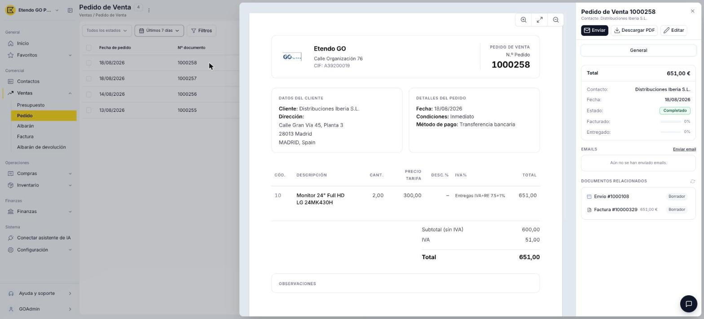
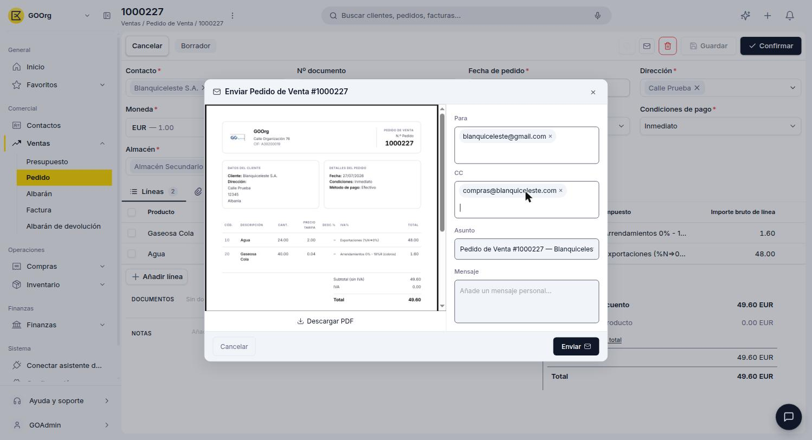
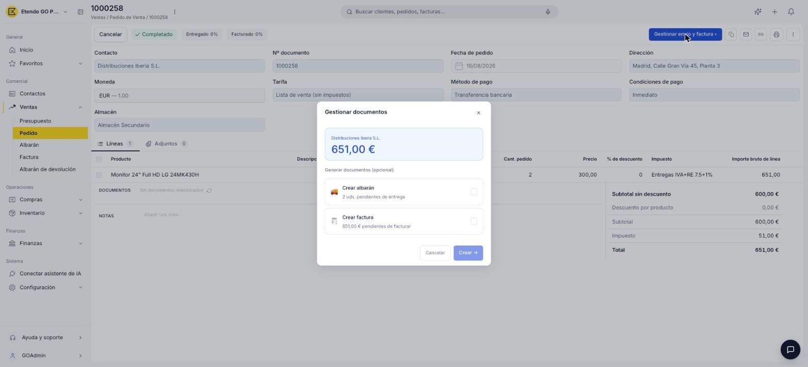

# Crear y gestionar pedidos

## Descripción general

El **pedido de venta** es el documento que formaliza el compromiso de entrega con el cliente. Puede crearse directamente o generarse a partir de un [presupuesto de venta](../crear-y-gestionar-presupuestos/crear-y-gestionar-presupuestos.md) aceptado. Una vez confirmado, el pedido queda bloqueado y da lugar opcionalmente a un [albarán](../crear-y-gestionar-albaranes/crear-y-gestionar-albaranes.md) (documento de entrega) y a una [factura de venta](../crear-una-factura-de-venta/crear-una-factura-de-venta.md).

El siguiente diagrama muestra las dos vías para crear un pedido de venta y su ciclo de vida hasta los documentos derivados:

Este artículo se organiza en dos flujos: primero cómo **crear un pedido** y confirmarlo, y luego cómo **gestionarlo** — enviarlo al cliente y generar los documentos derivados.

---

## Crear pedido de venta

### 1. Empieza un pedido nuevo

Para crear un pedido nuevo, accede a **[Ventas > Pedido](https://go.etendo.cloud/sales-order){target="_blank"}** y usa el botón **+ Nuevo pedido** en la esquina superior derecha. Alternativamente, puedes generar el pedido a partir de un [presupuesto de venta](../crear-y-gestionar-presupuestos/crear-y-gestionar-presupuestos.md) ya confirmado, en cuyo caso el pedido se crea con los datos del presupuesto ya cargados.

### 2. Completa el formulario

<figure markdown="span">
  
  <figcaption>Formulario de creación y edición del Pedido de venta.</figcaption>
</figure>

El formulario se abre al crear un pedido nuevo o al hacer clic en **Editar** desde la vista detalle.

**Cabecera**

- **Contacto** — cliente al que se dirige el pedido. Al seleccionarlo, el sistema autocompleta la Dirección, el Método de pago y las Condiciones de pago configurados en ese contacto.
- **Nº documento** — se genera automáticamente al guardar por primera vez.
- **Fecha de pedido** — toma por defecto la fecha actual; editable.
- **Dirección** — cargada desde el contacto; editable para este documento.
- **Tarifa** — determina a qué precios se cotizarán los productos en este pedido (lista de precios asignada al cliente). Normalmente se carga sola al seleccionar el cliente.
- **Método de pago** — heredado del contacto; editable para este documento.
- **Condiciones de pago** — heredado del contacto; editable para este documento. Las opciones disponibles son *Inmediato* y *30 días*.
- **Moneda** — moneda en la que se expresa el pedido. Por defecto, la moneda de la organización.
- **Almacén** — almacén desde el cual se despachará la mercadería de este pedido.

!!! tip "Campos autocargados desde el contacto"
    Son editables solo para este pedido, sin afectar la configuración del cliente.

**Pestaña Líneas**

<figure markdown="span">
  
  <figcaption>Pestaña Líneas con los productos y servicios incluidos en el pedido.</figcaption>
</figure>

Las líneas representan los productos o servicios incluidos en el pedido. Usa el botón **+ Añadir línea** para incorporar una nueva línea.

- **Producto** — al seleccionarlo autocompleta la descripción y el precio según la tarifa seleccionada en la cabecera; editable si se necesita ajustar para este pedido.
- **Descripción** — precompletada desde el producto; editable por línea.
- **Cant. pedido** — cantidad del producto. Por defecto 1.
- **Precio** — precio del producto según la tarifa de la cabecera; editable.
- **% de descuento** — descuento aplicado sobre el precio de tarifa de la línea.
- **Impuesto** — tipo impositivo aplicable a la línea.
- **Importe bruto de línea** — resultado de multiplicar el precio unitario por la cantidad, menos el descuento de línea aplicado.

Para guardar una línea pulsa ++enter++ o haz clic fuera de la fila. Para cancelar sin guardar, pulsa ++esc++.

**Totales**

<figure markdown="span">
  
  <figcaption>Panel de totales con desglose de subtotal, descuentos, impuesto e importe final.</figcaption>
</figure>

El sistema permite dos tipos de descuento: uno por línea (aplicado en la Pestaña Líneas) y uno global sobre el total del pedido.

El panel de totales en la parte inferior derecha muestra:

- **Subtotal sin descuento** — suma del importe bruto de todas las líneas antes de descuentos.
- **Descuento por producto** — suma de los descuentos aplicados por línea.
- **Descuento total** — descuento adicional aplicado al documento completo. Se activa con el enlace **+ Añadir descuento total**.
- **Subtotal** — base imponible tras descuentos.
- **Impuesto** — importe de impuesto calculado según el tipo seleccionado en cada línea.
- **Total** — importe final a pagar.

**Notas**

El campo **Notas** permite añadir observaciones internas. Este contenido no se incluye en el PDF enviado al cliente.

Junto a la pestaña **Líneas**, el formulario incluye también una pestaña **Adjuntos** para vincular archivos al pedido.

### 3. Confirma el pedido

<figure markdown="span">
  
  <figcaption>Popup de confirmación del Pedido de venta con opciones para generar documentos derivados.</figcaption>
</figure>

Al hacer clic en **Confirmar**, el sistema muestra el popup **Confirmar pedido** con el resumen del documento (contacto, importe total, número de líneas y subtotal).

!!! warning "El pedido queda bloqueado"
    Una vez confirmado, el pedido no se puede editar directamente. Si todavía no generaste el albarán ni la factura, puedes usar **Reactivar** para devolverlo a Borrador (ver [Acciones Disponibles](#acciones-disponibles)); en cuanto el pedido tiene algún documento relacionado, Reactivar deja de estar disponible y la única opción es usar **Copia** para trabajar sobre un nuevo pedido con los mismos datos.

La sección **Generar documentos (opcional)** permite seleccionar qué documentos crear en ese momento:

- **Crear albarán** — genera un albarán en estado Borrador, independiente de la factura. Úsalo cuando haya entrega física de mercadería.
- **Crear factura** — genera una factura en estado Borrador con las cantidades del pedido.

Puedes marcar uno, ambos o ninguno. Si no marcas ninguno, el pedido queda Completado sin documentos asociados y puedes generar el albarán o la factura más adelante desde la sección **Documentos relacionados** del propio pedido.

!!! info "Datos heredados en los documentos generados"
    El albarán y la factura creados desde el pedido heredan el contacto, la dirección, las condiciones de pago y todas las líneas.

---

## Gestionar pedidos de venta

### 1. Busca el pedido

<figure markdown="span">
  
  <figcaption>Vista lista del Pedido de venta con columnas de estado, facturación y entrega.</figcaption>
</figure>

La vista lista muestra todos los pedidos con las columnas **Fecha de pedido**, **Nº documento**, **Contacto**, **Estado doc.**, **Imp. total**, **Estado de facturación** y **Estado de entrega**.

**Estado de facturación** y **Estado de entrega** — indican qué porcentaje del pedido ya se facturó o se entregó. Ambas columnas muestran barras de progreso con porcentaje: verde cuando está al 100 %, naranja cuando es parcial y gris cuando no ha comenzado.

Para filtrar la lista utiliza los selectores de **estado del documento** y **fecha de pedido** en la barra superior. El ícono de embudo permite aplicar filtros adicionales.

### 2. Abre el pedido

<figure markdown="span">
  
  <figcaption>Vista detalle con la previsualización del PDF y el panel lateral de información clave.</figcaption>
</figure>

Al hacer clic sobre un pedido existente en la lista se abre la vista detalle. El centro muestra una previsualización del PDF y el panel derecho muestra la información clave: total, contacto, fecha, estado, y las barras de progreso de **Facturado** y **Entregado**.

Desde este panel puedes:

- **Enviar** — abre el panel de envío por email al cliente.
- **Descargar PDF** — descarga el pedido en formato PDF.
- **Editar** — abre el formulario completo para modificar el documento.

El panel también incluye la sección **Emails** con el historial de correos enviados, y la sección **Documentos relacionados**, que muestra los documentos vinculados al pedido: el presupuesto de origen (si el pedido fue generado desde uno) y los albaranes o facturas creados al confirmar, cada uno como un enlace navegable. Esta misma información aparece también dentro del formulario completo, accesible desde **Editar**.

### 3. Envía el pedido al cliente

<figure markdown="span">
  
  <figcaption>Panel de envío por email del Pedido de venta.</figcaption>
</figure>

El botón **Enviar**, disponible una vez que el pedido está Completado, abre el panel **Enviar Pedido de Venta**, con los campos **Para**, el enlace **Añadir CC** para sumar destinatarios en copia, **Asunto** (autocompletado con el número de documento y nombre del contacto) y **Mensaje**. Desde este panel también puedes descargar el PDF con el botón **Descargar PDF**.

Junto al botón **Enviar**, el botón **Imprimir** (también solo en Completado) genera directamente una copia imprimible del pedido, sin pasar por el panel de envío.

### 4. Genera los documentos pendientes

<figure markdown="span">
  
  <figcaption>Popup Gestionar documentos, con las opciones para crear el albarán y/o la factura pendientes.</figcaption>
</figure>

Si al confirmar no generaste el albarán y/o la factura, el pedido ya Completado muestra un botón **Gestionar envío y factura** en la barra superior, junto a los indicadores **Entregado** y **Facturado** con su porcentaje. Al hacer clic se abre el popup **Gestionar documentos**, que ofrece **Crear albarán** y/o **Crear factura** simultáneamente, según qué cantidades sigan pendientes de entrega y de facturación.

!!! info "Solo se ofrecen las cantidades pendientes"
    Si el pedido ya está entregado o facturado al 100 %, la acción correspondiente deja de aparecer en el popup automáticamente.

---

## Estados del Documento

La barra superior del formulario muestra el estado actual del pedido junto a los indicadores de entrega y facturación.

| Estado | Descripción |
|---|---|
| Borrador | En preparación. El documento es completamente editable. |
| Completado | Confirmado. Ya no es editable. Se pueden generar albarán y factura. |

!!! warning "El pedido no se puede editar tras confirmar"
    Una vez confirmado, el pedido queda bloqueado. Verifica las líneas, cantidades y precios antes de confirmar. Si todavía no generaste el albarán ni la factura, puedes usar **Reactivar** (ver [Acciones Disponibles](#acciones-disponibles)) para devolverlo a Borrador; si el pedido ya tiene algún documento relacionado, Reactivar ya no está disponible y la única opción es usar **Copia** para crear un nuevo pedido con los mismos datos.

---

## Acciones Disponibles

<figure markdown="span">
  
  <figcaption>Barra de acciones del Pedido de venta.</figcaption>
</figure>

La barra superior del formulario muestra las siguientes acciones:

| Acción | Descripción | Estado |
| :--- | :--- | :--- |
| **Cancelar** | Descarta los cambios no guardados y vuelve a la lista. | Solo en Borrador |
| **Guardar** | Guarda el documento sin cambiar su estado. | Solo en Borrador |
| **Confirmar** | Confirma el pedido y lo pasa a estado Completado (ver [Crear pedido de venta](#crear-pedido-de-venta)). | Solo en Borrador |
| **Copia** | Clona el pedido actual creando un nuevo borrador con el mismo contacto, líneas y condiciones. | Borrador y Completado |
| **Enviar** | Abre el panel de envío por correo electrónico. | Solo en Completado |
| **Imprimir** | Genera una copia imprimible del pedido. | Solo en Completado |
| **Reactivar** | Disponible en el menú de tres puntos. Devuelve el pedido a estado Borrador para poder editarlo de nuevo. Deja de estar disponible en cuanto el pedido tiene un albarán o una factura generados. | Solo en Completado sin documentos relacionados |
| **Papelera** | Elimina el documento con confirmación previa. | Solo en Borrador |

## Artículos Relacionados

- [Crear y gestionar presupuestos](../crear-y-gestionar-presupuestos/crear-y-gestionar-presupuestos.md)
- [Crear y gestionar albaranes](../crear-y-gestionar-albaranes/crear-y-gestionar-albaranes.md)
- [Crear una factura de venta](../crear-una-factura-de-venta/crear-una-factura-de-venta.md)

---
Esta obra está bajo la licencia :material-creative-commons: :fontawesome-brands-creative-commons-by: :fontawesome-brands-creative-commons-sa: [CC BY-SA 2.5 ES](https://creativecommons.org/licenses/by-sa/2.5/es/){target="_blank"} de [Futit Services S.L](https://etendo.software){target="_blank"}.
