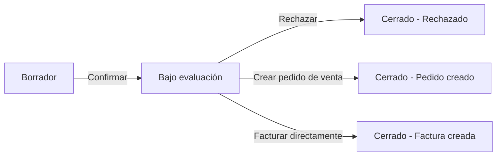
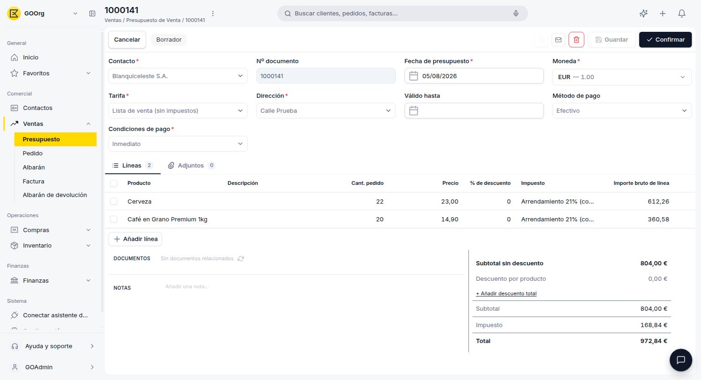
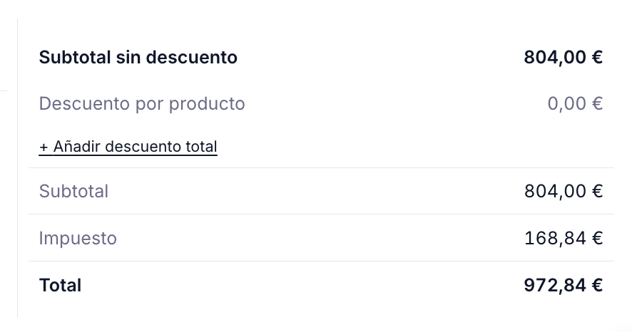
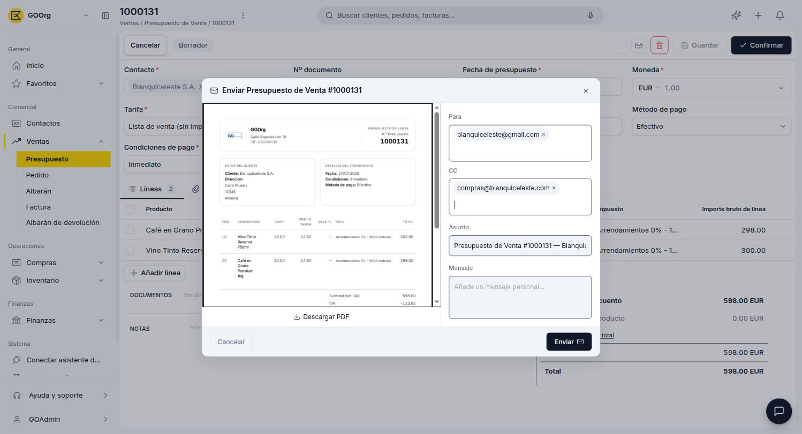
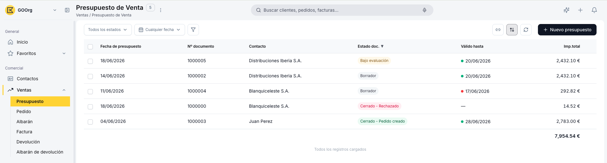
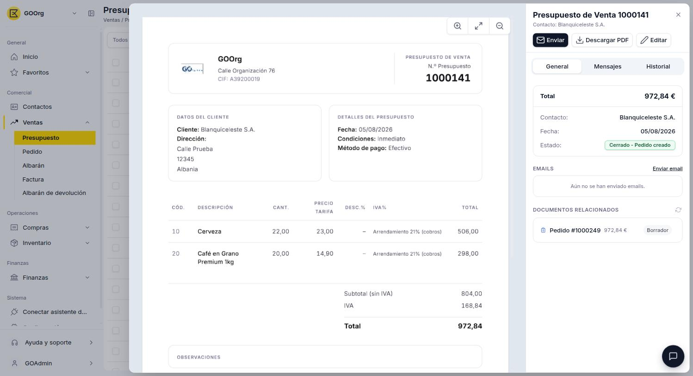
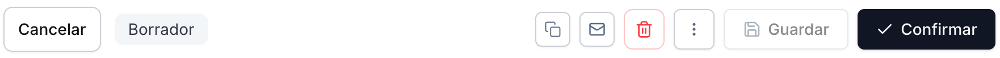

# Crear y gestionar presupuestos

## Descripción general

El **presupuesto de venta** es un documento opcional del ciclo comercial. Representa una oferta enviada al cliente con el detalle de productos, precios, descuentos y condiciones de pago. Una vez confirmado, da lugar a un [pedido de venta](../crear-y-gestionar-pedidos/crear-y-gestionar-pedidos.md) o a una [factura de venta](../crear-una-factura-de-venta/crear-una-factura-de-venta.md) directa sin necesidad de reintroducir datos. El pedido de venta es la opción habitual cuando se comercializan productos con stock o que requieren entrega física; la factura directa se usa para servicios o ventas sin entrega.

El siguiente diagrama muestra el ciclo de vida del presupuesto de venta, incluyendo los tres estados de cierre posibles:

Este artículo se organiza en dos flujos: primero cómo **crear un presupuesto** y enviarlo al cliente, y luego cómo **gestionarlo** cuando el cliente responde.

---

## Crear un presupuesto

### 1. Empieza un presupuesto nuevo

Para crear un presupuesto nuevo, accede a **[Ventas > Presupuesto](https://go.etendo.cloud/sales-quotation){target="_blank"}** y utiliza el botón **+ Nuevo presupuesto** en la esquina superior derecha. Esto abre el formulario en blanco, listo para completar.

### 2. Completa el formulario

<figure markdown="span">
  
  <figcaption>Formulario de creación y edición del Presupuesto de venta.</figcaption>
</figure>

El formulario se abre al crear un presupuesto nuevo o al hacer clic en **Editar** desde la vista detalle de un presupuesto existente.

**Cabecera**

- **Contacto** — cliente al que se dirige la oferta. Al seleccionarlo, el sistema autocompleta automáticamente la Dirección, el Método de pago y las Condiciones de pago con los valores configurados en ese contacto.
- **Nº documento** — se genera automáticamente al guardar por primera vez.
- **Fecha de presupuesto** — toma por defecto la fecha actual; editable.
- **Dirección** — cargada desde el contacto; puede modificarse para este documento sin afectar al contacto.
- **Tarifa** — determina a qué precios se cotizarán los productos en este presupuesto (lista de precios asignada al cliente). Normalmente se carga sola al seleccionar el cliente.
- **Válido hasta** — fecha límite de vigencia de la oferta. No es obligatorio.
- **Método de pago** — heredado del contacto; editable por documento.
- **Condiciones de pago** — heredado del contacto; editable por documento. Las opciones disponibles son *Inmediato* y *30 días*.
- **Moneda** — moneda en la que se expresa el presupuesto. Por defecto, la moneda de la organización.

!!! tip "Autocompletado al elegir el contacto"
    Todos los campos autocompletados son editables solo para este presupuesto, sin afectar la configuración del cliente. Si el contacto no tiene una dirección registrada, el campo queda vacío y debe completarse manualmente.

**Pestaña Líneas**

<figure markdown="span">
  
  <figcaption>Pestaña Líneas con los productos y servicios incluidos en el presupuesto.</figcaption>
</figure>

Las líneas representan los productos o servicios incluidos en la oferta. Usa el botón **+ Añadir línea** para incorporar una nueva línea al presupuesto.

- **Producto** — al seleccionarlo autocompleta la descripción y el precio según la tarifa de la cabecera.
- **Descripción** — precompletada desde el producto; editable por línea.
- **Cant. pedido** — cantidad del producto. Por defecto 1.
- **Precio** — precio del producto según la tarifa seleccionada en la cabecera; editable si se necesita ajustar para este presupuesto.
- **% de descuento** — descuento aplicado sobre el precio de tarifa de la línea.
- **Impuesto** — tipo impositivo aplicable a la línea.
- **Importe bruto de línea** — se calcula automáticamente aplicando el descuento al precio unitario multiplicado por la cantidad.

Para guardar una línea pulsa ++enter++ o haz clic fuera de la fila. Para cancelar sin guardar, pulsa ++esc++.

**Totales**

<figure markdown="span">
  
  <figcaption>Panel de totales con desglose de subtotal, descuentos, impuesto e importe final.</figcaption>
</figure>

El presupuesto admite dos tipos de descuento: uno por línea, aplicado directamente en la Pestaña Líneas sobre cada producto, y uno global que se aplica sobre el total del documento. El panel de totales en la parte inferior derecha muestra:

- **Subtotal sin descuento** — suma del importe bruto de todas las líneas antes de descuentos.
- **Descuento por producto** — suma de los descuentos por línea.
- **Descuento total** — descuento adicional aplicado al documento completo. Se activa con el enlace **+ Añadir descuento total**.
- **Subtotal** — base imponible tras descuentos.
- **Impuesto** — importe de impuesto calculado según el tipo seleccionado en cada línea.
- **Total** — importe final a pagar.

**Notas y adjuntos**

El campo **Notas** permite añadir observaciones internas. Este contenido no se incluye en el PDF enviado al cliente. Junto a la pestaña **Líneas**, el formulario incluye también una pestaña **Adjuntos** para vincular archivos al presupuesto.

### 3. Confirma el presupuesto y envíalo al cliente

Cuando el formulario está completo, haz clic en **Confirmar** en la barra superior — disponible mientras el documento está en estado **Borrador**. El presupuesto pasa a estado **Bajo evaluación**, quedando marcado como pendiente de respuesta del cliente.

!!! warning "El presupuesto ya no puede volver a Borrador"
    Una vez en **Bajo evaluación**, el presupuesto no puede devolverse a **Borrador** para editarlo. Si necesitas modificarlo, usa **Rechazar** para cerrarlo como **Cerrado - Rechazado** y luego **Copia** para crear un nuevo borrador con los mismos datos; edítalo y envía el nuevo presupuesto al cliente.

Con el presupuesto ya confirmado, tienes tres formas de hacérselo llegar al cliente:

- **Envíalo por email** — haz clic en el icono **Enviar** (con forma de sobre) para abrir el panel **Enviar Presupuesto de Venta**, con los campos **Para**, el enlace **Añadir CC** para sumar destinatarios en copia, **Asunto** (autocompletado con el número de documento y nombre del contacto) y **Mensaje**. Pulsa **Enviar** para completar el envío.
- **Descarga el PDF para enviarlo por otro medio** — si prefieres compartir el presupuesto por otro canal (por ejemplo WhatsApp), usa el botón **Descargar PDF**. Está disponible tanto desde la vista detalle del presupuesto como dentro del propio panel de envío por email.
- **Imprímelo para entregarlo en persona** — si la venta es presencial, usa el icono **Imprimir** en la barra superior para generar una copia física del presupuesto y entregársela directamente al cliente.

<figure markdown="span">
  
  <figcaption>Panel de envío por email del Presupuesto de venta.</figcaption>
</figure>

!!! info "Disponibilidad de Enviar e Imprimir"
    Estos dos íconos solo aparecen una vez que el presupuesto está **Bajo evaluación** o en alguno de los estados **Cerrado**; no están disponibles mientras el documento sigue en **Borrador**.

---

## Gestionar presupuestos

Cuando el cliente ya recibió el presupuesto, esta sección te muestra cómo localizarlo y avanzar según su respuesta.

### 1. Busca el presupuesto pendiente

<figure markdown="span">
  
  <figcaption>Vista lista del Presupuesto de venta con columnas de estado, vigencia e importe total.</figcaption>
</figure>

La vista lista muestra todos los presupuestos con las columnas **Fecha de presupuesto**, **Nº documento**, **Contacto**, **Estado doc.** (ver [Estados del Documento](#estados-del-documento)), **Válido hasta** e **Imp. total**.

Para filtrar la lista se dispone de dos selectores en la barra superior: el primero filtra por **estado del documento** y el segundo por **fecha de presupuesto**, con las opciones Hoy, Ayer, Últimos 7 días, Últimos 30 días, Últimos 12 meses, Todo el tiempo y Personalizado. Usa el primer selector para filtrar por **Bajo evaluación** y localizar de un vistazo los presupuestos pendientes de respuesta. El ícono de embudo permite aplicar filtros adicionales, y las columnas son ordenables haciendo clic en su encabezado.

### 2. Abre el presupuesto

<figure markdown="span">
  
  <figcaption>Vista detalle con la previsualización del PDF y el panel lateral de información clave.</figcaption>
</figure>

Al hacer clic sobre un presupuesto en la lista se abre la vista detalle. Esta vista muestra en el centro una previsualización del PDF del presupuesto y en el panel derecho la información clave del documento: total, contacto, fecha y estado.

Desde este panel se pueden realizar las siguientes acciones sin necesidad de entrar al formulario:

- **Enviar** — abre el panel de envío por email al cliente.
- **Descargar PDF** — descarga el presupuesto en formato PDF.
- **Editar** — abre el formulario completo para verlo con más detalle. En **Bajo evaluación** los campos ya no son editables, salvo el campo **Notas**; para modificar el resto de los datos hay que rechazar el presupuesto y trabajar sobre una copia (ver aviso en [Crear un presupuesto](#crear-un-presupuesto)).

El panel también incluye la pestaña **General**, donde se agrupa la información clave del documento ya mencionada (total, contacto, fecha y estado); la sección **Emails**, que registra los correos enviados al cliente; y la sección **Documentos relacionados**, que muestra los pedidos o facturas generados a partir de este presupuesto, con su importe y estado. Esta misma información aparece dentro del formulario completo (sección **Documentos**, accesible desde **Editar**), donde cada documento generado es un enlace navegable.

### 3. Cierra el presupuesto según la respuesta del cliente

Cuando el cliente contesta al presupuesto, haz clic en **Confirmar** de nuevo — esta segunda confirmación está disponible desde el estado **Bajo evaluación** y ya no vuelve el documento a Borrador. El sistema muestra un popup con dos opciones:

<figure markdown="span">
  { width=420 }
  <figcaption>Popup de confirmación del Presupuesto de venta con las opciones para generar documentos derivados.</figcaption>
</figure>

- **Crear pedido de venta** — recomendado para productos con stock, entregas o pedidos con múltiples envíos. El presupuesto queda **Cerrado - Pedido creado**.
- **Facturar directamente** — para servicios o ventas sin entrega física. No genera albarán (documento de entrega de mercadería que se crea al procesar un pedido). El presupuesto queda **Cerrado - Factura creada**.

!!! info "Datos heredados en el documento derivado"
    Tanto el Pedido como la Factura creados desde el presupuesto heredan el contacto, la dirección, la tarifa, las condiciones de pago y todas las líneas. No es necesario volver a introducir ningún dato.

Si el cliente rechaza la oferta, usa la acción **Rechazar**, disponible en el menú de tres puntos. El presupuesto pasa a **Cerrado - Rechazado**, sin generar ningún documento derivado.

---

## Estados del Documento

El estado actual se muestra como una etiqueta junto al botón **Cancelar** en la barra superior.

| Estado | Descripción |
|---|---|
| Borrador | En preparación. El documento es completamente editable. |
| Bajo evaluación | Enviado al cliente, pendiente de respuesta. Edición parcialmente restringida. |
| Cerrado - Rechazado | El cliente rechazó la propuesta. |
| Cerrado - Pedido creado | Aceptado y convertido en Pedido de venta. |
| Cerrado - Factura creada | Aceptado y convertido en Factura de venta directa. |

---

## Acciones Disponibles

<figure markdown="span">
  
  <figcaption>Barra de acciones del Presupuesto de venta.</figcaption>
</figure>

La barra superior del formulario muestra las siguientes acciones:

| Acción | Descripción | Estado |
| :--- | :--- | :--- |
| **Cancelar** | Descarta los cambios no guardados y vuelve a la lista. | Solo en Borrador |
| **Guardar** | Guarda el documento sin cambiar su estado. | Solo en Borrador |
| **Confirmar** | Envía el presupuesto al estado Bajo evaluación (ver [Crear un presupuesto](#crear-un-presupuesto)). Desde Bajo evaluación, una segunda confirmación lo convierte en Pedido de venta o Factura directa (ver [Gestionar presupuestos](#gestionar-presupuestos)). | Borrador y Bajo evaluación |
| **Copia** | Clona el presupuesto actual creando un nuevo borrador con los mismos datos. | Todos los estados |
| **Enviar** | Abre el panel de envío por email al cliente. | Bajo evaluación y estados Cerrado |
| **Imprimir** | Genera una copia imprimible del presupuesto, útil para entregarla en persona. | Bajo evaluación y estados Cerrado |
| **Rechazar** | Disponible en el menú de tres puntos. Marca el presupuesto como **Cerrado - Rechazado**, sin generar ningún documento derivado. | Solo en Bajo evaluación |
| **Papelera** | Elimina el documento con confirmación previa. | Solo en Borrador |

## Artículos Relacionados

- [Crear y gestionar pedidos](../crear-y-gestionar-pedidos/crear-y-gestionar-pedidos.md)
- [Crear una factura de venta](../crear-una-factura-de-venta/crear-una-factura-de-venta.md)
- [Cómo crear un contacto](../../contactos/como-crear-un-contacto/como-crear-un-contacto.md)

---
Esta obra está bajo la licencia :material-creative-commons: :fontawesome-brands-creative-commons-by: :fontawesome-brands-creative-commons-sa: [CC BY-SA 2.5 ES](https://creativecommons.org/licenses/by-sa/2.5/es/){target="_blank"} de [Futit Services S.L](https://etendo.software){target="_blank"}.
