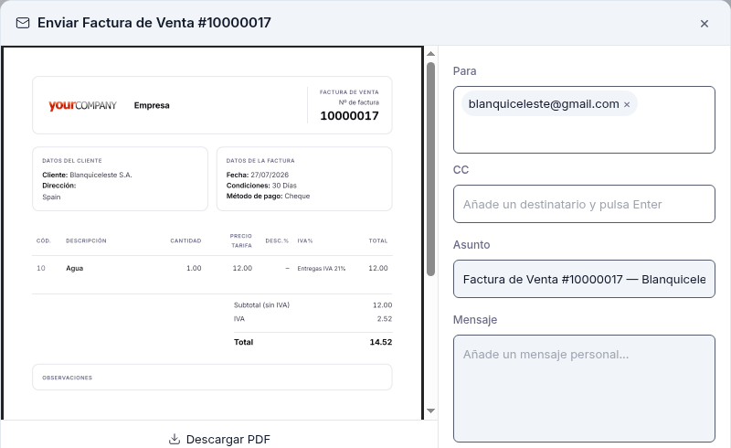

# Enviar tus facturas por email

Una vez creada una factura de venta, puedes enviarla por correo electrónico a tu cliente sin salir de Etendo Go, tanto en estado Borrador como Completado.

## Pasos

1. Abre la factura desde la vista lista o desde la vista detalle de **[Ventas > Factura](https://go.etendo.cloud/sales-invoice){target="_blank"}**.

2. Haz clic en **Enviar**. Se abre el panel **Enviar Factura de Venta**:

    

3. Completa los campos del panel:

    - **Para** — dirección de correo del destinatario; se precarga con el email del contacto si está cargado.
    - **Añadir CC** — enlace para sumar destinatarios adicionales en copia.
    - **Asunto** — se autocompleta con el número de documento y el nombre del contacto; editable.
    - **Mensaje** — texto libre que acompaña al envío.

4. Si necesitas revisar el documento antes de enviarlo, usa **Descargar PDF** desde el mismo panel.

5. Haz clic en **Enviar** para completar el envío.

Cada envío queda registrado en la sección **EMAILS** del panel lateral de la factura, junto con el historial de correos enviados previamente.

!!! info "Envíos repetidos"
    Puedes reenviar la misma factura las veces que necesites — por ejemplo, si el cliente solicita una copia. Cada envío se suma al historial sin afectar el estado del documento.

## Artículos Relacionados

- [Crear una factura de venta](../crear-una-factura-de-venta/crear-una-factura-de-venta.md)
- [Gestionar tus facturas de venta](../gestionar-tus-facturas-de-venta/gestionar-tus-facturas-de-venta.md)
- [Añadir pagos a tu factura de venta](../anadir-pagos-a-tu-factura-de-venta/anadir-pagos-a-tu-factura-de-venta.md)

---
Esta obra está bajo la licencia :material-creative-commons: :fontawesome-brands-creative-commons-by: :fontawesome-brands-creative-commons-sa: [CC BY-SA 2.5 ES](https://creativecommons.org/licenses/by-sa/2.5/es/){target="_blank"} de [Futit Services S.L](https://etendo.software){target="_blank"}.
