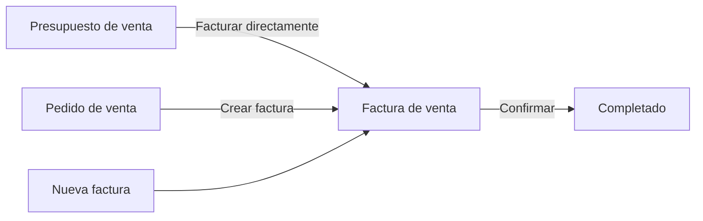
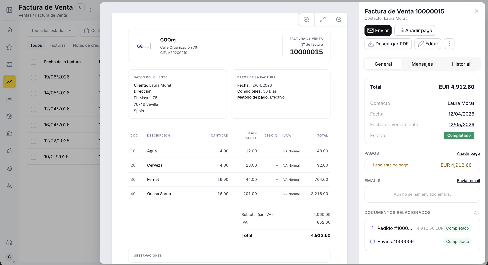
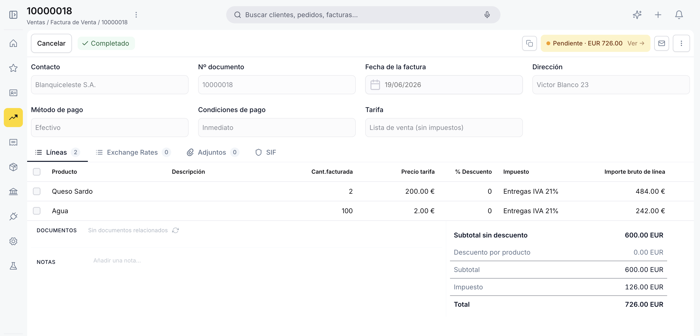
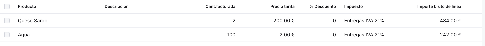
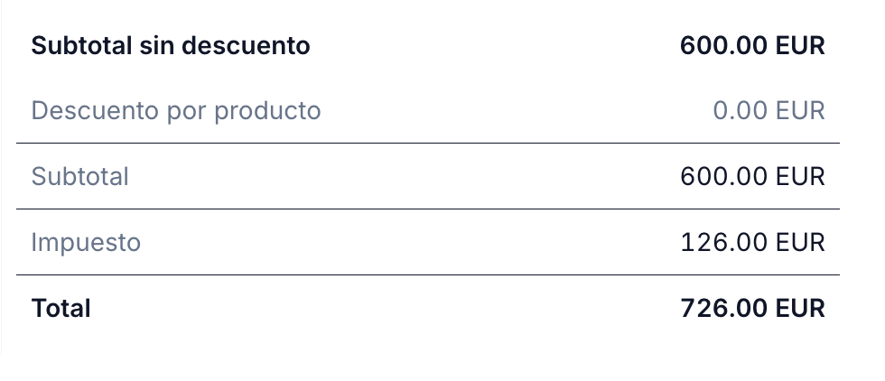
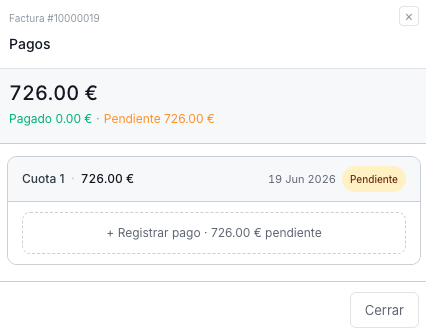
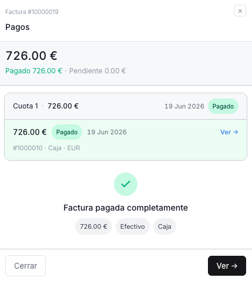

---
tags:
  - Factura de Venta
  - Ventas
  - Comercial
  - Gestión Documental
  - Etendo Go
---

# Factura de venta

## Descripción general

La **factura de venta** es el documento fiscal que formaliza el cobro al cliente. Puede crearse directamente, generarse desde un [presupuesto de venta](../presupuesto-de-venta/presupuesto-de-venta.md) aceptado o desde un [pedido de venta](../pedido-de-venta/pedido-de-venta.md) confirmado. Una vez confirmada, queda bloqueada y registra el importe pendiente de cobro.

El siguiente diagrama muestra las tres vías para crear una factura de venta y su ciclo de vida hasta la confirmación:

---

## Vista Lista

<figure markdown="span">
  
  <figcaption>Vista lista de la Factura de venta con columnas de estado, vencimiento e importe pendiente.</figcaption>
</figure>

La vista lista muestra todas las facturas con las columnas **Fecha de la factura**, **Nº documento**, **Vencimiento**, **Contacto**, **Estado doc.**, **Imp. total**, **Pendiente de pago** y **Estado de entrega**.

La barra superior incluye tabs para filtrar por tipo de documento: **Todos**, **Facturas**, **Notas de crédito** y **Todos los pagos**. Los selectores de **estado del documento** y **fecha de factura** permiten filtrar la lista. Para crear una factura nueva usa el botón **+ Nueva factura** en la esquina superior derecha.

---

## Vista Detalle

<figure markdown="span">
  
  <figcaption>Vista detalle con la previsualización del PDF y el panel lateral de información clave.</figcaption>
</figure>

Al hacer clic sobre una factura existente en la lista se abre la vista detalle. El centro muestra una previsualización del PDF y el panel derecho muestra la información clave: total, contacto, fecha, fecha de vencimiento y estado.

Desde este panel puedes:

- **Enviar** — abre el panel de envío por email al cliente.
- **Añadir pago** — registra un pago total o parcial sobre la factura.
- **Descargar PDF** — descarga la factura en formato PDF.
- **Editar** — abre el formulario completo para modificar el documento.

El panel también incluye la sección **PAGOS** con el importe pendiente de cobro, la sección **EMAILS** con el historial de correos enviados y la sección **DOCUMENTOS RELACIONADOS** con el pedido y albarán de origen.

---

## Vista Formulario

<figure markdown="span">
  
  <figcaption>Formulario de creación y edición de la Factura de venta.</figcaption>
</figure>

El formulario se abre al crear una factura nueva o al hacer clic en **Editar** desde la vista detalle.

### Cabecera

- **Contacto** — cliente al que se dirige la factura. Al seleccionarlo, el sistema autocompleta la Dirección, el Método de pago, las Condiciones de pago y la Tarifa configurados en ese contacto.
- **Nº documento** — se genera automáticamente al guardar por primera vez.
- **Fecha de la factura** — toma por defecto la fecha actual; editable.
- **Dirección** — cargada desde el contacto; editable para este documento.
- **Método de pago** — heredado del contacto; editable para este documento.
- **Condiciones de pago** — heredado del contacto; editable para este documento. Determina la fecha de vencimiento calculada automáticamente. Las opciones disponibles son *Inmediato* y *30 días*.
- **Tarifa** — lista de precios con la que se cotizarán los productos de la factura. Normalmente se carga sola al seleccionar el contacto.

!!! tip "Campos autocargados desde el contacto"
    Al seleccionar el contacto, el sistema carga automáticamente la dirección, el método de pago, las condiciones de pago y la tarifa. Todos son editables dentro de la factura sin afectar la configuración del cliente.

### Pestaña Líneas

<figure markdown="span">
  
  <figcaption>Pestaña Líneas con los productos y servicios incluidos en la factura.</figcaption>
</figure>

Las líneas representan los productos o servicios facturados. Usa el botón **+ Añadir línea** para incorporar una nueva línea manualmente. También puedes importar líneas directamente desde un albarán o pedido existente usando el enlace **Importar desde un envío o pedido**.

- **Producto** — al seleccionarlo autocompleta la descripción y el precio de tarifa; editable.
- **Descripción** — precompletada desde el producto; editable por línea.
- **Cant. facturada** — cantidad del producto incluida en esta factura.
- **Precio tarifa** — precio del producto según la tarifa de la cabecera; editable.
- **% de descuento** — descuento aplicado sobre el precio de tarifa de la línea.
- **Impuesto** — tipo impositivo aplicable a la línea.
- **Importe bruto de línea** — resultado de multiplicar el precio unitario por la cantidad, menos el descuento de línea aplicado.

Para guardar una línea pulsa ++enter++ o haz clic fuera de la fila. Para cancelar sin guardar, pulsa ++esc++.

#### Totales

<figure markdown="span">
  
  <figcaption>Panel de totales con desglose de subtotal, descuentos, impuesto e importe final.</figcaption>
</figure>

El panel de totales en la parte inferior derecha muestra:

- **Subtotal sin descuento** — suma del importe bruto de todas las líneas antes de descuentos.
- **Descuento por producto** — suma de los descuentos aplicados por línea.
- **Subtotal** — base imponible tras descuentos.
- **Impuesto** — importe de impuesto calculado según el tipo seleccionado en cada línea.
- **Total** — importe final a cobrar.

#### Documentos Relacionados

La sección **DOCUMENTOS** muestra los documentos vinculados a la factura: el pedido o presupuesto de origen y el albarán asociado. Cada documento es un enlace navegable.

#### Notas

El campo **NOTAS** permite añadir observaciones internas. Este contenido no se incluye en el PDF enviado al cliente.

---

## Estados del Documento

El estado actual se muestra en la barra superior del formulario junto al botón **Cancelar**.

| Estado | Descripción |
|---|---|
| Borrador | En preparación. El documento es completamente editable. |
| Completado | Confirmada. Ya no es editable. Queda pendiente de cobro. |

!!! warning "La factura no se puede editar tras confirmar"
    Una vez confirmada, la factura queda bloqueada. Verifica los importes, el contacto y las condiciones de pago antes de confirmar.

Cuando la fecha de vencimiento ha pasado sin que se registre el pago completo, la barra superior muestra el indicador **Vencido · EUR X** con un enlace para consultar los pagos pendientes.

---

## Acciones Disponibles

La barra superior del formulario muestra las siguientes acciones:

| Acción | Descripción | Estado |
| :--- | :--- | :--- |
| **Cancelar** | Descarta los cambios no guardados y vuelve a la lista. | Solo en Borrador |
| **Guardar** | Guarda el documento sin cambiar su estado. | Solo en Borrador |
| **Confirmar** | Confirma la factura y la pasa a estado Completado. La acción es directa, sin popup de confirmación. | Solo en Borrador |
| **Copia** | Clona la factura actual creando un nuevo borrador con el mismo contacto, líneas y condiciones. | Borrador y Completado |
| **Enviar / Descargar** | Abre el panel de envío por correo electrónico o descarga el PDF. | Borrador y Completado |
| **Papelera** | Elimina el documento con confirmación previa. | Solo en Borrador |

### Enviar por Email

<figure markdown="span">
  
  <figcaption>Panel de envío por email de la Factura de venta.</figcaption>
</figure>

El botón **Enviar / Descargar** abre el panel **Enviar Factura de Venta**, con los campos **Para**, **Asunto** (autocompletado con el número de documento y nombre del contacto) y **Mensaje**. Desde este panel también puedes descargar el PDF con el botón **Descargar PDF**.

### Añadir Pago

<figure markdown="span">
  
  <figcaption>Panel de registro de pago sobre la Factura de venta.</figcaption>
</figure>

<figure markdown="span">
  
  <figcaption>Confirmación del pago registrado con el importe pendiente actualizado.</figcaption>
</figure>

El botón **Añadir pago** —disponible tanto en la vista detalle como en la barra del formulario— permite registrar un cobro sobre la factura. Indica el importe recibido, la fecha y el método de pago. El sistema actualiza automáticamente el importe **Pendiente de pago** en el panel lateral.

!!! info "Pagos parciales"
    Puedes registrar varios pagos parciales hasta cubrir el total de la factura. El indicador de **Pendiente de pago** se reduce con cada pago registrado.

---

## Artículos Relacionados

- [Presupuesto de venta](../presupuesto-de-venta/presupuesto-de-venta.md)
- [Pedido de venta](../pedido-de-venta/pedido-de-venta.md)
- [Contactos](../../contactos/contactos.md)

---
This work is licensed under :material-creative-commons: :fontawesome-brands-creative-commons-by: :fontawesome-brands-creative-commons-sa: [ CC BY-SA 2.5 ES](https://creativecommons.org/licenses/by-sa/2.5/es/){target="_blank"} by [Futit Services S.L](https://etendo.software){target="_blank"}.
