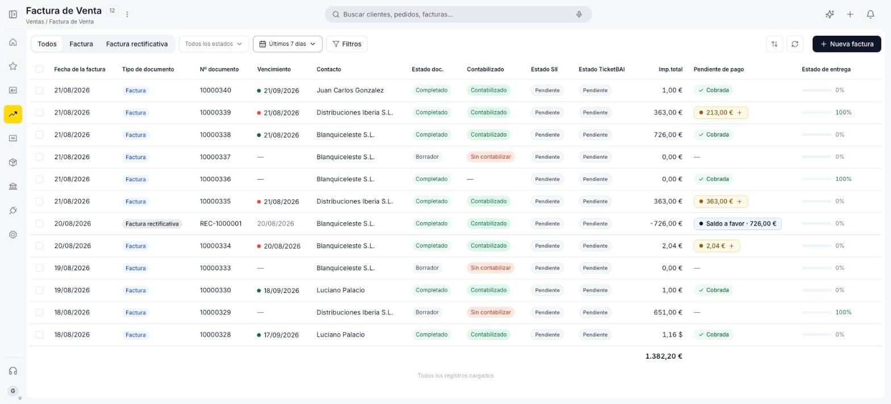
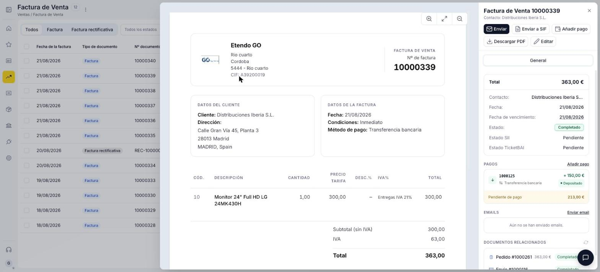

# Gestionar tus facturas de venta

Una vez que tienes facturas de venta creadas, vas a necesitar consultarlas, hacer seguimiento de su cobro o revisar su estado. Este artículo repasa la ventana de **[Ventas > Factura](https://go.etendo.cloud/sales-invoice){target="_blank"}** — la vista lista, la vista detalle y los estados del documento. Si todavía no has creado ninguna factura, empieza por [Crear una factura de venta](../crear-una-factura-de-venta/crear-una-factura-de-venta.md).

## Vista Lista

<figure markdown="span">
  
  <figcaption>Vista lista de Factura de venta, con filtros por tipo de documento y estado.</figcaption>
</figure>

La vista lista muestra todas las facturas con las columnas **Fecha de la factura**, **Tipo de documento**, **Nº documento**, **Vencimiento**, **Contacto**, **Estado doc.**, **Imp. total**, **Pendiente de pago** y **Estado de entrega**.

**Estado de entrega** — indica qué porcentaje de la factura ya se entregó mediante un [albarán](../crear-y-gestionar-albaranes/crear-y-gestionar-albaranes.md) asociado. Se muestra como una barra de progreso con porcentaje: verde al 100 %, naranja cuando es parcial y gris cuando todavía no hay ningún albarán vinculado.

La barra superior incluye tabs para filtrar por tipo de documento: **Todos**, **Factura** y **Factura rectificativa**. Los selectores de **estado del documento** y **fecha de factura** permiten filtrar la lista. Para crear una factura nueva usa el botón **+ Nueva factura** en la esquina superior derecha.

Al pasar el cursor sobre una fila aparecen accesos rápidos para **Editar**, **Copiar**, **Enviar** y **Eliminar** sin necesidad de abrir el documento.

## Vista Detalle

<figure markdown="span">
  
  <figcaption>Vista detalle de la Factura de venta, con las secciones Pagos, Emails y Documentos relacionados.</figcaption>
</figure>

Al hacer clic sobre una factura existente en la lista se abre la vista detalle. El centro muestra una previsualización del PDF y el panel derecho muestra la información clave: total, contacto, fecha, fecha de vencimiento y estado.

Desde este panel puedes:

- **Enviar** — abre el panel de envío por email al cliente. Ver [Enviar tus facturas por email](../enviar-tus-facturas-por-email/enviar-tus-facturas-por-email.md).
- **Añadir pago** — registra un pago total o parcial sobre la factura. Ver [Añadir pagos a tu factura de venta](../anadir-pagos-a-tu-factura-de-venta/anadir-pagos-a-tu-factura-de-venta.md).
- **Descargar PDF** — descarga la factura en formato PDF.
- **Editar** — abre el formulario completo para modificar el documento.

El panel también incluye la sección **PAGOS** con el importe pendiente de cobro, la sección **EMAILS** con el historial de correos enviados y la sección **DOCUMENTOS RELACIONADOS** con el pedido y albarán de origen.

## Estados del Documento

El estado actual se muestra en la barra superior del formulario junto al botón **Cancelar**.

| Estado | Descripción |
|---|---|
| Borrador | En preparación. El documento es completamente editable. |
| Completado | Confirmada. Ya no es editable. Queda pendiente de cobro. |

!!! warning "La factura no se puede editar tras confirmar"
    Una vez confirmada, la factura queda bloqueada. Verifica los importes, el contacto y las condiciones de pago antes de confirmar. Si todavía no tiene pagos registrados, puedes usar **Reactivar** (ver [Acciones Disponibles](#acciones-disponibles)) para devolverla a Borrador; si ya tiene algún pago asociado, esta acción deja de estar disponible.

Cuando la fecha de vencimiento ha pasado sin que se registre el pago completo, la barra superior muestra el indicador **Vencido · EUR [importe pendiente]** con un enlace para consultar los pagos pendientes.

## Acciones Disponibles

La barra superior del formulario muestra las siguientes acciones:

| Acción | Descripción | Estado |
| :--- | :--- | :--- |
| **Cancelar** | Descarta los cambios no guardados y vuelve a la lista. | Solo en Borrador |
| **Guardar** | Guarda el documento sin cambiar su estado. | Solo en Borrador |
| **Confirmar** | Confirma la factura y la pasa a estado Completado. La acción es directa, sin popup de confirmación. | Solo en Borrador |
| **Copia** | Clona la factura actual creando un nuevo borrador con el mismo contacto, líneas y condiciones. | Borrador y Completado |
| **Enviar** | Abre el panel de envío por correo electrónico. | Solo en Completado |
| **Añadir pago** | Registra un cobro sobre la factura. | Solo en Completado |
| **Descargar PDF** | Descarga la factura en formato PDF. | Solo en Completado |
| **Reactivar** | Disponible en el menú de tres puntos. Devuelve la factura a estado Borrador para poder editarla de nuevo. Solo funciona si la factura no tiene pagos asociados. | Solo en Completado |
| **Papelera** | Elimina el documento con confirmación previa. | Solo en Borrador |

## Artículos Relacionados

- [Crear una factura de venta](../crear-una-factura-de-venta/crear-una-factura-de-venta.md)
- [Enviar tus facturas por email](../enviar-tus-facturas-por-email/enviar-tus-facturas-por-email.md)
- [Añadir pagos a tu factura de venta](../anadir-pagos-a-tu-factura-de-venta/anadir-pagos-a-tu-factura-de-venta.md)

---
Esta obra está bajo la licencia :material-creative-commons: :fontawesome-brands-creative-commons-by: :fontawesome-brands-creative-commons-sa: [CC BY-SA 2.5 ES](https://creativecommons.org/licenses/by-sa/2.5/es/){target="_blank"} de [Futit Services S.L](https://etendo.software){target="_blank"}.
