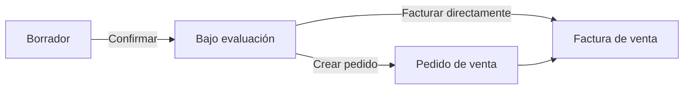
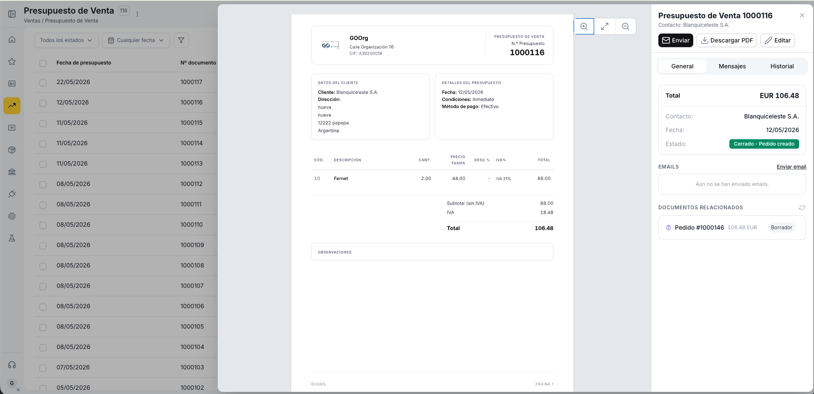
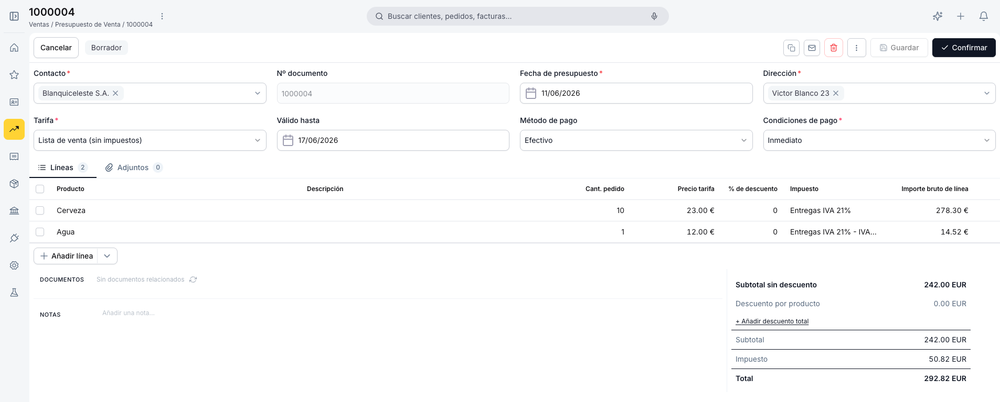
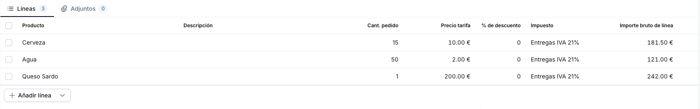
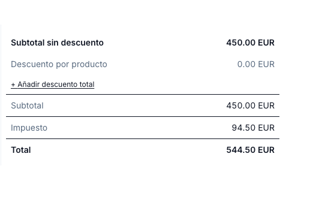
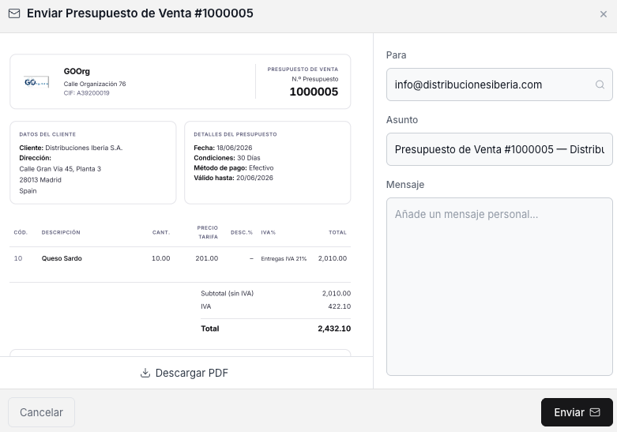
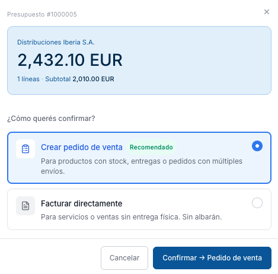

---
tags:
  - Presupuesto de Venta
  - Ventas
  - Comercial
  - Gestión Documental
  - Etendo Go
---

# Presupuesto de venta

El **presupuesto de venta** es un documento opcional del ciclo comercial. Representa una oferta enviada al cliente con el detalle de productos, precios, descuentos y condiciones de pago. Una vez confirmado, da lugar a un [pedido de venta](../pedidos-de-venta/pedidos-de-venta.md) o a una [factura de venta](../facturas-de-venta/facturas-de-venta.md) directa sin necesidad de reintroducir datos. El pedido de venta es la opción habitual cuando se comercializan productos con stock o que requieren entrega física; la factura directa se usa para servicios o ventas sin entrega.

---

## Vista Lista

La vista lista muestra todos los presupuestos con las columnas **Fecha de presupuesto**, **Nº documento**, **Contacto**, **Estado doc.** (ver [Estados del Documento](#estados-del-documento)), **Válido hasta** e **Imp. total**.

Para filtrar la lista se dispone de dos selectores en la barra superior: el primero filtra por **estado del documento** y el segundo por **fecha de presupuesto**, con las opciones Hoy, Ayer, Últimos 7 días, Últimos 30 días, Últimos 12 meses, Todo el tiempo y Personalizado. El ícono de embudo permite aplicar filtros adicionales. Las columnas son ordenables haciendo clic en su encabezado.

Para crear un presupuesto nuevo utiliza el botón **+ Nuevo presupuesto** en la esquina superior derecha.

---

## Vista Detalle

Al hacer clic sobre un presupuesto existente en la lista, se abre la vista detalle. Esta vista muestra en el centro una previsualización del PDF del presupuesto y en el panel derecho la información clave del documento: total, contacto, fecha y estado.

Desde este panel se pueden realizar las siguientes acciones sin necesidad de entrar al formulario:

- **Enviar** — abre el panel de envío por email al cliente.
- **Descargar PDF** — descarga el presupuesto en formato PDF.
- **Editar** — abre el formulario completo para modificar el documento.

El panel también incluye la pestaña **General**, la sección **Emails** que registra los correos enviados al cliente, y la sección **Documentos relacionados** que muestra los pedidos o facturas generados a partir de este presupuesto con su importe y estado.

---

## Vista Formulario

El formulario se abre al crear un presupuesto nuevo o al hacer clic en **Editar** desde la vista detalle.

### Cabecera

- **Contacto** — cliente al que se dirige la oferta. Al seleccionarlo, el sistema autocompleta automáticamente la Dirección, el Método de pago y las Condiciones de pago con los valores configurados en ese contacto.
- **Nº documento** — se genera automáticamente al guardar por primera vez.
- **Fecha de presupuesto** — toma por defecto la fecha actual; editable.
- **Dirección** — cargada desde el contacto; puede modificarse para este documento sin afectar al contacto.
- **Tarifa** — determina a qué precios se cotizarán los productos en este presupuesto. Normalmente se carga sola al seleccionar el cliente.
- **Válido hasta** — fecha límite de vigencia de la oferta. No es obligatorio.
- **Método de pago** — heredado del contacto; editable por documento.
- **Condiciones de pago** — heredado del contacto; editable por documento. Las opciones disponibles son *Inmediato* y *30 días*.

!!! tip "Autocompletado al elegir el contacto"
    Al seleccionar el contacto, el sistema carga automáticamente la dirección principal, la tarifa, el método de pago y las condiciones de pago configuradas en ese contacto. Todos estos campos son editables dentro del presupuesto: cualquier cambio que realices aplica únicamente a este documento y no modifica la configuración del cliente. Si el contacto no tiene una dirección registrada, el campo quedará vacío y deberá completarse manualmente.

### Pestaña Líneas

Las líneas representan los productos o servicios incluidos en la oferta. Usa el botón **+ Añadir línea** para incorporar una nueva línea al presupuesto.

- **Producto** — al seleccionarlo autocompleta la descripción y el precio de tarifa.
- **Descripción** — precompletada desde el producto; editable por línea.
- **Cant. pedido** — cantidad del producto. Por defecto 1.
- **Precio tarifa** — precio del producto según la tarifa seleccionada en la cabecera; editable si se necesita ajustar para este presupuesto.
- **% de descuento** — descuento aplicado sobre el precio de tarifa de la línea.
- **Impuesto** — tipo impositivo aplicable a la línea.
- **Importe bruto de línea** — se calcula automáticamente aplicando el descuento al precio unitario multiplicado por la cantidad.

Para guardar una línea pulsa **Enter** o haz clic fuera de la fila. Para cancelar sin guardar, pulsa **Esc**.

### Totales

El presupuesto admite dos tipos de descuento: uno por línea, aplicado directamente en la Pestaña Líneas sobre cada producto, y uno global que se aplica sobre el total del documento. El panel de totales en la parte inferior derecha muestra:

- **Subtotal sin descuento** — suma del importe bruto de todas las líneas antes de descuentos.
- **Descuento por producto** — suma de los descuentos por línea.
- **Descuento total** — descuento adicional aplicado al documento completo. Se activa con el enlace **+ Añadir descuento total**.
- **Subtotal** — base imponible tras descuentos.
- **Impuesto** — importe de impuesto calculado según el tipo seleccionado en cada línea.
- **Total** — importe final a pagar.

### Documentos Relacionados

La sección **Documentos** en la parte inferior del formulario muestra los documentos generados a partir de este presupuesto (pedidos o facturas). Cada documento listado es un enlace navegable que abre el documento correspondiente.

### Notas

El campo **Notas** permite añadir observaciones internas. Este contenido no se incluye en el PDF enviado al cliente.

---

## Estados del Documento

El estado actual se muestra como una etiqueta junto al botón **Cancelar** en la barra superior.

| Estado | Descripción |
|---|---|
| Borrador | En preparación. El documento es completamente editable |
| Bajo evaluación | Enviado al cliente, pendiente de respuesta. Edición parcialmente restringida |
| Cerrado - Rechazado | El cliente rechazó la propuesta |
| Cerrado - Pedido creado | Aceptado y convertido en Pedido de venta |
| Cerrado - Factura creada | Aceptado y convertido en Factura de venta directa |

---

## Acciones Disponibles

La barra superior del formulario muestra las siguientes acciones:

- **Cancelar** — descarta los cambios no guardados y vuelve a la lista.
- **Guardar** — guarda el documento sin cambiar su estado.
- **Confirmar** — envía el presupuesto al estado Bajo evaluación. Desde ese estado, una segunda confirmación lo convierte en Pedido de venta o Factura directa.
- **Copia** — clona el presupuesto actual creando un nuevo borrador con los mismos datos.
- **Email** — abre el panel de envío por correo electrónico.
- **Papelera** — elimina el documento con confirmación previa. Solo disponible en estado Borrador.

### Enviar por Email

El icono **Enviar** que se muestra con un sobre abre el panel **Enviar Presupuesto de Venta**, con los campos **Para**, **Asunto** (autocompletado con el número de documento y nombre del contacto) y **Mensaje**. Desde este panel también se puede descargar el PDF con el botón **Descargar PDF**. Para enviar, usa el botón **Enviar**.

### Flujo de Confirmación

Al hacer clic en **Confirmar** desde el estado *Bajo evaluación*, el sistema muestra un popup con dos opciones:

{ width=420 }

- **Crear pedido de venta** — recomendado para productos con stock, entregas o pedidos con múltiples envíos.
- **Facturar directamente** — para servicios o ventas sin entrega física. No genera albarán (documento de entrega de mercadería que se crea al procesar un pedido).

!!! info "Datos heredados en el documento derivado"
    Tanto el Pedido como la Factura creados desde el presupuesto heredan el contacto, la dirección, la tarifa, las condiciones de pago y todas las líneas. No es necesario volver a introducir ningún dato.

## Artículos Relacionados

- [Pedido de venta](../pedidos-de-venta/pedidos-de-venta.md)
- [Factura de venta](../facturas-de-venta/facturas-de-venta.md)
- [Contactos](../../contactos/contactos.md)

---
This work is licensed under :material-creative-commons: :fontawesome-brands-creative-commons-by: :fontawesome-brands-creative-commons-sa: [ CC BY-SA 2.5 ES](https://creativecommons.org/licenses/by-sa/2.5/es/){target="_blank"} by [Futit Services S.L](https://etendo.software){target="_blank"}.
