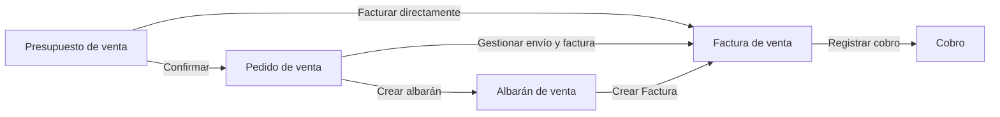

# ¿Qué es la sección Ventas?

La sección **Ventas** reúne todos los documentos con los que registras el ciclo comercial con tus clientes: desde la oferta inicial hasta el cobro, incluyendo las devoluciones. Todos estos documentos comparten el mismo [contacto](../../contactos/que-es-la-seccion-contactos/que-es-la-seccion-contactos.md) y se encadenan entre sí, de forma que no necesitas volver a cargar los mismos datos en cada paso.

## El ciclo de venta

El ciclo de ventas de Etendo Go sigue un modelo lineal de documentos encadenados. Cada documento puede generar el siguiente mediante una acción explícita tuya — nunca de forma automática.

- **[Presupuesto de venta](../crear-y-gestionar-presupuestos/crear-y-gestionar-presupuestos.md)** — documento opcional. Es la oferta comercial que le envías al cliente con productos, precios y condiciones, antes de que se comprometa a comprar.
- **[Pedido de venta](../crear-y-gestionar-pedidos/crear-y-gestionar-pedidos.md)** — formaliza el compromiso de compra del cliente. Es el punto de partida habitual cuando hay stock o entregas físicas de por medio.
- **[Albarán de venta](../crear-y-gestionar-albaranes/crear-y-gestionar-albaranes.md)** — documenta la entrega física de la mercadería.
- **[Factura de venta](../crear-una-factura-de-venta/crear-una-factura-de-venta.md)** — el documento fiscal que formaliza el cobro al cliente.

## El ciclo de devolución

Cuando un cliente devuelve mercadería, Etendo Go separa el evento físico del financiero: el reingreso de la mercadería se registra en un albarán de devolución, y el ajuste del saldo de cobro se resuelve con una factura de devolución o una nota de crédito. Para el detalle completo de este flujo, consulta [Crear y gestionar devoluciones](../crear-y-gestionar-devoluciones/crear-y-gestionar-devoluciones.md).

## Qué vas a encontrar en esta sección

- Cómo **crear** cada documento de venta: presupuesto, pedido, albarán, factura y devolución.
- Cómo **enviar tus facturas por email** y **añadir pagos** a medida que los cobras.
- Cómo **gestionar** tus documentos ya creados: filtrar la lista, revisar su estado y hacer seguimiento del importe pendiente.
- Respuestas a las **preguntas frecuentes** sobre documentos de venta.

## Artículos Relacionados

- [¿Qué es la sección Contactos?](../../contactos/que-es-la-seccion-contactos/que-es-la-seccion-contactos.md)
- [Crear y gestionar presupuestos](../crear-y-gestionar-presupuestos/crear-y-gestionar-presupuestos.md)
- [Documentos de venta: preguntas frecuentes](../../ventas/documentos-de-venta-preguntas-frecuentes/documentos-de-venta-preguntas-frecuentes.md)

---
Esta obra está bajo la licencia :material-creative-commons: :fontawesome-brands-creative-commons-by: :fontawesome-brands-creative-commons-sa: [CC BY-SA 2.5 ES](https://creativecommons.org/licenses/by-sa/2.5/es/){target="_blank"} de [Futit Services S.L](https://etendo.software){target="_blank"}.
