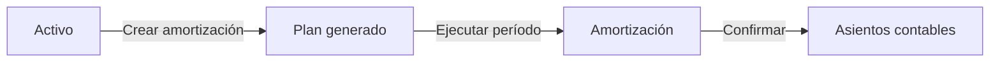
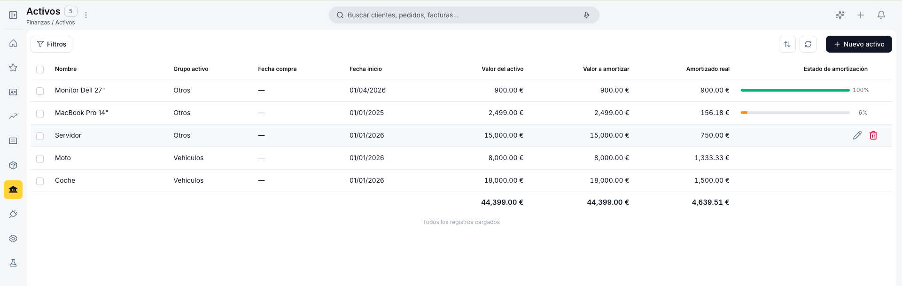
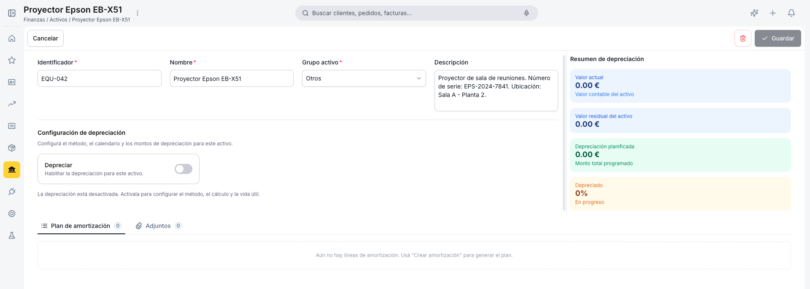
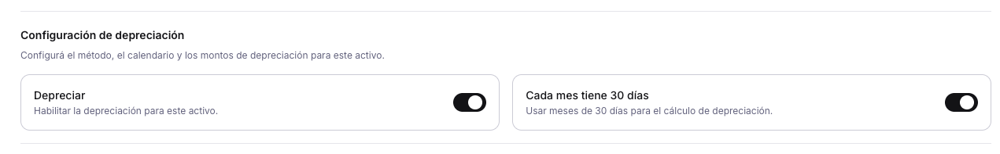
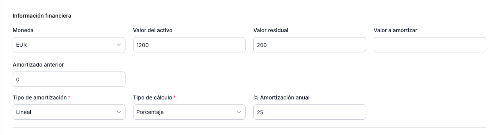
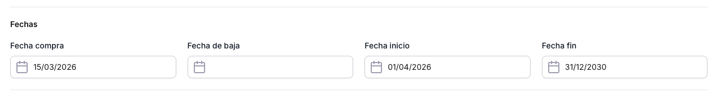
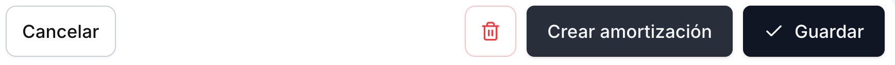
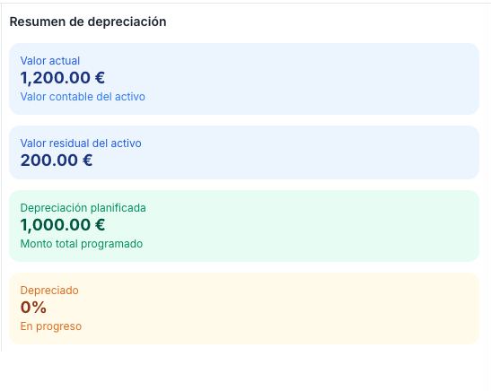
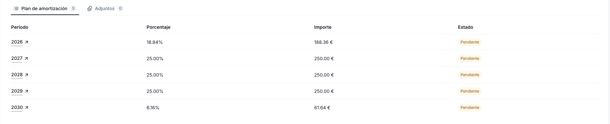

---
tags:
    - Activos
    - Amortización
    - Finanzas
    - Gestión Contable
    - Etendo Go
---

# Activos

Un **activo** es un bien fijo de la empresa (vehículo, equipo informático, maquinaria) que se deprecia a lo largo de su vida útil. Cada activo tiene un plan de amortización que distribuye su valor en períodos contables. Cuando llega el momento de ejecutar la depreciación, se crea un registro de [Amortización](../amortizacion/amortizacion.md) que agrupa uno o más activos y genera los asientos contables correspondientes (los registros en la contabilidad que reflejan el gasto de depreciación de ese período).

El flujo es: primero se crea y configura el activo, luego se genera el plan de amortización y, por último, se confirma la ejecución de cada período para producir los asientos contables.

## Ciclo de Vida de un Activo

El flujo completo desde el alta hasta la depreciación total sigue estos pasos:

1. **Crear el activo** — completa Identificador, Nombre y Grupo activo y guarda.
2. **Configurar la depreciación** — activa el switch **Depreciar**, elige el Tipo de cálculo y completa los campos correspondientes.
3. **Generar el plan** — pulsa **Crear amortización**. El sistema genera las líneas del plan en la pestaña **Plan de amortización**, una por período, con su porcentaje e importe.
4. **Ejecutar la depreciación del período** — ve a [Amortización](../amortizacion/amortizacion.md), o navega desde el mismo periodo y confírmalo. Confirmar ejecuta los asientos contables de forma definitiva; esta acción no se puede deshacer.
5. **Seguimiento** — las líneas del plan que ya fueron ejecutadas pasan a estado **Confirmado** y se pueden navegar directamente desde el plan del activo hasta el registro de Amortización correspondiente. En la vista de lista podrás ver el progreso de la amortización y los bienes 100% amortizados.

---

## Vista Lista

<figure markdown="span">
  
  <figcaption>Vista lista de Activos con columnas de nombre, grupo, fechas, valores y estado de amortización.</figcaption>
</figure>

La vista lista muestra todos los activos registrados con las columnas **Nombre**, **Grupo activo**, **Fecha compra**, **Fecha inicio**, **Valor del activo**, **Valor a amortizar**, **Amortizado real** y **Estado de amortización**.

La columna **Estado de amortización** muestra una barra de progreso con el porcentaje depreciado: naranja cuando está en curso y verde cuando el activo está totalmente depreciado al 100 %.

Al pie de la tabla aparece una fila de totales con la suma de **Valor del activo**, **Valor a amortizar** y **Amortizado real**.

Para filtrar usa el botón **Filtros** en la esquina superior izquierda, que abre un panel de filtros por condicionales donde puedes combinar campo, condición y valor. Para crear un activo nuevo usa el botón **+ Nuevo activo** en la esquina superior derecha.

---

## Formulario de Activo

El formulario se abre al crear un activo nuevo o al hacer clic sobre un registro existente en la lista.

### Datos del Activo

<figure markdown="span">
  
  <figcaption>Formulario de Activo con los campos de identificación del bien.</figcaption>
</figure>

Los campos de identificación aparecen siempre en la parte superior del formulario.

- **Identificador** — Código único del activo dentro de la organización (ej: número de inventario). Lo ingresa el usuario; no se genera automáticamente. Requerido.
- **Nombre** — Nombre descriptivo del activo (ej: *Servidor Dell R740*). Requerido.
- **Grupo activo** — Categoría contable del activo. Valor por defecto: *Otros*. Determina las cuentas contables de los asientos. Requerido.
- **Descripción** — Información adicional: número de serie, ubicación, proveedor, etc.

### Configuración de Depreciación

<figure markdown="span">
  
  <figcaption>Sección de configuración de depreciación con el switch Depreciar y sus opciones.</figcaption>
</figure>

Esta sección controla si el activo se deprecia y qué método se usa.

- **Depreciar** — switch que habilita o deshabilita la depreciación para este activo. Cuando está desactivado, aparece el mensaje *"La depreciación está desactivada. Actívala para configurar el método, el cálculo y la vida útil."*
- **Cada mes tiene 30 días** — switch que aparece al activar **Depreciar** (activo por defecto). Normaliza los meses a 30 días para obtener cuotas uniformes.

### Información Financiera

<figure markdown="span">
  
  <figcaption>Sección de información financiera con los valores del activo y el método de amortización.</figcaption>
</figure>

- **Moneda** — Moneda del activo. Por defecto: *EUR*.
- **Valor del activo** — Importe de adquisición. Base bruta antes de descontar el valor residual.
- **Valor residual** — Valor estimado al final de la vida útil. Debe ser menor o igual al valor del activo.
- **Valor a amortizar** — Resultado de restar el valor residual al valor del activo. Se calcula automáticamente.
- **Amortizado anterior** — Importe ya depreciado antes de registrar el activo en Etendo Go. Útil al migrar activos con depreciación acumulada en otro sistema. Por defecto: *0*.
- **Tipo de amortización** — Método de cálculo. Opción disponible: *Lineal*. Requerido.
- **Tipo de cálculo** — Define cómo se expresa la vida útil del activo. Opciones: *Porcentaje* o *Tiempo*. Requerido.

Según el **Tipo de cálculo** seleccionado, aparecen campos adicionales:

- Si eliges *Porcentaje*: **% Amortización anual** — porcentaje anual a depreciar. Ej: *25 %* deprecia el activo en 4 años. Con un activo de 10.000 € y 25 % anual en periodicidad mensual, cada cuota es de 208,33 €/mes.
- Si eliges *Tiempo*:
    - **Amortizar** — periodicidad del plan: *Mensual* (una línea por mes) o *Anual* (una línea por año). Por defecto: *Mensual*.
    - **Vida útil** — duración total del activo. La unidad varía según la periodicidad elegida: meses si se selecciona *Mensual*, años si se selecciona *Anual*. Ej: *48* meses equivale a 4 años. Con un activo de 10.000 € a 48 meses, cada cuota es de 208,33 €/mes.

### Fechas

<figure markdown="span">
  
  <figcaption>Sección de fechas con los campos de compra, inicio, baja y fin del activo.</figcaption>
</figure>

- **Fecha compra** — Informativa. Fecha de adquisición del activo; no interviene en el cálculo.
- **Fecha de baja** — Informativa. Fecha en que el activo se da de baja del patrimonio. Atención: ingresar esta fecha no detiene automáticamente los cálculos de depreciación; **debes gestionar la baja contable por separado**.
- **Fecha inicio** — Inicio de la vida útil contable del activo. Es el punto de partida para generar el plan de amortización; sin esta fecha el plan no puede crearse. **Requerido para generar el plan**.
- **Fecha fin** — Informativa. Se calcula automáticamente cuando el Tipo de cálculo es *Tiempo*; debe completarse manualmente si es *Porcentaje*.

### Dimensiones Contables

Campos opcionales para asociar el activo a dimensiones de análisis contable. Se propagan automáticamente a cada línea del plan al generarlo o recalcularlo.

- **Centro de costo** — úsalo cuando la depreciación debe imputarse a un área o departamento específico (ej: Tecnología, Operaciones).
- **Proyecto** — úsalo cuando el activo está vinculado a un proyecto concreto y su depreciación forma parte del costo de ese proyecto.
- **Producto** — úsalo cuando la depreciación está asociada a la fabricación o mantenimiento de un producto específico.
- **Contacto** — úsalo cuando el activo está asignado a un tercero (proveedor, cliente o entidad relacionada) relevante para la contabilidad.

---

## Barra de Acciones

<figure markdown="span">
  
  <figcaption>Barra de acciones del formulario de Activo.</figcaption>
</figure>

- **Cancelar** — descarta los cambios no guardados y cierra el formulario.
- **Guardar** — guarda los cambios. Solo se activa cuando hay cambios pendientes.
- **Crear amortización** — genera el plan de amortización. Solo disponible en activos existentes con **Depreciar** activado y **Fecha inicio** definida.
- **Eliminar** — elimina el activo. Solo disponible en activos existentes; se accede desde el ícono de papelera. No es posible eliminar un activo si ya tiene amortizaciones confirmadas.

El menú contextual (**⋮**) ofrece **Añadir a favoritos** y **Ayuda de esta página**.

---

## Resumen de Depreciación

<figure markdown="span">
  
  <figcaption>Panel lateral de Resumen de depreciación con el estado actual del activo.</figcaption>
</figure>

El panel lateral **Resumen de depreciación** muestra el estado actual del activo de forma permanente mientras trabajas en el formulario.

- **Valor actual** — Valor contable del activo a la fecha (euros).
- **Valor residual del activo** — Valor estimado al final de la vida útil.
- **Depreciación planificada** — Monto total programado en el plan vigente.
- **Depreciado %** — Porcentaje ya depreciado. Subtítulo *En progreso* mientras hay períodos pendientes; cambia a *Totalmente depreciado* al llegar al 100 %.

---

## Plan de Amortización

<figure markdown="span">
  
  <figcaption>Pestaña Plan de amortización con las líneas generadas por período, porcentaje e importe.</figcaption>
</figure>

La pestaña **Plan de amortización** muestra las líneas generadas por la acción **Crear amortización**.

- **Período** — Fecha del período de depreciación. El formato varía según la periodicidad: `MM-YYYY` para planes mensuales (ej: `04-2026`) o `YYYY` para planes anuales (ej: `2026`).
- **Porcentaje** — Porcentaje del valor a amortizar aplicado en ese período.
- **Importe** — Monto en euros a depreciar.
- **Estado** — **Confirmado** si el período ya fue ejecutado por una amortización; sin estado si está pendiente de ejecutar.

Cuando no hay líneas, el plan muestra el mensaje: *"Aún no hay líneas de amortización. Usá 'Crear amortización' para generar el plan."*

Al hacer clic en un período, se navega directamente al registro de [Amortización](../amortizacion/amortizacion.md) correspondiente a ese período.

---

## Adjuntos

La pestaña **Adjuntos** permite subir documentación de soporte del activo (factura de compra, contrato de seguro, ficha técnica, etc.) mediante arrastrar y soltar. Cada archivo muestra su nombre, tamaño, fecha de carga y el usuario que lo subió. Formatos compatibles: PDF, Word, Excel, PowerPoint e imágenes.

---

*[EUR]: Euro — moneda oficial de la zona euro

## Artículos Relacionados

- [Amortización](../amortizacion/amortizacion.md)
- [Apuntar un Activo](apuntar-un-activo.md)

---
Esta obra está bajo la licencia :material-creative-commons: :fontawesome-brands-creative-commons-by: :fontawesome-brands-creative-commons-sa: [CC BY-SA 2.5 ES](https://creativecommons.org/licenses/by-sa/2.5/es/){target="_blank"} de [Futit Services S.L](https://etendo.software){target="_blank"}.
