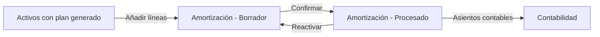
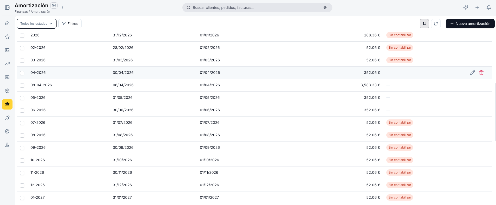
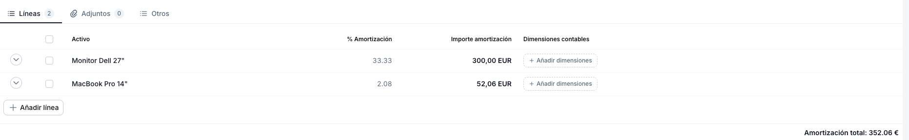

---
tags:
  - Amortización
  - Activos
  - Finanzas
  - Gestión Contable
  - Etendo Go
---

# Amortización

La **Amortización** agrupa en un único registro la ejecución de la depreciación de uno o varios activos para un período contable. Al confirmarla se generan los asientos contables correspondientes en la contabilidad.

Antes de crear una amortización, cada activo que vayas a incluir debe tener su [plan de amortización](../activos/activos.md) generado. Una vez confirmada, la amortización queda en estado **Procesado** y los asientos son definitivos.

---

## Vista Lista

<figure markdown="span">
  
  <figcaption>Vista lista de Amortización con columnas de nombre, fecha contable, fecha de inicio y amortización total.</figcaption>
</figure>

La vista lista muestra todos los registros de amortización con las columnas **Nombre**, **Fecha contable**, **Fecha de inicio** y **Amortización total**.

El nombre de cada registro adopta el formato *MM-YYYY* (ej: *06-2026*), que identifica el período al que corresponde. El filtro **Todos los estados** permite seleccionar entre **Procesado** y **Borrador**.

Usa el botón **Filtros** en la esquina superior izquierda para filtrar por cualquier campo. Usa **+ Nueva amortización** en la esquina superior derecha para crear un registro nuevo.

---

## Formulario de Amortización

<figure markdown="span">
  
  <figcaption>Formulario de Amortización con los datos generales y las pestañas de líneas y adjuntos.</figcaption>
</figure>

### Datos Generales

- **Nombre** — Se autorrellena con *Amortización* al crear. Se recomienda cambiarlo al formato *MM-YYYY* del período (ej: *06-2026*) para facilitar la identificación. Requerido.
- **Fecha contable** — Fecha con la que se registran los asientos contables. Se autorrellena con la fecha actual. Requerido.
- **Fecha de inicio** — Fecha de inicio del período. Referencial; no interviene en el cálculo.
- **Moneda** — Moneda de los importes. Valor por defecto: *EUR*. Requerido.
- **Descripción** — Notas internas del registro.

### Líneas

<figure markdown="span">
  
  <figcaption>Pestaña Líneas con los activos incluidos en el período y sus importes de depreciación.</figcaption>
</figure>

La pestaña **Líneas** contiene los activos que se amortizan en este registro. Cada línea representa un período de depreciación de un activo concreto.

- **Activo** — Nombre del activo incluido en este período.
- **% Amortización** — Porcentaje del valor a amortizar aplicado en el período.
- **Importe amortización** — Monto en euros a depreciar en este período.
- **Dimensiones contables** — Resumen de las dimensiones asignadas a la línea (Centro de costo, Proyecto, Producto, Contacto).

Al final de la tabla aparece el total **Amortización total: X €** con la suma de todos los importes de las líneas.

#### Añadir Líneas

Usa el botón **+ Añadir línea** para incorporar activos al registro. Solo se pueden añadir activos que tengan líneas de plan pendientes de ejecutar (estado sin confirmar).

#### Dimensiones

Cada línea permite sobrescribir o añadir dimensiones contables pulsando el enlace **+ Añadir dimensiones** en la columna **Dimensiones contables**.

Los campos disponibles son:

- **Centro de costo** — úsalo cuando la depreciación debe imputarse a un área o departamento específico (ej: Tecnología, Operaciones).
- **Proyecto** — úsalo cuando el activo está vinculado a un proyecto concreto y su depreciación forma parte del costo de ese proyecto.
- **Producto** — úsalo cuando la depreciación está asociada a la fabricación o mantenimiento de un producto específico.
- **Contacto** — úsalo cuando el activo está asignado a un tercero (proveedor, cliente o entidad relacionada) relevante para la contabilidad.

!!! info 
    Si el activo tiene dimensiones definidas en su formulario, se propagan automáticamente a la línea al añadirla.

---

## Pestaña Adjuntos

La pestaña **Adjuntos** permite subir documentación de soporte del registro (actas de cierre, justificantes contables, etc.) mediante arrastrar y soltar.

---

## Estados y Ciclo de Vida

Una amortización pasa por dos estados:

| Estado | Descripción |
|---|---|
| Borrador | Editable. Puedes añadir, modificar o eliminar líneas y cambiar los datos generales. |
| Procesado | Confirmado. Los asientos contables ya están generados. Para corregirlo, usa **Reactivar** (⋮) para volver a Borrador, aplica los cambios y vuelve a confirmar. |

1. **Crear** — hay dos formas de originar una amortización:
    - **Desde Activos** (flujo habitual): navega al período correspondiente en el plan de amortización del activo y accede al registro. Las líneas ya están generadas por el sistema.
    - **Manualmente** (para ajustes puntuales): pulsa **+ Nueva amortización** desde esta ventana.
2. **Añadir líneas** — en caso de creación manual, usa **+ Añadir línea** para incluir los activos del período. Verifica que el porcentaje e importe de cada línea son correctos.
3. **Revisar el total** — comprueba la **Amortización total** al pie de la tabla antes de confirmar.
4. **Confirmar** — pulsa **Confirmar**. El registro pasa a estado **Procesado** y se generan los asientos contables. Esta acción no se puede deshacer directamente; si necesitas corregir algo, usa **Reactivar**.
5. **Verificar en activos** — las líneas del plan de amortización de cada activo incluido pasan a estado **Confirmado** y quedan vinculadas a este registro.

---

## Artículos Relacionados

- [Activos](../activos/activos.md)
- [Apuntar un Activo](../apuntar-un-activo.md)

---
This work is licensed under :material-creative-commons: :fontawesome-brands-creative-commons-by: :fontawesome-brands-creative-commons-sa: [ CC BY-SA 2.5 ES](https://creativecommons.org/licenses/by-sa/2.5/es/){target="_blank"} by [Futit Services S.L](https://etendo.software){target="_blank"}.
