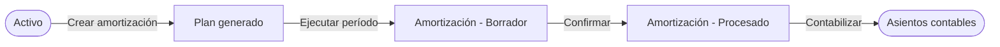
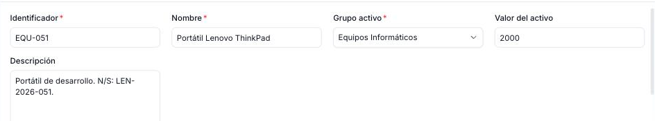

---
tags:
    - Activos
    - Amortización
    - Finanzas
    - Etendo Go
---

# Apuntar un activo

Un **activo** es un bien fijo de la empresa (vehículo, equipo informático, maquinaria) que se amortiza a lo largo de su vida útil. **Apuntar** un activo es el proceso de registrarlo en Etendo Go para que el sistema pueda calcular y gestionar su amortización: se hace cada vez que la empresa adquiere un bien fijo o cuando se migran activos existentes desde otro sistema.

Este artículo cubre cómo crear un activo y completar su formulario. Para el detalle de cada campo, consulta [Activos: referencia de campos](../referencia-de-campos-de-activo/referencia-de-campos-de-activo.md); para generar y ejecutar el plan de amortización una vez creado, consulta [Crear y ejecutar un plan de amortización](../como-crear-y-ejecutar-un-plan-de-amortizacion/como-crear-y-ejecutar-un-plan-de-amortizacion.md).

## Cómo apuntar un activo

1. Ve a **[Finanzas > Activos](https://go.etendo.cloud/assets){target="_blank"}** y pulsa **+ Nuevo activo**.
2. Completa el formulario:
    1. **Datos del activo** — identificación del bien y su valor de adquisición (usa el número de inventario interno como **Identificador**).
    2. **Configuración de amortización** e **Información financiera** — activa el interruptor **Amortizar** y define el método de cálculo.
    3. **Fechas** — define la **Fecha inicio**; opcionalmente completa **Dimensiones contables**.
3. Pulsa **Guardar**.
4. Pulsa **Crear amortización** para generar el plan de amortización — este paso se explica en detalle en [Crear y ejecutar un plan de amortización](../como-crear-y-ejecutar-un-plan-de-amortizacion/como-crear-y-ejecutar-un-plan-de-amortizacion.md).

<figure markdown="span">
  
  <figcaption>Formulario de Activo con los campos de identificación del bien y su valor de adquisición.</figcaption>
</figure>

!!! tip "Si tienes la factura de compra"
    Ve a la pestaña **Adjuntos** y sube el documento arrastrándolo y soltándolo (formatos compatibles: PDF, Word, Excel, PowerPoint e imágenes). Así el activo queda vinculado a su comprobante de forma centralizada: cada archivo muestra su nombre, tamaño, fecha de carga y el usuario que lo subió.

!!! warning "Paso obligatorio"
    Sin pulsar **Crear amortización**, el activo queda registrado pero sin plan de amortización. Consulta [Crear y ejecutar un plan de amortización](../como-crear-y-ejecutar-un-plan-de-amortizacion/como-crear-y-ejecutar-un-plan-de-amortizacion.md) para ver cómo generar y procesar los períodos.

El formulario se abre al crear un activo nuevo o al hacer clic sobre un registro existente en el listado de **[Finanzas > Activos](https://go.etendo.cloud/assets){target="_blank"}**.

---

## Artículos Relacionados

- [Activos: referencia de campos](../referencia-de-campos-de-activo/referencia-de-campos-de-activo.md)
- [Crear y ejecutar un plan de amortización](../como-crear-y-ejecutar-un-plan-de-amortizacion/como-crear-y-ejecutar-un-plan-de-amortizacion.md)
- [Glosario de Finanzas](../glosario-de-finanzas/glosario-de-finanzas.md)

---
Esta obra está bajo la licencia :material-creative-commons: :fontawesome-brands-creative-commons-by: :fontawesome-brands-creative-commons-sa: [CC BY-SA 2.5 ES](https://creativecommons.org/licenses/by-sa/2.5/es/){target="_blank"} de [Futit Services S.L](https://etendo.software){target="_blank"}.
