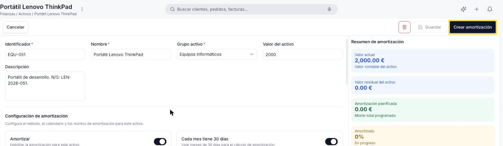
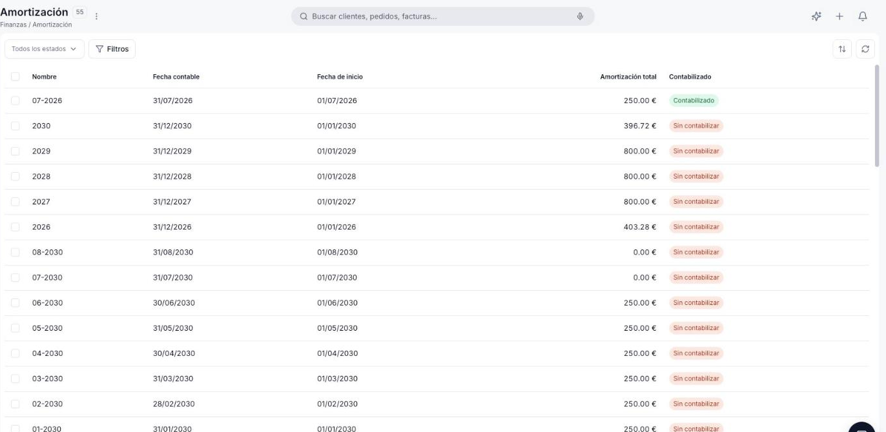
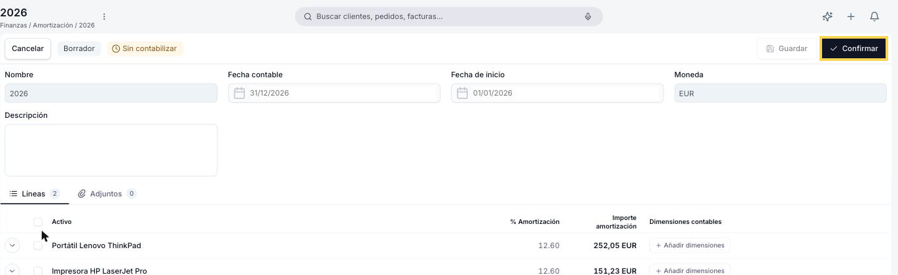

---
tags:
    - Activos
    - Amortización
    - Finanzas
    - Etendo Go
---

# Crear y ejecutar un plan de amortización

Al pulsar **Crear amortización** en un activo, Etendo Go genera su **plan de amortización**: una línea por período. Cada línea, a su vez, queda agrupada en un registro de **Amortización** junto con las de los demás activos que comparten esa misma fecha — por mes si la periodicidad es *Mensual*, por año si es *Anual* o *Porcentaje* (que siempre amortiza por año). Por eso **[Finanzas > Amortización](https://go.etendo.cloud/amortization){target="_blank"}** lista un registro por período, no uno por activo, y estos registros no se crean a mano: solo se generan desde el activo.

Este artículo cubre ambos pasos: generar el plan de amortización desde un activo, y ejecutar, confirmar y contabilizar el registro de Amortización que agrupa sus períodos.

## Generar el plan de amortización

!!! info "Prerrequisitos"
    Antes de generar el plan, el activo debe tener:

    - El interruptor **Amortizar** activado.
    - El **Tipo de amortización** y el **Tipo de cálculo** completos.
    - La **Fecha inicio** definida — sin esta fecha el plan no puede crearse.

    Consulta [Apuntar un activo](../como-apuntar-un-activo/como-apuntar-un-activo.md) para el detalle de estos campos o si todavía no registraste el activo.

1. Ve a **[Finanzas > Activos](https://go.etendo.cloud/assets){target="_blank"}** y abre el activo para el que quieres generar el plan.
2. Verifica que el interruptor **Amortizar** esté activado y que **Fecha inicio** esté completa.
3. Confirma el **Tipo de cálculo**:
    - Si es *Porcentaje*, revisa el **% Amortización anual**.
    - Si es *Tiempo*, revisa **Amortizar** (Mensual o Anual) y **Vida útil**.
4. Pulsa **Guardar** si hiciste cambios.
5. Pulsa **Crear amortización**.

    <figure markdown="span">
    
    <figcaption>El botón Crear amortización aparece en la barra de acciones una vez que Amortizar está activado y Fecha inicio está completa.</figcaption>
    </figure>

6. El sistema genera las líneas del plan en la pestaña **Plan de amortización**, una por período, y las agrupa en su registro de Amortización correspondiente.

    <figure markdown="span">
    
    <figcaption>Pestaña Plan de amortización del activo, con una línea por período.</figcaption>
    </figure>

    !!! tip "Revisar el plan generado"
        Cada línea del plan muestra el **Período**, el **Porcentaje**, el **Importe** y el **Estado**: **Pendiente** o **Confirmado**. Un clic en el período abre su registro de Amortización.

## Ejecutar una amortización

Abre el registro desde el período correspondiente en el **Plan de amortización** del activo, o búscalo en **[Finanzas > Amortización](https://go.etendo.cloud/amortization){target="_blank"}**.

<figure markdown="span">
  
  <figcaption>Vista lista de Amortización, con un registro por período. Nombre en formato MM-YYYY o YYYY según periodicidad.</figcaption>
</figure>

El filtro **Todos los estados** distingue **Procesado** de **Borrador**; **Contabilizado** es una columna aparte, independiente de ese estado. Usa **Filtros** para acotar la lista por cualquier campo.

<figure markdown="span">
  
  <figcaption>Registro de Amortización en Borrador. Nombre, Fecha contable y Moneda los completa el sistema.</figcaption>
</figure>

1. **Revisa las líneas**: cada una es un activo del grupo, con su **% Amortización** e **Importe amortización**. Las dimensiones contables se propagan automáticamente desde el activo, pero puedes sobrescribirlas con **+ Añadir dimensiones**.
2. **Confirma**: pulsa **Confirmar**. El registro pasa a **Procesado** (requiere que el período contable esté abierto) y las líneas de plan de cada activo pasan a **Confirmado**.
3. **Contabiliza**: usa **Contabilizar** (⋮) para generar los asientos. El registro pasa a **Contabilizado**.
4. **Corrige si hace falta**: **Reactivar** (⋮) devuelve el registro a Borrador y Sin contabilizar en un solo paso.

Consulta el [Glosario de Finanzas](../glosario-de-finanzas/glosario-de-finanzas.md) para el detalle de cada estado.

## Artículos Relacionados

- [Apuntar un activo](../como-apuntar-un-activo/como-apuntar-un-activo.md)
- [Activo: referencia de campos](../referencia-de-campos-de-activo/referencia-de-campos-de-activo.md)
- [Glosario de Finanzas](../glosario-de-finanzas/glosario-de-finanzas.md)

---
Esta obra está bajo la licencia :material-creative-commons: :fontawesome-brands-creative-commons-by: :fontawesome-brands-creative-commons-sa: [CC BY-SA 2.5 ES](https://creativecommons.org/licenses/by-sa/2.5/es/){target="_blank"} de [Futit Services S.L](https://etendo.software){target="_blank"}.
