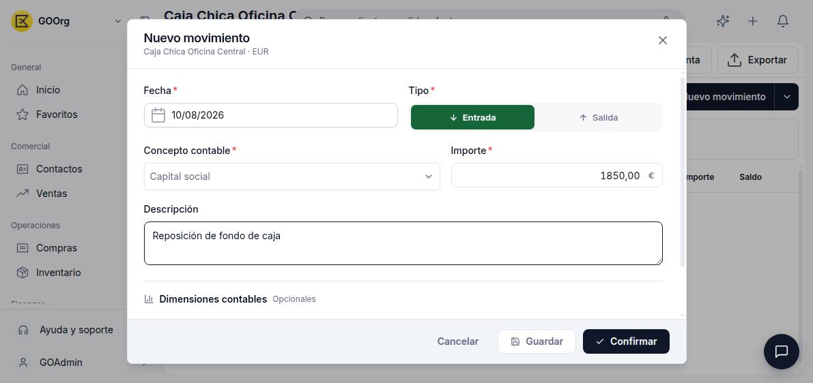
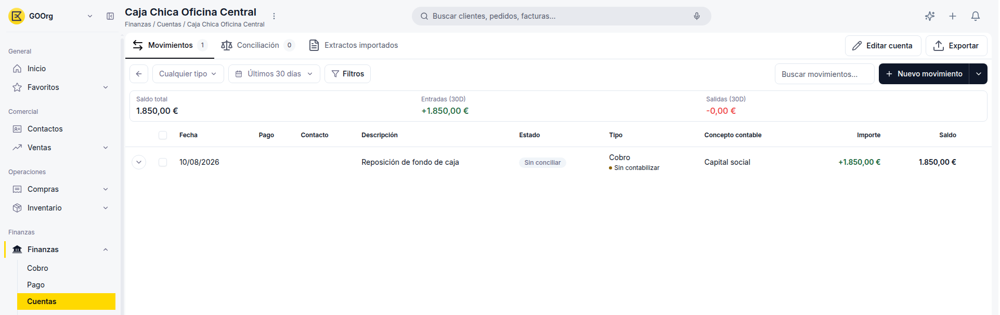

---
tags:
    - Cuentas
    - Finanzas
    - Caja
    - Efectivo
    - Etendo Go
---

# Gestionar cajas contables y movimientos en efectivo

Una caja es un tipo de cuenta financiera para el efectivo que manejas fuera del banco: la caja chica de la oficina, la caja de un punto de venta, etc.

## Qué es una caja contable

Dentro de Cuentas, **Caja** es uno de los tres tipos de cuenta financiera (junto a Banco y Tarjeta). A diferencia de un banco, una caja no se conecta ni importa extractos de una entidad externa: todos sus movimientos se registran a mano, directamente en Etendo Go. Aun así, la ficha de una caja tiene las mismas pestañas que una cuenta de banco (**Movimientos**, **Conciliación**, **Extractos importados**), aunque en la práctica una caja no suele tener extractos para importar.

## Registrar un movimiento en efectivo

1. Abre la caja desde **[Finanzas > Cuentas](https://go.etendo.cloud/financial-account){target="_blank"}**.
2. En la pestaña **Movimientos**, haz clic en **Nuevo movimiento**.
3. Elige el **Tipo**: **Entrada** (dinero que ingresa a la caja) o **Salida** (dinero que sale de la caja).
4. Completa **Fecha**, **Concepto contable** (la cuenta contable del movimiento) e **Importe**.
5. Opcionalmente, agrega una **Descripción** y, dentro de **Dimensiones contables**, un **Contacto**.
6. Haz clic en **Guardar** para dejarlo en borrador, o en **Confirmar** para registrarlo directamente.

Cada movimiento queda con dos estados independientes: si está conciliado (**Sin conciliar** / **Conciliado**) y si está contabilizado (**Sin contabilizar** / **Contabilizado**).

## Consultar el saldo de una caja

- Dentro de la caja, la pestaña **Movimientos** muestra el **Saldo total** junto con las **Entradas** y **Salidas** del período seleccionado (por ejemplo, últimos 30 días).
- Desde el listado general de **Cuentas**, el panel **Saldo** agrega el total de todas tus cuentas (bancos, tarjetas y cajas) y lo desglosa en **Detalle de saldos por moneda**.
- En el listado de movimientos, la columna **Tipo** no muestra "Entrada" o "Salida": una **Entrada** aparece como **Cobro** y una **Salida** como **Pago**.

---

## Artículos Relacionados

- [Añadir y configurar un banco, tarjeta o caja](../como-anadir-y-configurar-un-banco-tarjeta-o-caja/como-anadir-y-configurar-un-banco-tarjeta-o-caja.md)
- [Gestionar pagos y cobros](../como-gestionar-pagos-y-cobros/como-gestionar-pagos-y-cobros.md)

---
Esta obra está bajo la licencia :material-creative-commons: :fontawesome-brands-creative-commons-by: :fontawesome-brands-creative-commons-sa: [CC BY-SA 2.5 ES](https://creativecommons.org/licenses/by-sa/2.5/es/){target="_blank"} de [Futit Services S.L](https://etendo.software){target="_blank"}.
