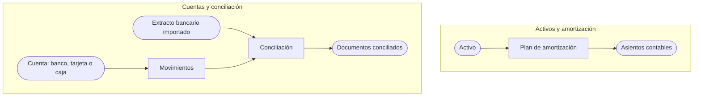

---
tags:
    - Finanzas
    - Cuentas
    - Cuentas financieras
    - Activos
    - Etendo Go
---

# ¿Qué es la sección Finanzas?

La sección **Finanzas** es donde Etendo Go centraliza el dinero de tu empresa: tus cuentas de banco, tarjeta y caja, todo lo que entra y sale de ellas, la conciliación contra tu banco, el seguimiento global de cobros y pagos, y el registro contable de tus activos fijos y su amortización.

Cada cuenta financiera mantiene su propio saldo y su propio historial. Cuando conectas un banco o importas su extracto, Etendo Go compara esas líneas contra tus movimientos, pagos y cobros, y te permite conciliarlos —a mano o de forma automática— para que el saldo de la cuenta siempre coincida con el del banco. En paralelo, tus activos fijos (vehículos, equipos, maquinaria) se amortizan por su cuenta, generando los asientos contables correspondientes cuando confirmas cada período.

## Qué incluye esta sección

- **Cuentas financieras** — el listado de todas tus cuentas (bancos, tarjetas y cajas), con su saldo, su moneda y sus pendientes de conciliar. Desde aquí das de alta cuentas nuevas y accedes al detalle de cada una.
- **Pagos y cobros** — el listado global de cobros a clientes y pagos a proveedores de todas tus cuentas, más allá de una cuenta en particular.
- **Extracto bancario** — los archivos de extracto que importas para una cuenta, línea por línea, o que descargas para tu propio registro.
- **Conciliación bancaria** — el cruce entre las líneas del extracto y tus movimientos, pagos y cobros, con sugerencias automáticas (**Automatch**), reglas de matcheo para casos recurrentes, y conciliación manual.
- **Activos y Amortización** — el registro de tus bienes fijos y la distribución de su valor a lo largo de su vida útil, con los asientos contables que se generan al confirmar cada período.

## Recursos y próximos pasos

Para empezar a operar, da de alta tu primera cuenta desde [Añadir y configurar un banco, tarjeta o caja](../como-anadir-y-configurar-un-banco-tarjeta-o-caja/como-anadir-y-configurar-un-banco-tarjeta-o-caja.md). Si tu banco lo permite, puedes conectarla directamente en lugar de introducir los movimientos a mano. Si además necesitas llevar el control contable de tus bienes fijos, consulta [Apuntar un activo](../como-apuntar-un-activo/como-apuntar-un-activo.md).

---

## Artículos Relacionados

- [Añadir y configurar un banco, tarjeta o caja](../como-anadir-y-configurar-un-banco-tarjeta-o-caja/como-anadir-y-configurar-un-banco-tarjeta-o-caja.md)
- [Gestionar pagos y cobros](../como-gestionar-pagos-y-cobros/como-gestionar-pagos-y-cobros.md)
- [¿Qué es la conciliación bancaria en Etendo Go?](../que-es-la-conciliacion-bancaria-en-etendo-go/que-es-la-conciliacion-bancaria-en-etendo-go.md)
- [Apuntar un activo](../como-apuntar-un-activo/como-apuntar-un-activo.md)

---
Esta obra está bajo la licencia :material-creative-commons: :fontawesome-brands-creative-commons-by: :fontawesome-brands-creative-commons-sa: [CC BY-SA 2.5 ES](https://creativecommons.org/licenses/by-sa/2.5/es/){target="_blank"} de [Futit Services S.L](https://etendo.software){target="_blank"}.
