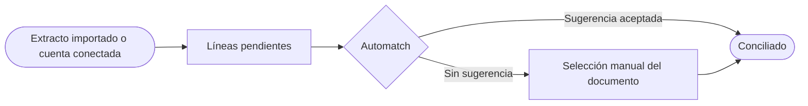
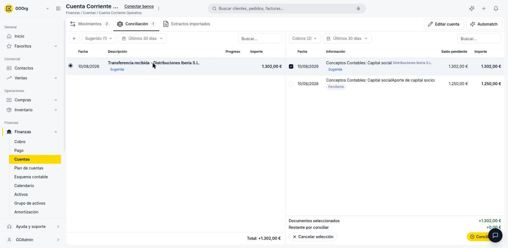

---
tags:
    - Cuentas
    - Finanzas
    - Conciliación bancaria
    - Etendo Go
---

# ¿Qué es la conciliación bancaria en Etendo Go?

Conciliar es confirmar que cada línea de tu extracto bancario tiene su documento correspondiente en Etendo Go (una factura, un cobro o un pago), para que el saldo de tu cuenta coincida siempre con el saldo real de tu banco.

## Cómo funciona el proceso de conciliación

Para cada línea pendiente del extracto, Etendo Go busca coincidencias entre cuatro tipos de documento: **Facturas de venta**, **Facturas de compra**, **Cobros** y **Pagos**. Puedes dejar que el sistema proponga la coincidencia con **Automatch**, o elegir el documento manualmente filtrando por tipo, fecha e importe. Una vez que el importe de los documentos seleccionados cubre el importe de la línea, la conciliación queda registrada.

## Qué incluye esta sección

- **Conciliación por cuenta** — dentro de cada cuenta financiera, la pestaña **Conciliación** muestra las líneas pendientes y te deja elegir el documento con el que hacen match.
- **Automatch** — sugerencias automáticas de conciliación para toda la cuenta, basadas en fecha e importe.
- **Reglas de matcheo** — reglas configurables para automatizar coincidencias recurrentes (por ejemplo, comisiones bancarias).
- **Tolerancia de conciliación** — configurada por cuenta en **Editar cuenta** (tolerancia de fecha en días y de importe en %), usada por Automatch y por las reglas.

Así se ve la pestaña **Conciliación** filtrada por **Sugerido**, con una línea de extracto pendiente y, a la derecha, la sugerencia de Automatch ya seleccionada:

## Recursos y próximos pasos

Antes de conciliar necesitas movimientos o un extracto en la cuenta. Empieza por [Importar o descargar el extracto bancario](../como-importar-o-descargar-el-extracto-bancario/como-importar-o-descargar-el-extracto-bancario.md), y después concilia cada línea desde [Conciliar o desconciliar movimientos contra documentos](../como-conciliar-o-desconciliar-movimientos-contra-documentos/como-conciliar-o-desconciliar-movimientos-contra-documentos.md).

---

## Artículos Relacionados

- [Conciliar o desconciliar movimientos contra documentos](../como-conciliar-o-desconciliar-movimientos-contra-documentos/como-conciliar-o-desconciliar-movimientos-contra-documentos.md)
- [Configurar reglas para automatizar la conciliación](../como-configurar-reglas-para-automatizar-la-conciliacion-bancaria/como-configurar-reglas-para-automatizar-la-conciliacion-bancaria.md)
- [Importar o descargar el extracto bancario](../como-importar-o-descargar-el-extracto-bancario/como-importar-o-descargar-el-extracto-bancario.md)

---
Esta obra está bajo la licencia :material-creative-commons: :fontawesome-brands-creative-commons-by: :fontawesome-brands-creative-commons-sa: [CC BY-SA 2.5 ES](https://creativecommons.org/licenses/by-sa/2.5/es/){target="_blank"} de [Futit Services S.L](https://etendo.software){target="_blank"}.
