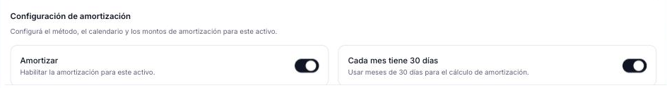
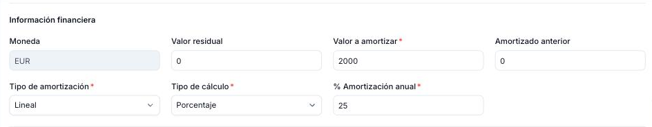
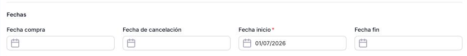
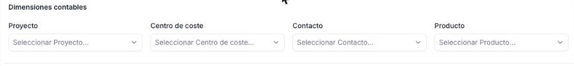
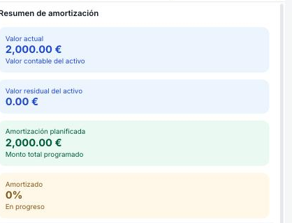
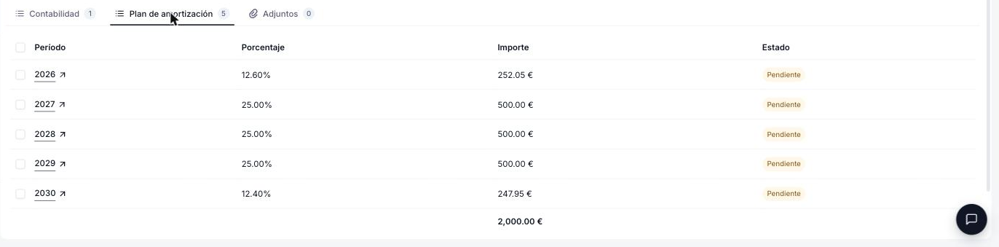
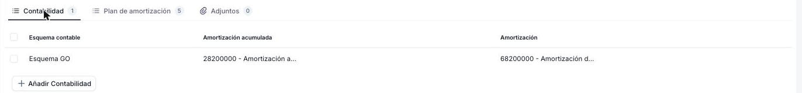
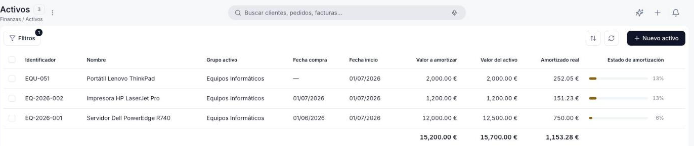

---
tags:
    - Activos
    - Amortización
    - Finanzas
    - Referencia
    - Etendo Go
---

# Activos: referencia de campos

Detalle de los campos del formulario de Activo, agrupados por sección, y de la información que se agrega automáticamente una vez que generas el plan de amortización. Para los pasos de creación, consulta [Apuntar un activo](../como-apuntar-un-activo/como-apuntar-un-activo.md).

## Datos del activo

Los campos de identificación aparecen siempre en la parte superior del formulario.

- **Identificador** — Código único del activo dentro de la organización (ej: número de inventario). Lo ingresa el usuario; no se genera automáticamente. Requerido.
- **Nombre** — Nombre descriptivo del activo (ej: *Servidor Dell PowerEdge R740*). Requerido.
- **Grupo activo** — Categoría contable del activo. Valor por defecto: *Otros*. Determina las cuentas contables de los asientos. Requerido.
- **Valor del activo** — Importe de adquisición. Base bruta antes de descontar el valor residual.
- **Descripción** — Información adicional: número de serie, ubicación, proveedor, etc.

## Configuración de amortización

<figure markdown="span">
  
  <figcaption>Sección de configuración de amortización con el interruptor Amortizar y sus opciones.</figcaption>
</figure>

Esta sección controla si el activo se amortiza y qué método se usa.

- **Amortizar** — interruptor que habilita o deshabilita la amortización para este activo. Cuando está desactivado, aparece el mensaje *"La amortización está desactivada. Actívala para configurar el método, el cálculo y la vida útil."*
- **Cada mes tiene 30 días** — interruptor que aparece al activar **Amortizar** (activo por defecto). Normaliza los meses a 30 días para obtener cuotas uniformes.

## Información financiera

<figure markdown="span">
  
  <figcaption>Sección de información financiera con los valores del activo y el método de amortización.</figcaption>
</figure>

- **Moneda** — Valor fijo, no editable: *EUR*.
- **Valor residual** — Valor estimado al final de la vida útil. Debe ser menor o igual al valor del activo.
- **Valor a amortizar** — Se autocompleta restando el valor residual al valor del activo, pero es un campo editable: puedes sobrescribirlo si lo necesitas. Requerido.
- **Amortizado anterior** — Importe ya amortizado antes de registrar el activo en Etendo Go. Útil al migrar activos con amortización acumulada en otro sistema. Por defecto: *0*.
- **Tipo de amortización** — Método de cálculo. Opción disponible: *Lineal*. Requerido.
- **Tipo de cálculo** — Define cómo se expresa la vida útil del activo. Opciones: *Porcentaje* o *Tiempo*. Requerido.

Según el **Tipo de cálculo** seleccionado, aparecen campos adicionales:

- Si eliges *Porcentaje*: **% Amortización anual** — porcentaje anual a amortizar. Ej: *25 %* amortiza el activo en 4 años. Con un activo de 10.000 € y 25 % anual en periodicidad mensual, cada cuota es de 208,33 €/mes.
- Si eliges *Tiempo*: aparecen otros dos campos, ambos llamados **Amortizar** y **Vida útil**, no confundir con el interruptor de la sección anterior:
    - **Amortizar** — periodicidad del plan: *Mensual* (una línea por mes) o *Anual* (una línea por año). Por defecto: *Mensual*.
    - **Vida útil** — duración total del activo. La etiqueta y la unidad cambian según la periodicidad elegida: *Vida útil - Meses* si es *Mensual*, *Vida útil - Años* si es *Anual*. Ej: *48* meses equivale a 4 años. Con un activo de 10.000 € a 48 meses, cada cuota es de 208,33 €/mes.

## Fechas

<figure markdown="span">
  
  <figcaption>Sección de fechas con los campos de compra, inicio, cancelación y fin del activo.</figcaption>
</figure>

- **Fecha compra** — Informativa. Fecha de adquisición del activo; no interviene en el cálculo.
- **Fecha de cancelación** — Informativa. Fecha en que el activo se da de baja del patrimonio. Atención: ingresar esta fecha no detiene automáticamente los cálculos de amortización; **debes gestionar la baja contable por separado**.
- **Fecha inicio** — Inicio de la vida útil contable del activo. Es el punto de partida para generar el plan de amortización; sin esta fecha el plan no puede crearse. **Requerido para generar el plan**.
- **Fecha fin** — Informativa. Se calcula automáticamente cuando el Tipo de cálculo es *Tiempo*; debe completarse manualmente si es *Porcentaje*.

## Dimensiones contables

<figure markdown="span">
  
  <figcaption>Sección de dimensiones contables, sin completar.</figcaption>
</figure>

Campos opcionales para asociar el activo a dimensiones de análisis contable. Se propagan automáticamente a cada línea del plan al generarlo o recalcularlo.

- **Proyecto** — úsalo cuando el activo está vinculado a un proyecto concreto y su amortización forma parte del costo de ese proyecto.
- **Centro de coste** — úsalo cuando la amortización debe imputarse a un área o departamento específico (ej: Tecnología, Operaciones).
- **Contacto** — úsalo cuando el activo está asignado a un tercero (proveedor, cliente o entidad relacionada) relevante para la contabilidad.
- **Producto** — vincula el activo a un producto del catálogo cuando corresponda, por ejemplo para relacionarlo con un ítem de inventario concreto.

## Qué ves después de generar el plan de amortización

Al pulsar **Crear amortización**, el formulario se completa con información que genera el sistema.

**Resumen de amortización** — panel lateral que muestra el estado del activo de forma permanente mientras trabajas en el formulario:

<figure markdown="span">
  
  <figcaption>Panel lateral de Resumen de amortización con el estado actual del activo.</figcaption>
</figure>

- **Valor actual** — Valor contable del activo a la fecha (euros).
- **Valor residual del activo** — Valor estimado al final de la vida útil.
- **Amortización planificada** — Monto total programado en el plan vigente.
- **Amortizado** — Porcentaje ya amortizado, calculado solo sobre los períodos en estado **Confirmado** del plan (no se cuentan los períodos **Pendientes**, aunque su fecha ya haya pasado). Subtítulo *En progreso* mientras hay períodos pendientes; cambia a *Totalmente amortizado* al llegar al 100 %. En la **Vista lista** de Activos, este mismo valor se muestra en euros en la columna **Amortizado real**, junto a una barra con el porcentaje.

**Plan de amortización y Contabilidad** — dos pestañas adicionales en el activo ya creado:

- **Plan de amortización** — muestra las líneas por período que produce **Crear amortización**. Consulta [Crear y ejecutar un plan de amortización](../como-crear-y-ejecutar-un-plan-de-amortizacion/como-crear-y-ejecutar-un-plan-de-amortizacion.md) para ver cómo generarlas y procesarlas.

<figure markdown="span">
  
  <figcaption>Pestaña Plan de amortización con las líneas generadas por período.</figcaption>
</figure>

- **Contabilidad** — muestra las cuentas de **Amortización acumulada** y **Amortización** usadas al generar los asientos de este activo. Usa **Añadir Contabilidad** para asociar un esquema adicional.

<figure markdown="span">
  
  <figcaption>Pestaña Contabilidad con las cuentas de amortización acumulada y amortización por esquema contable.</figcaption>
</figure>

## Vista lista

<figure markdown="span">
  
  <figcaption>Vista lista de Activos filtrada por Grupo activo "Equipos Informáticos", con columnas de identificador, grupo, fechas, valores y estado de amortización.</figcaption>
</figure>

Desde **[Finanzas > Activos](https://go.etendo.cloud/assets){target="_blank"}** encuentras todos los activos ya registrados, con columnas de identificador, grupo, fechas y valores, además de **Amortizado real** (el importe ya amortizado, ver más arriba) y **Estado de amortización** (el mismo porcentaje, como barra de progreso). Usa **Filtros** para acotar la lista (por ejemplo, por **Grupo activo**, como en la captura) o **+ Nuevo activo** para crear uno.

*[EUR]: Euro — moneda oficial de la zona euro

## Artículos Relacionados

- [Apuntar un activo](../como-apuntar-un-activo/como-apuntar-un-activo.md)
- [Crear y ejecutar un plan de amortización](../como-crear-y-ejecutar-un-plan-de-amortizacion/como-crear-y-ejecutar-un-plan-de-amortizacion.md)
- [Glosario de Finanzas](../glosario-de-finanzas/glosario-de-finanzas.md)

---
Esta obra está bajo la licencia :material-creative-commons: :fontawesome-brands-creative-commons-by: :fontawesome-brands-creative-commons-sa: [CC BY-SA 2.5 ES](https://creativecommons.org/licenses/by-sa/2.5/es/){target="_blank"} de [Futit Services S.L](https://etendo.software){target="_blank"}.
