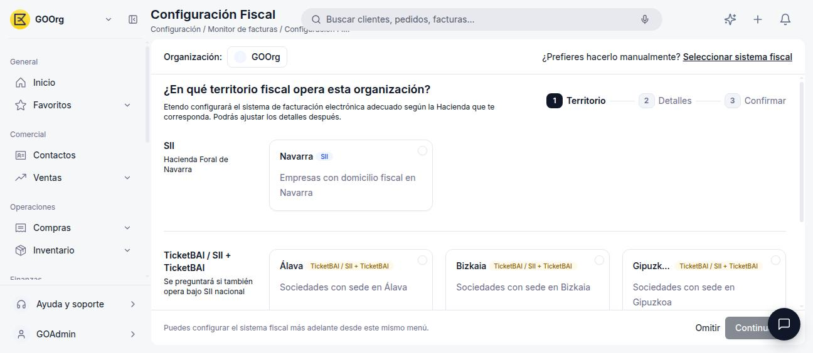

# Cómo Activar un Modelo Tributario

Antes de poder facturar, cada organización debe activar su **modelo tributario**: el **sistema fiscal** que le corresponde según el territorio en el que opera, ya sea **SII**, **TicketBAI** o **VERI\*FACTU**. Etendo Go incluye un asistente guiado que determina automáticamente qué sistema aplica a partir de tu territorio fiscal y tu volumen de facturación, con una alternativa manual para configurarlo tú mismo.

## Cómo Activar el Sistema Fiscal (Asistente Guiado)

1. Ve a **[Configuración > Configuración Fiscal](https://go.etendo.cloud/fiscal-config){target="_blank"}**.
2. **Paso 1 — Territorio:** selecciona el territorio fiscal en el que opera tu organización.

    <figure markdown="span">
      
      <figcaption>Paso 1: selección del territorio fiscal (Navarra, Álava, Bizkaia, Gipuzkoa, España/Baleares, Canarias o Ceuta/Melilla).</figcaption>
    </figure>

3. **Paso 2 — Detalles:** el asistente hace preguntas adicionales según el territorio elegido. Para **España/Baleares, Canarias y Ceuta/Melilla**, primero pregunta si estás obligado al SII:

    <figure markdown="span">
      
      <figcaption>El SII es obligatorio para Grandes Empresas (más de 6.010.121,04 € de volumen de operaciones en el año anterior), grupos de IVA e inscritos en REDEME.</figcaption>
    </figure>

    Si no estás obligado, el asistente te deja elegir entre **VERI\*FACTU** y **SII voluntario**:

    <figure markdown="span">
      
      <figcaption>VERI*FACTU: tu software genera y remite automáticamente los registros de facturación. SII voluntario: envías tú los registros a la AEAT en un plazo de 4 días y te exonera de los modelos 347 y 390.</figcaption>
    </figure>

    !!! warning "Son excluyentes"
        Si te acoges al SII, ya sea de forma obligatoria o voluntaria, quedas fuera del ámbito de VERI\*FACTU.

4. **Paso 3 — Confirmar:** revisa el territorio, la Hacienda y el sistema fiscal resultante antes de continuar.

    <figure markdown="span">
      
      <figcaption>Resumen final: territorio, Hacienda y sistema fiscal activado.</figcaption>
    </figure>

5. Pulsa **Confirmar**. A continuación podrás completar los detalles operativos (fechas de incorporación, cadencia de envío, entorno de pruebas o producción).

!!! tip "Territorios forales"
    Para **Navarra**, el sistema fiscal es siempre **SII** y el asistente salta directo del paso 1 al paso 3 (confirmar), sin preguntas adicionales. Para **Álava, Bizkaia y Gipuzkoa**, el paso 2 pregunta si además debes declarar por SII foral, y el resultado es **TicketBAI**, combinado o no con SII.

## Cómo Configurarlo Manualmente

Si prefieres elegir el sistema fiscal tú mismo, sin responder a las preguntas del asistente:

1. En **Configuración Fiscal**, pulsa **¿Prefieres hacerlo manualmente? Seleccionar sistema fiscal**.
2. Elige el territorio.
3. Elige el sistema fiscal disponible para ese territorio (por ejemplo, para Navarra la única opción es SII).
4. Pulsa **Continuar** y confirma.

!!! info "Puedes cambiarlo más adelante"
    Tanto si usas el asistente guiado como la configuración manual, podrás editar cualquier campo después desde **[Configuración > Configuración Fiscal](https://go.etendo.cloud/fiscal-config){target="_blank"}**.

## Artículos Relacionados

- [¿Qué puedes hacer en Impuestos?](../que-puedes-hacer-en-impuestos/que-puedes-hacer-en-impuestos.md)
- [Glosario de Impuestos](../glosario-de-impuestos/glosario-de-impuestos.md)
- [SII](../sii/sii.md)
- [TicketBAI](../ticketbai/ticketbai.md)
- [VERI\*FACTU](../verifactu/verifactu.md)

---
Esta obra está bajo la licencia :material-creative-commons: :fontawesome-brands-creative-commons-by: :fontawesome-brands-creative-commons-sa: [CC BY-SA 2.5 ES](https://creativecommons.org/licenses/by-sa/2.5/es/){target="_blank"} de [Futit Services S.L](https://etendo.software){target="_blank"}.
