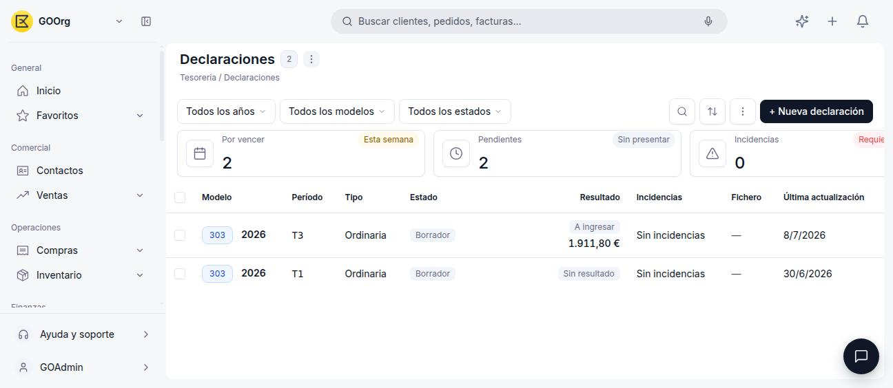
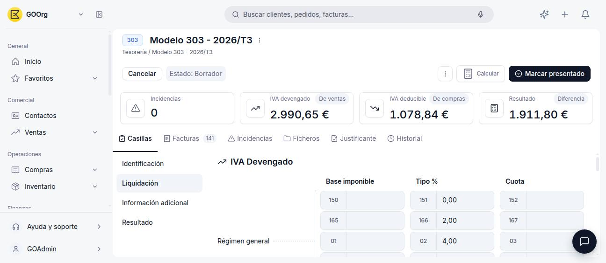
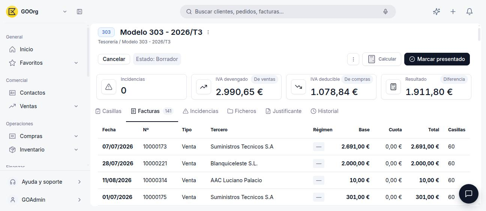

# Modelo 303

El **Modelo 303** es la autoliquidación trimestral del IVA. En Etendo Go se gestiona desde **[Finanzas > Modelos Fiscales](https://go.etendo.cloud/fiscal-models){target="_blank"}**, donde el sistema calcula automáticamente sus casillas a partir de los impuestos aplicados en tus facturas de venta y de compra del período.

## Cómo Crear una Declaración

1. Ve a **[Finanzas > Modelos Fiscales](https://go.etendo.cloud/fiscal-models){target="_blank"}**.
2. Pulsa **+ Nueva declaración**.
3. Selecciona **Modelo 303**, el **Año** y el **Período** (T1, T2, T3 o T4).
4. Pulsa **Crear**.

La declaración se crea en estado **Borrador** y aparece en el listado de **Declaraciones**, con su período, resultado e incidencias.

<figure markdown="span">
  
  <figcaption>Listado de Declaraciones: por vencer, pendientes de presentar e incidencias, con el detalle de cada Modelo 303 creado.</figcaption>
</figure>

## El Detalle de una Declaración

<figure markdown="span">
  
  <figcaption>Cabecera del Modelo 303: incidencias, IVA devengado (de ventas), IVA deducible (de compras) y resultado.</figcaption>
</figure>

La cabecera resume el período:

- **Incidencias** — número de facturas o datos con algún problema detectado.
- **IVA devengado** — total del IVA repercutido en tus ventas del período.
- **IVA deducible** — total del IVA soportado en tus compras del período.
- **Resultado** — diferencia entre ambos: a ingresar o a devolver.

Pulsa **Calcular** para que Etendo Go recalcule las casillas a partir de las facturas del período, y **Marcar presentado** cuando ya hayas presentado la declaración ante la AEAT.

### Pestaña Casillas

Organizada en cuatro bloques —**Identificación**, **Liquidación**, **Información adicional** y **Resultado**— reproduce la estructura oficial del Modelo 303:

<figure markdown="span">
  
  <figcaption>Liquidación: cada régimen (general, recargo de equivalencia, etc.) muestra su Base imponible, Tipo % y Cuota, con la numeración oficial de casillas (150-152, 165-167, 01-03...).</figcaption>
</figure>

En **IVA Devengado**, cada tramo de tipo impositivo (general, reducido, superreducido, recargo de equivalencia) tiene su propia fila de Base imponible, Tipo % y Cuota, con la numeración oficial de casillas de la AEAT. En **IVA Deducible** ocurre lo mismo para las cuotas soportadas en operaciones interiores, importaciones y adquisiciones intracomunitarias. El **Resultado** aplica las fórmulas oficiales (por ejemplo, la casilla 27 suma las cuotas devengadas de todos los regímenes, y la 46 resta el total a deducir del total devengado).

### Pestaña Facturas

<figure markdown="span">
  
  <figcaption>Cada factura del período aparece con su fecha, tercero, base, cuota y la casilla a la que contribuye su importe.</figcaption>
</figure>

Muestra todas las facturas del período que Etendo Go usó para calcular las casillas, con la base, la cuota y la casilla de destino de cada una. Es la forma de auditar de dónde sale cada importe de la declaración.

### Otras Pestañas

- **Incidencias** — detalle de las facturas o datos que generaron alguna advertencia durante el cálculo.
- **Ficheros** — genera el fichero de la declaración (**Generar fichero 303**) listo para subir a la Sede electrónica de la AEAT.
- **Justificante** — el comprobante de presentación, una vez presentada la declaración.
- **Historial** — cambios de estado de la declaración.

## Artículos Relacionados

- [Glosario de Impuestos](../glosario-de-impuestos/glosario-de-impuestos.md)
- [Modelo 349](../modelo-349/modelo-349.md)
- [Tipos de Impuestos y sus Porcentajes](../tipos-de-impuestos-y-sus-porcentajes/tipos-de-impuestos-y-sus-porcentajes.md)

---
Esta obra está bajo la licencia :material-creative-commons: :fontawesome-brands-creative-commons-by: :fontawesome-brands-creative-commons-sa: [CC BY-SA 2.5 ES](https://creativecommons.org/licenses/by-sa/2.5/es/){target="_blank"} de [Futit Services S.L](https://etendo.software){target="_blank"}.
