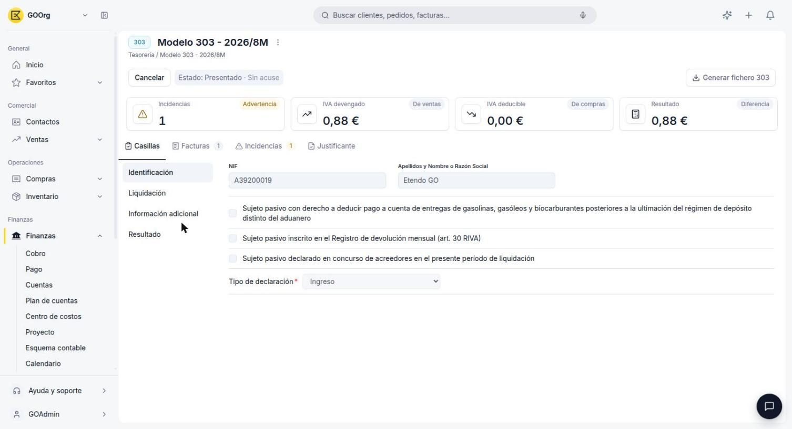
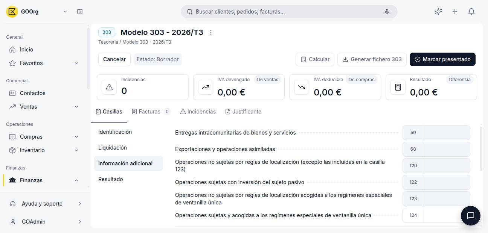
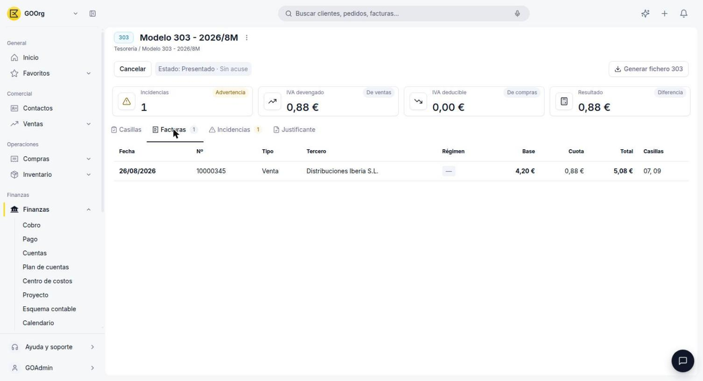
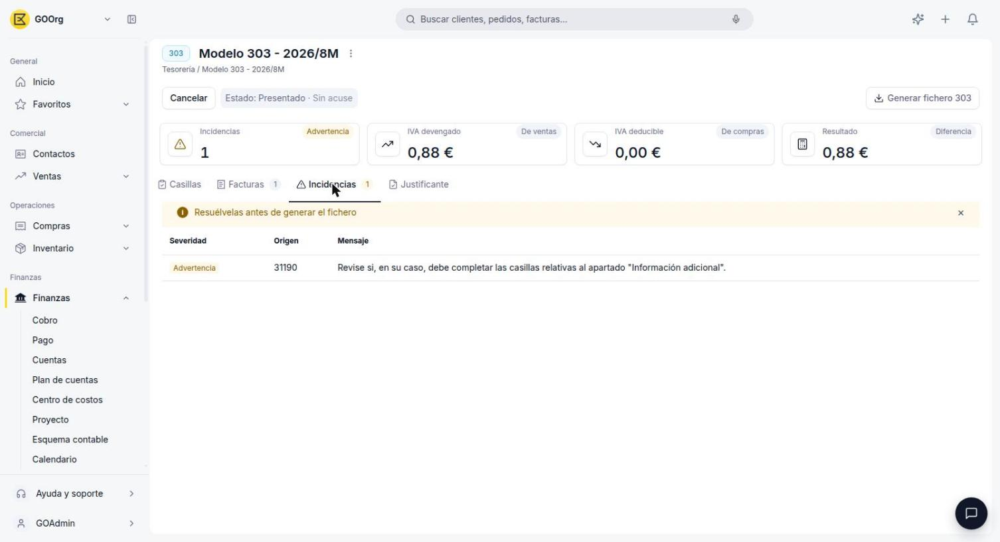

# Modelo 303

El **Modelo 303** es la autoliquidación trimestral (o mensual) del IVA. En Etendo Go se gestiona desde **[Finanzas > Modelos Fiscales](https://go.etendo.cloud/fiscal-models){target="_blank"}**, donde el sistema calcula automáticamente sus casillas a partir de los impuestos aplicados en tus facturas de venta y de compra del período.

## Antes de Empezar: Activar el Modelo

Para poder crear declaraciones, primero tienes que activar el Modelo 303 en el **Catálogo de modelos**:

1. Ve a **[Finanzas > Modelos Fiscales](https://go.etendo.cloud/fiscal-models){target="_blank"}**.
2. Pulsa **Catálogo de modelos**.
3. Activa el interruptor de **Modelo 303 - Autoliquidación IVA**.

Con el modelo activo, el botón **+ Nueva declaración** queda disponible.

## Cómo Crear una Declaración

1. Pulsa **+ Nueva declaración**.
2. Elige el **Modelo 303** en el selector.
3. Selecciona el **Año** y la **Frecuencia**: **Trimestral** (períodos T1 a T4) o **Mensual** (cuadrícula de los 12 meses).
4. Elige el **Período** correspondiente. El diálogo muestra una vista previa, por ejemplo *"Se creará como Modelo 303 · T2 2026"* para una declaración trimestral, o *"Se creará como Modelo 303 · 01 2026"* para una mensual.
5. Pulsa **Crear declaración**.

La declaración se crea en estado **Borrador** y aparece en el listado de **Declaraciones**, junto al resto de tus modelos activos, con columnas de Modelo, Período, Tipo, Estado, Resultado (*Sin resultado* hasta que pulses Calcular), Incidencias y Última actualización.

<figure markdown="span">
  
  <figcaption>Listado de Declaraciones: por vencer, pendientes de presentar e incidencias, con el detalle de cada modelo creado.</figcaption>
</figure>

## El Detalle de una Declaración

Dentro de una declaración en **Borrador**, la cabecera resume el período y ofrece tres acciones: **Calcular**, **Generar fichero 303** y **Marcar presentado**.

- **Calcular** — recalcula las casillas a partir de las facturas confirmadas del período.
- **Generar fichero 303** — genera el fichero listo para subir a la Sede electrónica de la AEAT.
- **Marcar presentado** — cambia el estado de la declaración una vez que la presentaste ante Hacienda.

<figure markdown="span">
  
  <figcaption>Una vez marcada como presentada, la declaración queda en estado <strong>Presentado · Sin acuse</strong>: los botones Calcular y Marcar presentado desaparecen, y solo quedan disponibles Cancelar y Generar fichero 303.</figcaption>
</figure>

!!! info "Estado Presentado · Sin acuse"
    Tras pulsar **Marcar presentado**, la declaración pasa a **Presentado · Sin acuse** hasta que subas el comprobante en la pestaña **Justificante**. En este estado ya no puedes recalcular las casillas ni volver a marcarla como presentada; solo puedes cancelarla o volver a generar el fichero.

Los cuatro indicadores de la cabecera son:

- **Incidencias** — número de facturas o datos con algún problema detectado.
- **IVA devengado** — total del IVA repercutido en tus ventas del período.
- **IVA deducible** — total del IVA soportado en tus compras del período.
- **Resultado** — diferencia entre ambos: a ingresar o a devolver.

### Pestaña Casillas

Organizada en cuatro bloques —**Identificación**, **Liquidación**, **Información adicional** y **Resultado**— reproduce la estructura oficial del Modelo 303:

<figure markdown="span">
  
  <figcaption>Identificación: NIF, razón social, las casillas de verificación de perfil (deducción del pago a cuenta de carburantes, REDEME, concurso de acreedores) y el campo obligatorio Tipo de declaración.</figcaption>
</figure>

En **Identificación**, además del NIF y la razón social, marcas las casillas de verificación que corresponden a tu situación: si tienes derecho a deducir el pago a cuenta de entregas de gasolinas, gasóleos y biocarburantes (novedad de 2026), si estás inscrito en el Registro de devolución mensual (REDEME) o si fuiste declarado en concurso de acreedores en el período. También completas el campo obligatorio **Tipo de declaración**, con las opciones oficiales de la AEAT: *Compensación*, *Devolución*, *Ingreso*, *Ingreso mediante domiciliación bancaria*, *Resultado cero*, *Devolución Cuenta Corriente Tributaria* y *Devolución por transferencia al extranjero*.

<figure markdown="span">
  
  <figcaption>Liquidación: cada régimen (general, recargo de equivalencia, etc.) muestra su Base imponible, Tipo % y Cuota, con la numeración oficial de casillas (150-152, 165-167, 01-03...).</figcaption>
</figure>

En **Liquidación**, la sección **IVA Devengado** tiene una fila por cada tramo de tipo impositivo (general, reducido, superreducido, recargo de equivalencia), con su Base imponible, Tipo % y Cuota, usando la numeración oficial de casillas de la AEAT. La sección **IVA Deducible** funciona igual para las cuotas soportadas en operaciones interiores, importaciones y adquisiciones intracomunitarias, y su resultado (casilla 46) es la casilla 27 menos la 45.

<figure markdown="span">
  
  <figcaption>Información adicional: entregas intracomunitarias y exportaciones, operaciones no sujetas por reglas de localización, inversión del sujeto pasivo y ventanilla única (OSS/IOSS), además de las casillas informativas del criterio de caja.</figcaption>
</figure>

El bloque **Información adicional** recoge operaciones que no forman parte del cálculo directo del resultado, pero que Hacienda pide declarar igualmente: entregas intracomunitarias de bienes y servicios (casilla 59), exportaciones y operaciones asimiladas (60), operaciones no sujetas por reglas de localización (120), operaciones con inversión del sujeto pasivo que tú emites (122), operaciones acogidas a los regímenes especiales de ventanilla única OSS/IOSS (123 y 124), y las casillas informativas de quienes están acogidos al criterio de caja (62, 63, 74 y 75).

<figure markdown="span">
  
  <figcaption>Resultado: suma de todos los regímenes, ajustes de periodos anteriores y la casilla 71 con el resultado final de la declaración.</figcaption>
</figure>

El bloque **Resultado** traduce todo lo anterior en una única cifra. La casilla 64 suma los resultados de régimen general, simplificado y regularizaciones; a partir de ahí se restan o suman ajustes como el IVA a la importación liquidado por la Aduana pendiente de ingreso (77) o el saldo a compensar de períodos anteriores que apliques en este período (78, tomado del acumulado de la casilla 110). El resultado final de la declaración llega a la **casilla 71**: positivo es lo que ingresas, negativo lo compensas en el siguiente período o lo pides devuelto si es la última declaración del año. Al final del bloque también están los checkboxes **Sin actividad** (si no tuviste operaciones en el período) y **Autoliquidación rectificativa** (para corregir una declaración ya presentada).

### Pestaña Facturas

Muestra todas las facturas confirmadas del período que Etendo Go usó (o usará, tras pulsar Calcular) para completar las casillas, con columnas de Fecha, Nº, Tipo (Venta o Compra), Tercero, Régimen, Base, Cuota, Total y las Casillas donde impacta cada factura. Es la forma de auditar de dónde sale cada importe de la declaración.

<figure markdown="span">
  
  <figcaption>Cada fila indica en qué casillas del modelo impacta la factura; en este ejemplo, una venta afecta las casillas 07 y 09.</figcaption>
</figure>

### Otras Pestañas

- **Incidencias** — detalle de las facturas o datos que generaron alguna advertencia durante el cálculo, en una tabla de Severidad, Origen y Mensaje.
- **Justificante** — sube aquí el comprobante de presentación de tu declaración.

<figure markdown="span">
  
  <figcaption>Cada incidencia indica su Severidad (por ejemplo, Advertencia), el Origen (el número de la factura o registro implicado) y un Mensaje explicando qué revisar antes de generar el fichero.</figcaption>
</figure>

!!! tip "Justificante es un área de carga manual"
    Etendo Go no genera el comprobante de presentación de forma automática. Arrastra el archivo o selecciónalo desde tu equipo una vez que ya presentaste la declaración ante Hacienda (formatos compatibles: PDF, Word, Excel, PowerPoint e imágenes).

## Artículos Relacionados

- [Glosario de Impuestos](../glosario-de-impuestos/glosario-de-impuestos.md)
- [Modelo 349](../modelo-349/modelo-349.md)
- [Tipos de Impuestos y sus Porcentajes](../tipos-de-impuestos-y-sus-porcentajes/tipos-de-impuestos-y-sus-porcentajes.md)

---
Esta obra está bajo la licencia :material-creative-commons: :fontawesome-brands-creative-commons-by: :fontawesome-brands-creative-commons-sa: [CC BY-SA 2.5 ES](https://creativecommons.org/licenses/by-sa/2.5/es/){target="_blank"} de [Futit Services S.L](https://etendo.software){target="_blank"}.
