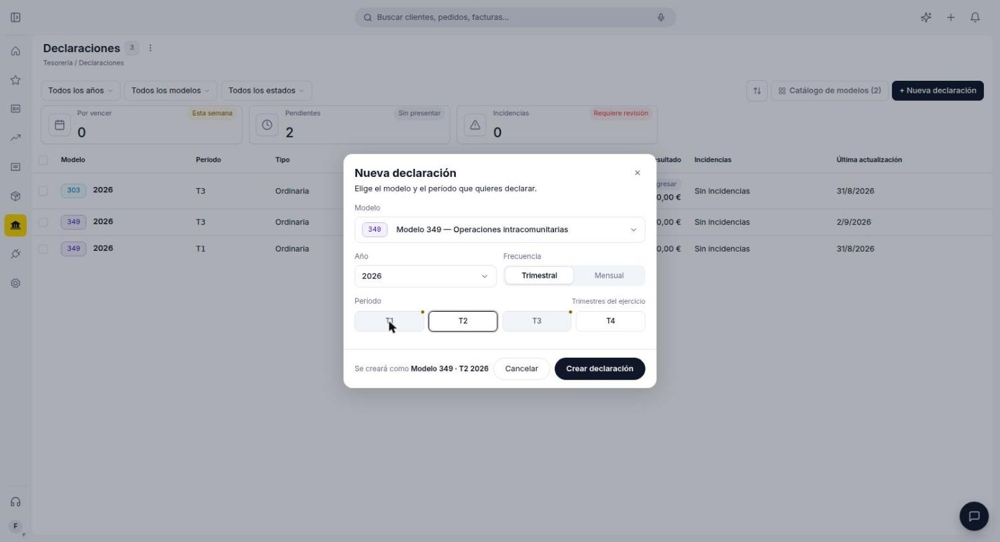
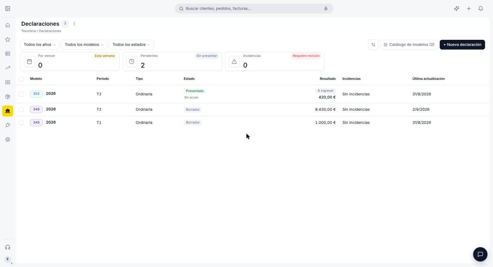
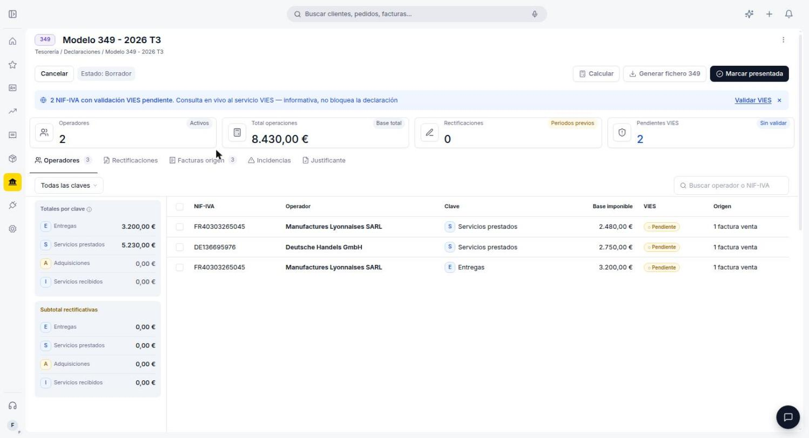
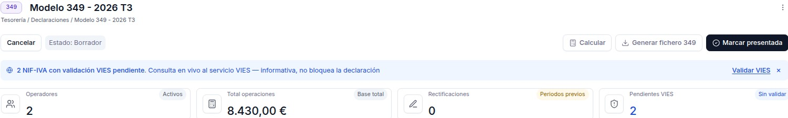
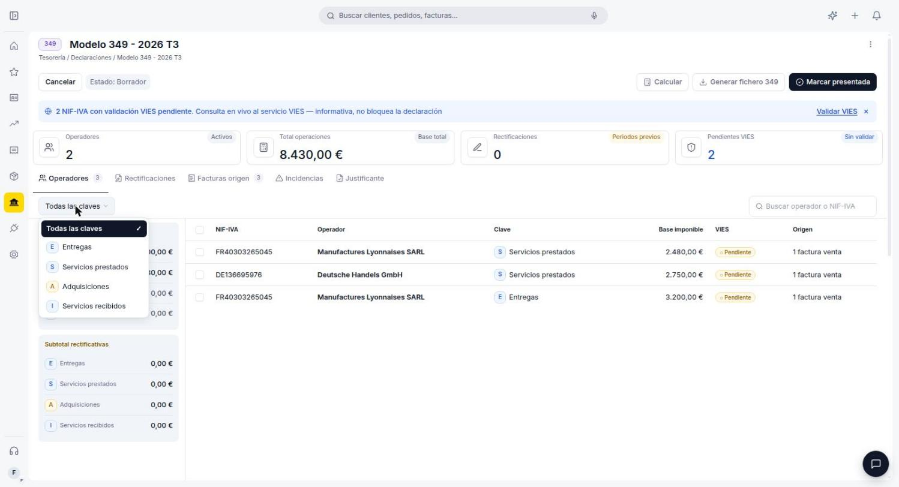
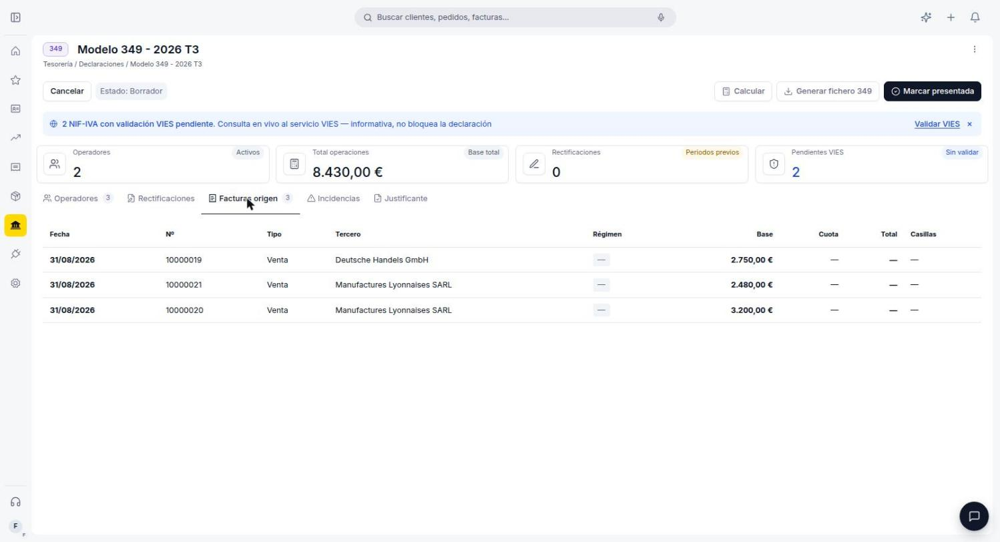

# Modelo 349

El **Modelo 349** es la declaración informativa de operaciones intracomunitarias: recoge las entregas y adquisiciones de bienes, y los servicios prestados y recibidos, con empresas de otros países de la Unión Europea. A diferencia del Modelo 303, no implica ingreso ni devolución: su función es permitir que las administraciones tributarias de los países de la UE crucen esta información a través del sistema VIES, comprobando que lo que declaras coincide con lo que declara tu contraparte en el otro país — un control clave contra el fraude en el IVA intracomunitario, y una condición para que tus entregas a otros países de la UE puedan quedar exentas de IVA. Como el Modelo 303, se gestiona desde **[Finanzas > Modelos Fiscales](https://go.etendo.cloud/fiscal-models){target="_blank"}**.

!!! info "Marco normativo del Modelo 349"
    Esta declaración recapitulativa está regulada por la Orden EHA/769/2010, de 18 de marzo, con última modificación relevante en la Orden HAC/174/2020:

    - **Operaciones que cubre** — entregas intracomunitarias de bienes exentas de IVA, adquisiciones intracomunitarias sujetas al impuesto y las llamadas operaciones triangulares (una adquisición intracomunitaria seguida de una entrega posterior también exenta).
    - **Periodicidad general** — mensual, dentro de los primeros 20 días naturales del mes siguiente.
    - **Periodicidad trimestral** — disponible si el importe de tus operaciones intracomunitarias no supera los 50.000 € (sin IVA) ni en el trimestre en curso ni en los cuatro anteriores; si lo superas a mitad de trimestre, tienes que presentar igualmente una declaración por los meses ya transcurridos.
    - **Presentación anual** — ya no existe: se suprimió en 2020.

El proceso completo, de punta a punta, sigue esta secuencia:

1. Activas el Modelo 349 en el Catálogo de modelos (una única vez).
2. Creas una declaración para el año y el período que corresponda.
3. Pulsas **Calcular** para que tome las facturas intracomunitarias confirmadas del período.
4. Revisas las pestañas (Operadores, Rectificaciones, Facturas origen, Incidencias) y resuelves lo que haga falta, por ejemplo validar un NIF-IVA pendiente en VIES.
5. Pulsas **Generar fichero 349** y completas los datos que pide la AEAT.
6. Pulsas **Marcar presentada**, con o sin acuse de recibo.
7. Si no subiste el justificante al presentar, lo subes después desde la pestaña **Justificante**.

## Antes de Empezar: Activar el Modelo

Para poder crear declaraciones, primero tienes que activar el Modelo 349 en el **Catálogo de modelos**:

1. Ve a **[Finanzas > Modelos Fiscales](https://go.etendo.cloud/fiscal-models){target="_blank"}**.
2. Pulsa **Catálogo de modelos**.
3. Activa el interruptor de **Modelo 349 — Operaciones intracomunitarias**.

## Cómo Crear una Declaración

1. Pulsa **+ Nueva declaración**.
2. Elige el **Modelo 349** en el selector.
3. Selecciona el **Año** y la **Frecuencia**: **Trimestral** (T1 a T4) o **Mensual**, según el volumen de operaciones intracomunitarias que debas declarar.
4. Elige el **Período** y pulsa **Crear declaración**.

<figure markdown="span">
  
  <figcaption>Selecciona el modelo, el año, la frecuencia (Trimestral o Mensual) y el período. El diálogo muestra una vista previa, por ejemplo "Se creará como Modelo 349 · T2 2026". Los períodos que ya tienen una declaración creada aparecen marcados con un punto.</figcaption>
</figure>

La declaración se crea en estado **Borrador** y aparece junto al resto de tus declaraciones activas.

<figure markdown="span">
  
  <figcaption>El Modelo 349 aparece en el mismo listado de Declaraciones que el Modelo 303, cada uno con su propio período y estado.</figcaption>
</figure>

## El Detalle de una Declaración

La cabecera de una declaración Modelo 349 en **Borrador** ofrece tres acciones:

- **Calcular** — recalcula los totales por clave a partir de las facturas intracomunitarias confirmadas del período. A diferencia del [Modelo 303](../modelo-303/modelo-303.md), no exige que el envío a SII o TicketBAI esté en estado Aceptado: una factura Completada y Contabilizada entra en el cálculo aunque su envío fiscal siga en *Pendiente*.
- **Generar fichero 349** — antes de descargar el fichero para la AEAT, pide completar un formulario: nombre del fichero, persona y teléfono de contacto, si es una declaración **Sustitutiva** (con el identificador de la declaración anterior), el NIF del representante legal y, si corresponde, las casillas de régimen foral **Navarra** o **Guipúzcoa**.
- **Marcar presentada** — abre un diálogo para elegir cómo se presentó la declaración:
    - **Con acuse de recibo**: subes en el momento el justificante (PDF o XML) del portal de la AEAT, y la declaración pasa directamente a **Presentado · Acuse manual**.
    - **Sin acuse de recibo**: confirmas la presentación sin adjuntar nada todavía; la declaración pasa a **Presentado · Sin acuse**, y puedes subir el justificante más adelante desde la pestaña **Justificante**.

En cualquiera de los dos casos, tras presentar la declaración los botones Calcular y Marcar presentada desaparecen: solo quedan disponibles Cancelar y Generar fichero 349.

**Cancelar** se comporta distinto según el estado: en una declaración en Borrador simplemente vuelve al listado de Declaraciones sin cambiar nada; en una declaración ya presentada (con o sin acuse), la devuelve a **Borrador** conservando los totales calculados y el justificante que hayas subido, para que puedas corregir algo y volver a presentarla.

<figure markdown="span">
  
  <figcaption>Cabecera del Modelo 349: operadores activos, total de operaciones, rectificaciones de períodos previos y pendientes de validación VIES.</figcaption>
</figure>

Los cuatro indicadores de la cabecera son:

- **Operadores** — cantidad de terceros con operaciones intracomunitarias en el período.
- **Total operaciones** — base total declarada, sumando todas las claves.
- **Rectificaciones** — operaciones que corrigen datos ya declarados en períodos anteriores.
- **Pendientes VIES** — operadores cuyo NIF-IVA todavía no fue validado contra el sistema VIES de la Unión Europea.

Si tienes operadores con el NIF-IVA pendiente de validar (el indicador **Pendientes VIES**), un aviso aparece sobre los indicadores con acceso directo a la validación:

<figure markdown="span">
  
  <figcaption>El aviso "NIF-IVA con validación VIES pendiente" es informativo y no bloquea la declaración; pulsa <strong>Validar VIES</strong> para lanzar la validación asíncrona contra el sistema de la Unión Europea.</figcaption>
</figure>

### Pestaña Operadores

Lista cada tercero con operaciones intracomunitarias en el período, con su NIF-IVA, el nombre del Operador, la **Clave** de la operación, la Base imponible, el estado de validación **VIES** (*Pendiente* o *Inválido*) y una columna de **Origen** con un resumen de cuántas facturas componen ese total, por ejemplo *"10 facturas compra"* o *"1 factura venta"*. Un buscador en la esquina superior derecha permite filtrar la lista por operador o NIF-IVA.

<figure markdown="span">
  
  <figcaption>El panel "Totales por clave" resume la base imponible de cada tipo de operación; debajo, "Subtotal rectificativas" muestra el mismo desglose pero solo para las operaciones que rectifican un período anterior. El filtro permite acotar la lista por clave.</figcaption>
</figure>

Las cuatro claves de operación son:

- **E — Entregas** — venta de bienes a un cliente de otro país de la UE.
- **S — Servicios prestados** — servicios facturados a un cliente de otro país de la UE.
- **A — Adquisiciones** — compra de bienes a un proveedor de otro país de la UE.
- **I — Servicios recibidos** — servicios facturados por un proveedor de otro país de la UE.

### Otras Pestañas

- **Rectificaciones** — operaciones que corrigen la base imponible ya declarada en un período anterior; muestra *"Sin rectificaciones correctivas en este periodo"* cuando no hay ninguna.
- **Facturas origen** — las facturas que Etendo Go usó (o usará, tras pulsar Calcular) para completar la declaración, con las mismas columnas que la pestaña Facturas del Modelo 303 (Fecha, Nº, Tipo, Tercero, Régimen, Base, Cuota, Total y Casillas). En el Modelo 349, las columnas Cuota, Total y Casillas suelen mostrarse vacías (*—*), porque estas operaciones intracomunitarias no generan cuota de IVA ni ocupan casillas del 303.
- **Incidencias** — detalle de los datos que generaron alguna advertencia durante el cálculo, como el aviso de validación VIES pendiente ya descrito arriba; si no hay ninguna, muestra un estado vacío "Sin incidencias".
- **Justificante** — aquí aparece el comprobante que subiste al elegir "Con acuse de recibo" al presentar la declaración, o donde puedes subirlo más adelante si la marcaste como "Sin acuse de recibo".

<figure markdown="span">
  
  <figcaption>Facturas origen del período: en este ejemplo, tres facturas de venta con bases distintas que alimentan las claves E y S de la declaración.</figcaption>
</figure>

!!! note "El título de la declaración puede mostrarse en inglés"
    Al igual que en el Modelo 303, el título de una declaración mensual no siempre coincide con la vista previa del diálogo de creación. Además, en el Modelo 349 el mes puede aparecer en inglés en el título, por ejemplo **"Modelo 349 - 2026 / August"** en lugar de "Modelo 349 - 2026 / Agosto". Es una particularidad conocida de la pantalla, no una traducción pendiente de tu configuración.

!!! tip "Justificante es un área de carga manual"
    Etendo Go no genera el comprobante de presentación de forma automática: lo subes tú, ya sea en el momento de marcar la declaración como presentada (opción "Con acuse de recibo") o después, arrastrando el archivo aquí o seleccionándolo desde tu equipo (formatos compatibles: PDF, Word, Excel, PowerPoint e imágenes).

## Artículos Relacionados

- [Modelo 303](../modelo-303/modelo-303.md)
- [Glosario de Impuestos](../glosario-de-impuestos/glosario-de-impuestos.md)

---
Esta obra está bajo la licencia :material-creative-commons: :fontawesome-brands-creative-commons-by: :fontawesome-brands-creative-commons-sa: [CC BY-SA 2.5 ES](https://creativecommons.org/licenses/by-sa/2.5/es/){target="_blank"} de [Futit Services S.L](https://etendo.software){target="_blank"}.
