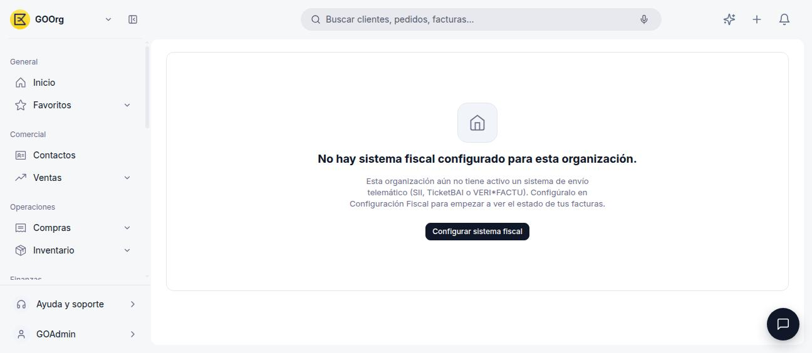
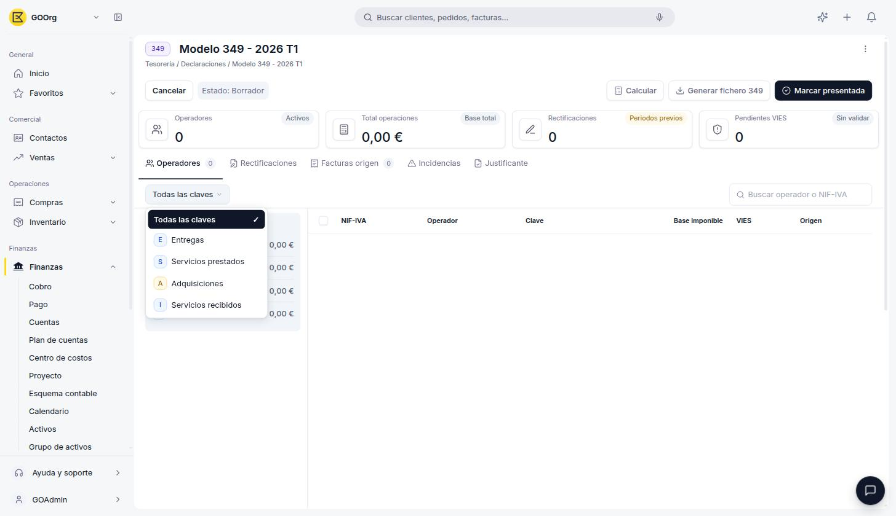
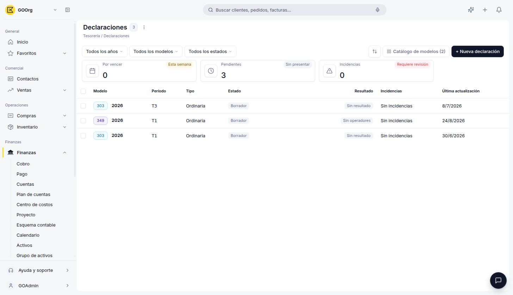

# Monitor Fiscal

El **Monitor Fiscal**, en **[Finanzas > Monitor Fiscal](https://go.etendo.cloud/fiscal-monitor){target="_blank"}**, es el panel donde revisas el estado del envío de tus facturas al sistema fiscal activo de tu organización (SII, TicketBAI o VERI\*FACTU) y sus incidencias.

## Antes de Activar un Sistema Fiscal

Si tu organización todavía no tiene un sistema fiscal configurado, el Monitor Fiscal muestra un estado vacío con acceso directo a la configuración:

<figure markdown="span">
  
  <figcaption>Sin un sistema fiscal activo, el Monitor Fiscal no puede mostrar el estado de tus facturas.</figcaption>
</figure>

Pulsa **Configurar sistema fiscal** para ir a Configuración Fiscal y activar SII, TicketBAI o VERI\*FACTU. Ver [Cómo Activar un Modelo Tributario](../como-activar-un-modelo-tributario/como-activar-un-modelo-tributario.md).

## Con un Sistema Fiscal Activo

Una vez que tu organización tiene un sistema fiscal configurado, el Monitor Fiscal organiza el envío de tus facturas en una pestaña por cada sistema activo. Por ejemplo, una organización con **SII** y **TicketBAI** activos ve ambas pestañas, cada una con su propio contador de facturas:

<figure markdown="span">
  
  <figcaption>Pestaña SII: Facturas emitidas y recibidas del período, con su Estado y el CSV de la AEAT una vez enviadas.</figcaption>
</figure>

### Pestaña SII

Se divide en **Facturas emitidas** y **Facturas recibidas**, y un filtro de período (**Período actual** o **Período anterior**). Cada fila muestra la Fecha, el Nº de Factura (enlaza a la factura original), el Cliente o Proveedor, el Tipo, el Total, el **Estado** del envío (por ejemplo *Pendiente*) y el **CSV AEAT** (el código de verificación que devuelve Hacienda una vez aceptado el envío). Puedes seleccionar facturas con la casilla de la izquierda y exportar el listado con el botón **Exportar**.

### Pestaña TicketBAI

Se divide en **Enviadas** y **Rechazadas**. Cada fila muestra la Fecha, el Nº de Factura, una Descripción, si tiene **Firma** digital aplicada, y el **Estado** de la respuesta de la Hacienda Foral (por ejemplo *Aceptado*, en verde):

<figure markdown="span">
  
  <figcaption>Pestaña TicketBAI: cada envío muestra su Firma y el Estado devuelto por la Hacienda Foral.</figcaption>
</figure>

### Estado de envío en el detalle de la factura

El estado de envío también aparece directamente en el detalle de cada factura, junto al resto de su información general. Si tu organización tiene varios sistemas activos (como SII y TicketBAI), la factura muestra un indicador de estado por cada uno:

<figure markdown="span">
  
  <figcaption>El detalle de la factura resume su Estado SII y su Estado TicketBAI de forma independiente.</figcaption>
</figure>

!!! tip "Cada sistema fiscal tiene su propia configuración"
    Los campos operativos de cada sistema (régimen REDEME, autorizaciones especiales AEAT, certificado digital para SII; territorio y envío automático para TicketBAI) se gestionan desde Configuración Fiscal. Ver [SII](../sii/sii.md) y [TicketBAI](../ticketbai/ticketbai.md).

## Artículos Relacionados

- [Cómo Activar un Modelo Tributario](../como-activar-un-modelo-tributario/como-activar-un-modelo-tributario.md)
- [SII](../sii/sii.md)
- [TicketBAI](../ticketbai/ticketbai.md)
- [VERI\*FACTU](../verifactu/verifactu.md)

---
Esta obra está bajo la licencia :material-creative-commons: :fontawesome-brands-creative-commons-by: :fontawesome-brands-creative-commons-sa: [CC BY-SA 2.5 ES](https://creativecommons.org/licenses/by-sa/2.5/es/){target="_blank"} de [Futit Services S.L](https://etendo.software){target="_blank"}.
