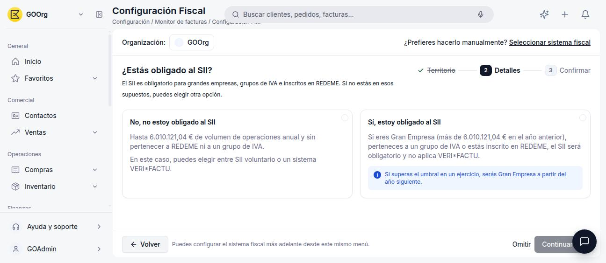
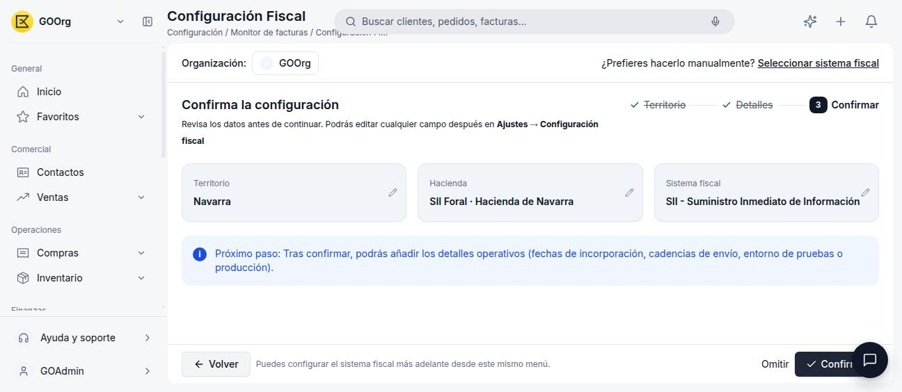
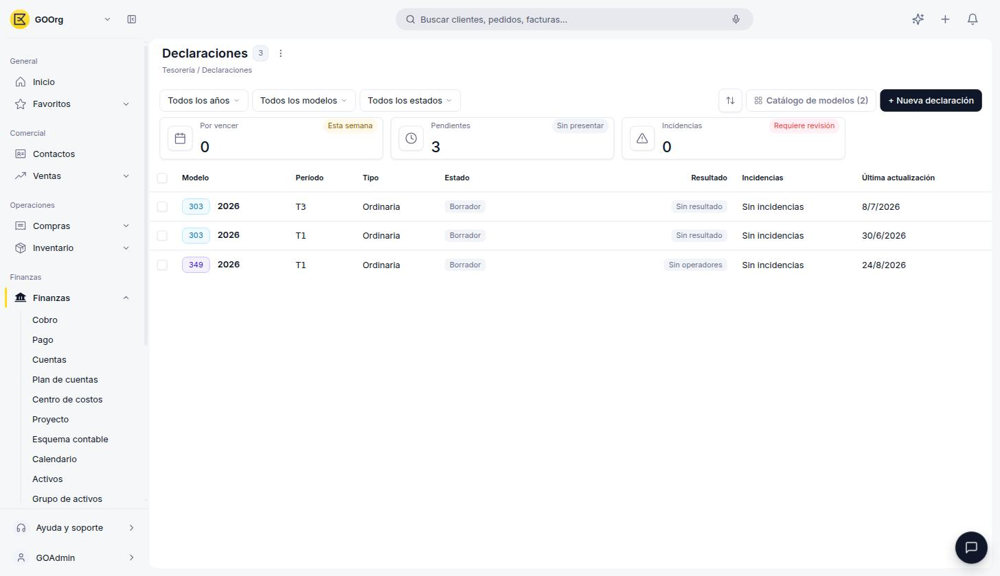

# SII

El **SII** (Suministro Inmediato de Información) es el sistema por el que se envían electrónicamente los registros de facturación a la Sede electrónica de la AEAT, o a la Hacienda Foral correspondiente en Navarra. Es el sistema fiscal que Etendo Go activa automáticamente para organizaciones con domicilio fiscal en **Navarra**, y una de las opciones disponibles para el resto de territorios.

!!! tip "¿No sabes qué sistema te corresponde?"
    Este artículo asume que ya sabes que el SII es tu sistema fiscal. Si todavía no lo activaste, empieza por [Cómo Activar un Modelo Tributario](../como-activar-un-modelo-tributario/como-activar-un-modelo-tributario.md), que te guía según tu territorio.

## Cuándo Aplica el SII

<figure markdown="span">
  
  <figcaption>El asistente de Configuración Fiscal pregunta si tu organización está obligada al SII.</figcaption>
</figure>

El SII es **obligatorio** si tu organización cumple alguno de estos supuestos:

- Es una **Gran Empresa**: su volumen de operaciones superó los 6.010.121,04 € en el año anterior.
- Pertenece a un **grupo de IVA**.
- Está inscrita en **REDEME** (Registro de Devolución Mensual del IVA).

Si no estás en ninguno de estos supuestos, puedes acogerte al SII de forma **voluntaria** como alternativa a VERI\*FACTU. Para las organizaciones con domicilio fiscal en **Navarra**, el SII (foral) es siempre el sistema resultante, sin necesidad de evaluar estos supuestos.

!!! warning "Excluye VERI\*FACTU"
    Acogerte al SII, ya sea de forma obligatoria o voluntaria, te deja fuera del ámbito de VERI\*FACTU.

## Cómo Activarlo

1. Ve a **[Configuración > Configuración Fiscal](https://go.etendo.cloud/fiscal-config){target="_blank"}**.
2. Selecciona tu territorio fiscal.
3. Si tu territorio ofrece varias opciones (por ejemplo, España/Baleares, Canarias o Ceuta/Melilla), responde que **sí estás obligado al SII**, o elige **SII voluntario** si no lo estás pero prefieres este sistema frente a VERI\*FACTU. Si tu territorio es **Navarra**, el asistente te lleva directo a confirmar.
4. Revisa el resumen y pulsa **Confirmar**.

<figure markdown="span">
  
  <figcaption>Resumen de confirmación: territorio Navarra, Hacienda Foral y sistema fiscal SII.</figcaption>
</figure>

## Detalles Operativos

Tras confirmar, la pantalla se llama **Configuración Fiscal** (con el sufijo del sistema activo, por ejemplo *"Configuración Fiscal SII + TBAI"* si además activaste TicketBAI) y queda disponible en **[Configuración > Monitor de facturas > Configuración Fiscal](https://go.etendo.cloud/fiscal-config){target="_blank"}**, con una pestaña **SII** para completar sus detalles operativos:

<figure markdown="span">
  
  <figcaption>Pestaña SII: interruptor de Régimen especial REDEME, Autorizaciones especiales AEAT y el certificado digital para autenticar con Hacienda.</figcaption>
</figure>

- **Régimen especial** — interruptor de **REDEME** (Registro de Devolución Mensual del IVA).
- **Autorizaciones especiales AEAT** — número de registro de la autorización, si tu organización cuenta con alguna.
- **Certificado digital** — el certificado necesario para autenticar los envíos con Hacienda; muestra su fecha de vigencia y un botón **Reemplazar** para actualizarlo. Es el mismo certificado que usa la opción **Presentación telemática AEAT** al presentar el [Modelo 303](../modelo-303/modelo-303.md), fuera de su modo de prueba.

## Artículos Relacionados

- [Cómo Activar un Modelo Tributario](../como-activar-un-modelo-tributario/como-activar-un-modelo-tributario.md)
- [TicketBAI](../ticketbai/ticketbai.md)
- [VERI\*FACTU](../verifactu/verifactu.md)
- [Modelo 303](../modelo-303/modelo-303.md)
- [Glosario de Impuestos](../glosario-de-impuestos/glosario-de-impuestos.md)

---
Esta obra está bajo la licencia :material-creative-commons: :fontawesome-brands-creative-commons-by: :fontawesome-brands-creative-commons-sa: [CC BY-SA 2.5 ES](https://creativecommons.org/licenses/by-sa/2.5/es/){target="_blank"} de [Futit Services S.L](https://etendo.software){target="_blank"}.
