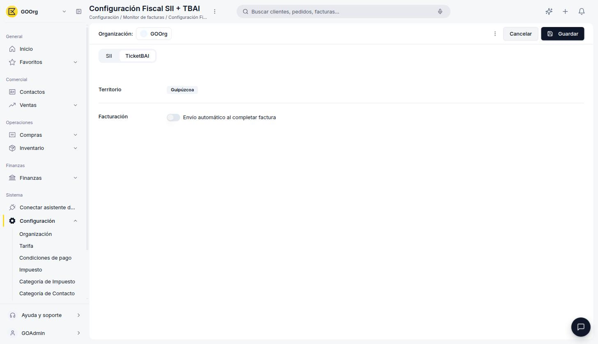

# TicketBAI

**TicketBAI** es el sistema de facturación electrónica de los Territorios Históricos del País Vasco. En Etendo se activa desde Configuración Fiscal seleccionando el territorio que corresponda.

!!! tip "¿No sabes qué sistema te corresponde?"
    Este artículo asume que ya sabes que TicketBAI es tu sistema fiscal. Si todavía no lo activaste, empieza por [Cómo Activar un Modelo Tributario](../como-activar-un-modelo-tributario/como-activar-un-modelo-tributario.md), que te guía según tu territorio.

## Cuándo Aplica TicketBAI

TicketBAI es **obligatorio** para toda sociedad con domicilio fiscal en los Territorios Históricos del País Vasco: **Álava**, **Bizkaia** o **Guipúzcoa**. A diferencia del SII o VERI\*FACTU, no depende de tu volumen de facturación ni de si estás inscrita en REDEME o perteneces a un grupo de IVA — solo del territorio.

Dentro de TicketBAI, esos mismos supuestos sí se evalúan para decidir si además debes declarar por el SII foral:

- **Solo TicketBAI** — caso habitual si no eres Gran Empresa, no estás en REDEME, no perteneces a un grupo de IVA y no te has acogido voluntariamente al SII.
- **TicketBAI + SII** — aplica normalmente si estás obligada al SII o te has acogido voluntariamente.

## Cómo Activarlo

1. Ve a **[Configuración > Configuración Fiscal](https://app.etendo.software/fiscal-config){target="_blank"}**.
2. Selecciona tu territorio: **Álava**, **Bizkaia** o **Guipúzcoa**.

    <figure markdown="span">
      
      <figcaption>Selección de territorio: Bizkaia (Hacienda Foral de Bizkaia).</figcaption>
    </figure>

3. El asistente pregunta si además debes declarar por SII (ver arriba):

    <figure markdown="span">
      
      <figcaption>"Solo TicketBAI" si tu empresa únicamente remite facturas mediante TicketBAI; "TicketBAI + SII" si además debes llevar el SII foral.</figcaption>
    </figure>

4. Revisa el resumen y pulsa **Confirmar**.

    <figure markdown="span">
      
      <figcaption>Resumen de confirmación: territorio Bizkaia, Hacienda Foral de Bizkaia y sistema fiscal TicketBAI (País Vasco).</figcaption>
    </figure>

## Detalles Operativos

Tras confirmar, la pantalla **[Configuración > Configuración Fiscal](https://app.etendo.software/fiscal-config){target="_blank"}** incluye una pestaña **TicketBAI** con sus detalles operativos:

<figure markdown="span">
  
  <figcaption>Pestaña TicketBAI: el territorio confirmado en el asistente y el interruptor de envío automático al completar factura.</figcaption>
</figure>

- **Territorio** — el territorio histórico confirmado en el asistente de activación (Álava, Bizkaia o Guipúzcoa).
- **Facturación** — interruptor de **envío automático al completar factura**: si está desactivado, tienes que enviar cada factura a Hacienda manualmente con el botón **Enviar a SIF** de su detalle; el [Monitor Fiscal](../monitor-fiscal/monitor-fiscal.md) es el punto de partida para encontrarla y comprobar si quedó Pendiente.

Además, cada registro de **Impuesto** que uses en tus facturas tiene su propio campo **TBAI - Clave de Régimen Especial de IVA**, con el código oficial de régimen especial o trascendencia que se incluye en el envío a TicketBAI (ver [Tipos de Impuestos y sus Porcentajes](../tipos-de-impuestos-y-sus-porcentajes/tipos-de-impuestos-y-sus-porcentajes.md#campos-del-registro-impuesto)).

## Artículos Relacionados

- [Cómo Activar un Modelo Tributario](../como-activar-un-modelo-tributario/como-activar-un-modelo-tributario.md)
- [Monitor Fiscal](../monitor-fiscal/monitor-fiscal.md)
- [SII](../sii/sii.md)

---
Esta obra está bajo la licencia :material-creative-commons: :fontawesome-brands-creative-commons-by: :fontawesome-brands-creative-commons-sa: [CC BY-SA 2.5 ES](https://creativecommons.org/licenses/by-sa/2.5/es/){target="_blank"} de [Futit Services S.L](https://etendo.software){target="_blank"}.
