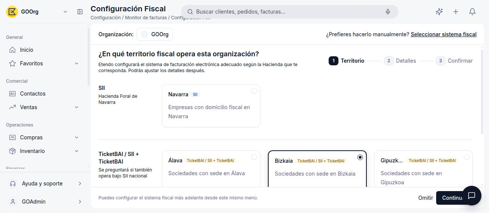
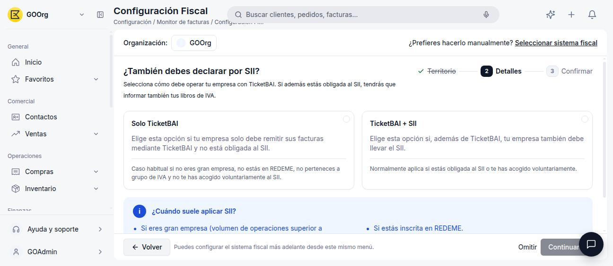
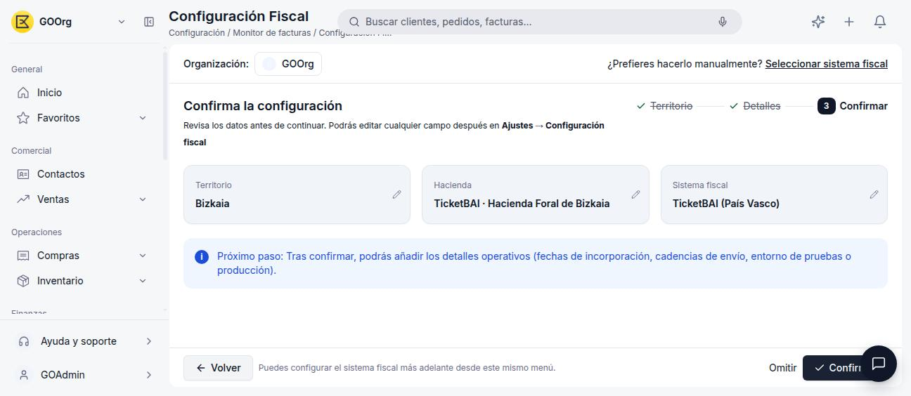

# TicketBAI

**TicketBAI** es el sistema de facturación electrónica obligatorio para sociedades con domicilio fiscal en los Territorios Históricos del País Vasco: **Álava**, **Bizkaia** y **Gipuzkoa**. En Etendo Go se activa desde Configuración Fiscal seleccionando cualquiera de estos tres territorios.

!!! tip "¿No sabes qué sistema te corresponde?"
    Este artículo asume que ya sabes que TicketBAI es tu sistema fiscal. Si todavía no lo activaste, empieza por [Cómo Activar un Modelo Tributario](../como-activar-un-modelo-tributario/como-activar-un-modelo-tributario.md), que te guía según tu territorio.

## Cómo Activarlo

1. Ve a **[Configuración > Configuración Fiscal](https://go.etendo.cloud/fiscal-config){target="_blank"}**.
2. Selecciona tu territorio: **Álava**, **Bizkaia** o **Gipuzkoa**.

    <figure markdown="span">
      
      <figcaption>Selección de territorio: Bizkaia (Hacienda Foral de Bizkaia).</figcaption>
    </figure>

3. El asistente pregunta si además debes declarar por SII:

    <figure markdown="span">
      
      <figcaption>"Solo TicketBAI" si tu empresa únicamente remite facturas mediante TicketBAI; "TicketBAI + SII" si además debes llevar el SII foral.</figcaption>
    </figure>

    - **Solo TicketBAI** — caso habitual si no eres Gran Empresa, no estás en REDEME, no perteneces a un grupo de IVA y no te has acogido voluntariamente al SII.
    - **TicketBAI + SII** — aplica normalmente si estás obligada al SII o te has acogido voluntariamente.

4. Revisa el resumen y pulsa **Confirmar**.

    <figure markdown="span">
      
      <figcaption>Resumen de confirmación: territorio Bizkaia, Hacienda Foral de Bizkaia y sistema fiscal TicketBAI (País Vasco).</figcaption>
    </figure>

## Detalles Operativos

Tras confirmar, desde **[Configuración > Configuración Fiscal](https://go.etendo.cloud/fiscal-config){target="_blank"}** puedes completar los detalles operativos de TicketBAI:

- **Fecha acogida TicketBAI** — fecha desde la que tu organización opera bajo este sistema.
- **Entorno producción** — si envías al entorno real de Hacienda o a un entorno de pruebas.
- **Facturación** — si usas la descripción de la factura como su nombre, si el envío a Hacienda es automático al completar la factura, y el texto de **Descripción de facturas** por defecto.
- **Técnico** — si se valida la factura anterior de la cadena (encadenamiento de facturas, requisito técnico de TicketBAI).

## Artículos Relacionados

- [Cómo Activar un Modelo Tributario](../como-activar-un-modelo-tributario/como-activar-un-modelo-tributario.md)
- [SII](../sii/sii.md)
- [VERI\*FACTU](../verifactu/verifactu.md)
- [Glosario de Impuestos](../glosario-de-impuestos/glosario-de-impuestos.md)

---
Esta obra está bajo la licencia :material-creative-commons: :fontawesome-brands-creative-commons-by: :fontawesome-brands-creative-commons-sa: [CC BY-SA 2.5 ES](https://creativecommons.org/licenses/by-sa/2.5/es/){target="_blank"} de [Futit Services S.L](https://etendo.software){target="_blank"}.
