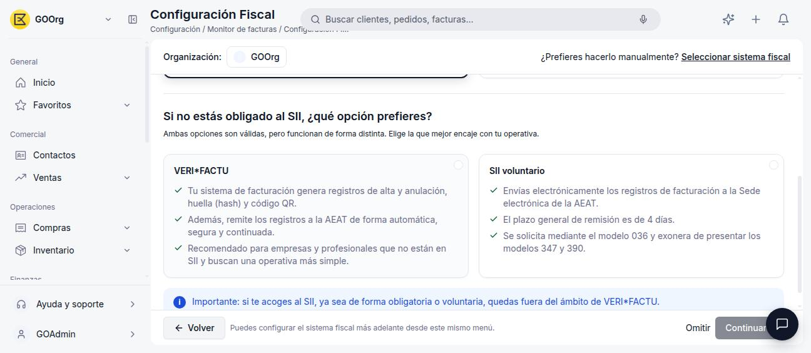
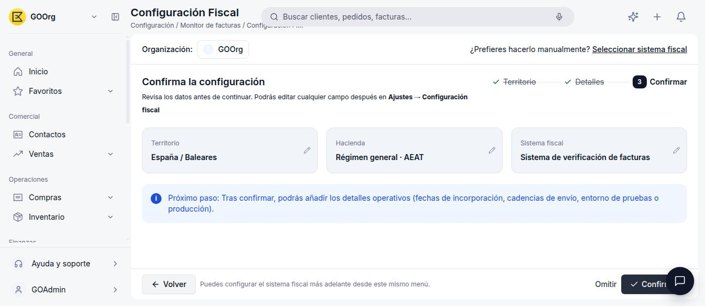

# VERI\*FACTU

**VERI\*FACTU** es el sistema de verificación de facturas: el propio software de facturación genera los registros de alta y anulación de cada factura, su huella (*hash*) y un código QR, y los remite a la AEAT de forma automática, segura y continuada. Es la alternativa al SII para organizaciones con domicilio fiscal en régimen común (España peninsular y Baleares), Canarias o Ceuta y Melilla que no están obligadas al SII.

!!! tip "¿No sabes qué sistema te corresponde?"
    Este artículo asume que ya sabes que VERI\*FACTU es tu sistema fiscal. Si todavía no lo activaste, empieza por [Cómo Activar un Modelo Tributario](../como-activar-un-modelo-tributario/como-activar-un-modelo-tributario.md), que te guía según tu territorio.

## Cuándo Elegir VERI\*FACTU

Si tu organización **no está obligada al SII** (no es Gran Empresa, no pertenece a un grupo de IVA y no está inscrita en REDEME), el asistente de Configuración Fiscal te deja elegir entre VERI\*FACTU y el SII voluntario:

<figure markdown="span">
  
  <figcaption>VERI*FACTU frente a SII voluntario: ambas opciones son válidas, pero funcionan de forma distinta.</figcaption>
</figure>

- **VERI\*FACTU** es la opción recomendada si buscas una operativa más simple: no tienes que remitir tú los registros, lo hace tu software de facturación de forma automática y continuada.
- **SII voluntario**, en cambio, exige enviar electrónicamente los registros a la AEAT en un plazo general de 4 días, se solicita mediante el modelo 036 y te exonera de presentar los modelos 347 y 390.

!!! warning "Son excluyentes"
    Si te acoges al SII, ya sea de forma obligatoria o voluntaria, quedas fuera del ámbito de VERI\*FACTU.

## Cómo Activarlo

1. Ve a **[Configuración > Configuración Fiscal](https://go.etendo.cloud/fiscal-config){target="_blank"}**.
2. Selecciona tu territorio: **España/Baleares**, **Canarias** o **Ceuta/Melilla**.
3. Cuando el asistente pregunte si estás obligada al SII, responde que **no**.
4. Elige **VERI\*FACTU** entre las dos opciones ofrecidas.
5. Revisa el resumen y pulsa **Confirmar**.

    <figure markdown="span">
      
      <figcaption>Resumen de confirmación: territorio España/Baleares, régimen general AEAT y sistema de verificación de facturas.</figcaption>
    </figure>

!!! info "Detalles operativos pendientes de documentar"
    Tras confirmar, Etendo Go permite completar detalles operativos adicionales (fechas, entorno de pruebas o producción). Este artículo se actualizará con esa configuración una vez validada contra una organización con VERI\*FACTU activo.

## Artículos Relacionados

- [Cómo Activar un Modelo Tributario](../como-activar-un-modelo-tributario/como-activar-un-modelo-tributario.md)
- [SII](../sii/sii.md)
- [TicketBAI](../ticketbai/ticketbai.md)
- [Glosario de Impuestos](../glosario-de-impuestos/glosario-de-impuestos.md)

---
Esta obra está bajo la licencia :material-creative-commons: :fontawesome-brands-creative-commons-by: :fontawesome-brands-creative-commons-sa: [CC BY-SA 2.5 ES](https://creativecommons.org/licenses/by-sa/2.5/es/){target="_blank"} de [Futit Services S.L](https://etendo.software){target="_blank"}.
