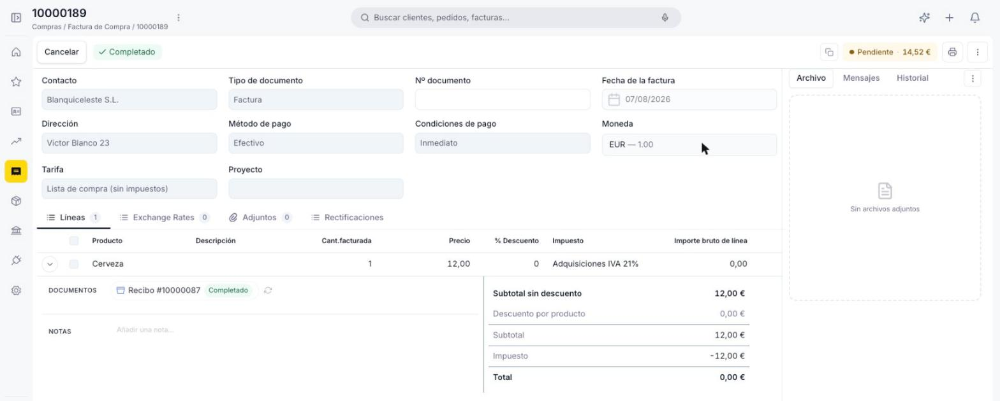
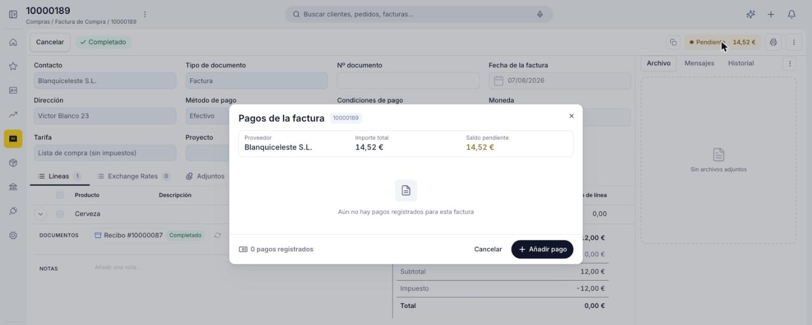
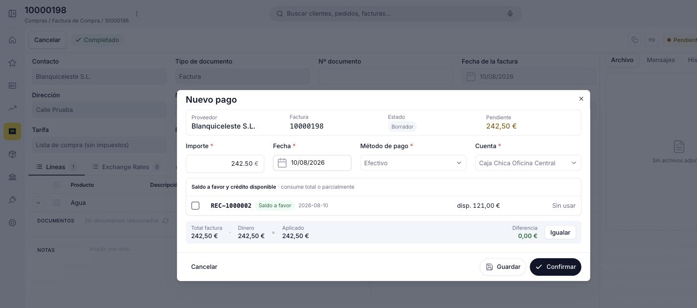
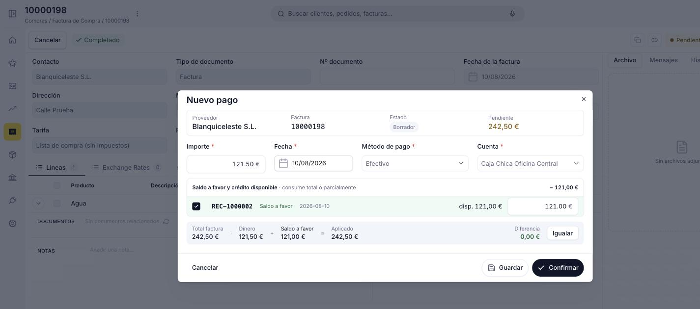
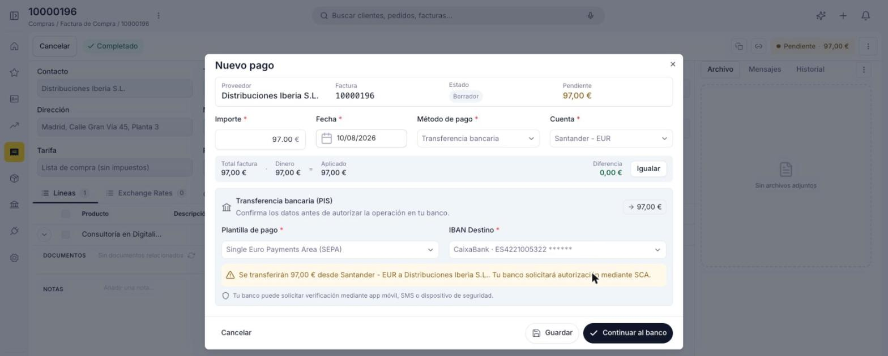
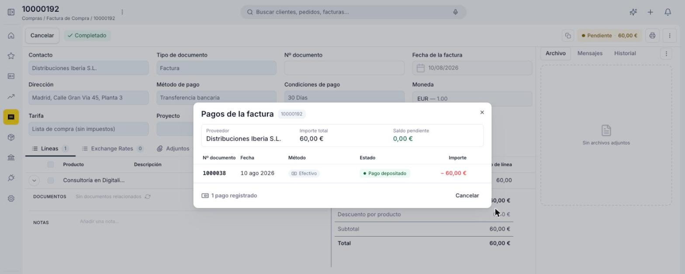
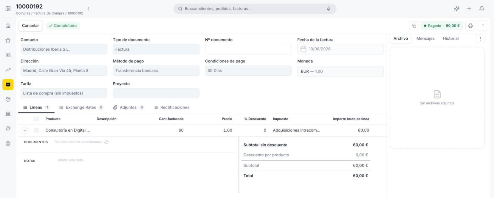

# Añadir pagos a tu factura de compra

Sigue esta guía cuando necesites registrar uno o varios pagos a un proveedor sobre una factura ya confirmada, y hacer seguimiento del importe pendiente hasta saldarla por completo.

**Antes de empezar**, necesitas una [factura de compra](../crear-una-factura-de-compra/crear-una-factura-de-compra.md) en estado **Completado**: mientras esté en Borrador, la opción de añadir pagos no está disponible.

## Registrar un pago

1. Abre la factura desde la vista lista o desde la vista detalle. En la cabecera del detalle, junto a los botones de cabecera, encuentras una etiqueta con el saldo pendiente de la factura, por ejemplo **Pendiente · 14,52 €**. Haz clic en esa etiqueta para gestionar los pagos.

    <figure markdown="span">
      
      <figcaption>La etiqueta Pendiente · 14,52 € en la cabecera del detalle da acceso a los pagos de la factura.</figcaption>
    </figure>

2. Se abre el modal **Pagos de la factura**. Si todavía no has registrado ningún pago, la lista aparece vacía y solo ves el botón **Añadir pago**.

    <figure markdown="span">
      
      <figcaption>Modal Pagos de la factura recién abierto, sin pagos registrados y con el botón Añadir pago.</figcaption>
    </figure>

3. Haz clic en **Añadir pago** para abrir el popup **Nuevo pago**. La cabecera del popup muestra cuatro datos de referencia:
    - **Proveedor** — el proveedor al que se le paga.
    - **Factura** — el número de la factura sobre la que se registra el pago.
    - **Estado** — el estado del propio pago que estás creando, no el de la factura. Este pago siempre empieza en Borrador y cambia de estado cuando lo confirmas; el estado de la factura (Completado) se muestra aparte, en la cabecera del detalle de la factura, y no cambia por este motivo.
    - **Pendiente** — el importe que todavía queda por pagar de la factura.

4. Completa los campos del pago:
    - **Importe** — por defecto, el importe total pendiente de la factura; editable para pagos parciales.
    - **Fecha** — por defecto la fecha actual.
    - **Método de pago** — heredado del proveedor; editable para este pago.
    - **Cuenta** — cuenta bancaria o de caja desde la que se realiza el pago; heredada de la configuración del proveedor, editable para este pago.
    - **Tasa de conversión** e **Importe en moneda de la cuenta** — solo aparecen si la factura está en una moneda distinta a la de la cuenta elegida; convierten el importe pagado a la moneda de esa cuenta.
    - Panel de conciliación **Total factura / Dinero / Aplicado / Diferencia** (o **Total factura / Dinero / Saldo a favor / Aplicado** si aplicas crédito disponible, ver más abajo) — muestra si el importe indicado cubre exactamente el total pendiente. El enlace **Igualar** ajusta el importe aplicado para que la diferencia quede en 0,00.

El resto del popup cambia según el **Método de pago** que elijas.

### Pago en efectivo

Si eliges una cuenta de tipo caja (por ejemplo *Caja Chica Oficina Central*), completa Importe, Fecha, Método de pago y Cuenta, revisa el panel de conciliación y confirma.

<figure markdown="span">
  
  <figcaption>Popup Nuevo pago con método Efectivo y cuenta Caja Chica Oficina Central, listo para confirmar.</figcaption>
</figure>

Haz clic en **Confirmar** para registrar el pago.

### Aplicar saldo a favor y crédito disponible

Si el proveedor tiene [facturas rectificativas](../crear-una-devolucion-de-compra/crear-una-devolucion-de-compra.md) con saldo a favor disponible, el popup muestra también la sección **Saldo a favor y crédito disponible**, con la lista de esos documentos (número, fecha e importe disponible). Esta sección puede aparecer tanto en un pago en efectivo como en uno por transferencia.

Marca el checkbox de uno o varios documentos para aplicar ese crédito al pago: puedes consumir el saldo disponible total o parcialmente. Al marcarlo, el importe que queda por pagar en efectivo o por transferencia (**Dinero**) se reduce en la misma medida, y el panel de conciliación pasa a mostrar Total factura = Dinero + Saldo a favor = Aplicado.

<figure markdown="span">
  
  <figcaption>Popup Nuevo pago con la factura rectificativa REC-1000002 (121,00 € disponibles) marcada: el Dinero a pagar en efectivo baja a 121,50 € y el panel de conciliación muestra Total factura = Dinero + Saldo a favor = Aplicado.</figcaption>
</figure>

Esto te permite combinar el crédito de una factura rectificativa con un pago en efectivo o por transferencia por el importe restante.

### Pago por transferencia bancaria

Al elegir **Transferencia bancaria**, el popup se comporta de una forma u otra según si la cuenta bancaria que eliges tiene o no una **conexión bancaria** activa en Etendo Go:

- **Cuenta sin conexión bancaria** — el pago ya lo hiciste por tu cuenta (por ejemplo, hiciste la transferencia desde la web o la app de tu banco) y en Etendo Go solo dejas constancia de que se realizó. El popup no añade ningún campo adicional: completa Importe, Fecha, Método de pago y Cuenta, revisa el panel de conciliación y confirma con el botón **Confirmar**, igual que en un pago en efectivo.
- **Cuenta con conexión bancaria** — Etendo Go puede iniciar la transferencia por ti, sin que la hagas primero por tu cuenta. En este caso el popup añade la sección **Transferencia bancaria** con estos campos:

    - **Plantilla de pago** — el estándar de transferencia a usar, por ejemplo *Single Euro Payments Area (SEPA)*, el formato europeo común para transferencias en euros.
    - **IBAN Destino** — la cuenta bancaria del proveedor a la que se transfiere el dinero.
    - Un aviso con el importe exacto que se transferirá, indicando que el banco solicitará una autorización mediante **SCA** (Autenticación Reforzada de Cliente): la verificación de seguridad adicional que piden los bancos, normalmente desde la app del banco o por SMS, antes de dar por buena la transferencia.

    <figure markdown="span">
      
      <figcaption>Popup Nuevo pago con la cuenta Santander - EUR (con conexión bancaria activa): sección Transferencia bancaria con plantilla SEPA, IBAN Destino y aviso de transferencia de 97,00 € con autorización SCA.</figcaption>
    </figure>

    En este caso, el botón final ya no es **Confirmar** sino **Continuar al banco**: al hacer clic, se inicia el proceso de autorización con tu banco.

## Efecto sobre la factura

Cada vez que confirmas un pago, el modal **Pagos de la factura** se actualiza: muestra el Proveedor, el Importe total, el Saldo pendiente y la lista de pagos ya registrados, con su número de documento, fecha, método, estado e importe. Cada pago tiene su propio estado, por ejemplo **Pago depositado**.

<figure markdown="span">
  
  <figcaption>Modal Pagos de la factura después de confirmar un pago en efectivo: el pago aparece con estado Pago depositado y el saldo pendiente queda en 0,00 €.</figcaption>
</figure>

Cuando el saldo pendiente llega a 0, la etiqueta de la cabecera de la factura cambia de **Pendiente · importe** a **Pagado**.

<figure markdown="span">
  
  <figcaption>Detalle de la factura de compra con la etiqueta Pagado · 60,00 € en la cabecera, tras completar el pago.</figcaption>
</figure>

!!! info "Pagos parciales"
    Puedes registrar varios pagos parciales hasta cubrir el total de la factura. El Saldo pendiente se reduce con cada pago confirmado, y puedes repetir el paso Añadir pago desde el modal Pagos de la factura tantas veces como necesites.

## Artículos Relacionados

- [Crear una factura de compra](../crear-una-factura-de-compra/crear-una-factura-de-compra.md)
- [Gestionar tus facturas de compra](../gestionar-tus-facturas-de-compra/gestionar-tus-facturas-de-compra.md)

---
Esta obra está bajo la licencia :material-creative-commons: :fontawesome-brands-creative-commons-by: :fontawesome-brands-creative-commons-sa: [CC BY-SA 2.5 ES](https://creativecommons.org/licenses/by-sa/2.5/es/){target="_blank"} de [Futit Services S.L](https://etendo.software){target="_blank"}.
