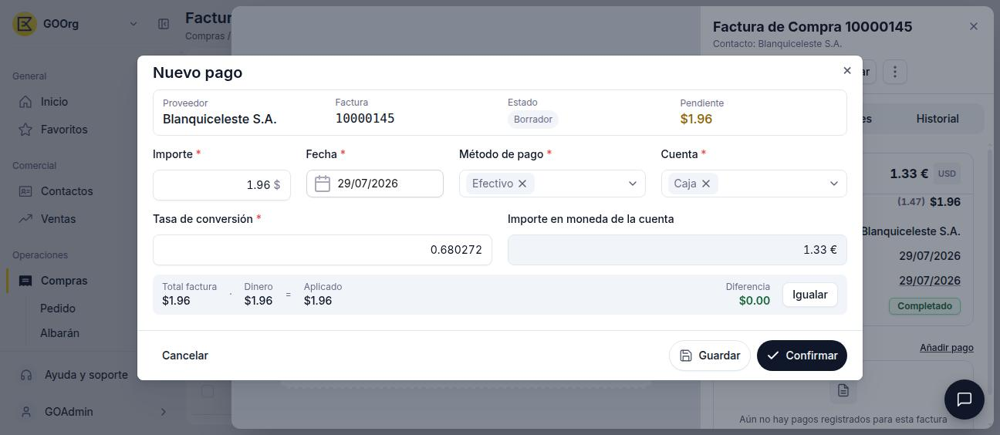
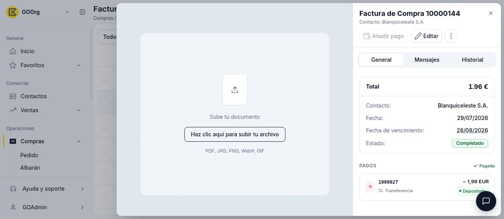

# Añadir pagos a tu factura de compra

Sigue esta guía cuando necesites registrar uno o varios pagos a un proveedor sobre una factura ya confirmada, y hacer seguimiento del importe pendiente hasta saldarla por completo.

**Antes de empezar**, necesitas una [factura de compra](../crear-una-factura-de-compra/crear-una-factura-de-compra.md) en estado **Completado**: mientras esté en Borrador, la opción de añadir pagos no está disponible.

## Registrar un pago

1. Abre la factura desde la vista lista o desde la vista detalle y haz clic en **Añadir pago** — disponible en la cabecera del panel de detalle y en la sección **PAGOS**, siempre que quede importe pendiente.
2. Completa el popup **Nuevo pago**:
    - **Importe** — por defecto, el importe total pendiente de la factura; editable para pagos parciales.
    - **Fecha** — por defecto la fecha actual.
    - **Método de pago** — heredado del proveedor; editable para este pago.
    - **Cuenta** — cuenta bancaria o de caja desde la que se realiza el pago.
    - **Tasa de conversión** e **Importe en moneda de la cuenta** — solo aparecen si la factura está en una moneda distinta a la de la cuenta elegida; convierten el importe pagado a la moneda de esa cuenta.
    - Panel de conciliación **Total factura / Dinero / Aplicado / Diferencia** — muestra si el importe indicado cubre exactamente el total pendiente. El enlace **Igualar** ajusta el importe aplicado para que la diferencia quede en 0.00.

    <figure markdown="span">
      
      <figcaption>Popup Nuevo pago sobre una factura en USD, con los campos Tasa de conversión e Importe en moneda de la cuenta visibles.</figcaption>
    </figure>

3. Usa **Guardar** para dejar el pago en Borrador, o **Confirmar** para registrarlo directamente.

## Efecto sobre la factura

Al confirmar el pago:

- La sección **PAGOS** muestra el pago registrado (número, método e importe) con su propio estado (por ejemplo, **Depositado**).
- Cuando el importe pagado cubre el total, la sección **PAGOS** muestra el indicador **Pagada** y el botón **Añadir pago** se deshabilita.

<figure markdown="span">
  
  <figcaption>Vista detalle de una factura pagada: la sección PAGOS muestra el indicador Pagada y el pago registrado.</figcaption>
</figure>

!!! info "Pagos parciales"
    Puedes registrar varios pagos parciales hasta cubrir el total de la factura. El importe **Pendiente** se reduce con cada pago confirmado, y puedes repetir el paso **Añadir pago** tantas veces como necesites.

## Artículos Relacionados

- [Crear una factura de compra](../crear-una-factura-de-compra/crear-una-factura-de-compra.md)
- [Gestionar tus facturas de compra](../gestionar-tus-facturas-de-compra/gestionar-tus-facturas-de-compra.md)

---
Esta obra está bajo la licencia :material-creative-commons: :fontawesome-brands-creative-commons-by: :fontawesome-brands-creative-commons-sa: [CC BY-SA 2.5 ES](https://creativecommons.org/licenses/by-sa/2.5/es/){target="_blank"} de [Futit Services S.L](https://etendo.software){target="_blank"}.
