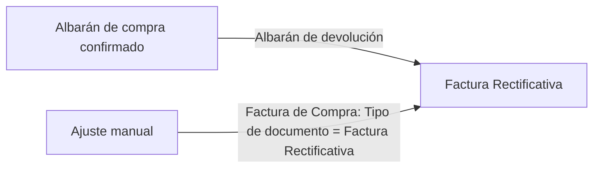
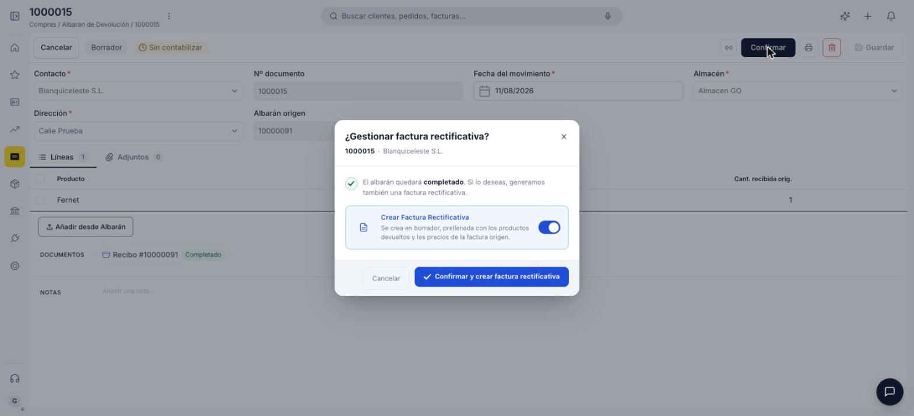
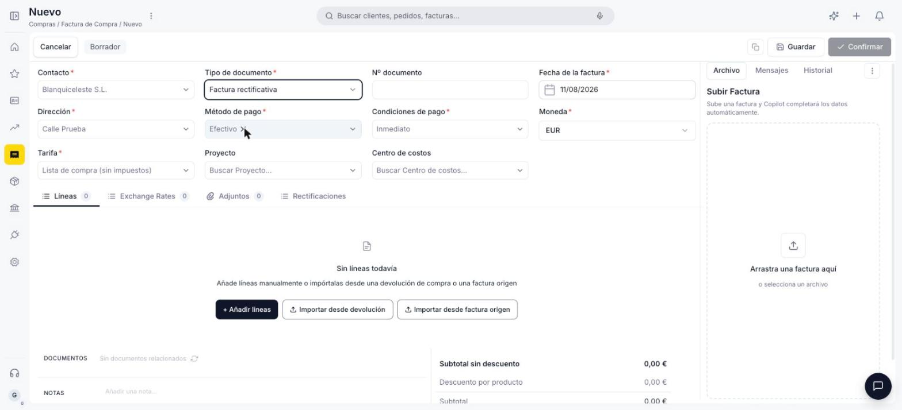

# Crear una devolución de compra

Sigue esta guía cuando necesites devolver mercancía a un proveedor o corregir el importe de una factura de compra ya emitida. Etendo Go distingue dos situaciones distintas, según si hay mercancía física de por medio o solo un ajuste económico:

- **Devolución física** — se registra un **Albarán de devolución**, vinculado a un albarán de compra (recepción) ya confirmado. Genera automáticamente la **Factura Rectificativa** correspondiente.
- **Ajuste financiero** — se crea directamente una **Factura Rectificativa** desde la ventana de Factura de Compra, sin devolver mercancía (por ejemplo, para corregir un precio o aplicar un descuento o bonificación del proveedor).

**Antes de empezar**, necesitas tener:

- Para una devolución física: un **albarán de compra (recepción)** ya confirmado, del que se vaya a devolver la mercancía.
- Para un ajuste financiero por importación: la **factura de origen** ya confirmada, si vas a crear la Factura Rectificativa importando sus líneas en vez de añadirlas manualmente.

---

## Registrar una devolución física

1. Accede a **[Compras > Albarán de devolución](https://go.etendo.cloud/return-to-vendor-shipment){target="_blank"}** y haz clic en **+ Nuevo albarán de devolución**.
2. Completa la cabecera: **Contacto** (proveedor), **Fecha del movimiento**, **Almacén** y **Dirección**.
3. En **Albarán origen**, selecciona el albarán de compra (recepción) del que se devuelve la mercancía — las líneas se importan desde ahí.
4. Ajusta las cantidades a devolver por línea si no se devuelve la totalidad de lo recibido.
5. Al confirmar el albarán de devolución aparece el popup **¿Gestionar factura rectificativa?** con la opción **Crear Factura Rectificativa** activada por defecto — genera una Factura Rectificativa en Borrador, prellenada con los productos devueltos y los precios de la factura de origen. Puedes desactivarla si no quieres generarla en este paso.

    <figure markdown="span">
      
      <figcaption>Popup mostrado al confirmar el albarán de devolución, con la opción Crear Factura Rectificativa activada por defecto.</figcaption>
    </figure>

## Crear un ajuste financiero (Factura Rectificativa manual)

1. Accede a **[Compras > Factura](https://go.etendo.cloud/purchase-invoice){target="_blank"}** y haz clic en **+ Nueva factura**.
2. En **Tipo de documento**, selecciona **Factura Rectificativa**. A diferencia de una Factura, aquí no puedes importar líneas desde un pedido ni desde un recibo — en cambio, puedes añadirlas manualmente, importarlas desde una devolución de compra ya confirmada, o importarlas desde la factura de origen (útil para corregir un precio o aplicar un descuento o bonificación sobre líneas ya facturadas).

    <figure markdown="span">
      
      <figcaption>Factura Rectificativa manual: mismos campos de cabecera que una factura, con Tipo de documento en Factura Rectificativa y las opciones para añadir líneas manualmente o importarlas desde una devolución de compra o desde la factura de origen.</figcaption>
    </figure>
3. Completa el resto de la cabecera igual que en una [factura de compra](../crear-una-factura-de-compra/crear-una-factura-de-compra.md): Contacto, Dirección, Método de pago, Condiciones de pago, Moneda y Tarifa.
4. Añade las líneas correspondientes al ajuste (precio, descuento o bonificación) y confirma el documento.

Una vez confirmada, la Factura Rectificativa queda como saldo a favor del proveedor (no se aplica automáticamente contra una factura puntual) — ver [Gestionar tus facturas de compra](../gestionar-tus-facturas-de-compra/gestionar-tus-facturas-de-compra.md) para el detalle de esa gestión.

## Artículos Relacionados

- [Crear una factura de compra](../crear-una-factura-de-compra/crear-una-factura-de-compra.md)
- [Gestionar tus facturas de compra](../gestionar-tus-facturas-de-compra/gestionar-tus-facturas-de-compra.md)

---
Esta obra está bajo la licencia :material-creative-commons: :fontawesome-brands-creative-commons-by: :fontawesome-brands-creative-commons-sa: [CC BY-SA 2.5 ES](https://creativecommons.org/licenses/by-sa/2.5/es/){target="_blank"} de [Futit Services S.L](https://etendo.software){target="_blank"}.
