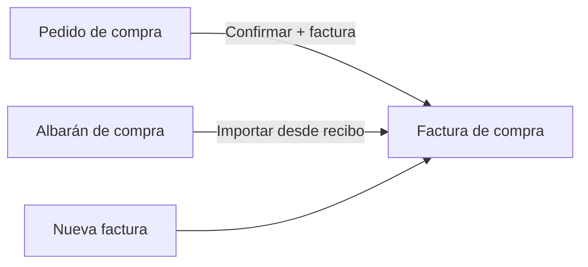
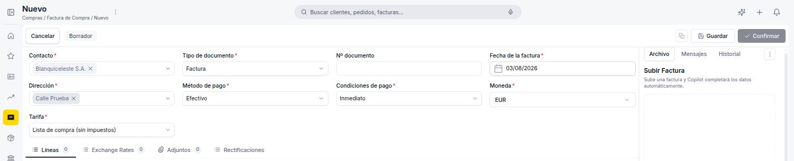
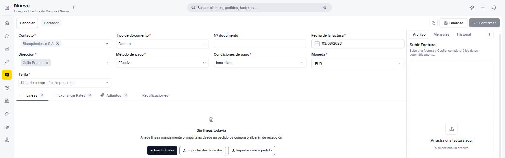
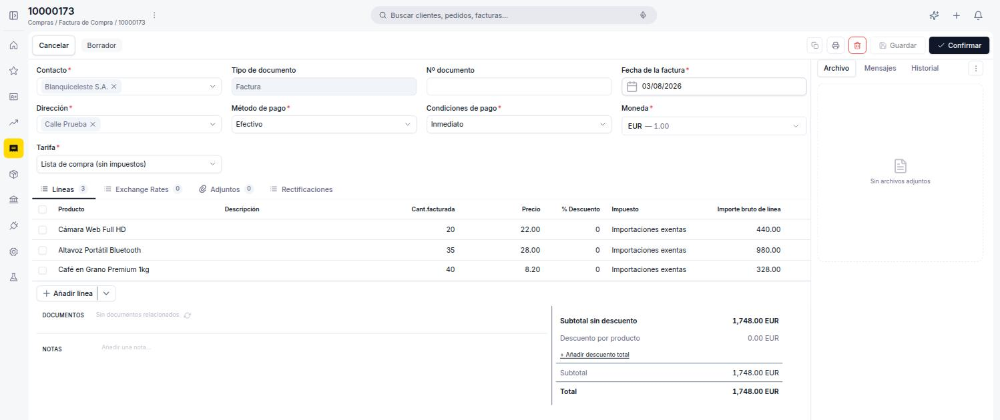

# Crear una factura de compra

Sigue esta guía cuando necesites registrar la obligación de pago a un proveedor: puedes crear la factura directamente desde cero, o generarla desde un [pedido de compra](../../inventario/gestionar-tus-pedidos-de-compra/gestionar-tus-pedidos-de-compra.md) o un albarán de compra ya confirmados.

**Antes de empezar**, necesitas tener cargado el [contacto](../../../comercial/contactos/que-es-la-seccion-contactos/que-es-la-seccion-contactos.md) del proveedor con el rol **Proveedor** activo y, al menos, una dirección marcada como dirección de facturación.

---

## Crear una factura desde cero

1. Accede a **[Compras > Factura](https://go.etendo.cloud/purchase-invoice){target="_blank"}** y haz clic en **+ Nueva factura**.
2. Completa la cabecera:
    - **Contacto** — proveedor que emite la factura. Al seleccionarlo, el sistema autocompleta **Dirección**, **Método de pago**, **Condiciones de pago**, **Tarifa** y **Moneda** configurados para ese proveedor.
    - **Tipo de documento** — *Factura* (compra estándar) o *Nota de crédito*. Ver [Crear una devolución de compra](../crear-una-devolucion-de-compra/crear-una-devolucion-de-compra.md) para este segundo caso. No es editable una vez guardado.
    - **Nº documento** — número de la factura del proveedor. Manual; puede dejarse en blanco si aún no lo tienes.
    - **Fecha de la factura** — por defecto la fecha actual; editable.
    - **Dirección**, **Método de pago**, **Condiciones de pago** — heredados del contacto; editables para este documento. Las condiciones de pago determinan la fecha de vencimiento calculada automáticamente.
    - **Moneda** — moneda del documento. Si difiere de la moneda de la empresa, aparece la pestaña **Exchange Rates** para gestionar el tipo de cambio.
    - **Tarifa** — lista de precios de compra aplicada; se carga desde el proveedor y es editable.

    <figure markdown="span">
      
      <figcaption>Cabecera de la factura con las pestañas Líneas, Exchange Rates, Adjuntos y Rectificaciones.</figcaption>
    </figure>

3. Sube el documento del proveedor en el panel **Archivo** (PDF, JPG, PNG, WebP o GIF).

    !!! info "Lectura automática con Copilot"
        Al subir el documento del proveedor, Copilot puede extraer automáticamente los datos clave — contacto, número de documento, fecha y líneas — y proponer el prellenado del formulario.

## Añadir las líneas

En la pestaña **Líneas** tienes tres formas de incorporar productos:

- **+ Añadir líneas** — agrega una línea vacía para completar manualmente: producto, cantidad facturada, precio, % de descuento e impuesto.
- **Importar desde recibo** — importa líneas desde un albarán de compra (recepción) existente del mismo proveedor.
- **Importar desde pedido** — importa líneas desde un pedido de compra confirmado del mismo proveedor.

<figure markdown="span">
  
  <figcaption>Cabecera ya completada y pestaña Líneas antes de añadir productos, con las opciones + Añadir líneas, Importar desde recibo e Importar desde pedido.</figcaption>
</figure>

Al seleccionar un producto se autocompletan su descripción, precio de tarifa e impuesto; los tres son editables por línea. La columna **Importe bruto de línea** se calcula automáticamente como precio × cantidad facturada, menos el descuento de línea aplicado (antes de impuesto). Para guardar una línea pulsa ++enter++ o haz clic fuera de la fila; para cancelar sin guardar, pulsa ++esc++.

### Totales, notas y documentos

El panel de totales muestra **Subtotal sin descuento**, **Descuento por producto**, **Subtotal**, **Impuesto** y **Total** (con la opción de añadir un descuento global vía **+ Añadir descuento total**). El campo **Notas** permite agregar observaciones internas que no se incluyen en el PDF, y la sección **Documentos** muestra el pedido o albarán de origen, cuando corresponda.

<figure markdown="span">
  
  <figcaption>Factura con varias líneas y cantidades — el panel de totales calcula el Subtotal y el Total a partir de todas las líneas.</figcaption>
</figure>

## Generar la factura desde un pedido de compra

Si el pedido ya está confirmado, no hace falta crear la factura desde cero: marca la opción **Crear factura** al confirmarlo (o desde el pedido ya confirmado) para generarla automáticamente en Borrador, con proveedor, dirección, condiciones de pago y líneas pendientes ya cargadas.

## Artículos Relacionados

- [¿Qué es la sección Compras?](../que-es-la-seccion-compras/que-es-la-seccion-compras.md)
- [Añadir pagos a tu factura de compra](../anadir-pagos-a-tu-factura-de-compra/anadir-pagos-a-tu-factura-de-compra.md)
- [Gestionar tus facturas de compra](../gestionar-tus-facturas-de-compra/gestionar-tus-facturas-de-compra.md)

---
Esta obra está bajo la licencia :material-creative-commons: :fontawesome-brands-creative-commons-by: :fontawesome-brands-creative-commons-sa: [CC BY-SA 2.5 ES](https://creativecommons.org/licenses/by-sa/2.5/es/){target="_blank"} de [Futit Services S.L](https://etendo.software){target="_blank"}.
