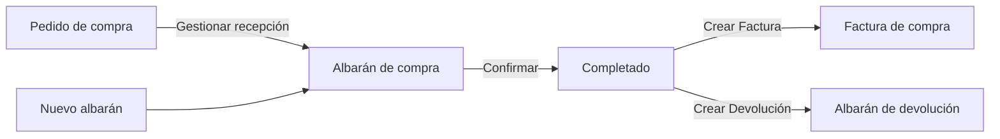
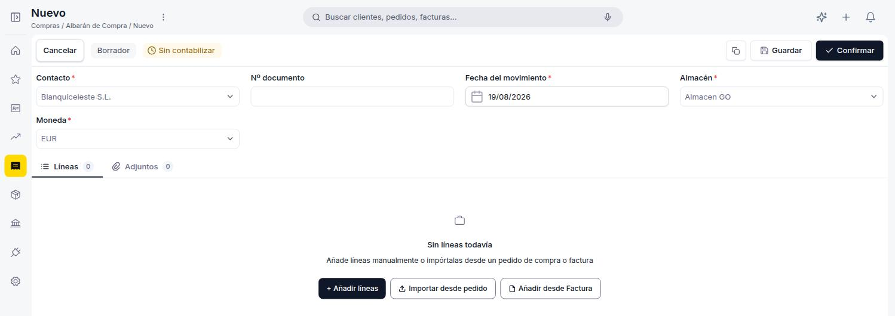
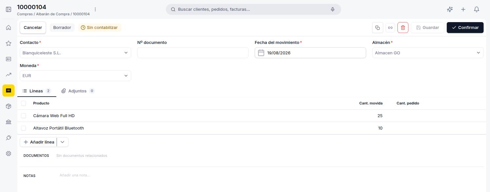
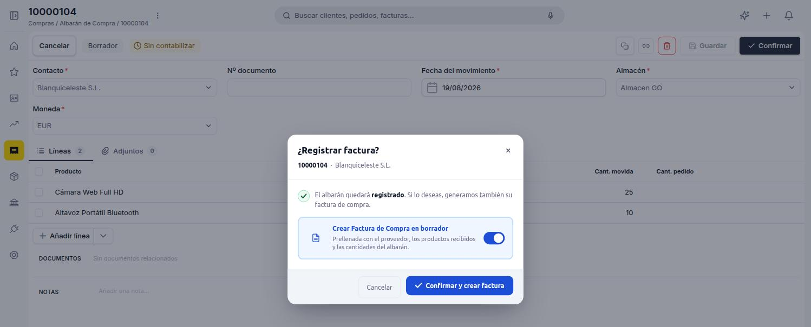
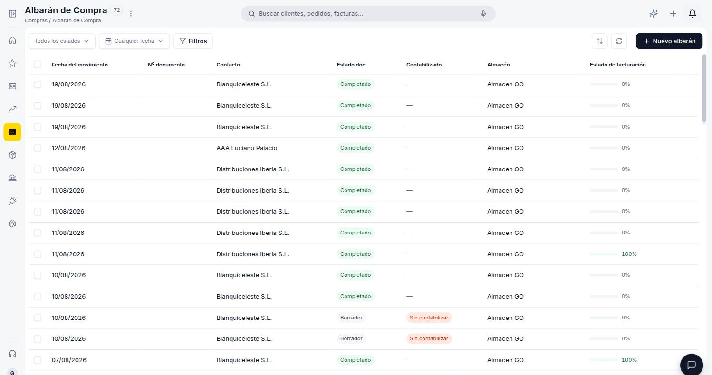
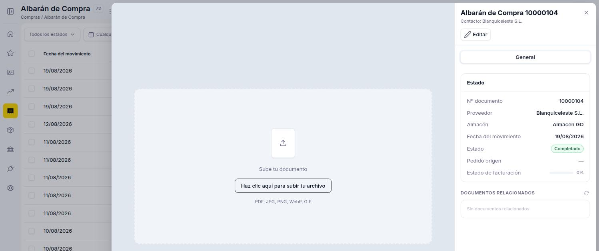
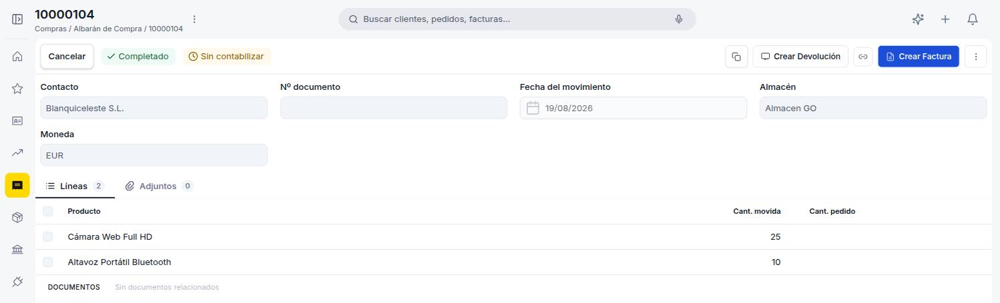

# Crear y gestionar albaranes de compra

## Descripción general

El **albarán de compra** registra la recepción física de mercancía de un proveedor. Puede generarse desde un [pedido de compra](../gestionar-tus-pedidos-de-compra/gestionar-tus-pedidos-de-compra.md#gestionar-recepcion-y-factura) confirmado — marcando la opción **Crear albarán de proveedor** en el popup de confirmación, o más adelante con el botón **Gestionar recepción y factura** del pedido — o crearse directamente desde la ventana **[Compras > Albarán](https://go.etendo.cloud/goods-receipt){target="_blank"}** con **+ Nuevo albarán**. Una vez completado, habilita la generación de la [factura de compra](../crear-una-factura-de-compra/crear-una-factura-de-compra.md) o de una devolución.

Este artículo se organiza en dos flujos: primero cómo **crear un albarán** y confirmarlo, y luego cómo **gestionarlo** — generar la factura o la devolución correspondiente.

---

## Crear un albarán

### 1. Empieza un albarán nuevo

Puedes generar el albarán desde un [pedido de compra](../gestionar-tus-pedidos-de-compra/gestionar-tus-pedidos-de-compra.md#gestionar-recepcion-y-factura) confirmado — marcando **Crear albarán de proveedor** en el popup de confirmación del pedido, o más adelante con el botón **Gestionar recepción y factura** — en cuyo caso el albarán hereda el contacto y las líneas pendientes del pedido de origen. Alternativamente, puedes crearlo directamente accediendo a **[Compras > Albarán](https://go.etendo.cloud/goods-receipt){target="_blank"}** y usando el botón **+ Nuevo albarán** en la esquina superior derecha.

### 2. Completa el formulario

<figure markdown="span">
  
  <figcaption>Cabecera del albarán con las opciones + Añadir líneas, Importar desde pedido y Añadir desde Factura.</figcaption>
</figure>

El formulario se abre al crear un albarán nuevo o al hacer clic en **Editar** desde la vista detalle.

**Cabecera**

- **Contacto** *(obligatorio)* — proveedor que envía la mercancía; se prellena desde el pedido de origen si el albarán se generó desde uno.
- **Nº documento** — número del albarán del proveedor. Manual; puede dejarse en blanco.
- **Fecha del movimiento** *(obligatorio)* — fecha real de la recepción; por defecto la fecha actual, editable.
- **Almacén** *(obligatorio)* — almacén donde se recibe la mercancía; se carga con tu almacén por defecto y es editable.
- **Moneda** *(obligatorio)* — moneda del documento.

**Pestaña Líneas**

En la pestaña Líneas tienes tres formas de incorporar productos: **+ Añadir líneas** agrega una línea vacía para completar manualmente (producto y cantidad recibida); **Importar desde pedido** abre un buscador de pedidos de compra confirmados del proveedor, con cada pedido expandible para elegir qué líneas y qué cantidad importar; y **Añadir desde Factura** importa líneas desde una factura de compra ya existente del mismo proveedor.

<figure markdown="span">
  
  <figcaption>Albarán en Borrador con dos líneas añadidas manualmente: Cámara Web Full HD y Altavoz Portátil Bluetooth.</figcaption>
</figure>

A diferencia de una factura o un pedido, las líneas del albarán solo registran **Producto**, **Cant. movida** (cantidad recibida) y, cuando la línea proviene de un pedido, **Cant. pedido** (cantidad original solicitada) — no incluyen precio ni impuesto, porque el albarán es un movimiento de stock, no un documento de cobro o pago.

Debajo de las líneas, la sección **DOCUMENTOS** muestra el pedido de origen como enlace navegable cuando corresponde, y el campo **NOTAS** permite añadir observaciones internas que no se incluyen en el PDF. El formulario incluye también una pestaña **Adjuntos**, para vincular archivos al albarán (PDF, Word, Excel, PowerPoint o imágenes).

### 3. Confirma el albarán

<figure markdown="span">
  
  <figcaption>Popup mostrado al confirmar el albarán, con la opción Crear Factura de Compra en borrador activada por defecto.</figcaption>
</figure>

Al hacer clic en **Confirmar**, el sistema muestra el popup **¿Registrar factura?** con la opción **Crear Factura de Compra en borrador** activada por defecto — genera una factura en Borrador prellenada con el proveedor, los productos recibidos y las cantidades del albarán. Puedes desactivarla si no quieres generarla en este paso; el botón cambia entonces de **Confirmar y crear factura** a **Confirmar albarán**.

!!! warning "El albarán no se puede editar tras confirmar"
    Una vez confirmado, el albarán queda bloqueado. Verifica el contacto, el almacén y las cantidades antes de confirmar.

---

## Gestionar albaranes

### 1. Busca el albarán

<figure markdown="span">
  
  <figcaption>Vista lista de Albarán de compra con columnas de estado y progreso de facturación.</figcaption>
</figure>

La vista lista de **[Compras > Albarán](https://go.etendo.cloud/goods-receipt){target="_blank"}** muestra las columnas **Fecha del movimiento**, **Nº documento**, **Contacto**, **Estado doc.**, **Contabilizado**, **Almacén** y **Estado de facturación** — esta última con una barra de progreso: verde cuando está al 100 %, naranja cuando es parcial y gris cuando no ha comenzado. Al pasar el cursor sobre una fila aparecen accesos rápidos para abrir el documento y clonarlo. Los selectores de **estado del documento** y **fecha** permiten filtrar la lista, y **Filtros** habilita condiciones adicionales.

### 2. Abre el albarán

<figure markdown="span">
  
  <figcaption>Vista detalle de un albarán completado sin factura generada todavía: Pedido origen y Documentos relacionados muestran "—" / vacío.</figcaption>
</figure>

Al hacer clic sobre un albarán existente en la lista se abre el panel de detalle, con la acción **Editar** en la cabecera. El panel muestra **Nº documento**, **Proveedor**, **Almacén**, **Fecha del movimiento**, **Estado** y **Estado de facturación** (el mismo indicador de progreso que en la vista lista); el campo **Pedido origen** enlaza al pedido de compra desde el que se generó el albarán y muestra "—" cuando el albarán se creó directamente o desde una factura, y la sección **DOCUMENTOS RELACIONADOS** muestra la factura generada a partir del albarán, cuando corresponde.

A la izquierda del panel, un área para **subir un documento** (PDF, JPG, PNG, WebP o GIF) permite adjuntar una copia del comprobante físico entregado por el proveedor, útil como respaldo del movimiento aunque no se haya cargado nada en la pestaña Adjuntos del formulario.

### 3. Genera la factura o la devolución

<figure markdown="span">
  
  <figcaption>Albarán en estado Completado, con las acciones Crear Devolución y Crear Factura disponibles en la cabecera.</figcaption>
</figure>

Si el albarán Completado todavía no tiene una factura asociada, la acción **Crear Factura** genera una [factura de compra](../crear-una-factura-de-compra/crear-una-factura-de-compra.md) en Borrador con el proveedor, los productos recibidos y las cantidades del albarán.

!!! info "El proveedor necesita una tarifa de compra para generar la factura"
    Si el proveedor no tiene una lista de precios de compra configurada, **Crear Factura** (o la opción del popup al confirmar) muestra un aviso y no genera el documento. Configura la tarifa del proveedor antes de intentarlo de nuevo.

La acción **Crear Devolución** genera un [albarán de devolución](../crear-una-devolucion-de-compra/crear-una-devolucion-de-compra.md) prellenado con el proveedor y las líneas del albarán.

Independientemente de estas acciones, usa **Contabilizar** (menú ⋮) cuando quieras registrar el movimiento contablemente — el badge **Contabilizado / Sin contabilizar** no cambia automáticamente al confirmar el albarán.

---

## Estados del Documento

| Estado | Descripción |
|---|---|
| Borrador | En preparación. El documento es completamente editable. |
| Completado | Confirmado. Ya no es editable. Puede facturarse o devolverse. |

---

## Acciones Disponibles

| Acción | Descripción | Estado |
| :--- | :--- | :--- |
| **Cancelar** | Descarta los cambios no guardados y vuelve a la lista. | Solo en Borrador |
| **Guardar** | Guarda el documento sin cambiar su estado. | Solo en Borrador |
| **Confirmar** | Confirma el albarán y lo pasa a estado Completado, con la opción de generar la factura en el mismo paso (ver [Confirma el albarán](#3-confirma-el-albaran)). | Solo en Borrador |
| **Crear Devolución** | Genera un [albarán de devolución](../crear-una-devolucion-de-compra/crear-una-devolucion-de-compra.md) prellenado con el proveedor y las líneas del albarán. | Solo en Completado |
| **Crear Factura** | Genera una [factura de compra](../crear-una-factura-de-compra/crear-una-factura-de-compra.md) en Borrador con el proveedor, los productos recibidos y las cantidades del albarán, cuando no se generó al confirmar. | Solo en Completado |
| **Clonar** | Crea un nuevo borrador con el mismo proveedor y líneas. | Borrador y Completado |
| **Descargar PDF** | Disponible en el menú ⋮. Descarga el documento en formato PDF. | Solo en Completado |
| **Contabilizar** | Disponible en el menú ⋮. Registra el movimiento contablemente. | Solo en Completado |
| **Eliminar** | Elimina el documento con confirmación previa. | Solo en Borrador |

## Artículos Relacionados

- [Gestionar tus pedidos de compra](../gestionar-tus-pedidos-de-compra/gestionar-tus-pedidos-de-compra.md)
- [Crear una factura de compra](../crear-una-factura-de-compra/crear-una-factura-de-compra.md)
- [Crear una devolución de compra](../crear-una-devolucion-de-compra/crear-una-devolucion-de-compra.md)

---
Esta obra está bajo la licencia :material-creative-commons: :fontawesome-brands-creative-commons-by: :fontawesome-brands-creative-commons-sa: [CC BY-SA 2.5 ES](https://creativecommons.org/licenses/by-sa/2.5/es/){target="_blank"} de [Futit Services S.L](https://etendo.software){target="_blank"}.
