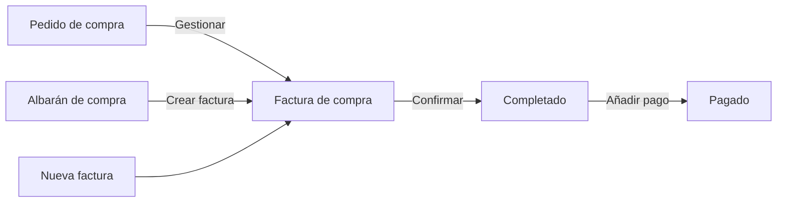
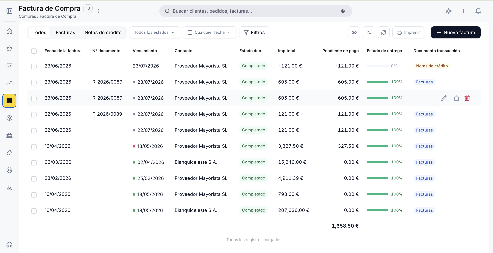
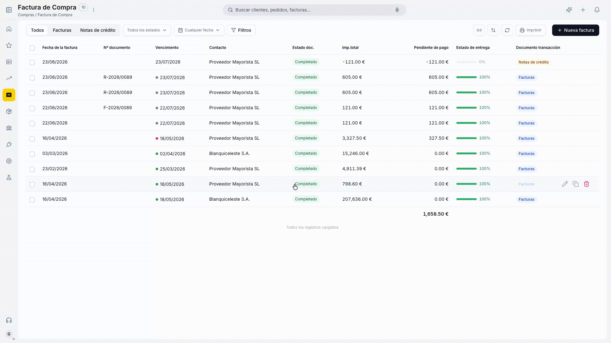
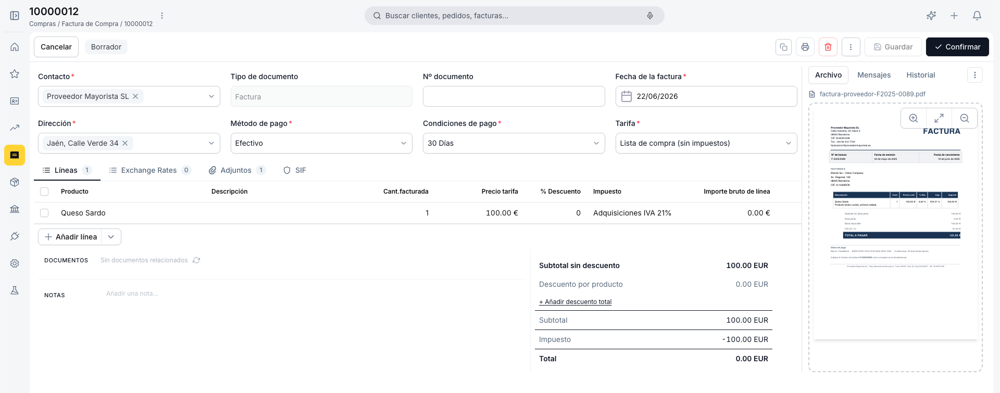
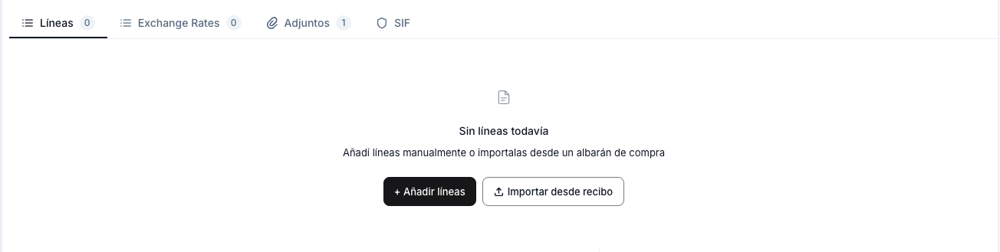
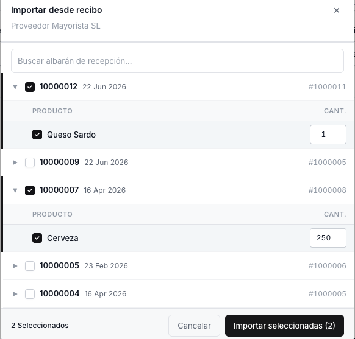
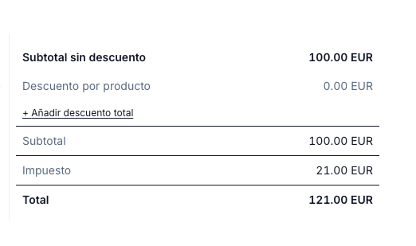
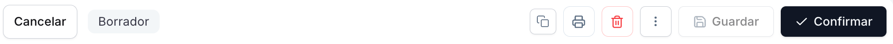
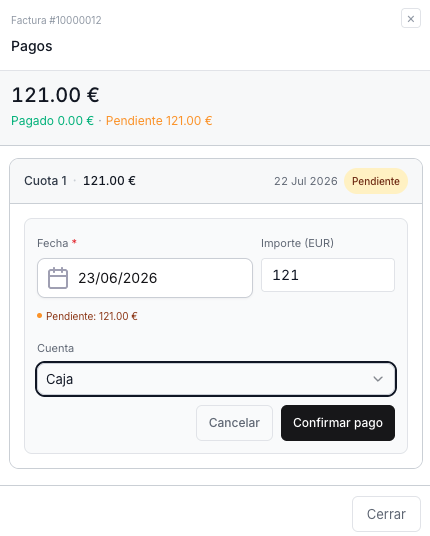

---
tags:
  - Factura de Compra
  - Compras
  - Operaciones
  - Gestión Documental
  - Etendo Go
---

# Factura de compra

## Descripción general

La **factura de compra** es el documento que registra la obligación de pago al proveedor. Puede crearse directamente, generarse desde un [pedido de compra](../pedido-de-compra/pedido-de-compra.md) confirmado o desde un albarán de compra confirmado. La misma ventana gestiona dos tipos de documento: **Factura** (compra estándar) y **Nota de crédito** (devolución o ajuste financiero del proveedor).

El siguiente diagrama muestra las tres vías para crear una factura de compra y su ciclo de vida hasta el pago:

---

## Vista Lista

<figure markdown="span">
  
  <figcaption>Vista lista de la Factura de compra con columnas de estado, vencimiento e importe pendiente.</figcaption>
</figure>

La vista lista muestra todas las facturas con las columnas **Fecha de la factura**, **Nº documento**, **Vencimiento**, **Contacto**, **Estado doc.**, **Imp. total**, **Pendiente de pago**, **Estado de entrega** y **Documento transacción**.

La barra superior incluye tabs para filtrar por tipo de documento: **Todos**, **Facturas** y **Notas de crédito**. Los selectores de **estado del documento** y **fecha de factura** permiten filtrar la lista. La columna **Vencimiento** muestra un punto de color según el estado de pago: verde cuando está pagada, naranja cuando vence pronto y rojo cuando está vencida con pago pendiente. Para crear una factura nueva usa el botón **+ Nueva factura** en la esquina superior derecha.

---

## Vista Detalle

<figure markdown="span">
  
  <figcaption>Vista detalle con el documento físico del proveedor y el panel lateral de información clave.</figcaption>
</figure>

Al hacer clic sobre una factura existente en la lista se abre la vista detalle. El lado izquierdo muestra el área de carga del documento físico del proveedor. El panel derecho muestra la información clave: total, contacto, fecha, fecha de vencimiento y estado.

Desde este panel puedes:

- **Añadir pago** — registra un pago total o parcial sobre la factura. Disponible en estado Completado cuando hay importe pendiente.
- **Editar** — abre el formulario completo para modificar el documento.

El panel también incluye la sección **PAGOS** con el historial de pagos registrados y el importe pendiente, y la sección **DOCUMENTOS RELACIONADOS** con el pedido y albarán de origen.

---

## Vista Formulario

<figure markdown="span">
  
  <figcaption>Formulario de creación y edición de la Factura de compra.</figcaption>
</figure>

El formulario se abre al crear una factura nueva o al hacer clic en **Editar** desde la vista detalle. El formulario tiene una disposición dividida en dos zonas: la zona de datos ocupa la parte principal y el panel **Archivo** permanece visible a la derecha para subir y consultar el documento físico del proveedor.

### Panel Archivo

El panel **Archivo** permite adjuntar el documento original del proveedor (PDF, JPG, PNG, WebP o GIF). Una vez subido, el documento queda vinculado a la factura y es accesible desde la vista detalle.

!!! info "Lectura automática con Copilot"
    Al subir el documento del proveedor, Copilot puede extraer automáticamente los datos clave — contacto, número de documento, fecha y líneas — y proponer el prellenado del formulario.

### Cabecera

- **Contacto** — proveedor que emite la factura. Al seleccionarlo, el sistema autocompleta la Dirección, el Método de pago, las Condiciones de pago y la Tarifa configurados para ese proveedor.
- **Tipo de documento** — determina si el documento es una *Factura* (compra estándar) o una *Nota de crédito* (devolución o ajuste). No es editable una vez guardado.
- **Nº documento** — número de la factura del proveedor. Se introduce manualmente; puede dejarse en blanco si no se dispone del número en el momento de la creación.
- **Fecha de la factura** — fecha de emisión de la factura del proveedor. Toma por defecto la fecha actual; editable.
- **Dirección** — cargada desde el contacto; editable para este documento.
- **Método de pago** — heredado del contacto; editable para este documento.
- **Condiciones de pago** — heredado del contacto; editable para este documento. Determina la fecha de vencimiento calculada automáticamente.
- **Tarifa** — lista de precios de compra aplicada. Se carga desde el proveedor y es editable.

!!! info "Nota de Crédito"

    Una **Nota de crédito** es un documento de crédito del proveedor que reduce el saldo pendiente de pago de una factura de compra. Se gestiona desde la misma ventana seleccionando *Nota de crédito* en el campo **Tipo de documento** al crear el documento.

    Se usa en dos situaciones:

    - **Devolución física** — generada automáticamente desde un albarán de devolución confirmado. Las líneas se precargan desde el albarán de devolución.
    - **Ajuste financiero** — creada manualmente para corregir errores de precio, aplicar descuentos o registrar bonificaciones del proveedor.

!!! tip "Campos autocargados desde el contacto"
    Al seleccionar el proveedor, el sistema carga automáticamente la dirección, el método de pago, las condiciones de pago y la tarifa. Todos son editables dentro de la factura sin afectar la configuración del proveedor.

### Pestaña Líneas

<figure markdown="span">
  
  <figcaption>Pestaña Líneas con los productos y servicios incluidos en la factura.</figcaption>
</figure>

Las líneas representan los productos o servicios incluidos en la factura. Usa el botón **+ Añadir línea** para incorporar una nueva línea manualmente. Al desplegar ese botón también puedes importar líneas desde un albarán de compra existente; se abre un popup con las líneas disponibles para seleccionar.

<figure markdown="span">
  
  <figcaption>Popup de selección de líneas desde un albarán de compra existente.</figcaption>
</figure>

- **Producto** — al seleccionarlo autocompleta la descripción, el precio de tarifa y el impuesto; editable.
- **Descripción** — precompletada desde el producto; editable por línea.
- **Cant. facturada** — cantidad del producto incluida en esta factura.
- **Precio tarifa** — precio del producto según la tarifa de la cabecera; editable.
- **% de descuento** — descuento aplicado sobre el precio de tarifa de la línea.
- **Impuesto** — tipo impositivo aplicable a la línea, heredado del producto.
- **Importe bruto de línea** — resultado de multiplicar el precio unitario por la cantidad, menos el descuento de línea aplicado.

Para guardar una línea pulsa ++enter++ o haz clic fuera de la fila. Para cancelar sin guardar, pulsa ++esc++.

#### Totales

<figure markdown="span">
  
  <figcaption>Panel de totales con desglose de subtotal, descuentos, impuesto e importe final.</figcaption>
</figure>

El panel de totales en la parte inferior derecha muestra:

- **Subtotal sin descuento** — suma del importe bruto de todas las líneas antes de descuentos.
- **Descuento por producto** — suma de los descuentos aplicados por línea.
- **Subtotal** — base imponible tras descuentos.
- **Impuesto** — importe de impuesto calculado según el tipo seleccionado en cada línea.
- **Total** — importe final a pagar al proveedor.

Puedes añadir un descuento global sobre el total del documento con el enlace **+ Añadir descuento total**.

#### Documentos Relacionados

La sección **DOCUMENTOS** muestra los documentos vinculados a la factura: el pedido de compra de origen y el albarán asociado. Cada documento es un enlace navegable.

#### Notas

El campo **NOTAS** permite añadir observaciones internas. Este contenido no se incluye en el PDF de la factura.

---

## Estados del Documento

El estado actual se muestra en la barra superior del formulario junto al botón **Cancelar**.

| Estado | Descripción |
|---|---|
| Borrador | En preparación. El documento es completamente editable. |
| Completado | Confirmada. Ya no es editable. Queda pendiente de pago al proveedor. |

!!! warning "La factura no se puede editar tras confirmar"
    Una vez confirmada, la factura queda bloqueada. Verifica los importes, el contacto y las condiciones de pago antes de confirmar. Para corregir errores en una factura completada, emite una Nota de crédito.

Cuando hay importe pendiente de pago, la barra superior del formulario muestra el indicador **Pendiente · EUR X** en naranja o rojo según si ha vencido.

---

## Acciones Disponibles

<figure markdown="span">
  
  <figcaption>Barra de acciones del formulario de la Factura de compra.</figcaption>
</figure>

La barra superior del formulario muestra las siguientes acciones:

| Acción | Descripción | Estado |
| :--- | :--- | :--- |
| **Cancelar** | Descarta los cambios no guardados y vuelve a la lista. | Solo en Borrador |
| **Guardar** | Guarda el documento sin cambiar su estado. | Solo en Borrador |
| **Confirmar** | Confirma la factura y la pasa a estado Completado. La acción es directa, sin popup de confirmación. | Solo en Borrador |
| **Copia** | Clona la factura actual creando un nuevo borrador con el mismo proveedor, líneas y condiciones. | Borrador y Completado |
| **Papelera** | Elimina el documento con confirmación previa. | Solo en Borrador |

### Añadir Pago

<figure markdown="span">
  
  <figcaption>Panel de registro de pago sobre la Factura de compra.</figcaption>
</figure>

El botón **Añadir pago** — disponible tanto en la vista detalle como en la barra del formulario en estado Completado — permite registrar un pago al proveedor. Indica el importe pagado, la fecha y el método de pago. El sistema actualiza automáticamente el importe **Pendiente de pago** en el panel lateral.

!!! info "Pagos parciales"
    Puedes registrar varios pagos parciales hasta cubrir el total de la factura. El indicador **Pendiente de pago** se reduce con cada pago registrado y desaparece cuando la factura queda completamente pagada.

---

## Artículos Relacionados

- [Pedido de compra](../pedido-de-compra/pedido-de-compra.md)
- [Contactos](../../../comercial/contactos/contactos.md)

---
This work is licensed under :material-creative-commons: :fontawesome-brands-creative-commons-by: :fontawesome-brands-creative-commons-sa: [ CC BY-SA 2.5 ES](https://creativecommons.org/licenses/by-sa/2.5/es/){target="_blank"} by [Futit Services S.L](https://etendo.software){target="_blank"}.
