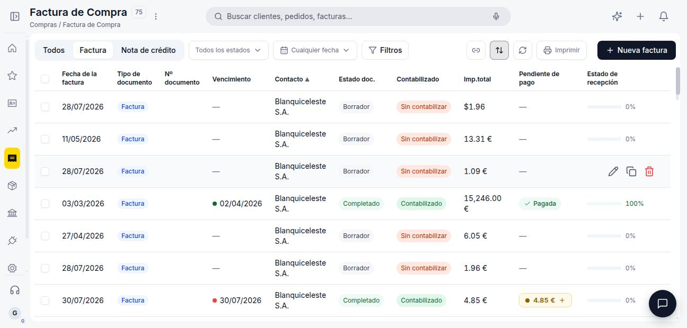
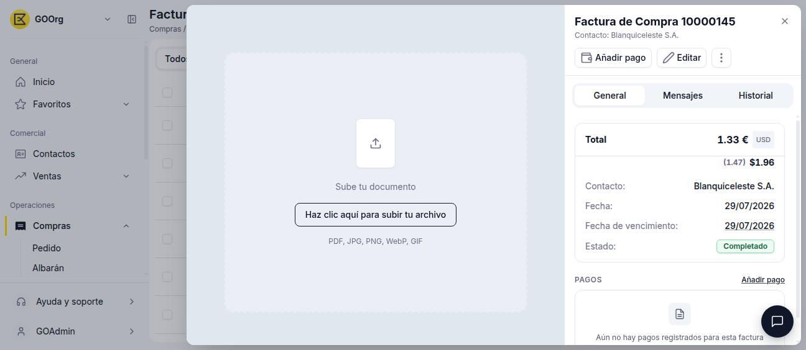
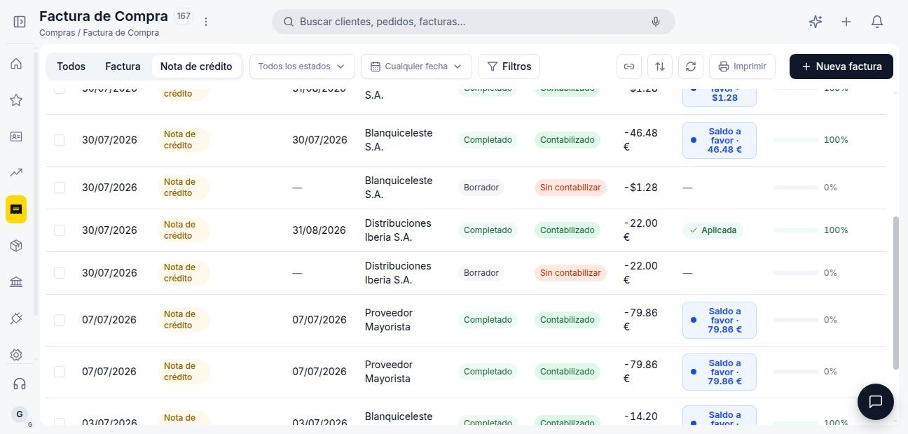

# Gestionar tus facturas de compra

Una vez que tienes facturas de compra cargadas, vas a necesitar consultarlas, editarlas o revisar su estado de pago. Este artículo repasa la ventana de **[Compras > Factura](https://go.etendo.cloud/purchase-invoice){target="_blank"}** — la vista lista, la vista detalle y la vista formulario. Si todavía no has creado ninguna, empieza por [Crear una factura de compra](../crear-una-factura-de-compra/crear-una-factura-de-compra.md).

## Vista Lista

<figure markdown="span">
  
  <figcaption>Vista lista de Factura de compra con columnas de estado, importe pendiente y estado de recepción.</figcaption>
</figure>

La vista lista muestra todas las facturas con las columnas **Fecha de la factura**, **Tipo de documento**, **Nº documento**, **Vencimiento**, **Contacto**, **Estado doc.**, **Contabilizado**, **Imp. total**, **Pendiente de pago** y **Estado de recepción**.

La barra superior incluye tabs para filtrar por tipo de documento: **Todos**, **Factura** y **Nota de crédito**. Los selectores de **estado del documento** y **fecha** permiten filtrar la lista, y **Filtros** habilita condiciones adicionales. Para crear una factura nueva usa **+ Nueva factura**.

La columna **Vencimiento** muestra un punto de color junto a la fecha según el estado de pago: verde cuando la factura está pagada, rojo cuando venció y sigue pendiente, ámbar cuando el vencimiento está próximo, y gris cuando queda pendiente pero el vencimiento todavía está lejos.

## Vista Detalle

<figure markdown="span">
  
  <figcaption>Vista detalle de una factura en moneda extranjera: el Total se muestra en la moneda de la empresa (EUR), con el importe original en la moneda del documento (USD) debajo.</figcaption>
</figure>

Al hacer clic sobre una factura existente en la lista se abre el panel de detalle, con las acciones **Añadir pago** y **Editar** en la cabecera. El panel muestra:

- **Total**, **Contacto**, **Fecha**, **Fecha de vencimiento** y **Estado**. Si la factura está en una moneda distinta a la de tu empresa, el Total se muestra en la moneda de tu empresa, con el importe original en la moneda del documento justo debajo entre paréntesis.
- Sección **PAGOS** — con el indicador **Pagada** cuando corresponde, el historial de pagos registrados (número, método, importe y su propio estado) y el acceso directo a **Añadir pago**. Ver [Añadir pagos a tu factura de compra](../anadir-pagos-a-tu-factura-de-compra/anadir-pagos-a-tu-factura-de-compra.md).
- Sección **DOCUMENTOS** — con el pedido y/o albarán de origen, cuando la factura se generó a partir de alguno de ellos.
- Pestañas **General**, **Mensajes** e **Historial**.

Desde el menú de opciones (⋮) de la cabecera puedes acceder a otras acciones sobre el documento (imprimir, eliminar, etc., según el estado).

## Vista Formulario

Al hacer clic en **Editar** se abre el formulario completo, con la cabecera (Contacto, Tipo de documento, Nº documento, Fecha, Dirección, Método de pago, Condiciones de pago, Moneda, Tarifa), las pestañas **Líneas**, **Exchange Rates**, **Adjuntos** y **Rectificaciones**, y el panel **Archivo / Mensajes / Historial**. Ver [Crear una factura de compra](../crear-una-factura-de-compra/crear-una-factura-de-compra.md) para el detalle de estos campos.

## Estados del Documento

| Estado | Descripción |
|---|---|
| Borrador | En preparación. El documento es completamente editable. |
| Completado | Confirmada. Ya no es editable. Queda pendiente de pago al proveedor hasta registrar los pagos correspondientes. |

!!! warning "La factura no se puede editar tras confirmar"
    Una vez confirmada, la factura queda bloqueada. Verifica los importes, el contacto y las condiciones de pago antes de confirmar. Para corregir errores en una factura completada, emite una Nota de crédito — ver [Crear una devolución de compra](../crear-una-devolucion-de-compra/crear-una-devolucion-de-compra.md).

En estado Completado, la barra superior del formulario muestra además un indicador con el importe: **Pendiente · [importe]** en ámbar mientras queda saldo por pagar, o **Pagado · [importe]** en verde una vez saldada. A diferencia del punto de color de la Vista Lista, este indicador no distingue si la factura está vencida — se mantiene en ámbar tanto si el vencimiento es próximo como si ya pasó.

## Gestionar Notas de crédito

Una Nota de crédito se gestiona desde la misma ventana y vista lista de **[Compras > Factura](https://go.etendo.cloud/purchase-invoice){target="_blank"}**, filtrando por el tab **Nota de crédito**. Al confirmarla, la columna **Pendiente de pago** muestra **Saldo a favor** por el importe de la nota, en vez de un importe pendiente: es un saldo a favor general del proveedor, no un descuento aplicado automáticamente a una factura puntual — se concilia por Contacto, no seleccionando una factura origen específica.

<figure markdown="span">
  
  <figcaption>Vista lista filtrada por el tab Nota de crédito: la columna Pendiente de pago muestra Saldo a favor en vez de un importe pendiente.</figcaption>
</figure>

## Acciones Disponibles

| Acción | Descripción | Estado |
| :--- | :--- | :--- |
| **Cancelar** | Descarta los cambios no guardados y vuelve a la lista. | Solo en Borrador |
| **Guardar** | Guarda el documento sin cambiar su estado. | Solo en Borrador |
| **Confirmar** | Confirma la factura y la pasa a estado Completado. | Solo en Borrador |
| **Clonar** | Crea un nuevo borrador con el mismo proveedor, líneas y condiciones. | Borrador y Completado |
| **Imprimir** | Descarga o imprime el documento. | Borrador y Completado |
| **Eliminar** | Elimina el documento con confirmación previa. | Solo en Borrador |

## Artículos Relacionados

- [Crear una factura de compra](../crear-una-factura-de-compra/crear-una-factura-de-compra.md)
- [Añadir pagos a tu factura de compra](../anadir-pagos-a-tu-factura-de-compra/anadir-pagos-a-tu-factura-de-compra.md)
- [Crear una devolución de compra](../crear-una-devolucion-de-compra/crear-una-devolucion-de-compra.md)

---
Esta obra está bajo la licencia :material-creative-commons: :fontawesome-brands-creative-commons-by: :fontawesome-brands-creative-commons-sa: [CC BY-SA 2.5 ES](https://creativecommons.org/licenses/by-sa/2.5/es/){target="_blank"} de [Futit Services S.L](https://etendo.software){target="_blank"}.
