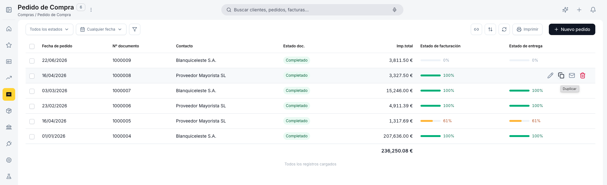

# Gestionar tus pedidos de compra

Una vez que tienes pedidos de compra cargados, vas a necesitar consultarlos, editarlos o generar los documentos que originan. Este artículo repasa la ventana de **[Compras > Pedido de Compra](https://go.etendo.cloud/purchase-order){target="_blank"}** — la vista lista, la vista detalle y las acciones disponibles. Si todavía no has creado ninguno, empieza por [Crear un pedido de compra](../crear-un-pedido-de-compra/crear-un-pedido-de-compra.md).

## Vista Lista

<figure markdown="span">
  
  <figcaption>Vista lista del Pedido de compra con columnas de estado, progreso de facturación y recepción.</figcaption>
</figure>

La vista lista muestra todos los pedidos con las columnas **Fecha de pedido**, **Nº documento**, **Contacto**, **Estado doc.**, **Imp. total**, **Estado de facturación** y **Estado de recepción**.

**Estado de facturación** y **Estado de recepción** indican qué parte del pedido ya se facturó o se recibió. Ambas columnas muestran barras de progreso con porcentaje: verde cuando está al 100 %, naranja cuando es parcial y gris cuando no ha comenzado.

Los selectores de **estado del documento** y **fecha de pedido**, en la barra superior, permiten filtrar la lista, y el ícono de embudo habilita filtros adicionales. El botón **+ Nuevo pedido**, en la esquina superior derecha, crea un pedido nuevo.

---

## Vista Detalle

<figure markdown="span">
  
  <figcaption>Vista detalle con previsualización del PDF y panel lateral de información clave.</figcaption>
</figure>

Al hacer clic sobre un pedido existente en la lista se abre la vista detalle. El centro muestra una previsualización del PDF y el panel derecho muestra la información clave: total, contacto, fecha, estado, y las barras de progreso de **Facturado** y **Entregado**.

Desde este panel puedes:

- **Enviar** — abre el panel de envío por email al proveedor. El destinatario y el asunto vienen precompletados con los datos del proveedor; si no tiene un email registrado, debes escribirlo manualmente antes de poder enviar. Desde el mismo panel también puedes usar **Descargar PDF** si prefieres enviarlo por otro medio o imprimirlo.
- **Descargar PDF** — descarga el pedido en formato PDF.
- **Editar** — abre el formulario completo. En Borrador es editable; en Completado se abre en solo lectura, ya que el pedido queda bloqueado tras confirmar (ver [Estados del Documento](#estados-del-documento)). Ver [Crear un pedido de compra](../crear-un-pedido-de-compra/crear-un-pedido-de-compra.md) para el detalle de estos campos.

El panel también incluye la sección **Emails** con el historial de correos enviados. Los albaranes y facturas generados a partir del pedido se consultan desde la sección **Documentos** de la vista formulario, no desde este panel de detalle.

---

## Estados del Documento

| Estado | Descripción |
|---|---|
| Borrador | En preparación. El documento es completamente editable. |
| Completado | Confirmado. Ya no es editable. Se puede gestionar la recepción y la factura. |

!!! warning "El pedido no se puede editar tras confirmar"
    Una vez confirmado, el pedido queda bloqueado. Verifica las líneas, cantidades y precios antes de confirmar.

---

## Acciones Disponibles

La barra superior del formulario muestra las siguientes acciones:

| Acción | Descripción | Estado |
| :--- | :--- | :--- |
| **Cancelar** | Cierra el formulario sin guardar los últimos cambios. El pedido no se elimina; sigue disponible en la lista en su último estado guardado. | Solo en Borrador |
| **Guardar** | Guarda el documento sin cambiar su estado. | Solo en Borrador |
| **Confirmar** | Confirma el pedido y lo pasa a [estado Completado](#estados-del-documento). | Solo en Borrador |
| **Copia** | Clona el pedido actual creando un nuevo borrador con el mismo proveedor, líneas y condiciones. | Borrador y Completado |
| **Email** | Abre el panel de envío por email. | Borrador y Completado |
| **Papelera** | Elimina el documento con confirmación previa. | Solo en Borrador |

### Gestionar Recepción y Factura

<figure markdown="span">
  
  <figcaption>Popup Gestionar documentos para generar albarán y factura desde el pedido confirmado.</figcaption>
</figure>

En estado Completado, el botón **Gestionar recepción y factura** abre el popup **Gestionar documentos**. El popup muestra el nombre del proveedor y el importe total del pedido, e indica el progreso de recepción y facturación de las líneas.

La sección **Generar documentos (opcional)** permite seleccionar qué documentos crear:

- **Crear albarán de proveedor** — genera un albarán de compra en estado Borrador con las unidades pendientes de recibir. El popup indica la cantidad pendiente (ej: *1 uds. pendientes de recibir*).
- **Crear factura** — genera una [factura de compra](../crear-una-factura-de-compra/crear-una-factura-de-compra.md) en estado Borrador con el importe pendiente de facturar (ej: *5.00 EUR pendientes de facturar*).

Puedes marcar uno, ambos o ninguno antes de pulsar **Crear →**. Si no marcas ninguno, el pedido permanece Completado y puedes generar los documentos más adelante.

!!! info "También puedes generarlos al confirmar"
    Este mismo popup —con las mismas opciones **Crear albarán de proveedor** y **Crear factura**— aparece automáticamente al pulsar **Confirmar** en un pedido nuevo. El botón **Gestionar recepción y factura** te permite volver a abrirlo más adelante si en ese momento no generaste los documentos.

!!! info "Cuándo desaparece el botón"
    Cuando los indicadores **Recibido** y **Facturado** alcanzan el 100 %, el botón **Gestionar recepción y factura** desaparece porque no quedan unidades ni importes pendientes.

!!! tip "Datos heredados en los documentos generados"
    El albarán y la factura creados desde el pedido heredan el contacto, la dirección, las condiciones de pago y las líneas pendientes.

---

## Artículos Relacionados

- [Crear un pedido de compra](../crear-un-pedido-de-compra/crear-un-pedido-de-compra.md)
- [Gestionar tus facturas de compra](../gestionar-tus-facturas-de-compra/gestionar-tus-facturas-de-compra.md)
- [Contactos](../../../comercial/contactos/que-es-la-seccion-contactos/que-es-la-seccion-contactos.md)

---
Esta obra está bajo la licencia :material-creative-commons: :fontawesome-brands-creative-commons-by: :fontawesome-brands-creative-commons-sa: [CC BY-SA 2.5 ES](https://creativecommons.org/licenses/by-sa/2.5/es/){target="_blank"} de [Futit Services S.L](https://etendo.software){target="_blank"}.
