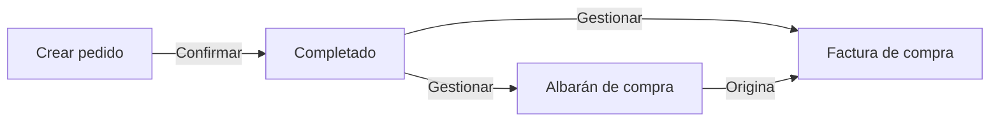
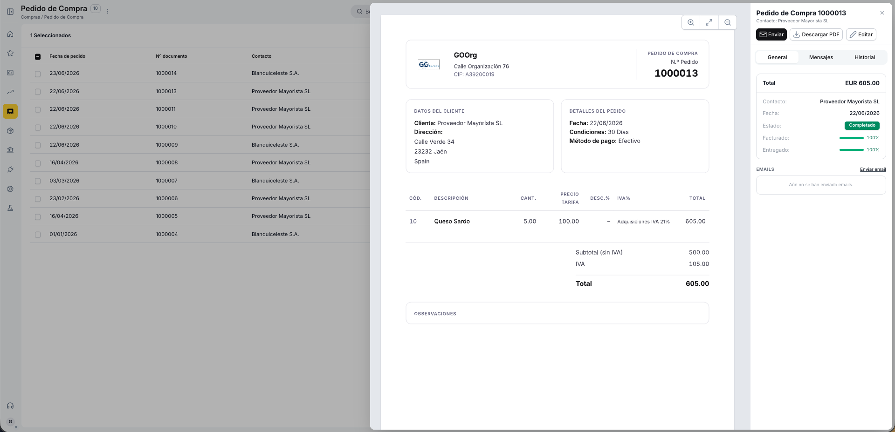
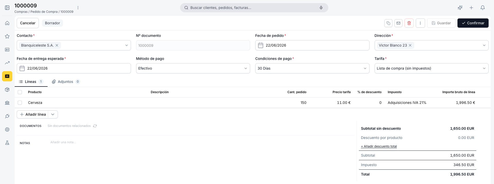
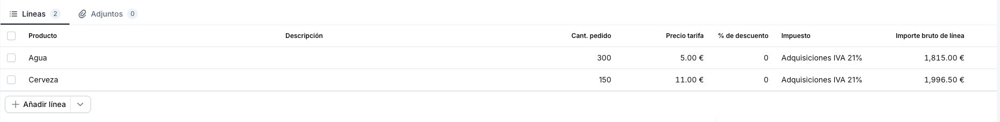
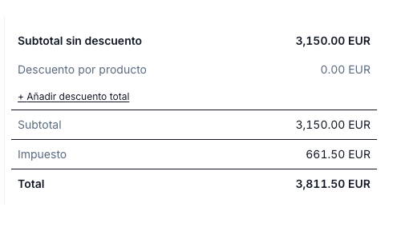
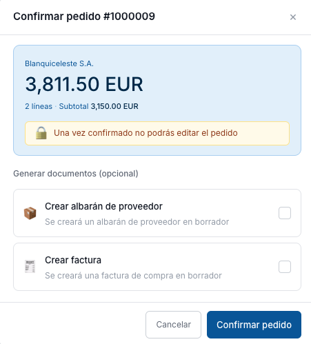

---
tags:
    - Pedido de Compra
    - Compras
    - Operaciones
    - Gestión Documental
    - Etendo Go
---

# Pedido de compra

## Descripción general

El **pedido de compra** es el documento que formaliza la solicitud de productos o servicios a un proveedor. Es el punto de entrada del ciclo de compras. Una vez confirmado, queda bloqueado y permite generar un albarán de recepción y una [factura de compra](../factura-de-compra/factura-de-compra.md).

---

## Vista Lista

<figure markdown="span">
  
  <figcaption>Vista lista del Pedido de compra con columnas de estado, progreso de facturación y entrega.</figcaption>
</figure>

La vista lista muestra todos los pedidos con las columnas **Fecha de pedido**, **Nº documento**, **Contacto**, **Estado doc.**, **Imp. total**, **Estado de facturación** y **Estado de entrega**.

**Estado de facturación** y **Estado de entrega** — indican qué porcentaje del pedido ya ha sido facturado o recibido. Ambas columnas muestran barras de progreso con porcentaje: verde cuando está al 100 %, naranja cuando es parcial y gris cuando no ha comenzado.

Para filtrar la lista utiliza los selectores de **estado del documento** y **fecha de pedido** en la barra superior. El ícono de embudo permite aplicar filtros adicionales. Para crear un pedido nuevo usa el botón **+ Nuevo pedido** en la esquina superior derecha.

---

## Vista Detalle

<figure markdown="span">
  
  <figcaption>Vista detalle con previsualización del PDF y panel lateral de información clave.</figcaption>
</figure>

Al hacer clic sobre un pedido existente en la lista se abre la vista detalle. El centro muestra una previsualización del PDF y el panel derecho muestra la información clave: total, contacto, fecha, estado, y las barras de progreso de **Facturado** y **Entregado**.

Desde este panel puedes:

- **Enviar** — abre el panel de envío por email al proveedor.
- **Descargar PDF** — descarga el pedido en formato PDF.
- **Editar** — abre el [formulario completo](#vista-formulario) para modificar el documento.

El panel también incluye la sección **Emails** con el historial de correos enviados, y la sección **Documentos relacionados** con los albaranes y facturas generados a partir del pedido.

---

## Vista Formulario

<figure markdown="span">
  
  <figcaption>Formulario de creación y edición del Pedido de compra.</figcaption>
</figure>

El formulario se abre al crear un pedido nuevo o al hacer clic en **Editar** desde la vista detalle.

### Cabecera

- **Contacto** — proveedor al que se dirige el pedido. Al seleccionarlo, el sistema autocompleta la **Dirección**, la **Tarifa**, el **Método de pago** y las **Condiciones de pago** configurados para ese proveedor.
- **Nº documento** — se genera automáticamente al confirmar el pedido.
- **Fecha de pedido** — toma por defecto la fecha actual; editable.
- **Dirección** — cargada desde el contacto; editable para este documento.
- **Fecha de entrega esperada** — fecha prevista de recepción de la mercancía. Campo exclusivo del pedido de compra.
- **Método de pago** — heredado del contacto; editable para este documento.
- **Condiciones de pago** — heredado del contacto; editable para este documento.
- **Tarifa** — lista de precios de compra que se aplica a las líneas del pedido. Por defecto se carga desde el proveedor.

!!! tip "Campos autocargados desde el contacto"
    Todos los campos cargados automáticamente al seleccionar el proveedor (dirección, tarifa, método de pago, condiciones de pago) son editables para este pedido sin afectar la configuración del proveedor.

### Pestaña Líneas

<figure markdown="span">
  
  <figcaption>Pestaña Líneas con los productos y servicios incluidos en el pedido.</figcaption>
</figure>

Las líneas representan los productos o servicios incluidos en el pedido. Usa el botón **+ Añadir línea** para incorporar una nueva línea.

- **Producto** — al seleccionarlo autocompleta la descripción, el precio de tarifa y el impuesto; editable si se necesita ajustar para este pedido.
- **Descripción** — precompletada desde el producto; editable por línea.
- **Cant. pedido** — cantidad solicitada al proveedor. Por defecto 1.
- **Precio tarifa** — precio del producto según la tarifa de compra; editable.
- **% de descuento** — descuento aplicado sobre el precio de tarifa de la línea.
- **Impuesto** — tipo impositivo aplicable a la línea, heredado del producto.
- **Importe bruto de línea** — resultado de multiplicar el **Precio tarifa** por la **Cant. pedido**, menos el descuento aplicado, más el impuesto de la línea.

Para guardar una línea pulsa ++enter++ o haz clic fuera de la fila. Para cancelar sin guardar, pulsa ++esc++.

### Totales

<figure markdown="span">
  
  <figcaption>Panel de totales con desglose de subtotal, descuentos, impuesto e importe final.</figcaption>
</figure>

El panel de totales en la parte inferior derecha muestra:

- **Subtotal sin descuento** — suma del importe bruto de todas las líneas antes de descuentos.
- **Descuento por producto** — suma de los descuentos aplicados por línea.
- **Subtotal** — base imponible tras descuentos.
- **Impuesto** — importe de impuesto calculado según el tipo seleccionado en cada línea.
- **Total** — importe final del pedido.

### Sección Documentos

La sección **Documentos** muestra los albaranes de compra y facturas de compra generados a partir de este pedido. Cada documento aparece como un enlace navegable con su número, estado e importe.

### Notas

El campo **Notas** permite añadir observaciones internas. Este contenido no se incluye en el PDF enviado al proveedor.

---

## Estados del Documento

La barra superior del formulario muestra el estado actual del pedido junto a los indicadores de entrega y facturación.

| Estado | Descripción |
|---|---|
| Borrador | En preparación. El documento es completamente editable. |
| Completado | Confirmado. Ya no es editable. Se puede gestionar la recepción y la factura. |

!!! warning "El pedido no se puede editar tras confirmar"
    Una vez confirmado, el pedido queda bloqueado. Verifica las líneas, cantidades y precios antes de confirmar.

---

## Acciones Disponibles

La barra superior del formulario muestra las siguientes acciones:

| Acción | Descripción | Estado |
| :--- | :--- | :--- |
| **Cancelar** | Cierra el formulario sin guardar los últimos cambios. El pedido no se elimina; sigue disponible en la lista en su último estado guardado. | Solo en Borrador |
| **Guardar** | Guarda el documento sin cambiar su estado. | Solo en Borrador |
| **Confirmar** | Confirma el pedido y lo pasa a [estado Completado](#estados-del-documento). | Solo en Borrador |
| **Copia** | Clona el pedido actual creando un nuevo borrador con el mismo proveedor, líneas y condiciones. | Borrador y Completado |
| **Email** | Abre el panel de envío por correo electrónico. | Solo en Completado |
| **Papelera** | Elimina el documento con confirmación previa. | Solo en Borrador |

### Gestionar Recepción y Factura

<figure markdown="span">
  
  <figcaption>Popup Gestionar documentos para generar albarán y factura desde el pedido confirmado.</figcaption>
</figure>

En estado Completado, el botón **Gestionar recepción y factura** abre el popup **Gestionar documentos**. El popup muestra el nombre del proveedor y el importe total del pedido, e indica el progreso de recepción y facturación de las líneas.

La sección **Generar documentos (opcional)** permite seleccionar qué documentos crear:

- **Crear albarán de proveedor** — genera un albarán de compra en estado Borrador con las unidades pendientes de recibir. El popup indica el progreso actual (ej: *Recibido: 20 / 33 uds. · 13 pendientes*).
- **Crear factura** — genera una [factura de compra](../factura-de-compra/factura-de-compra.md) en estado Borrador con el importe pendiente de facturar (ej: *Facturado: 798.60 EUR · 519.09 EUR pendientes*).

Puedes marcar uno, ambos o ninguno antes de pulsar **Crear →**. Si no marcas ninguno, el pedido permanece Completado y puedes generar los documentos más adelante.

!!! info "Cuándo desaparece el botón"
    Cuando los indicadores **Recibido** y **Facturado** alcanzan el 100 %, el botón **Gestionar recepción y factura** desaparece porque no quedan unidades ni importes pendientes.

!!! tip "Datos heredados en los documentos generados"
    El albarán y la factura creados desde el pedido heredan el contacto, la dirección, las condiciones de pago y las líneas pendientes.

---

## Artículos Relacionados

- [Factura de compra](../factura-de-compra/factura-de-compra.md)
- [Contactos](../../../comercial/contactos/que-es-la-seccion-contactos/que-es-la-seccion-contactos.md)

---
Esta obra está bajo la licencia :material-creative-commons: :fontawesome-brands-creative-commons-by: :fontawesome-brands-creative-commons-sa: [CC BY-SA 2.5 ES](https://creativecommons.org/licenses/by-sa/2.5/es/){target="_blank"} de [Futit Services S.L](https://etendo.software){target="_blank"}.
