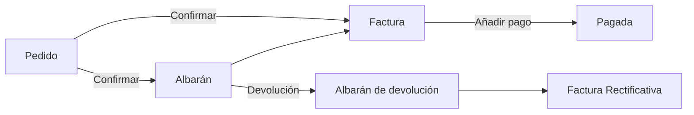

# ¿Qué es la sección Compras?

La sección **Compras**, dentro de **Operaciones**, reúne los documentos con los que gestionas el ciclo completo con tus proveedores: desde que pides mercancía o servicios hasta que pagas la factura correspondiente. Tenerla al día te permite saber en todo momento qué pediste, qué recibiste, qué te queda por pagar y qué proveedores tienen saldo pendiente a tu favor.

## Los documentos de Compras

- **Pedido** — formaliza la solicitud de productos o servicios a un proveedor. Es el punto de entrada del ciclo de compras y dispara el movimiento de stock esperado. Ver [Gestionar tus pedidos de compra](../gestionar-tus-pedidos-de-compra/gestionar-tus-pedidos-de-compra.md).
- **Albarán** — registra la recepción física de la mercancía pedida a un proveedor. Ver [Crear y gestionar albaranes de compra](../crear-y-gestionar-albaranes-de-compra/crear-y-gestionar-albaranes-de-compra.md).
- **Factura** — registra la obligación de pago al proveedor. Puede crearse directamente o generarse desde un pedido o un albarán confirmado.
- **Albarán de devolución** — registra la devolución física de mercancía ya recibida a un proveedor, y genera automáticamente la Factura Rectificativa correspondiente.
- **Factura Rectificativa** — corrige el importe de una factura de compra a partir de una devolución de mercancía ya recibida.

Estos cinco documentos se relacionan entre sí: un pedido confirmado puede generar un albarán y/o una factura. Un albarán ya recibido puede devolverse mediante un albarán de devolución, que a su vez genera una Factura Rectificativa correspondiente. Cada documento queda enlazado al que le dio origen, así que en cualquier momento puedes navegar de uno a otro para seguir el rastro completo de una compra.

## Dónde lo vas a usar

- **Al pedir mercancía o un servicio a un proveedor** — creas un pedido de compra, que después puedes confirmar para generar el albarán de recepción y la factura correspondiente. Ver [Crear un pedido de compra](../crear-un-pedido-de-compra/crear-un-pedido-de-compra.md).
- **Al recibir la factura del proveedor** — la cargas o la generas desde el pedido, y haces seguimiento del pago hasta saldarla. Ver [Crear una factura de compra](../crear-una-factura-de-compra/crear-una-factura-de-compra.md).
- **Al devolver mercancía o corregir un importe ya facturado** — registras una devolución de compra. Ver [Crear una devolución de compra](../crear-una-devolucion-de-compra/crear-una-devolucion-de-compra.md).

Para crear cualquiera de estos documentos necesitas tener cargado el [contacto](../../../comercial/contactos/que-es-la-seccion-contactos/que-es-la-seccion-contactos.md) del proveedor, con el rol **Proveedor** activo. Con el proveedor ya cargado, ya puedes avanzar a crear tu primer pedido o registrar directamente tu primera factura de compra.

## Recursos y próximos pasos

- [Crear un pedido de compra](../crear-un-pedido-de-compra/crear-un-pedido-de-compra.md)
- [Crear y gestionar albaranes de compra](../crear-y-gestionar-albaranes-de-compra/crear-y-gestionar-albaranes-de-compra.md)
- [Crear una factura de compra](../crear-una-factura-de-compra/crear-una-factura-de-compra.md)
- [Añadir pagos a tu factura de compra](../anadir-pagos-a-tu-factura-de-compra/anadir-pagos-a-tu-factura-de-compra.md)
- [Gestionar tus facturas de compra](../gestionar-tus-facturas-de-compra/gestionar-tus-facturas-de-compra.md)
- [Crear una devolución de compra](../crear-una-devolucion-de-compra/crear-una-devolucion-de-compra.md)

Empieza por el documento que necesites en este momento — no hace falta seguir un orden estricto entre pedido, albarán y factura.

## Artículos relacionados

- [¿Qué es la sección Contactos?](../../../comercial/contactos/que-es-la-seccion-contactos/que-es-la-seccion-contactos.md)
- [¿Qué es la sección Inventario?](../../inventario/que-es-inventario/que-es-inventario.md)

---
Esta obra está bajo la licencia :material-creative-commons: :fontawesome-brands-creative-commons-by: :fontawesome-brands-creative-commons-sa: [CC BY-SA 2.5 ES](https://creativecommons.org/licenses/by-sa/2.5/es/){target="_blank"} de [Futit Services S.L](https://etendo.software){target="_blank"}.
