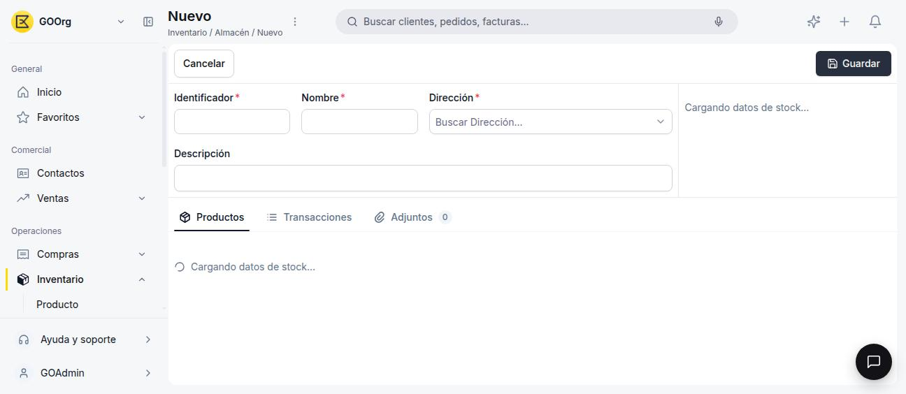
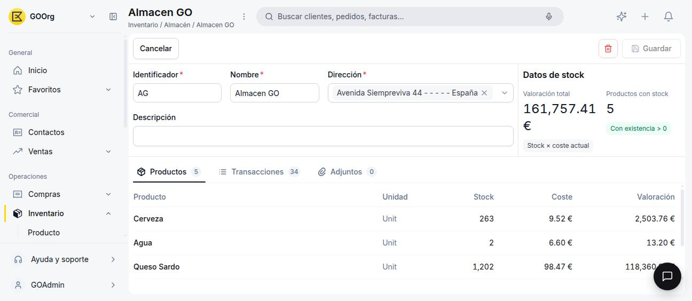

---
tags:
    - Almacén
    - Inventario
    - Etendo Go
---

# Cómo crear un almacén

Este artículo cubre cómo dar de alta un almacén nuevo en Etendo Go.

## Ve a la ventana Almacén

Ve a **Inventario > Almacén** y haz clic en **+ Nuevo almacén**.

## Completa el formulario

| Campo | Obligatorio | Notas |
| :--- | :---: | :--- |
| **Nombre** | Sí | Nombre descriptivo del almacén. |
| **Identificador** | Sí | Código único. Ej. `ALM-01`. |
| **Dirección** | Sí | Selector buscable ("Buscar Dirección...") sobre las direcciones ya existentes en tu organización. No permite cargar una dirección nueva desde acá: si la que necesitas todavía no existe como registro, primero tienes que darla de alta en otra parte del sistema. |
| **Descripción** | No | Observaciones internas. |

<figure markdown="span">
  
  <figcaption>Formulario de un almacén nuevo, con los datos de stock todavía cargando.</figcaption>
</figure>

Cuando termines de completar el formulario, haz clic en **Guardar**.

!!! info "Los datos de stock aparecen después de guardar"
    Hasta que el almacén no esté guardado, el panel de datos de stock y la pestaña Productos muestran "Cargando datos de stock...". Una vez guardado, vas a poder ver ahí el stock y la valoración de cada producto en este almacén.

<figure markdown="span">
  
  <figcaption>Ficha de un almacén guardado, con Valoración total, Productos con stock y la pestaña Productos poblada.</figcaption>
</figure>

Al guardar, el almacén queda disponible para asignarle stock desde compras, ajustes de inventario o movimientos entre almacenes.

---

## Artículos Relacionados

- [¿Qué es la sección Almacén?](../index.md)
- [¿Qué es la sección de Productos?](../../productos/index.md)
- [¿Qué es la sección Inventario?](../../que-es-inventario/que-es-inventario.md)

---
Esta obra está bajo la licencia :material-creative-commons: :fontawesome-brands-creative-commons-by: :fontawesome-brands-creative-commons-sa: [CC BY-SA 2.5 ES](https://creativecommons.org/licenses/by-sa/2.5/es/){target="_blank"} de [Futit Services S.L](https://etendo.software){target="_blank"}.
