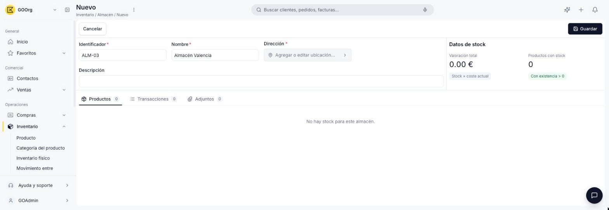
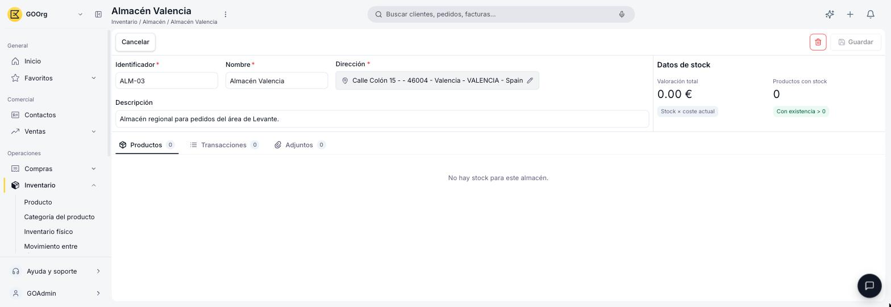

---
tags:
    - Almacén
    - Inventario
    - Etendo Go
---

# Crear un almacén

Este artículo cubre cómo dar de alta un almacén nuevo en Etendo Go.

## Ve a la ventana Almacén

Ve a **[Inventario > Almacén](https://go.etendo.cloud/warehouse){target="_blank"}** y haz clic en **+ Nuevo almacén**.

## Completa el formulario

- **Nombre** *(obligatorio)* — Nombre descriptivo del almacén.
- **Identificador** *(obligatorio)* — Código único. Ej. `ALM-01`.
- **Dirección** *(obligatorio)* — Al hacer clic se abre el modal **Ubicación**, donde completas **Primera línea**, **Segunda línea**, **Código postal**, **Ciudad**, **País** y **Región** para dar de alta la dirección del almacén.
- **Descripción** *(opcional)* — Observaciones internas.

<figure markdown="span">
  
  <figcaption>Formulario de un almacén nuevo, todavía sin datos de stock.</figcaption>
</figure>

Cuando termines de completar el formulario, haz clic en **Guardar**.

!!! info "Los datos de stock aparecen después de guardar"
    Hasta que el almacén no esté guardado, el panel de datos de stock muestra $0,00 y 0 productos, la pestaña Productos muestra "No hay stock para este almacén" y la pestaña Transacciones muestra "No se encontraron transacciones para este almacén". Una vez guardado y con movimientos, vas a poder ver ahí el stock y la valoración de cada producto en este almacén.

<figure markdown="span">
  
  <figcaption>Ficha de un almacén recién guardado, todavía sin movimientos de stock.</figcaption>
</figure>

Al guardar, el almacén queda disponible para cargarle stock. Podés hacerlo de dos formas: con un recuento desde la ventana **Inventario físico**, o registrando compras a proveedores — el stock se suma al completar el albarán de compra correspondiente.

---

## Artículos Relacionados

- [¿Qué es la sección Almacén?](../index.md)
- [¿Qué es la sección de Productos?](../../productos/index.md)
- [¿Qué es la sección Inventario?](../../que-es-inventario/que-es-inventario.md)

---
Esta obra está bajo la licencia :material-creative-commons: :fontawesome-brands-creative-commons-by: :fontawesome-brands-creative-commons-sa: [CC BY-SA 2.5 ES](https://creativecommons.org/licenses/by-sa/2.5/es/){target="_blank"} de [Futit Services S.L](https://etendo.software){target="_blank"}.
