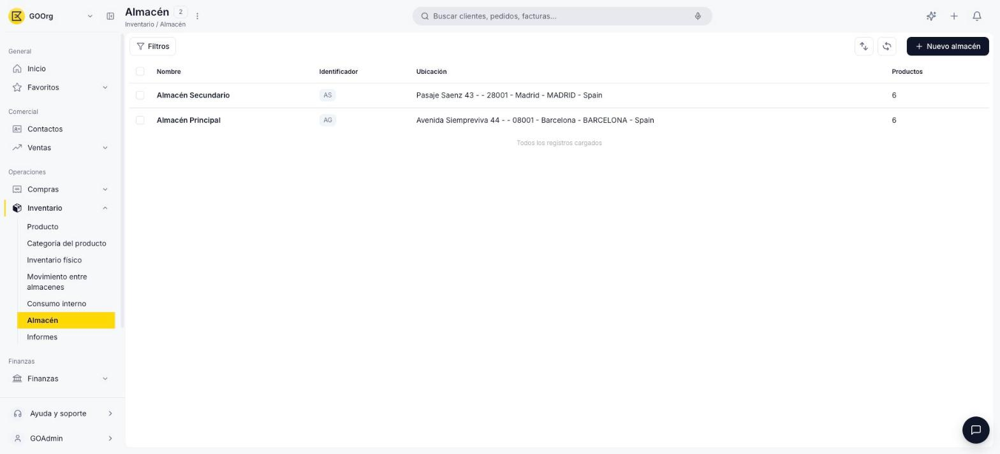
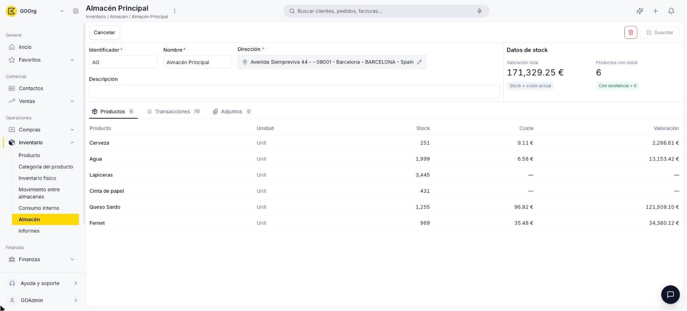

---
tags:
    - Almacén
    - Inventario
    - Productos
    - Etendo Go
---

# ¿Qué es la sección Almacén?

La sección **Almacén** es donde gestionas tus ubicaciones físicas de stock. Cada almacén lleva su propio inventario por separado, aunque después puedas transferir mercancía entre almacenes cuando lo necesites.

## Vista lista

La lista de almacenes muestra las columnas **Nombre**, **Identificador**, **Ubicación** (la dirección del almacén) y **Productos** (cantidad de productos con stock en ese almacén). Para crear un almacén nuevo usa el botón **+ Nuevo almacén**.

<figure markdown="span">
  
  <figcaption>Vista lista de Almacén, con columnas de Nombre, Identificador, Ubicación y Productos.</figcaption>
</figure>

## Detalle de un almacén

Al seleccionar un almacén de la lista se abre su ficha con el formulario y un resumen de stock en tiempo real:

<figure markdown="span">
  
  <figcaption>Ficha de un almacén, con el formulario, los datos de stock y la pestaña Productos.</figcaption>
</figure>

- **Formulario** — **Nombre**, **Identificador**, **Dirección** y **Descripción** del almacén.
- **Datos de stock** (solo lectura) — **Valoración total** (para cada producto del almacén, multiplica su stock por el costo que el sistema tiene registrado para ese producto, y suma el resultado de todos) y **Productos con stock** (cantidad de productos con existencia mayor a cero).
- **Pestaña Productos** — el stock de cada producto en este almacén: producto, unidad, stock, coste y valoración.
- **Pestaña Transacciones** — el historial de movimientos.
- **Pestaña Adjuntos** — archivos asociados al almacén.

!!! info "Mientras el almacén no esté guardado"
    En un almacén recién creado y todavía sin guardar, el panel de datos de stock muestra $0,00 y 0 productos, la pestaña Productos muestra "No hay stock para este almacén" y la pestaña Transacciones muestra "No se encontraron transacciones para este almacén" — esa información solo empieza a completarse una vez que el almacén existe como registro guardado y tiene movimientos.

## Recursos y próximos pasos

Para dar de alta tu primer almacén, sigue la guía [Crear un almacén](crear-un-almacen/crear-un-almacen.md).

---

## Artículos Relacionados

- [Crear un almacén](crear-un-almacen/crear-un-almacen.md)
- [¿Qué es la sección de Productos?](../productos/index.md)
- [¿Qué es la sección Inventario?](../que-es-inventario/que-es-inventario.md)

---
Esta obra está bajo la licencia :material-creative-commons: :fontawesome-brands-creative-commons-by: :fontawesome-brands-creative-commons-sa: [CC BY-SA 2.5 ES](https://creativecommons.org/licenses/by-sa/2.5/es/){target="_blank"} de [Futit Services S.L](https://etendo.software){target="_blank"}.
