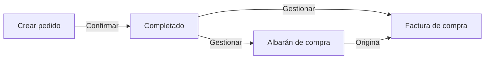

# Crear un pedido de compra

Sigue esta guía cuando necesites solicitar productos o servicios a un proveedor: el pedido de compra formaliza la solicitud y, una vez confirmado, te permite generar el albarán de recepción y la factura correspondientes.

**Antes de empezar**, necesitas tener cargado el [contacto](../../../comercial/contactos/que-es-la-seccion-contactos/que-es-la-seccion-contactos.md) del proveedor con el rol **Proveedor** activo y, al menos, una dirección configurada.

---

## Crear el pedido

1. Accede a **[Compras > Pedido de Compra](https://go.etendo.cloud/purchase-order){target="_blank"}** y haz clic en **+ Nuevo pedido**.
2. Completa la cabecera:
    - **Contacto** *(obligatorio)* — proveedor al que se dirige el pedido. Al seleccionarlo, el sistema autocompleta **Dirección**, **Fecha de entrega esperada**, **Método de pago**, **Condiciones de pago**, **Moneda** y **Tarifa** configurados para ese proveedor.
    - **Nº documento** — se asigna automáticamente al guardar el pedido por primera vez; no es editable.
    - **Fecha de pedido** *(obligatorio)* — por defecto la fecha actual; editable.
    - **Dirección** *(obligatorio)* — heredada del contacto; editable para este documento.
    - **Fecha de entrega esperada** *(obligatorio)* — fecha prevista de recepción de la mercancía; toma por defecto la fecha actual y es editable. Campo exclusivo del pedido de compra.
    - **Almacén** *(obligatorio)* — almacén donde se va a recibir la mercancía; se carga con tu almacén por defecto y es editable.
    - **Condiciones de pago** *(obligatorio)*, **Moneda** *(obligatorio)*, **Tarifa** *(obligatorio)* — heredados del contacto; editables para este documento.
    - **Método de pago** — heredado del contacto; editable para este documento.
3. Si necesitas adjuntar algún archivo de referencia (por ejemplo, la cotización del proveedor), usa la pestaña **Adjuntos** — admite PDF, Word, Excel, PowerPoint e imágenes.

!!! tip "Campos autocargados desde el contacto"
    Todos los campos cargados automáticamente al seleccionar el proveedor son editables para este pedido sin afectar la configuración del proveedor.

## Añadir las líneas

En la pestaña **Líneas**, usa **+ Añadir línea** para incorporar cada producto o servicio:

- **Producto** — al seleccionarlo autocompleta la descripción, el precio de tarifa y el impuesto; editable si necesitas ajustarlo para este pedido.
- **Descripción** — precompletada desde el producto; editable por línea.
- **Cant. pedido** — cantidad solicitada al proveedor. Por defecto 1.
- **Precio** — precio del producto según la tarifa de compra; editable.
- **% de descuento** — descuento aplicado sobre el precio de la línea.
- **Impuesto** — tipo impositivo aplicable, heredado del producto.
- **Importe bruto de línea** — resultado de multiplicar el **Precio** por la **Cant. pedido**, menos el descuento aplicado, más el impuesto de la línea.

Para guardar una línea pulsa ++enter++ o haz clic fuera de la fila; para cancelar sin guardar, pulsa ++esc++.

### Totales y notas

El panel de totales muestra **Subtotal sin descuento**, **Descuento por producto**, **Subtotal**, **Impuesto** y **Total** (con la opción de añadir un descuento global vía **+ Añadir descuento total**). El campo **Notas** permite agregar observaciones internas que no se incluyen en el PDF enviado al proveedor.

## Guardar o confirmar el pedido

Usa **Guardar** para dejar el pedido en Borrador, o **Confirmar** para pasarlo a estado Completado.

!!! warning "El pedido no se puede editar tras confirmar"
    Una vez confirmado, el pedido queda bloqueado. Verifica las líneas, cantidades y precios antes de confirmar.

Con el pedido en estado Completado, ya puedes generar el albarán de recepción y la factura correspondientes — ver [Gestionar tus pedidos de compra](../gestionar-tus-pedidos-de-compra/gestionar-tus-pedidos-de-compra.md) para el detalle de esa gestión.

## Artículos Relacionados

- [Gestionar tus pedidos de compra](../gestionar-tus-pedidos-de-compra/gestionar-tus-pedidos-de-compra.md)
- [Crear una factura de compra](../../compras/crear-una-factura-de-compra/crear-una-factura-de-compra.md)
- [Contactos](../../../comercial/contactos/que-es-la-seccion-contactos/que-es-la-seccion-contactos.md)

---
Esta obra está bajo la licencia :material-creative-commons: :fontawesome-brands-creative-commons-by: :fontawesome-brands-creative-commons-sa: [CC BY-SA 2.5 ES](https://creativecommons.org/licenses/by-sa/2.5/es/){target="_blank"} de [Futit Services S.L](https://etendo.software){target="_blank"}.
