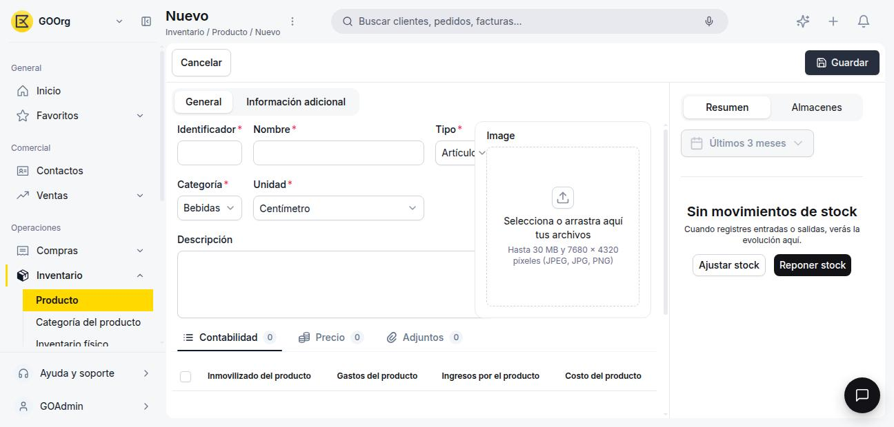

---
tags:
    - Producto
    - Inventario
    - Productos
    - Etendo Go
---

# Cómo crear un producto

Este artículo cubre cómo dar de alta un producto nuevo en Etendo Go, ya sea un artículo con stock o un servicio.

!!! tip "Antes de empezar"
    Necesitas tener creada la [categoría de producto](../como-crear-una-categoria-de-producto/como-crear-una-categoria-de-producto.md) a la que va a pertenecer el producto, ya que es un campo obligatorio del formulario.

## Ve a la ventana Producto

Ve a **Inventario > Producto** y haz clic en **+ Nuevo producto**.

## Completa los datos generales

En la pestaña **General** completa:

| Campo | Obligatorio | Notas |
| :--- | :---: | :--- |
| **Nombre** | Sí | Nombre comercial del producto. |
| **Identificador** | Sí | Código interno (SKU) que lo identifica. |
| **Categoría** | Sí | Determina de forma automática las cuentas contables del producto (existencias, gastos, ingresos y costo). |
| **Unidad de medida** | Sí | Ej. Unidad, Kg, Litro. |
| **Tipo de producto** | Sí | Cuatro opciones: **Artículo** (gestiona stock), **Servicio** (no genera movimientos de inventario), **Recurso** y **Gasto**. |
| **Descripción** | No | — |
| **Imagen** | No | Se muestra en la vista catálogo. |

<figure markdown="span">
  
  <figcaption>Pestaña General del formulario de un producto nuevo.</figcaption>
</figure>

!!! warning "Artículo vs. Servicio"
    Elige **Artículo** si necesitas controlar cuánto tienes disponible de este producto en tus almacenes. Elige **Servicio** si es algo que facturas pero que no se almacena físicamente. Ver [¿Qué es la sección de Productos?](../index.md).

## Completa la información adicional

En la pestaña **Información adicional** completa:

| Campo | Obligatorio | Notas |
| :--- | :---: | :--- |
| **Grupo de impuesto** | Sí | Se usa para la facturación. |
| **Disponibilidad** (Venta / Compra) | No | Marca si el producto puede usarse en documentos de venta, de compra, o ambos. |
| **Unidad de peso** y **Peso** | No | Datos logísticos del producto. |
| **Gestión de stock** (Almacenado / Retornable) | No | Indica si el producto se almacena y si es retornable. |

<figure markdown="span">
  
  <figcaption>Pestaña Información adicional, con Grupo de impuesto, Disponibilidad y datos de Logística.</figcaption>
</figure>

!!! info "El precio se define después"
    El producto no tiene un precio único: los precios se configuran por tarifa, desde la pestaña **Precio**. Consulta [Cómo gestionar tarifas de producto](../como-gestionar-tarifas-de-producto/como-gestionar-tarifas-de-producto.md).

Al guardar, el producto queda disponible para usarse en presupuestos, pedidos, albaranes y facturas.

---

## Artículos Relacionados

- [¿Qué es la sección de Productos?](../index.md)
- [Cómo crear y configurar una categoría de producto](../como-crear-una-categoria-de-producto/como-crear-una-categoria-de-producto.md)
- [Cómo gestionar tarifas de producto](../como-gestionar-tarifas-de-producto/como-gestionar-tarifas-de-producto.md)

---
Esta obra está bajo la licencia :material-creative-commons: :fontawesome-brands-creative-commons-by: :fontawesome-brands-creative-commons-sa: [CC BY-SA 2.5 ES](https://creativecommons.org/licenses/by-sa/2.5/es/){target="_blank"} de [Futit Services S.L](https://etendo.software){target="_blank"}.
